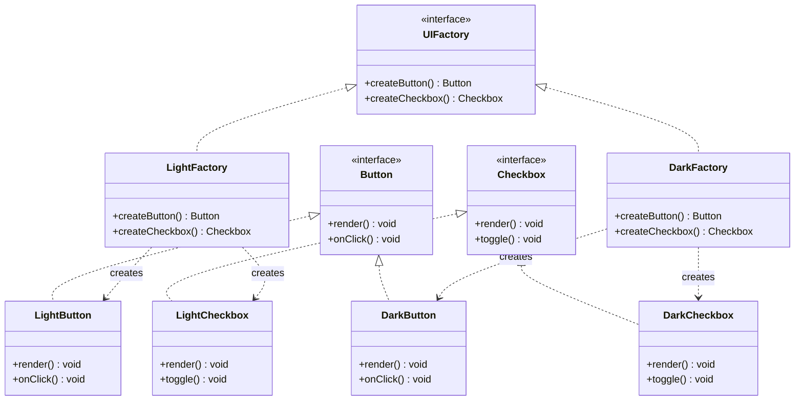

import { Tabs, TabItem } from '@astrojs/starlight/components';

## The problem

Your app needs to render a UI with buttons and checkboxes. Simple enough. But then it needs to run on two themes: Light and Dark. Each theme has its own button style and its own checkbox style. If you instantiate `LightButton` and `DarkCheckbox` directly in your component code, you scatter theme-aware logic everywhere. Swapping themes at runtime becomes a find-and-replace nightmare.

The deeper issue: the client creating the widgets has to know which concrete classes belong together. That knowledge is fragile. A new theme (High Contrast, say) means hunting down every spot that names a concrete class.

Abstract Factory solves this by grouping the creation of a related family of objects behind a single interface. The client asks the factory for a button and a checkbox. Which concrete factory it holds determines which family it gets. The client never names a concrete class.

## Structure



## When to use

- **Theme or platform families**: your system has several coherent product families (Light/Dark, Mac/Windows, mobile/desktop) and the client must use products from one family at a time.
- **Consistency enforcement**: products within a family must be used together. Mixing a `LightButton` with a `DarkCheckbox` would break visual coherence.
- **Swappable families at runtime**: the factory is injected or selected at startup, letting you swap the entire family without touching client code.
- **Isolating third-party dependencies**: wrapping third-party UI libraries behind a factory interface lets you swap libraries without rewriting component code.

Prefer a simpler [Factory](../factory/) when you only have one product type. Abstract Factory earns its complexity only when you have two or more related product types that must vary together.

## Implementation

<Tabs>
<TabItem label="TypeScript">
```typescript
// Product interfaces
interface Button {
  render(): void;
  onClick(): void;
}

interface Checkbox {
  render(): void;
  toggle(): void;
}

// Abstract factory interface
interface UIFactory {
  createButton(): Button;
  createCheckbox(): Checkbox;
}

// Light theme products
class LightButton implements Button {
  render(): void {
    console.log("Rendering light button: white background, dark border");
  }
  onClick(): void {
    console.log("Light button clicked");
  }
}

class LightCheckbox implements Checkbox {
  private checked = false;

  render(): void {
    console.log(`Rendering light checkbox: ${this.checked ? "checked" : "unchecked"}`);
  }
  toggle(): void {
    this.checked = !this.checked;
    console.log(`Light checkbox toggled to ${this.checked}`);
  }
}

// Dark theme products
class DarkButton implements Button {
  render(): void {
    console.log("Rendering dark button: dark background, light border");
  }
  onClick(): void {
    console.log("Dark button clicked");
  }
}

class DarkCheckbox implements Checkbox {
  private checked = false;

  render(): void {
    console.log(`Rendering dark checkbox: ${this.checked ? "checked" : "unchecked"}`);
  }
  toggle(): void {
    this.checked = !this.checked;
    console.log(`Dark checkbox toggled to ${this.checked}`);
  }
}

// Concrete factories
class LightFactory implements UIFactory {
  createButton(): Button {
    return new LightButton();
  }
  createCheckbox(): Checkbox {
    return new LightCheckbox();
  }
}

class DarkFactory implements UIFactory {
  createButton(): Button {
    return new DarkButton();
  }
  createCheckbox(): Checkbox {
    return new DarkCheckbox();
  }
}

// Client -- knows nothing about concrete classes
function renderSettingsPanel(factory: UIFactory): void {
  const button = factory.createButton();
  const checkbox = factory.createCheckbox();

  button.render();
  checkbox.render();
  checkbox.toggle();
  button.onClick();
}

// Usage
const theme = process.env.THEME === "dark" ? new DarkFactory() : new LightFactory();
renderSettingsPanel(theme);
```
</TabItem>
<TabItem label="Python">
```python
from abc import ABC, abstractmethod


# Product interfaces
class Button(ABC):
    @abstractmethod
    def render(self) -> None:
        ...

    @abstractmethod
    def on_click(self) -> None:
        ...


class Checkbox(ABC):
    @abstractmethod
    def render(self) -> None:
        ...

    @abstractmethod
    def toggle(self) -> None:
        ...


# Abstract factory
class UIFactory(ABC):
    @abstractmethod
    def create_button(self) -> Button:
        ...

    @abstractmethod
    def create_checkbox(self) -> Checkbox:
        ...


# Light theme products
class LightButton(Button):
    def render(self) -> None:
        print("Rendering light button: white background, dark border")

    def on_click(self) -> None:
        print("Light button clicked")


class LightCheckbox(Checkbox):
    def __init__(self) -> None:
        self._checked = False

    def render(self) -> None:
        state = "checked" if self._checked else "unchecked"
        print(f"Rendering light checkbox: {state}")

    def toggle(self) -> None:
        self._checked = not self._checked
        print(f"Light checkbox toggled to {self._checked}")


# Dark theme products
class DarkButton(Button):
    def render(self) -> None:
        print("Rendering dark button: dark background, light border")

    def on_click(self) -> None:
        print("Dark button clicked")


class DarkCheckbox(Checkbox):
    def __init__(self) -> None:
        self._checked = False

    def render(self) -> None:
        state = "checked" if self._checked else "unchecked"
        print(f"Rendering dark checkbox: {state}")

    def toggle(self) -> None:
        self._checked = not self._checked
        print(f"Dark checkbox toggled to {self._checked}")


# Concrete factories
class LightFactory(UIFactory):
    def create_button(self) -> Button:
        return LightButton()

    def create_checkbox(self) -> Checkbox:
        return LightCheckbox()


class DarkFactory(UIFactory):
    def create_button(self) -> Button:
        return DarkButton()

    def create_checkbox(self) -> Checkbox:
        return DarkCheckbox()


# Client -- knows nothing about concrete classes
def render_settings_panel(factory: UIFactory) -> None:
    button = factory.create_button()
    checkbox = factory.create_checkbox()

    button.render()
    checkbox.render()
    checkbox.toggle()
    button.on_click()


# Usage
import os

theme = os.environ.get("THEME", "light")
factory: UIFactory = DarkFactory() if theme == "dark" else LightFactory()
render_settings_panel(factory)
```
</TabItem>
<TabItem label="Go">
```go
package main

import "fmt"

// Product interfaces
type Button interface {
	Render()
	OnClick()
}

type Checkbox interface {
	Render()
	Toggle()
}

// Abstract factory interface
type UIFactory interface {
	CreateButton() Button
	CreateCheckbox() Checkbox
}

// Light theme products
type LightButton struct{}

func (b *LightButton) Render() {
	fmt.Println("Rendering light button: white background, dark border")
}

func (b *LightButton) OnClick() {
	fmt.Println("Light button clicked")
}

type LightCheckbox struct {
	checked bool
}

func (c *LightCheckbox) Render() {
	state := "unchecked"
	if c.checked {
		state = "checked"
	}
	fmt.Printf("Rendering light checkbox: %s\n", state)
}

func (c *LightCheckbox) Toggle() {
	c.checked = !c.checked
	fmt.Printf("Light checkbox toggled to %v\n", c.checked)
}

// Dark theme products
type DarkButton struct{}

func (b *DarkButton) Render() {
	fmt.Println("Rendering dark button: dark background, light border")
}

func (b *DarkButton) OnClick() {
	fmt.Println("Dark button clicked")
}

type DarkCheckbox struct {
	checked bool
}

func (c *DarkCheckbox) Render() {
	state := "unchecked"
	if c.checked {
		state = "checked"
	}
	fmt.Printf("Rendering dark checkbox: %s\n", state)
}

func (c *DarkCheckbox) Toggle() {
	c.checked = !c.checked
	fmt.Printf("Dark checkbox toggled to %v\n", c.checked)
}

// Concrete factories
type LightFactory struct{}

func (f *LightFactory) CreateButton() Button {
	return &LightButton{}
}

func (f *LightFactory) CreateCheckbox() Checkbox {
	return &LightCheckbox{}
}

type DarkFactory struct{}

func (f *DarkFactory) CreateButton() Button {
	return &DarkButton{}
}

func (f *DarkFactory) CreateCheckbox() Checkbox {
	return &DarkCheckbox{}
}

// Client -- knows nothing about concrete classes
func renderSettingsPanel(factory UIFactory) {
	button := factory.CreateButton()
	checkbox := factory.CreateCheckbox()

	button.Render()
	checkbox.Render()
	checkbox.Toggle()
	button.OnClick()
}

func main() {
	var factory UIFactory = &LightFactory{}
	renderSettingsPanel(factory)

	fmt.Println("---")

	factory = &DarkFactory{}
	renderSettingsPanel(factory)
}
```
</TabItem>
</Tabs>

## Tradeoffs

| Pro | Con |
|-----|-----|
| Guarantees product family consistency -- the factory can only produce matching products | Adding a new product type (say, `createSlider()`) requires changing the abstract factory interface and every concrete factory |
| Client code is fully decoupled from concrete classes; swap factories at the injection point | More classes and interfaces up front; the pattern adds real structural overhead for simple cases |
| New families (a High Contrast theme) are added by implementing the factory interface, without touching existing code | Factories can become large if the product family grows to many types |
| Makes cross-platform or cross-environment support explicit and traceable | Hard to unit-test factories in isolation when products have side effects or heavy dependencies |

## Gotchas

- **Factory explosion**: each new theme or platform multiplies your class count by the number of product types. Keep families small or consider a data-driven approach (config maps to implementations) when families grow past five or six products.
- **Interface extension pain**: the "Open/Closed" benefit only flows in one direction. Adding a product type to the abstract factory interface is a breaking change for all concrete factories. Plan your product surface area before committing to the pattern.
- **Singleton factories**: factories are usually stateless. It is tempting to make them singletons, but that can cause problems in tests. Prefer injecting factory instances rather than accessing a global.
- **Mixing families by accident**: if a client receives a factory but also holds a stray reference to a concrete product from another family, consistency breaks silently. Discipline at the injection boundary matters.
- **Overuse**: if your app only ever has one theme or one platform target, this pattern is pure overhead. Start with direct instantiation and extract a factory when a second family actually arrives.

## References

- [Design Patterns: Elements of Reusable Object-Oriented Software](https://www.informit.com/store/design-patterns-elements-of-reusable-object-oriented-9780201633610) -- the original GoF book; Abstract Factory is chapter 3.
- [Refactoring Guru: Abstract Factory](https://refactoring.guru/design-patterns/abstract-factory) -- visual walkthrough with diagrams and multi-language examples.
- [SourceMaking: Abstract Factory](https://sourcemaking.com/design_patterns/abstract_factory) -- concise motivation and structure reference.

## Related topics

- [Design Patterns](../) -- the full GoF catalog this pattern belongs to.
- [Factory](../factory/) -- the simpler single-product factory; reach for it before adding Abstract Factory complexity.
- [Builder](../builder/) -- another creational pattern, suited for constructing a single complex object step by step rather than a family of objects.
- [Prototype](../prototype/) -- clones existing objects instead of constructing new ones; useful when construction is expensive.
