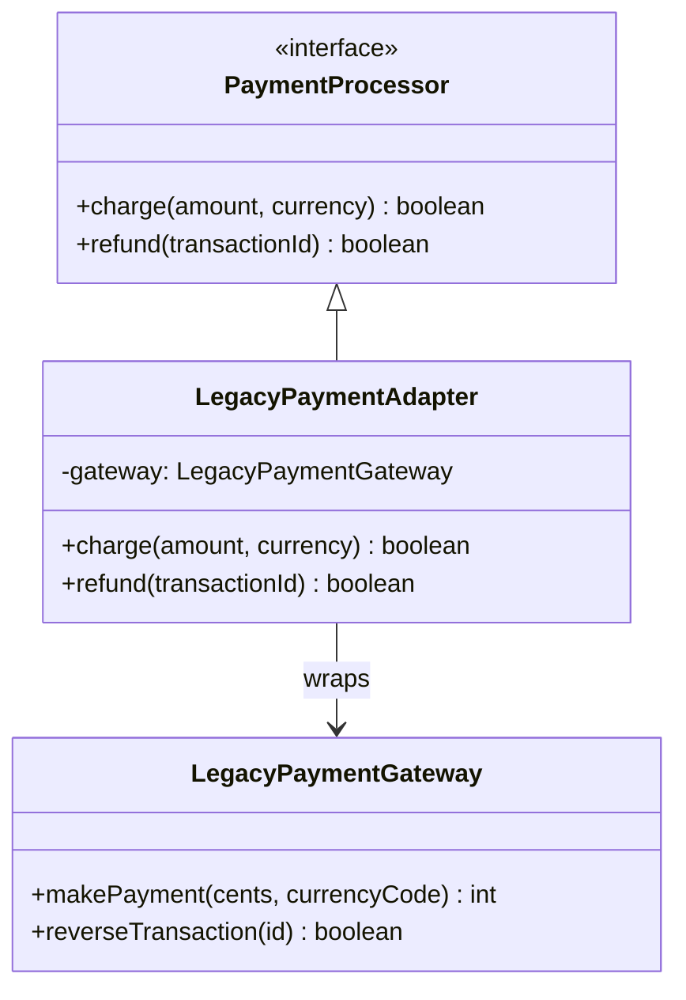

import { Tabs, TabItem } from '@astrojs/starlight/components';

## The problem

You have a class that does something useful, but its interface does not match what your application expects. Maybe it is a legacy payment gateway that takes cents as integers and returns error codes, while your new checkout code expects decimal amounts and boolean results. Maybe it is a third-party SDK you cannot modify. Changing the caller is invasive; changing the library is impossible.

The Adapter pattern wraps the incompatible class in a new object that implements the interface your code expects. The adapter translates calls in both directions: incoming method signatures from your target interface get converted into whatever the underlying system (the adaptee) requires, and return values get translated back. Neither the caller nor the adaptee changes. The GoF book describes two forms: a class adapter, which uses multiple inheritance to extend both the target and adaptee simultaneously, and an object adapter, which holds the adaptee as a field. Class adapters are rarely practical in TypeScript, Python, or Go. Every example here uses the object adapter.

## Structure



## When to use

- You need to integrate a library or legacy class whose interface does not match what your application expects, and you cannot modify either side.
- You want to insulate your application from a third-party API so that swapping the underlying provider only requires a new adapter, not changes throughout the codebase.
- You are standardizing multiple external services behind a single interface (for example, adapting three different SMS providers to one `SmsSender` interface).
- You want to test code that depends on an external system by substituting a stub adapter.

## Implementation

<Tabs>
<TabItem label="TypeScript">

The `LegacyPaymentGateway` takes cents as an integer and returns a numeric result code. The new `PaymentProcessor` interface takes decimal amounts and returns booleans. The adapter converts between them so client code never sees the legacy details.

```typescript
// New interface the rest of the application expects
interface PaymentProcessor {
  charge(amount: number, currency: string): boolean;
  refund(transactionId: string): boolean;
}

// Legacy system we cannot modify
class LegacyPaymentGateway {
  makePayment(cents: number, currencyCode: string): number {
    console.log(`Legacy: charging ${cents} cents in ${currencyCode}`);
    return 0; // 0 = success
  }

  reverseTransaction(transactionId: string): boolean {
    console.log(`Legacy: reversing ${transactionId}`);
    return true;
  }
}

// Adapter: implements the new interface, delegates to the old one
class LegacyPaymentAdapter implements PaymentProcessor {
  constructor(private gateway: LegacyPaymentGateway) {}

  charge(amount: number, currency: string): boolean {
    const cents = Math.round(amount * 100);
    const result = this.gateway.makePayment(cents, currency.toUpperCase());
    return result === 0;
  }

  refund(transactionId: string): boolean {
    return this.gateway.reverseTransaction(transactionId);
  }
}

// Client code uses only PaymentProcessor; legacy details are hidden
function processOrder(processor: PaymentProcessor, total: number): void {
  const ok = processor.charge(total, 'usd');
  console.log(ok ? 'Payment accepted' : 'Payment failed');
}

const adapter = new LegacyPaymentAdapter(new LegacyPaymentGateway());
processOrder(adapter, 29.99);
// Legacy: charging 2999 cents in USD
// Payment accepted
```

</TabItem>
<TabItem label="Python">

Python's abstract base class makes the target interface explicit. The adapter inherits from `PaymentProcessor` and holds a `LegacyPaymentGateway` as an instance variable. Without the ABC, duck typing would still work, but the ABC gives `isinstance` checks and IDE completions.

```python
from __future__ import annotations
from abc import ABC, abstractmethod


class PaymentProcessor(ABC):
    @abstractmethod
    def charge(self, amount: float, currency: str) -> bool: ...

    @abstractmethod
    def refund(self, transaction_id: str) -> bool: ...


class LegacyPaymentGateway:
    def make_payment(self, cents: int, currency_code: str) -> int:
        print(f'Legacy: charging {cents} cents in {currency_code}')
        return 0  # 0 = success

    def reverse_transaction(self, transaction_id: str) -> bool:
        print(f'Legacy: reversing {transaction_id}')
        return True


class LegacyPaymentAdapter(PaymentProcessor):
    def __init__(self, gateway: LegacyPaymentGateway) -> None:
        self._gateway = gateway

    def charge(self, amount: float, currency: str) -> bool:
        cents = round(amount * 100)
        result = self._gateway.make_payment(cents, currency.upper())
        return result == 0

    def refund(self, transaction_id: str) -> bool:
        return self._gateway.reverse_transaction(transaction_id)


def process_order(processor: PaymentProcessor, total: float) -> None:
    ok = processor.charge(total, 'usd')
    print('Payment accepted' if ok else 'Payment failed')


adapter = LegacyPaymentAdapter(LegacyPaymentGateway())
process_order(adapter, 29.99)
# Legacy: charging 2999 cents in USD
# Payment accepted
```

</TabItem>
<TabItem label="Go">

Go satisfies interfaces implicitly. `LegacyPaymentAdapter` implements `PaymentProcessor` because it has matching `Charge` and `Refund` methods. The compile-time check `var _ PaymentProcessor = (*LegacyPaymentAdapter)(nil)` catches mismatches without running any code.

```go
package main

import (
	"fmt"
	"math"
)

// Target interface
type PaymentProcessor interface {
	Charge(amount float64, currency string) bool
	Refund(transactionID string) bool
}

// Adaptee (legacy, cannot be changed)
type LegacyPaymentGateway struct{}

func (g *LegacyPaymentGateway) MakePayment(cents int, currencyCode string) int {
	fmt.Printf("Legacy: charging %d cents in %s\n", cents, currencyCode)
	return 0 // 0 = success
}

func (g *LegacyPaymentGateway) ReverseTransaction(id string) bool {
	fmt.Printf("Legacy: reversing %s\n", id)
	return true
}

// Adapter
type LegacyPaymentAdapter struct {
	gateway *LegacyPaymentGateway
}

// Compile-time interface check
var _ PaymentProcessor = (*LegacyPaymentAdapter)(nil)

func (a *LegacyPaymentAdapter) Charge(amount float64, currency string) bool {
	cents := int(math.Round(amount * 100))
	result := a.gateway.MakePayment(cents, currency)
	return result == 0
}

func (a *LegacyPaymentAdapter) Refund(transactionID string) bool {
	return a.gateway.ReverseTransaction(transactionID)
}

func processOrder(p PaymentProcessor, total float64) {
	ok := p.Charge(total, "USD")
	if ok {
		fmt.Println("Payment accepted")
	} else {
		fmt.Println("Payment failed")
	}
}

func main() {
	adapter := &LegacyPaymentAdapter{gateway: &LegacyPaymentGateway{}}
	processOrder(adapter, 29.99)
	// Legacy: charging 2999 cents in USD
	// Payment accepted
}
```

</TabItem>
</Tabs>

## Tradeoffs

| Pro | Con |
| --- | --- |
| Integrate legacy or third-party code without touching it | Adds a translation layer with its own maintenance burden |
| Client code stays clean, depends only on the target interface | Data conversion (cents/dollars, codes/enums) can introduce bugs |
| Easy to test: stub the adaptee in unit tests | Class adapter (multiple inheritance) is messy in most languages |
| Standard way to wrap an SDK you do not own | If the adaptee API changes, the adapter must change too |

## Gotchas

- Round money conversions consistently. `amount * 100` in floating point can produce 2998 instead of 2999 for certain inputs. Use `math.Round` in Go, `round()` in Python, or a dedicated decimal library for production financial code.
- Adapter and Facade are often confused. Adapter makes two things compatible by translating between their interfaces. Facade simplifies a complex subsystem behind a convenience interface. They solve different problems and can coexist: a facade can use adapters internally.
- In Python, the abstract base class is optional. Skip it when duck typing is sufficient, for example in a small service where there is only ever one concrete processor. Add it when you want `isinstance` checks, enforced method signatures, or explicit IDE support.
- In Go, add the compile-time check `var _ TargetInterface = (*AdapterType)(nil)` near the adapter declaration. It costs nothing at runtime and catches method signature drift immediately when the adaptee changes.
- Keep the adapter thin. If translation logic grows complex, extract it into a helper function that is separately testable, rather than burying it in `Charge` or `pay`.

## References

- [Design Patterns: Adapter, GoF](https://www.informit.com/store/design-patterns-elements-of-reusable-object-oriented-9780201633610), the canonical definition with class and object adapter variants
- [Refactoring Guru: Adapter](https://refactoring.guru/design-patterns/adapter), diagrams and examples in multiple languages
- [SourceMaking: Adapter](https://sourcemaking.com/design_patterns/adapter), additional motivation and known uses
- [Go interfaces and implicit satisfaction](https://go.dev/tour/methods/10), the language property that makes object adapters idiomatic in Go

## Related topics

- [Design Patterns](../), the full GoF catalog
- [Facade](../facade/), simplifies a subsystem rather than bridging two incompatible interfaces
- [Proxy](../proxy/), also wraps an object but to control access, not translate interfaces
- [Strategy](../strategy/), a behavioral complement: adapters fix interface mismatches, strategies swap algorithms
