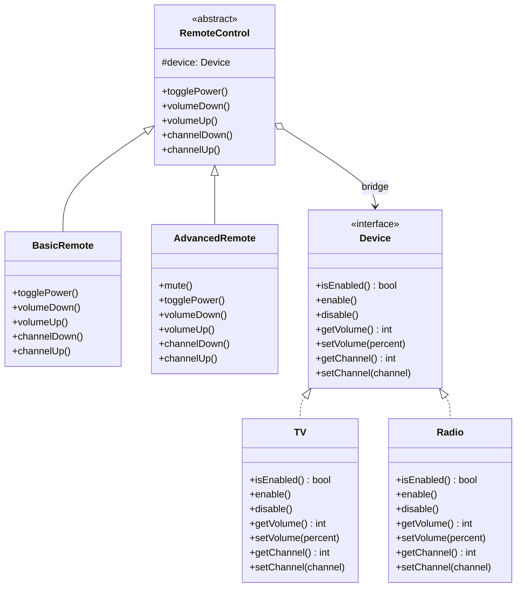

import { Tabs, TabItem } from '@astrojs/starlight/components';
import TypeScriptRepl from '../../../../../components/TypeScriptRepl.astro';
import PythonRepl from '../../../../../components/PythonRepl.astro';
import GoRepl from '../../../../../components/GoRepl.astro';
import tsCode from './bridge.ts?raw';
import pyCode from './bridge.py?raw';
import goCode from './bridge.go?raw';

## The problem

You have two dimensions of variation: the kind of remote control (basic vs. advanced) and the kind of device (TV vs. Radio). If you model this through inheritance, you end up with a class for every combination: `BasicRemoteTV`, `BasicRemoteRadio`, `AdvancedRemoteTV`, `AdvancedRemoteRadio`. Add a third device type and the count doubles again.

The Bridge pattern breaks this exponential growth. It separates the abstraction (remote control) from the implementation (device) and connects them through composition. You end up with two independent hierarchies. Adding a new device type does not require touching any remote class, and adding a new remote type does not require touching any device class.

## Structure

The bridge is the composition arrow: `RemoteControl` holds a reference to `Device`, not a concrete class.

## When to use

- You have two or more independent dimensions of variation and want to extend them separately.
- You want to switch implementations at runtime (hand a different `Device` to the same remote instance).
- You want to hide implementation details from the abstraction's clients entirely.
- Inheritance would produce a cartesian-product explosion of subclasses.

## Implementation

All three implementations split into two hierarchies: `RemoteControl` (abstraction) holds a reference to `Device` (implementation) injected at construction. `BasicRemote` adds nothing; `AdvancedRemote` adds `mute`. Python expresses the split with ABCs on both sides. Go uses struct embedding for `RemoteControl` inside each concrete remote, giving promoted methods without re-implementing them.

<Tabs>
<TabItem label="TypeScript">
<TypeScriptRepl code={tsCode} id="bridge-ts" />
</TabItem>
<TabItem label="Python">
<PythonRepl code={pyCode} id="bridge-py" />
</TabItem>
<TabItem label="Go">
<GoRepl code={goCode} id="bridge-go" />
</TabItem>
</Tabs>

## Tradeoffs

| Pro | Con |
|-----|-----|
| Adding a new device type never touches any remote class | Introduces more types and indirection, which increases initial complexity |
| Adding a new remote type never touches any device class | The composition relationship can be harder to trace in an IDE than a straight inheritance chain |
| Devices can be swapped at runtime without changing the remote | Requires upfront discipline: you must identify the two independent dimensions before designing the hierarchy |
| Reduces the total number of classes compared to the inheritance approach (N + M instead of N x M) | Poorly chosen split points produce a Bridge that is just as rigid as the inheritance it replaced |
| Each side of the bridge can be tested in isolation using a mock or stub for the other side | Over-engineering risk: if only one device or one remote ever exists, the pattern adds cost with no benefit |

## Gotchas

- **Choosing the split**: the pattern only pays off when both dimensions genuinely vary independently. If the "implementation" side never changes, you have added indirection for nothing.
- **Initialization order**: the abstraction must receive its device at construction time (or via a setter). Forgetting to inject a real device and defaulting to `null`/`None`/`nil` causes runtime panics instead of compile errors.
- **Not the same as Strategy**: Bridge splits a hierarchy into two independent ones; Strategy replaces a single algorithm inside one object. The structural result looks similar but the intent differs.
- **Reference sharing**: if you share one `Device` instance between two remotes and both call `setVolume`, they will see each other's side effects. Decide explicitly whether devices are shared or owned.
- **Go embedding vs. interface**: in Go, embedding `RemoteControl` gives the outer struct promoted methods, but the `device` field is still accessed through the embedded struct. Verify that your concrete remote calls `ar.device`, not a shadowed copy.

## References

- [Design Patterns: Elements of Reusable Object-Oriented Software](https://www.informit.com/store/design-patterns-elements-of-reusable-object-oriented-9780201633610) (GoF book, Gamma et al., 1994)
- [Bridge pattern](https://refactoring.guru/design-patterns/bridge) on Refactoring Guru
- [Bridge](https://sourcemaking.com/design_patterns/bridge) on SourceMaking

## Related topics

- [Design Patterns](../): the full GoF catalog this page belongs to
- [Adapter](../adapter/): also reconciles incompatible interfaces, but after the fact rather than by design
- [Strategy](../strategy/): also uses composition over inheritance for variation, but replaces an algorithm rather than splitting a hierarchy
- [Decorator](../decorator/): wraps an object to extend behavior rather than bridging two independent hierarchies
