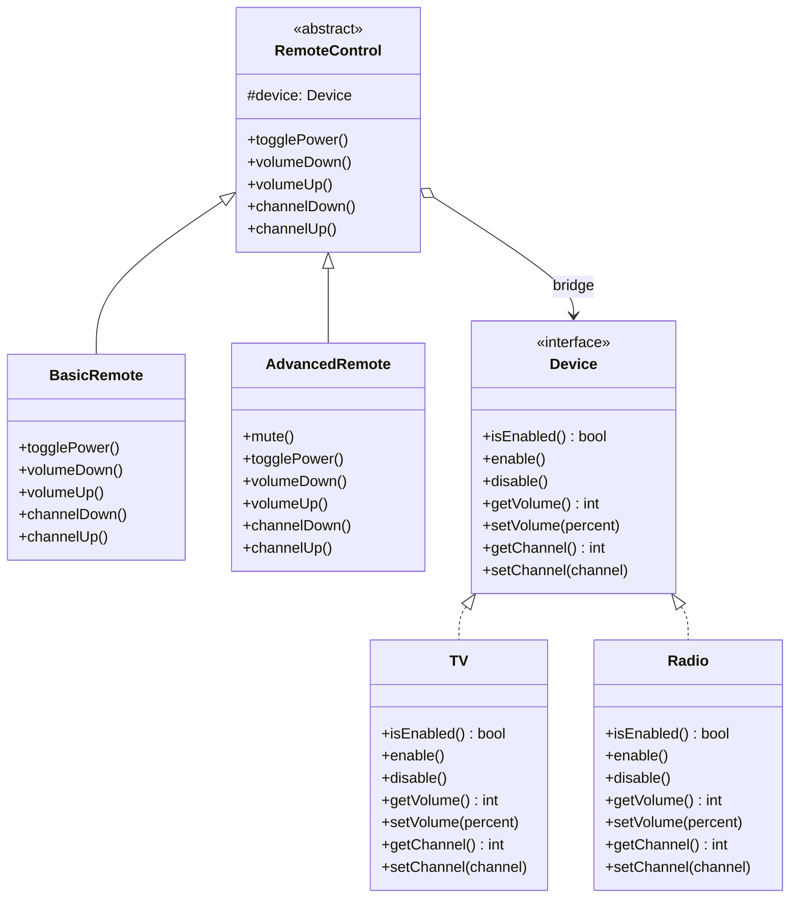

import { Tabs, TabItem } from '@astrojs/starlight/components';

## The problem

You have two dimensions of variation: the kind of remote control (basic vs. advanced) and the kind of device (TV vs. Radio). If you model this through inheritance, you end up with a class for every combination: `BasicRemoteTV`, `BasicRemoteRadio`, `AdvancedRemoteTV`, `AdvancedRemoteRadio`. Add a third device type and the count doubles again.

The Bridge pattern breaks this exponential growth. It separates the abstraction (remote control) from the implementation (device) and connects them through composition. You end up with two independent hierarchies. Adding a new device type does not require touching any remote class, and adding a new remote type does not require touching any device class.

## Structure



The bridge is the composition arrow: `RemoteControl` holds a reference to `Device`, not a concrete class.

## When to use

- You have two or more independent dimensions of variation and want to extend them separately.
- You want to switch implementations at runtime (hand a different `Device` to the same remote instance).
- You want to hide implementation details from the abstraction's clients entirely.
- Inheritance would produce a cartesian-product explosion of subclasses.

## Implementation

<Tabs>
<TabItem label="TypeScript">
```typescript
// Device interface (implementation side)
interface Device {
  isEnabled(): boolean;
  enable(): void;
  disable(): void;
  getVolume(): number;
  setVolume(percent: number): void;
  getChannel(): number;
  setChannel(channel: number): void;
}

// Concrete implementations
class TV implements Device {
  private on = false;
  private volume = 30;
  private channel = 1;

  isEnabled() { return this.on; }
  enable() { this.on = true; console.log("TV: powered on"); }
  disable() { this.on = false; console.log("TV: powered off"); }
  getVolume() { return this.volume; }
  setVolume(percent: number) {
    this.volume = Math.max(0, Math.min(100, percent));
    console.log(`TV: volume set to ${this.volume}`);
  }
  getChannel() { return this.channel; }
  setChannel(channel: number) {
    this.channel = channel;
    console.log(`TV: channel set to ${this.channel}`);
  }
}

class Radio implements Device {
  private on = false;
  private volume = 50;
  private channel = 1;

  isEnabled() { return this.on; }
  enable() { this.on = true; console.log("Radio: powered on"); }
  disable() { this.on = false; console.log("Radio: powered off"); }
  getVolume() { return this.volume; }
  setVolume(percent: number) {
    this.volume = Math.max(0, Math.min(100, percent));
    console.log(`Radio: volume set to ${this.volume}`);
  }
  getChannel() { return this.channel; }
  setChannel(channel: number) {
    this.channel = channel;
    console.log(`Radio: channel set to ${this.channel}`);
  }
}

// Abstraction side
abstract class RemoteControl {
  protected device: Device;

  constructor(device: Device) {
    this.device = device;
  }

  togglePower() {
    if (this.device.isEnabled()) {
      this.device.disable();
    } else {
      this.device.enable();
    }
  }

  volumeDown() { this.device.setVolume(this.device.getVolume() - 10); }
  volumeUp()   { this.device.setVolume(this.device.getVolume() + 10); }
  channelDown() { this.device.setChannel(this.device.getChannel() - 1); }
  channelUp()   { this.device.setChannel(this.device.getChannel() + 1); }
}

class BasicRemote extends RemoteControl {
  // Inherits all methods from RemoteControl; no additions.
}

class AdvancedRemote extends RemoteControl {
  mute() {
    console.log("AdvancedRemote: muting device");
    this.device.setVolume(0);
  }
}

// Usage
const tv = new TV();
const radio = new Radio();

const basicRemote = new BasicRemote(tv);
basicRemote.togglePower();  // TV: powered on
basicRemote.volumeUp();     // TV: volume set to 40

const advancedRemote = new AdvancedRemote(radio);
advancedRemote.togglePower(); // Radio: powered on
advancedRemote.mute();        // Radio: volume set to 0

// Swap the device without changing the remote class
const tvAdvancedRemote = new AdvancedRemote(tv);
tvAdvancedRemote.mute(); // TV: volume set to 0
```
</TabItem>
<TabItem label="Python">
```python
from abc import ABC, abstractmethod

# Implementation side
class Device(ABC):
    @abstractmethod
    def is_enabled(self) -> bool: ...

    @abstractmethod
    def enable(self) -> None: ...

    @abstractmethod
    def disable(self) -> None: ...

    @abstractmethod
    def get_volume(self) -> int: ...

    @abstractmethod
    def set_volume(self, percent: int) -> None: ...

    @abstractmethod
    def get_channel(self) -> int: ...

    @abstractmethod
    def set_channel(self, channel: int) -> None: ...


class TV(Device):
    def __init__(self):
        self._on = False
        self._volume = 30
        self._channel = 1

    def is_enabled(self): return self._on
    def enable(self):
        self._on = True
        print("TV: powered on")
    def disable(self):
        self._on = False
        print("TV: powered off")
    def get_volume(self): return self._volume
    def set_volume(self, percent):
        self._volume = max(0, min(100, percent))
        print(f"TV: volume set to {self._volume}")
    def get_channel(self): return self._channel
    def set_channel(self, channel):
        self._channel = channel
        print(f"TV: channel set to {self._channel}")


class Radio(Device):
    def __init__(self):
        self._on = False
        self._volume = 50
        self._channel = 1

    def is_enabled(self): return self._on
    def enable(self):
        self._on = True
        print("Radio: powered on")
    def disable(self):
        self._on = False
        print("Radio: powered off")
    def get_volume(self): return self._volume
    def set_volume(self, percent):
        self._volume = max(0, min(100, percent))
        print(f"Radio: volume set to {self._volume}")
    def get_channel(self): return self._channel
    def set_channel(self, channel):
        self._channel = channel
        print(f"Radio: channel set to {self._channel}")


# Abstraction side
class RemoteControl(ABC):
    def __init__(self, device: Device):
        self._device = device

    def toggle_power(self):
        if self._device.is_enabled():
            self._device.disable()
        else:
            self._device.enable()

    def volume_down(self):
        self._device.set_volume(self._device.get_volume() - 10)

    def volume_up(self):
        self._device.set_volume(self._device.get_volume() + 10)

    def channel_down(self):
        self._device.set_channel(self._device.get_channel() - 1)

    def channel_up(self):
        self._device.set_channel(self._device.get_channel() + 1)


class BasicRemote(RemoteControl):
    pass  # All behavior inherited from RemoteControl.


class AdvancedRemote(RemoteControl):
    def mute(self):
        print("AdvancedRemote: muting device")
        self._device.set_volume(0)


# Swapping the device at construction time changes behavior without
# changing either remote class.
tv = TV()
radio = Radio()

basic = BasicRemote(tv)
basic.toggle_power()   # TV: powered on
basic.volume_up()      # TV: volume set to 40

advanced = AdvancedRemote(radio)
advanced.toggle_power()  # Radio: powered on
advanced.mute()           # Radio: volume set to 0

# Hand the same AdvancedRemote a TV instead.
tv_advanced = AdvancedRemote(tv)
tv_advanced.mute()  # TV: volume set to 0
```
</TabItem>
<TabItem label="Go">
```go
package main

import "fmt"

// Device is the implementation interface.
type Device interface {
    IsEnabled() bool
    Enable()
    Disable()
    GetVolume() int
    SetVolume(percent int)
    GetChannel() int
    SetChannel(channel int)
}

// TV is a concrete Device.
type TV struct {
    on      bool
    volume  int
    channel int
}

func NewTV() *TV { return &TV{volume: 30, channel: 1} }

func (t *TV) IsEnabled() bool { return t.on }
func (t *TV) Enable()         { t.on = true; fmt.Println("TV: powered on") }
func (t *TV) Disable()        { t.on = false; fmt.Println("TV: powered off") }
func (t *TV) GetVolume() int  { return t.volume }
func (t *TV) SetVolume(percent int) {
    if percent < 0 { percent = 0 }
    if percent > 100 { percent = 100 }
    t.volume = percent
    fmt.Printf("TV: volume set to %d\n", t.volume)
}
func (t *TV) GetChannel() int { return t.channel }
func (t *TV) SetChannel(channel int) {
    t.channel = channel
    fmt.Printf("TV: channel set to %d\n", t.channel)
}

// Radio is a concrete Device.
type Radio struct {
    on      bool
    volume  int
    channel int
}

func NewRadio() *Radio { return &Radio{volume: 50, channel: 1} }

func (r *Radio) IsEnabled() bool { return r.on }
func (r *Radio) Enable()         { r.on = true; fmt.Println("Radio: powered on") }
func (r *Radio) Disable()        { r.on = false; fmt.Println("Radio: powered off") }
func (r *Radio) GetVolume() int  { return r.volume }
func (r *Radio) SetVolume(percent int) {
    if percent < 0 { percent = 0 }
    if percent > 100 { percent = 100 }
    r.volume = percent
    fmt.Printf("Radio: volume set to %d\n", r.volume)
}
func (r *Radio) GetChannel() int { return r.channel }
func (r *Radio) SetChannel(channel int) {
    r.channel = channel
    fmt.Printf("Radio: channel set to %d\n", r.channel)
}

// RemoteControl is the abstraction. It holds the bridge to the Device.
type RemoteControl struct {
    device Device
}

func (rc *RemoteControl) TogglePower() {
    if rc.device.IsEnabled() {
        rc.device.Disable()
    } else {
        rc.device.Enable()
    }
}

func (rc *RemoteControl) VolumeDown() {
    rc.device.SetVolume(rc.device.GetVolume() - 10)
}

func (rc *RemoteControl) VolumeUp() {
    rc.device.SetVolume(rc.device.GetVolume() + 10)
}

func (rc *RemoteControl) ChannelDown() {
    rc.device.SetChannel(rc.device.GetChannel() - 1)
}

func (rc *RemoteControl) ChannelUp() {
    rc.device.SetChannel(rc.device.GetChannel() + 1)
}

// BasicRemote embeds RemoteControl and adds nothing.
type BasicRemote struct {
    RemoteControl
}

func NewBasicRemote(d Device) *BasicRemote {
    return &BasicRemote{RemoteControl{device: d}}
}

// AdvancedRemote embeds RemoteControl and adds Mute.
type AdvancedRemote struct {
    RemoteControl
}

func NewAdvancedRemote(d Device) *AdvancedRemote {
    return &AdvancedRemote{RemoteControl{device: d}}
}

func (ar *AdvancedRemote) Mute() {
    fmt.Println("AdvancedRemote: muting device")
    ar.device.SetVolume(0)
}

func main() {
    tv := NewTV()
    radio := NewRadio()

    basic := NewBasicRemote(tv)
    basic.TogglePower() // TV: powered on
    basic.VolumeUp()    // TV: volume set to 40

    advanced := NewAdvancedRemote(radio)
    advanced.TogglePower() // Radio: powered on
    advanced.Mute()         // Radio: volume set to 0

    // Same remote type, different device: no class changes required.
    tvAdvanced := NewAdvancedRemote(tv)
    tvAdvanced.Mute() // TV: volume set to 0
}
```
</TabItem>
</Tabs>

## Tradeoffs

| Pro | Con |
|-----|-----|
| Adding a new device type never touches any remote class | Introduces more types and indirection, which increases initial complexity |
| Adding a new remote type never touches any device class | The composition relationship can be harder to trace in an IDE than a straight inheritance chain |
| Devices can be swapped at runtime without changing the remote | Requires upfront discipline: you must identify the two independent dimensions before designing the hierarchy |
| Reduces the total number of classes compared to the inheritance approach (N + M instead of N x M) | Poorly chosen split points produce a Bridge that is just as rigid as the inheritance it replaced |
| Each side of the bridge can be tested in isolation using a mock or stub for the other side | Over-engineering risk: if only one device or one remote ever exists, the pattern adds cost with no benefit |

## Gotchas

- **Choosing the split**: the pattern only pays off when both dimensions genuinely vary independently. If the "implementation" side never changes, you have added indirection for nothing.
- **Initialization order**: the abstraction must receive its device at construction time (or via a setter). Forgetting to inject a real device and defaulting to `null`/`None`/`nil` causes runtime panics instead of compile errors.
- **Not the same as Strategy**: Bridge splits a hierarchy into two independent ones; Strategy replaces a single algorithm inside one object. The structural result looks similar but the intent differs.
- **Reference sharing**: if you share one `Device` instance between two remotes and both call `setVolume`, they will see each other's side effects. Decide explicitly whether devices are shared or owned.
- **Go embedding vs. interface**: in Go, embedding `RemoteControl` gives the outer struct promoted methods, but the `device` field is still accessed through the embedded struct. Verify that your concrete remote calls `ar.device`, not a shadowed copy.

## References

- [Design Patterns: Elements of Reusable Object-Oriented Software](https://www.informit.com/store/design-patterns-elements-of-reusable-object-oriented-9780201633610) (GoF book, Gamma et al., 1994)
- [Bridge pattern](https://refactoring.guru/design-patterns/bridge) on Refactoring Guru
- [Bridge](https://sourcemaking.com/design_patterns/bridge) on SourceMaking

## Related topics

- [Design Patterns](../): the full GoF catalog this page belongs to
- [Adapter](../adapter/): also reconciles incompatible interfaces, but after the fact rather than by design
- [Strategy](../strategy/): also uses composition over inheritance for variation, but replaces an algorithm rather than splitting a hierarchy
- [Decorator](../decorator/): wraps an object to extend behavior rather than bridging two independent hierarchies
