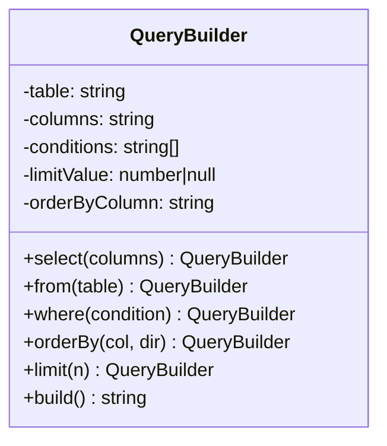

import { Tabs, TabItem } from '@astrojs/starlight/components';
import TypeScriptRepl from '../../../../../components/TypeScriptRepl.astro';
import PythonRepl from '../../../../../components/PythonRepl.astro';
import GoRepl from '../../../../../components/GoRepl.astro';
import tsCode from './builder.ts?raw';
import pyCode from './builder.py?raw';
import goCode from './builder.go?raw';

## The problem

When an object has many optional fields, constructor calls become unreadable. A function with eight parameters forces callers to remember argument order, and most parameters are left as `null` or a default sentinel. The telescoping constructor antipattern is the common symptom: one constructor for every combination of optional fields, each delegating to a longer one. Adding a ninth parameter breaks every call site.

The Builder pattern moves construction into a dedicated object that collects configuration incrementally. The caller sets only what matters, in any order, and triggers construction in a single terminal step. That step is also the right place to validate that mandatory fields are present and that collected configuration is internally consistent. The product comes back in a fully initialized state or not at all.

## Structure

## When to use

- An object requires more than three or four constructor arguments, especially when most are optional.
- You need to produce several representations of the same logical structure (e.g. SQL vs. a query DSL object vs. a log string) from the same assembly steps.
- Construction involves validation that only makes sense after all inputs are known (cross-field invariants).
- You want to prevent callers from holding a partially constructed object and accidentally using it.

## Implementation

The SQL `QueryBuilder` accumulates clauses through method chaining: each setter returns `this` (or `self`), and `build()` validates then assembles the final string. Python's `from` is a reserved keyword, so the method is named `from_`. Go has no default parameter values, so optional clauses use explicit fields; the `hasLimit` boolean distinguishes "not set" from `LIMIT 0`, and `Build()` returns an error rather than panicking.

<Tabs>
<TabItem label="TypeScript">
<TypeScriptRepl code={tsCode} id="builder-ts" />
</TabItem>
<TabItem label="Python">
<PythonRepl code={pyCode} id="builder-py" />
</TabItem>
<TabItem label="Go">
<GoRepl code={goCode} id="builder-go" />
</TabItem>
</Tabs>

## Tradeoffs

| Pro | Con |
| --- | --- |
| Eliminates telescoping constructors | More types to maintain |
| Makes optional parameters explicit | Overkill for objects with 2-3 fields |
| Prevents half-constructed objects | Fluent interface can obscure invariants |
| Supports multiple representations | Builder itself can grow unwieldy |

## Gotchas

- **Mutable builder, immutable product**: `build()` should copy state rather than expose builder fields on the product. Callers who keep a reference to the builder and mutate it after building should not affect the product.
- **Validate in `build()`, not in setters**: individual setters rarely have enough context to enforce cross-field invariants. Collect all inputs first, then validate once.
- **TypeScript `this` return type**: returning `this` instead of the concrete class name enables subclassing. In Python, the `QueryBuilder` annotation on return types breaks if you subclass; use `Self` (3.11+) or a `TypeVar` bound to the class.
- **Go error accumulation**: Go has no method chaining ergonomics for collecting errors across calls. Put all validation in `Build()` and return a single error from there.
- **Calling `build()` twice**: two calls on the same builder should produce two independent products. Either document single-use or copy internal state in `build()` so subsequent mutations don't affect earlier products.

## References

- [Design Patterns: Elements of Reusable Object-Oriented Software](https://www.goodreads.com/book/show/85009.Design_Patterns), GoF, pp. 97-106, the original Builder chapter
- [Effective Java, Item 2: Consider a builder when faced with many constructor parameters](https://www.oreilly.com/library/view/effective-java/9780134686097/), Joshua Bloch
- [Fluent Interface, Martin Fowler](https://www.martinfowler.com/bliki/FluentInterface.html), the naming and framing of method chaining
- [Builder Pattern, Refactoring Guru](https://refactoring.guru/design-patterns/builder), worked examples in multiple languages

## Related topics

- [Design Patterns](../), the full GoF catalog and pattern index
- [Factory](../factory/), a simpler creational pattern for single-step construction
- [Strategy](../strategy/), a behavioral pattern that pairs well with builders for algorithm selection
