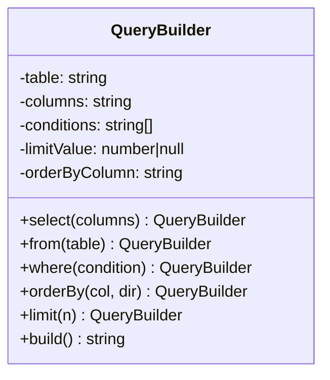

import { Tabs, TabItem } from '@astrojs/starlight/components';

## The problem

When an object has many optional fields, constructor calls become unreadable. A function with eight parameters forces callers to remember argument order, and most parameters are left as `null` or a default sentinel. The telescoping constructor antipattern is the common symptom: one constructor for every combination of optional fields, each delegating to a longer one. Adding a ninth parameter breaks every call site.

The Builder pattern moves construction into a dedicated object that collects configuration incrementally. The caller sets only what matters, in any order, and triggers construction in a single terminal step. That step is also the right place to validate that mandatory fields are present and that collected configuration is internally consistent. The product comes back in a fully initialized state or not at all.

## Structure



## When to use

- An object requires more than three or four constructor arguments, especially when most are optional.
- You need to produce several representations of the same logical structure (e.g. SQL vs. a query DSL object vs. a log string) from the same assembly steps.
- Construction involves validation that only makes sense after all inputs are known (cross-field invariants).
- You want to prevent callers from holding a partially constructed object and accidentally using it.

## Implementation

<Tabs>
<TabItem label="TypeScript">

The SQL `QueryBuilder` below accumulates clauses through method chaining. Each setter returns `this`, which lets calls chain. `build()` validates and assembles the final string.

```typescript
class QueryBuilder {
  private table = '';
  private columns = '*';
  private conditions: string[] = [];
  private limitValue: number | null = null;
  private orderByColumn = '';
  private orderDir: 'ASC' | 'DESC' = 'ASC';

  select(columns: string): this { this.columns = columns; return this; }
  from(table: string): this { this.table = table; return this; }
  where(condition: string): this { this.conditions.push(condition); return this; }
  orderBy(column: string, dir: 'ASC' | 'DESC' = 'ASC'): this {
    this.orderByColumn = column; this.orderDir = dir; return this;
  }
  limit(n: number): this { this.limitValue = n; return this; }

  build(): string {
    if (!this.table) throw new Error('FROM clause is required');
    let q = `SELECT ${this.columns} FROM ${this.table}`;
    if (this.conditions.length > 0) q += ` WHERE ${this.conditions.join(' AND ')}`;
    if (this.orderByColumn) q += ` ORDER BY ${this.orderByColumn} ${this.orderDir}`;
    if (this.limitValue !== null) q += ` LIMIT ${this.limitValue}`;
    return q;
  }
}

const query = new QueryBuilder()
  .select('id, name, email')
  .from('users')
  .where('active = true')
  .where('age > 18')
  .orderBy('name')
  .limit(10)
  .build();

console.log(query);
// SELECT id, name, email FROM users WHERE active = true AND age > 18 ORDER BY name ASC LIMIT 10
```

</TabItem>
<TabItem label="Python">

Python's `from` is a reserved keyword, so the `from_` method handles that clause. The `__future__` import lets the return type annotation refer to `QueryBuilder` before the class is fully defined.

```python
from __future__ import annotations


class QueryBuilder:
    def __init__(self) -> None:
        self._table = ''
        self._columns = '*'
        self._conditions: list[str] = []
        self._limit: int | None = None
        self._order_by = ''
        self._order_dir = 'ASC'

    def select(self, columns: str) -> QueryBuilder:
        self._columns = columns
        return self

    def from_(self, table: str) -> QueryBuilder:
        self._table = table
        return self

    def where(self, condition: str) -> QueryBuilder:
        self._conditions.append(condition)
        return self

    def order_by(self, column: str, direction: str = 'ASC') -> QueryBuilder:
        self._order_by = column
        self._order_dir = direction
        return self

    def limit(self, n: int) -> QueryBuilder:
        self._limit = n
        return self

    def build(self) -> str:
        if not self._table:
            raise ValueError('FROM clause is required')
        q = f'SELECT {self._columns} FROM {self._table}'
        if self._conditions:
            q += ' WHERE ' + ' AND '.join(self._conditions)
        if self._order_by:
            q += f' ORDER BY {self._order_by} {self._order_dir}'
        if self._limit is not None:
            q += f' LIMIT {self._limit}'
        return q


query = (
    QueryBuilder()
    .select('id, name, email')
    .from_('users')
    .where('active = true')
    .where('age > 18')
    .order_by('name')
    .limit(10)
    .build()
)
print(query)
# SELECT id, name, email FROM users WHERE active = true AND age > 18 ORDER BY name ASC LIMIT 10
```

</TabItem>
<TabItem label="Go">

Go has no default parameter values, so optional clauses are tracked with explicit fields. The `hasLimit` boolean distinguishes "not set" from `LIMIT 0`. All validation lives in `Build()`, which returns an error rather than panicking.

```go
package main

import (
	"errors"
	"fmt"
	"strings"
)

type QueryBuilder struct {
	table      string
	columns    string
	conditions []string
	orderCol   string
	orderDir   string
	limitVal   int
	hasLimit   bool
}

func NewQuery() *QueryBuilder {
	return &QueryBuilder{columns: "*", orderDir: "ASC"}
}

func (q *QueryBuilder) Select(columns string) *QueryBuilder {
	q.columns = columns
	return q
}

func (q *QueryBuilder) From(table string) *QueryBuilder {
	q.table = table
	return q
}

func (q *QueryBuilder) Where(condition string) *QueryBuilder {
	q.conditions = append(q.conditions, condition)
	return q
}

func (q *QueryBuilder) OrderBy(column, dir string) *QueryBuilder {
	q.orderCol = column
	q.orderDir = dir
	return q
}

func (q *QueryBuilder) Limit(n int) *QueryBuilder {
	q.limitVal = n
	q.hasLimit = true
	return q
}

func (q *QueryBuilder) Build() (string, error) {
	if q.table == "" {
		return "", errors.New("FROM clause is required")
	}
	query := fmt.Sprintf("SELECT %s FROM %s", q.columns, q.table)
	if len(q.conditions) > 0 {
		query += " WHERE " + strings.Join(q.conditions, " AND ")
	}
	if q.orderCol != "" {
		query += fmt.Sprintf(" ORDER BY %s %s", q.orderCol, q.orderDir)
	}
	if q.hasLimit {
		query += fmt.Sprintf(" LIMIT %d", q.limitVal)
	}
	return query, nil
}

func main() {
	query, err := NewQuery().
		Select("id, name, email").
		From("users").
		Where("active = true").
		Where("age > 18").
		OrderBy("name", "ASC").
		Limit(10).
		Build()
	if err != nil {
		panic(err)
	}
	fmt.Println(query)
	// SELECT id, name, email FROM users WHERE active = true AND age > 18 ORDER BY name ASC LIMIT 10
}
```

</TabItem>
</Tabs>

## Tradeoffs

| Pro | Con |
| --- | --- |
| Eliminates telescoping constructors | More types to maintain |
| Makes optional parameters explicit | Overkill for objects with 2-3 fields |
| Prevents half-constructed objects | Fluent interface can obscure invariants |
| Supports multiple representations | Builder itself can grow unwieldy |

## Gotchas

- **Mutable builder, immutable product**: `build()` should copy state rather than expose builder fields on the product. Callers who keep a reference to the builder and mutate it after building should not affect the product.
- **Validate in `build()`, not in setters**: individual setters rarely have enough context to enforce cross-field invariants. Collect all inputs first, then validate once.
- **TypeScript `this` return type**: returning `this` instead of the concrete class name enables subclassing. In Python, the `QueryBuilder` annotation on return types breaks if you subclass; use `Self` (3.11+) or a `TypeVar` bound to the class.
- **Go error accumulation**: Go has no method chaining ergonomics for collecting errors across calls. Put all validation in `Build()` and return a single error from there.
- **Calling `build()` twice**: two calls on the same builder should produce two independent products. Either document single-use or copy internal state in `build()` so subsequent mutations don't affect earlier products.

## References

- [Design Patterns: Elements of Reusable Object-Oriented Software](https://www.goodreads.com/book/show/85009.Design_Patterns), GoF, pp. 97-106, the original Builder chapter
- [Effective Java, Item 2: Consider a builder when faced with many constructor parameters](https://www.oreilly.com/library/view/effective-java/9780134686097/), Joshua Bloch
- [Fluent Interface, Martin Fowler](https://www.martinfowler.com/bliki/FluentInterface.html), the naming and framing of method chaining
- [Builder Pattern, Refactoring Guru](https://refactoring.guru/design-patterns/builder), worked examples in multiple languages

## Related topics

- [Design Patterns](../), the full GoF catalog and pattern index
- [Factory](../factory/), a simpler creational pattern for single-step construction
- [Strategy](../strategy/), a behavioral pattern that pairs well with builders for algorithm selection
