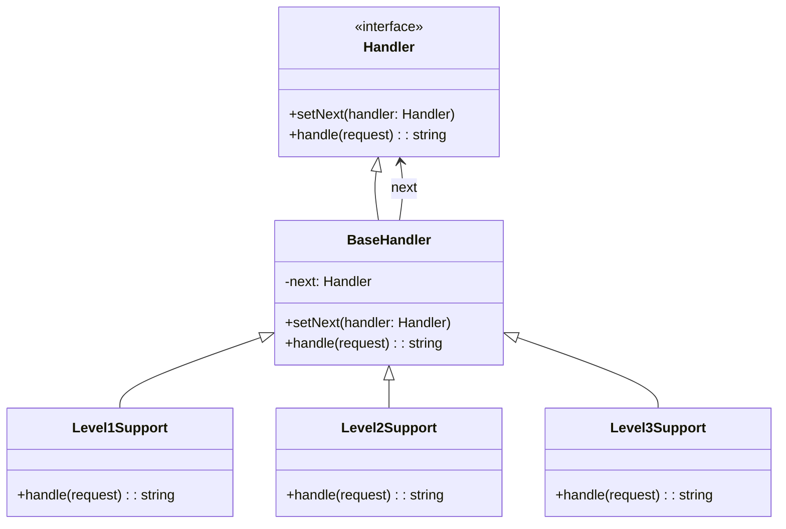

import { Tabs, TabItem } from '@astrojs/starlight/components';
import TypeScriptRepl from '../../../../../components/TypeScriptRepl.astro';
import PythonRepl from '../../../../../components/PythonRepl.astro';
import GoRepl from '../../../../../components/GoRepl.astro';
import tsCode from './chain-of-responsibility.ts?raw';
import pyCode from './chain-of-responsibility.py?raw';
import goCode from './chain-of-responsibility.go?raw';

## The problem

A request needs to be handled, but the right handler depends on runtime conditions. A support ticket might be resolved by a front-line agent, escalated to a specialist, or escalated again to engineering. Hardcoding the routing logic into the sender couples it to every possible receiver. Adding a new tier requires changing the sender. Removing a tier requires the same.

Chain of Responsibility decouples the sender from the receiver by giving multiple objects a chance to handle the request. Each handler either processes the request or passes it to the next handler in the chain. The sender fires into the chain without knowing which handler will respond, or if any will.

## Structure

## When to use

- More than one object may handle a request, and the handler is not known at compile time.
- You want to issue a request to one of several objects without specifying the receiver explicitly.
- The set of objects that can handle a request should be specified dynamically.
- You are building middleware, event bubbling, or a processing pipeline where each stage can short-circuit the chain.

## Implementation

All three show the same support ticket escalation: `Level1Support` handles password resets, `Level2Support` handles billing disputes, and `Level3Support` handles data corruption. Each handler checks the request and either resolves it or forwards to the next via `BaseHandler`. The fluent `setNext` return value lets you chain assignments in one expression. Go has no inheritance, so `BaseHandler` is embedded in each concrete struct; forwarding requires explicitly calling `h.BaseHandler.Handle(request)` rather than `h.Handle(request)` to avoid infinite recursion.

<Tabs>
<TabItem label="TypeScript">
<TypeScriptRepl code={tsCode} id="chain-of-responsibility-ts" />
</TabItem>
<TabItem label="Python">
<PythonRepl code={pyCode} id="chain-of-responsibility-py" />
</TabItem>
<TabItem label="Go">
<GoRepl code={goCode} id="chain-of-responsibility-go" />
</TabItem>
</Tabs>

## Tradeoffs

| Pro | Con |
| --- | --- |
| Decouples sender from all possible receivers | No guarantee any handler will process the request |
| Single responsibility: each handler focuses on one case | Debugging is harder; the request path is implicit |
| Open/closed: add handlers without changing senders | Performance degrades if the chain is long and the matching handler is near the end |
| Supports dynamic chains assembled at runtime | Circular chains cause infinite loops |

## Gotchas

- **Unhandled requests**: If no handler claims a request, it silently drops. Decide up front whether `null`/empty string is acceptable or whether the end of the chain should throw.
- **Order matters**: Handlers earlier in the chain get first refusal. A broad handler placed before a specific one will swallow requests the specific handler should have caught.
- **Shared mutable state**: Handlers should not modify the request object in ways that break subsequent handlers. Pass immutable request objects or document mutation contracts explicitly.
- **Circular chains**: Setting `l1 → l2 → l1` produces infinite recursion. Validate chain assembly in tests or add a visited-set guard if chains are built dynamically.
- **Go embedding**: Calling `h.Handle(request)` inside a concrete handler recurses into itself. Always call `h.BaseHandler.Handle(request)` to forward correctly.

## References

- [Design Patterns: Chain of Responsibility, GoF](https://www.informit.com/store/design-patterns-elements-of-reusable-object-oriented-9780201633610), the canonical definition
- [Refactoring Guru: Chain of Responsibility](https://refactoring.guru/design-patterns/chain-of-responsibility), diagrams and examples in multiple languages
- [SourceMaking: Chain of Responsibility](https://sourcemaking.com/design_patterns/chain_of_responsibility), additional known uses

## Related topics

- [Design Patterns](../), the full GoF catalog
- [Command](../command/), Command encapsulates the request; Chain of Responsibility routes it
- [Decorator](../decorator/), also chains objects but wraps behavior rather than routing requests
- [Observer](../observer/), broadcasts to all listeners; Chain of Responsibility stops at the first match
