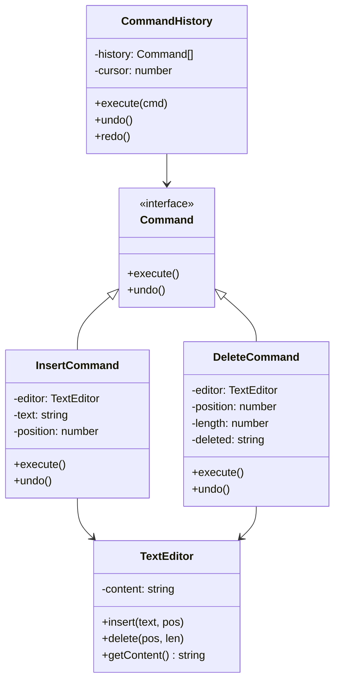

import { Tabs, TabItem } from '@astrojs/starlight/components';

## The problem

In most applications, user actions and the code that handles them are directly coupled. A button click calls a method. A menu item calls a different method. When you need undo, you realize every action needs a reverse operation, but those reverse operations are scattered across unrelated objects with no shared structure. Logging, queueing, and replaying operations have the same problem: there is no object to log, queue, or replay.

The Command pattern fixes this by packaging each operation as an object with a uniform interface. Every command knows how to execute itself and how to undo itself. A history stack of command objects gives you undo and redo for free. A queue of command objects gives you deferred execution for free. Audit logging means serializing a list of command objects rather than instrumenting dozens of call sites.

## Structure



## When to use

- You need undo and redo. The history stack of command objects is the canonical implementation.
- You want to queue or schedule operations rather than execute them immediately.
- You need an audit log of every action a user or system took, in order and reversible.
- You want to compose simple commands into macro commands without changing the calling code.

## Implementation

<Tabs>
<TabItem label="TypeScript">

`TextEditor` is the receiver: it owns the content and exposes `insert` and `delete`. Commands wrap operations on the editor and capture enough state to reverse them. `CommandHistory` manages the stack and handles redo by truncating forward history when a new command arrives.

```typescript
interface Command {
  execute(): void;
  undo(): void;
}

class TextEditor {
  private content = '';

  getContent(): string { return this.content; }

  insert(text: string, pos: number): void {
    this.content = this.content.slice(0, pos) + text + this.content.slice(pos);
  }

  delete(pos: number, len: number): void {
    this.content = this.content.slice(0, pos) + this.content.slice(pos + len);
  }
}

class InsertCommand implements Command {
  constructor(
    private editor: TextEditor,
    private text: string,
    private position: number,
  ) {}

  execute(): void { this.editor.insert(this.text, this.position); }
  undo(): void { this.editor.delete(this.position, this.text.length); }
}

class DeleteCommand implements Command {
  private deleted = '';

  constructor(
    private editor: TextEditor,
    private position: number,
    private length: number,
  ) {}

  execute(): void {
    const content = this.editor.getContent();
    this.deleted = content.slice(this.position, this.position + this.length);
    this.editor.delete(this.position, this.length);
  }

  undo(): void { this.editor.insert(this.deleted, this.position); }
}

class CommandHistory {
  private history: Command[] = [];
  private cursor = -1;

  execute(cmd: Command): void {
    this.history = this.history.slice(0, this.cursor + 1);
    cmd.execute();
    this.history.push(cmd);
    this.cursor++;
  }

  undo(): void {
    if (this.cursor < 0) return;
    this.history[this.cursor].undo();
    this.cursor--;
  }

  redo(): void {
    if (this.cursor >= this.history.length - 1) return;
    this.cursor++;
    this.history[this.cursor].execute();
  }
}

const editor = new TextEditor();
const history = new CommandHistory();

history.execute(new InsertCommand(editor, 'Hello, ', 0));
history.execute(new InsertCommand(editor, 'world', 7));
console.log(editor.getContent()); // Hello, world

history.undo();
console.log(editor.getContent()); // Hello, 

history.redo();
console.log(editor.getContent()); // Hello, world

history.execute(new DeleteCommand(editor, 7, 5));
console.log(editor.getContent()); // Hello, 
```

</TabItem>
<TabItem label="Python">

`abc.ABC` with `@abstractmethod` is the idiomatic way to define the `Command` interface in Python. The `DeleteCommand` captures deleted text inside `execute()`, not in `__init__`, because the content to be deleted does not exist yet at construction time.

```python
from __future__ import annotations
from abc import ABC, abstractmethod


class Command(ABC):
    @abstractmethod
    def execute(self) -> None: ...

    @abstractmethod
    def undo(self) -> None: ...


class TextEditor:
    def __init__(self) -> None:
        self._content = ''

    def get_content(self) -> str:
        return self._content

    def insert(self, text: str, pos: int) -> None:
        self._content = self._content[:pos] + text + self._content[pos:]

    def delete(self, pos: int, length: int) -> None:
        self._content = self._content[:pos] + self._content[pos + length:]


class InsertCommand(Command):
    def __init__(self, editor: TextEditor, text: str, position: int) -> None:
        self._editor = editor
        self._text = text
        self._position = position

    def execute(self) -> None:
        self._editor.insert(self._text, self._position)

    def undo(self) -> None:
        self._editor.delete(self._position, len(self._text))


class DeleteCommand(Command):
    def __init__(self, editor: TextEditor, position: int, length: int) -> None:
        self._editor = editor
        self._position = position
        self._length = length
        self._deleted = ''

    def execute(self) -> None:
        content = self._editor.get_content()
        self._deleted = content[self._position:self._position + self._length]
        self._editor.delete(self._position, self._length)

    def undo(self) -> None:
        self._editor.insert(self._deleted, self._position)


class CommandHistory:
    def __init__(self) -> None:
        self._history: list[Command] = []
        self._cursor = -1

    def execute(self, cmd: Command) -> None:
        self._history = self._history[:self._cursor + 1]
        cmd.execute()
        self._history.append(cmd)
        self._cursor += 1

    def undo(self) -> None:
        if self._cursor < 0:
            return
        self._history[self._cursor].undo()
        self._cursor -= 1

    def redo(self) -> None:
        if self._cursor >= len(self._history) - 1:
            return
        self._cursor += 1
        self._history[self._cursor].execute()


editor = TextEditor()
history = CommandHistory()

history.execute(InsertCommand(editor, 'Hello, ', 0))
history.execute(InsertCommand(editor, 'world', 7))
print(editor.get_content())  # Hello, world

history.undo()
print(editor.get_content())  # Hello, 

history.redo()
print(editor.get_content())  # Hello, world
```

</TabItem>
<TabItem label="Go">

Go uses an interface for `Command`. There are no abstract classes, so the interface is the natural fit. String slicing on a raw `string` type works the same way as in TypeScript and Python for this ASCII example. In production code handling Unicode, you would convert to `[]rune` first.

```go
package main

import "fmt"

type Command interface {
	Execute()
	Undo()
}

type TextEditor struct {
	content string
}

func (e *TextEditor) GetContent() string { return e.content }

func (e *TextEditor) Insert(text string, pos int) {
	e.content = e.content[:pos] + text + e.content[pos:]
}

func (e *TextEditor) Delete(pos, length int) {
	e.content = e.content[:pos] + e.content[pos+length:]
}

type InsertCommand struct {
	editor   *TextEditor
	text     string
	position int
}

func (c *InsertCommand) Execute() { c.editor.Insert(c.text, c.position) }
func (c *InsertCommand) Undo()    { c.editor.Delete(c.position, len(c.text)) }

type DeleteCommand struct {
	editor   *TextEditor
	position int
	length   int
	deleted  string
}

func (c *DeleteCommand) Execute() {
	content := c.editor.GetContent()
	c.deleted = content[c.position : c.position+c.length]
	c.editor.Delete(c.position, c.length)
}

func (c *DeleteCommand) Undo() { c.editor.Insert(c.deleted, c.position) }

type CommandHistory struct {
	history []Command
	cursor  int
}

func NewHistory() *CommandHistory { return &CommandHistory{cursor: -1} }

func (h *CommandHistory) Execute(cmd Command) {
	h.history = h.history[:h.cursor+1]
	cmd.Execute()
	h.history = append(h.history, cmd)
	h.cursor++
}

func (h *CommandHistory) Undo() {
	if h.cursor < 0 {
		return
	}
	h.history[h.cursor].Undo()
	h.cursor--
}

func (h *CommandHistory) Redo() {
	if h.cursor >= len(h.history)-1 {
		return
	}
	h.cursor++
	h.history[h.cursor].Execute()
}

func main() {
	editor := &TextEditor{}
	history := NewHistory()

	history.Execute(&InsertCommand{editor, "Hello, ", 0})
	history.Execute(&InsertCommand{editor, "world", 7})
	fmt.Println(editor.GetContent()) // Hello, world

	history.Undo()
	fmt.Println(editor.GetContent()) // Hello, 

	history.Redo()
	fmt.Println(editor.GetContent()) // Hello, world
}
```

</TabItem>
</Tabs>

## Tradeoffs

| Pro | Con |
| --- | --- |
| Undo/redo is a natural consequence | Each operation needs its own class |
| Commands are first-class: queue, log, serialize | Deleted state must be captured at execute time |
| Decouples sender from receiver | History can consume significant memory |
| Composable into macro commands | Redo breaks if history is branching (must truncate) |

## Gotchas

- **Capture deleted content in `execute()`, not the constructor**: the constructor runs before the edit happens, so the content to be deleted does not exist yet. Capture it as the first step of `execute()`.
- **Truncate redo history on new commands**: when the user makes a new edit after undoing, any redoable future is gone. Truncate `history` to `cursor + 1` before pushing the new command.
- **Python interface idiom**: `abc.ABC` with `@abstractmethod` is the right way to define the `Command` interface. A plain class with unimplemented methods will work but won't fail loudly when a subclass forgets to implement one.
- **Go package-private interfaces**: if all command types live in one package, an unexported `command` interface is fine. If commands cross package boundaries (e.g. plugins), the interface must be exported.
- **Macro commands**: a composite command that holds a list of sub-commands and calls each in turn implements the same `Command` interface. No change needed in `CommandHistory`.

## References

- [Design Patterns: Elements of Reusable Object-Oriented Software](https://www.goodreads.com/book/show/85009.Design_Patterns), GoF, pp. 233-242, the original Command chapter
- [Command Pattern, Refactoring Guru](https://refactoring.guru/design-patterns/command), worked examples and diagrams
- [Command Pattern in Game Programming Patterns](https://gameprogrammingpatterns.com/command.html), Robert Nystrom's treatment with undo, redo, and replay in a game context
- [Undo/Redo the Right Way](https://www.inkandswitch.com/cambria/), Ink and Switch on command history in collaborative editing

## Related topics

- [Design Patterns](../), the full GoF catalog and pattern index
- [Observer](../observer/), another behavioral pattern for decoupling senders from receivers
- [Strategy](../strategy/), also encapsulates behavior as an object, but without undo semantics
