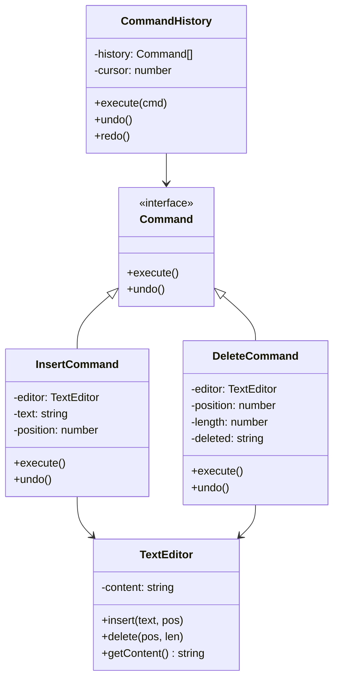

import { Tabs, TabItem } from '@astrojs/starlight/components';
import TypeScriptRepl from '../../../../../components/TypeScriptRepl.astro';
import PythonRepl from '../../../../../components/PythonRepl.astro';
import GoRepl from '../../../../../components/GoRepl.astro';
import tsCode from './command.ts?raw';
import pyCode from './command.py?raw';
import goCode from './command.go?raw';

## The problem

In most applications, user actions and the code that handles them are directly coupled. A button click calls a method. A menu item calls a different method. When you need undo, you realize every action needs a reverse operation, but those reverse operations are scattered across unrelated objects with no shared structure. Logging, queueing, and replaying operations have the same problem: there is no object to log, queue, or replay.

The Command pattern fixes this by packaging each operation as an object with a uniform interface. Every command knows how to execute itself and how to undo itself. A history stack of command objects gives you undo and redo for free. A queue of command objects gives you deferred execution for free. Audit logging means serializing a list of command objects rather than instrumenting dozens of call sites.

## Structure

## When to use

- You need undo and redo. The history stack of command objects is the canonical implementation.
- You want to queue or schedule operations rather than execute them immediately.
- You need an audit log of every action a user or system took, in order and reversible.
- You want to compose simple commands into macro commands without changing the calling code.

## Implementation

`TextEditor` is the receiver: it owns the content and exposes `insert` and `delete`. Commands wrap operations on the editor and capture enough state to reverse them. `CommandHistory` manages the stack and handles redo by truncating forward history when a new command arrives. Python uses `abc.ABC` with `@abstractmethod` for the `Command` interface. Go uses an interface type since there are no abstract classes; note that string slicing on raw `string` works for this ASCII example, but production Unicode code would convert to `[]rune` first.

<Tabs>
<TabItem label="TypeScript">
<TypeScriptRepl code={tsCode} id="command-ts" />
</TabItem>
<TabItem label="Python">
<PythonRepl code={pyCode} id="command-py" />
</TabItem>
<TabItem label="Go">
<GoRepl code={goCode} id="command-go" />
</TabItem>
</Tabs>

## Tradeoffs

| Pro | Con |
| --- | --- |
| Undo/redo is a natural consequence | Each operation needs its own class |
| Commands are first-class: queue, log, serialize | Deleted state must be captured at execute time |
| Decouples sender from receiver | History can consume significant memory |
| Composable into macro commands | Redo breaks if history is branching (must truncate) |

## Gotchas

- **Capture deleted content in `execute()`, not the constructor**: the constructor runs before the edit happens, so the content to be deleted does not exist yet. Capture it as the first step of `execute()`.
- **Truncate redo history on new commands**: when the user makes a new edit after undoing, any redoable future is gone. Truncate `history` to `cursor + 1` before pushing the new command.
- **Python interface idiom**: `abc.ABC` with `@abstractmethod` is the right way to define the `Command` interface. A plain class with unimplemented methods will work but won't fail loudly when a subclass forgets to implement one.
- **Go package-private interfaces**: if all command types live in one package, an unexported `command` interface is fine. If commands cross package boundaries (e.g. plugins), the interface must be exported.
- **Macro commands**: a composite command that holds a list of sub-commands and calls each in turn implements the same `Command` interface. No change needed in `CommandHistory`.

## References

- [Design Patterns: Elements of Reusable Object-Oriented Software](https://www.goodreads.com/book/show/85009.Design_Patterns), GoF, pp. 233-242, the original Command chapter
- [Command Pattern, Refactoring Guru](https://refactoring.guru/design-patterns/command), worked examples and diagrams
- [Command Pattern in Game Programming Patterns](https://gameprogrammingpatterns.com/command.html), Robert Nystrom's treatment with undo, redo, and replay in a game context
- [Undo/Redo the Right Way](https://www.inkandswitch.com/cambria/), Ink and Switch on command history in collaborative editing

## Related topics

- [Design Patterns](../), the full GoF catalog and pattern index
- [Observer](../observer/), another behavioral pattern for decoupling senders from receivers
- [Strategy](../strategy/), also encapsulates behavior as an object, but without undo semantics
