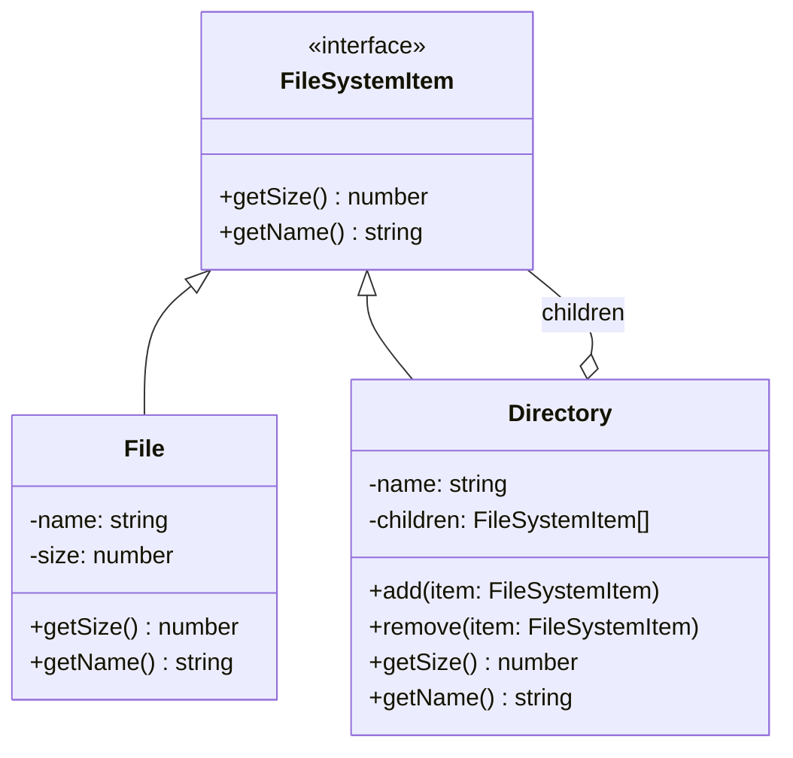

import { Tabs, TabItem } from '@astrojs/starlight/components';
import TypeScriptRepl from '../../../../../components/TypeScriptRepl.astro';
import PythonRepl from '../../../../../components/PythonRepl.astro';
import GoRepl from '../../../../../components/GoRepl.astro';
import tsCode from './composite.ts?raw';
import pyCode from './composite.py?raw';
import goCode from './composite.go?raw';

## The problem

You have a tree structure where individual items and groups of items need to be treated the same way. A file system is the canonical example: a single file has a size, and a directory also has a size (the sum of its children). Code that asks "how big is this thing?" should not need to know whether it is talking to a file or a directory. The naive approach uses `instanceof` checks everywhere: `if (item instanceof Directory) { recurse... } else { return item.size; }`. That conditional leaks into every caller and must be updated every time a new node type is added.

Composite solves this by giving both leaves and composites the same interface. The composite's implementation of each method delegates to its children and combines their results. Callers never inspect the type of the object they hold.

## Structure



## When to use

- You need to represent part-whole hierarchies: trees where nodes and leaves share behavior.
- Clients should be able to ignore the difference between compositions of objects and individual objects.
- You are adding `instanceof` or type-tag checks to methods that should be uniform across node types.
- The structure is recursive by nature: a directory can contain other directories.

## Implementation

<Tabs>
<TabItem label="TypeScript">

`Directory.getSize()` iterates its children and sums their sizes. Because `File` and `Directory` both implement `FileSystemItem`, the loop works without any type inspection.

```typescript
interface FileSystemItem {
  getSize(): number;
  getName(): string;
}

class File implements FileSystemItem {
  constructor(private name: string, private size: number) {}

  getSize(): number {
    return this.size;
  }

  getName(): string {
    return this.name;
  }
}

class Directory implements FileSystemItem {
  private children: FileSystemItem[] = [];

  constructor(private name: string) {}

  add(item: FileSystemItem): void {
    this.children.push(item);
  }

  remove(item: FileSystemItem): void {
    this.children = this.children.filter((c) => c !== item);
  }

  getSize(): number {
    return this.children.reduce((total, child) => total + child.getSize(), 0);
  }

  getName(): string {
    return this.name;
  }
}

const root = new Directory('root');
const src = new Directory('src');
src.add(new File('index.ts', 1200));
src.add(new File('utils.ts', 800));

const assets = new Directory('assets');
assets.add(new File('logo.png', 45000));

root.add(src);
root.add(assets);
root.add(new File('README.md', 300));

console.log(root.getSize()); // 47300
console.log(src.getSize());  // 2000
```

</TabItem>
<TabItem label="Python">

The abstract base class enforces the interface on both `File` and `Directory`. `__repr__` on `Directory` walks the tree recursively, showing the shape of the composite.

```python
from __future__ import annotations
from abc import ABC, abstractmethod


class FileSystemItem(ABC):
    @abstractmethod
    def get_size(self) -> int: ...

    @abstractmethod
    def get_name(self) -> str: ...


class File(FileSystemItem):
    def __init__(self, name: str, size: int) -> None:
        self._name = name
        self._size = size

    def get_size(self) -> int:
        return self._size

    def get_name(self) -> str:
        return self._name

    def __repr__(self) -> str:
        return f'File({self._name!r}, {self._size}B)'


class Directory(FileSystemItem):
    def __init__(self, name: str) -> None:
        self._name = name
        self._children: list[FileSystemItem] = []

    def add(self, item: FileSystemItem) -> None:
        self._children.append(item)

    def remove(self, item: FileSystemItem) -> None:
        self._children.remove(item)

    def get_size(self) -> int:
        return sum(child.get_size() for child in self._children)

    def get_name(self) -> str:
        return self._name

    def __repr__(self) -> str:
        return f'Directory({self._name!r}, children={self._children!r})'


root = Directory('root')
src = Directory('src')
src.add(File('index.py', 1200))
src.add(File('utils.py', 800))

assets = Directory('assets')
assets.add(File('logo.png', 45000))

root.add(src)
root.add(assets)
root.add(File('README.md', 300))

print(root.get_size())   # 47300
print(src.get_size())    # 2000
print(repr(src))
# Directory('src', children=[File('index.py', 1200B), File('utils.py', 800B)])
```

</TabItem>
<TabItem label="Go">

Go interfaces are satisfied implicitly. Both `FileNode` and `DirNode` implement `FileSystemItem` without any declaration. The composite stores a slice of the interface, so any node type can nest inside any directory.

```go
package main

import "fmt"

type FileSystemItem interface {
	GetSize() int
	GetName() string
}

type FileNode struct {
	name string
	size int
}

func (f *FileNode) GetSize() int    { return f.size }
func (f *FileNode) GetName() string { return f.name }

type DirNode struct {
	name     string
	children []FileSystemItem
}

func (d *DirNode) Add(item FileSystemItem) {
	d.children = append(d.children, item)
}

func (d *DirNode) Remove(item FileSystemItem) {
	filtered := d.children[:0]
	for _, c := range d.children {
		if c != item {
			filtered = append(filtered, c)
		}
	}
	d.children = filtered
}

func (d *DirNode) GetSize() int {
	total := 0
	for _, child := range d.children {
		total += child.GetSize()
	}
	return total
}

func (d *DirNode) GetName() string { return d.name }

func main() {
	root := &DirNode{name: "root"}
	src := &DirNode{name: "src"}
	src.Add(&FileNode{name: "main.go", size: 1200})
	src.Add(&FileNode{name: "utils.go", size: 800})

	assets := &DirNode{name: "assets"}
	assets.Add(&FileNode{name: "logo.png", size: 45000})

	root.Add(src)
	root.Add(assets)
	root.Add(&FileNode{name: "README.md", size: 300})

	fmt.Println(root.GetSize()) // 47300
	fmt.Println(src.GetSize())  // 2000
}
```

</TabItem>
</Tabs>

## Tradeoffs

| Pro | Con |
| --- | --- |
| Clients treat leaves and composites identically, no type checks needed | Hard to restrict which component types can be children of a composite |
| Adding new leaf or composite types requires no changes to existing code | Deep trees can make stack overflows a real concern for very large hierarchies |
| Recursive operations (size, render, serialize) write once and work at every level | Shared mutable state in leaf nodes causes subtle bugs when the same leaf appears under two parents |
| Natural fit for any domain with inherent tree structure: UI widgets, org charts, file systems, scene [graphs](../data-structures/graphs/) | Operations that only make sense on leaves (like `getContent()`) pollute the shared interface or require casting |

## Gotchas

- **Child management placement**: The GoF book identifies two options: put `add`/`remove` on the `Component` interface (uniform but meaningless on leaves) or put them only on `Composite` (safe but requires casting to add children). Most practical implementations put them on the composite and accept the cast at construction time.
- **Cycles**: If you allow `directory.add(directory)`, a `getSize()` call loops forever. Guard by checking that a node is not an ancestor of itself before accepting it as a child.
- **Caching size**: For large trees that are read often but changed rarely, cache `getSize()` and invalidate upward on mutation. Otherwise every read rescans the full subtree.
- **Ordering**: Some composites care about child order (a UI layout, a scene graph). Others do not (a directory). Make the ordering contract explicit; `add` at index vs. `append` are different APIs.
- **Null leaf**: A `NullObject` that implements `FileSystemItem` and returns zero for everything can replace null checks when a slot in a composite might be empty.

## References

- [Design Patterns: Composite, GoF](https://www.informit.com/store/design-patterns-elements-of-reusable-object-oriented-9780201633610), the canonical definition
- [Refactoring Guru: Composite](https://refactoring.guru/design-patterns/composite), diagrams and multiple-language examples
- [SourceMaking: Composite](https://sourcemaking.com/design_patterns/composite), additional context and known uses

## Related topics

- [Design Patterns](../), the full GoF catalog
- [Decorator](../decorator/), also uses recursive wrapping but adds behavior rather than building trees
- [Flyweight](../flyweight/), often combined with Composite to share leaf nodes
