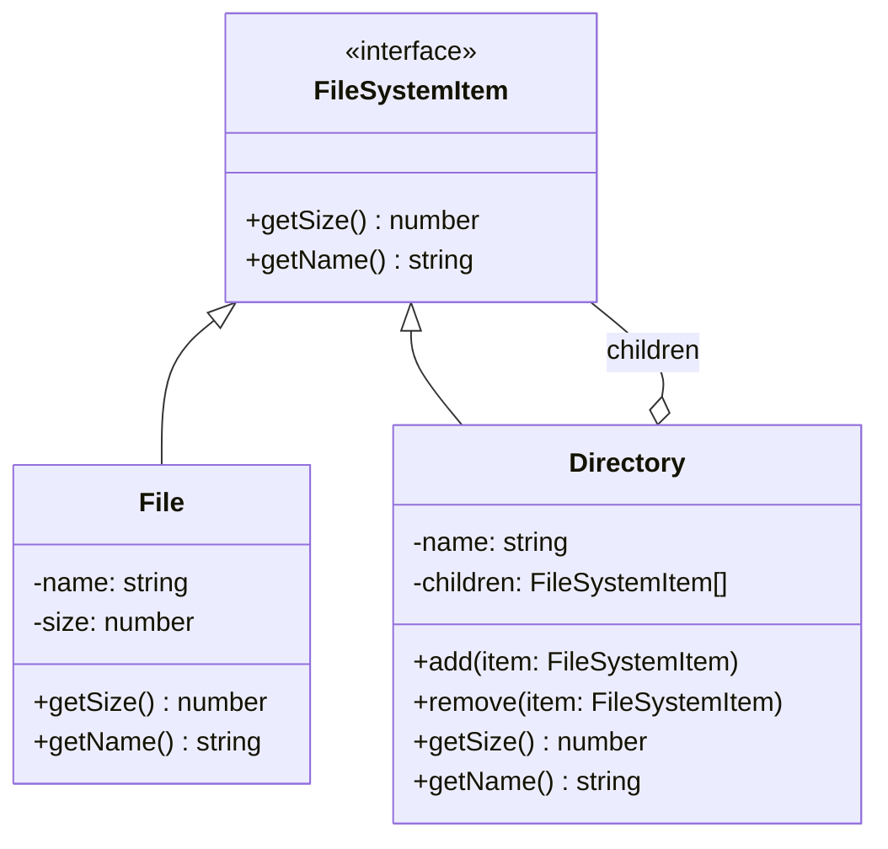

import { Tabs, TabItem } from '@astrojs/starlight/components';
import TypeScriptRepl from '../../../../../components/TypeScriptRepl.astro';
import PythonRepl from '../../../../../components/PythonRepl.astro';
import GoRepl from '../../../../../components/GoRepl.astro';
import tsCode from './composite.ts?raw';
import pyCode from './composite.py?raw';
import goCode from './composite.go?raw';

## The problem

You have a tree structure where individual items and groups of items need to be treated the same way. A file system is the canonical example: a single file has a size, and a directory also has a size (the sum of its children). Code that asks "how big is this thing?" should not need to know whether it is talking to a file or a directory. The naive approach uses `instanceof` checks everywhere: `if (item instanceof Directory) { recurse... } else { return item.size; }`. That conditional leaks into every caller and must be updated every time a new node type is added.

Composite solves this by giving both leaves and composites the same interface. The composite's implementation of each method delegates to its children and combines their results. Callers never inspect the type of the object they hold.

## Structure

## When to use

- You need to represent part-whole hierarchies: trees where nodes and leaves share behavior.
- Clients should be able to ignore the difference between compositions of objects and individual objects.
- You are adding `instanceof` or type-tag checks to methods that should be uniform across node types.
- The structure is recursive by nature: a directory can contain other directories.

## Implementation

`Directory.getSize()` iterates its children and sums their sizes without any type inspection, because `File` and `Directory` both implement `FileSystemItem`. In Python, the abstract base class enforces the interface on both leaf and composite. In Go, interfaces are satisfied implicitly: both `FileNode` and `DirNode` implement `FileSystemItem` without any declaration, and the composite stores a slice of the interface so any node type can nest inside any directory.

<Tabs>
<TabItem label="TypeScript">
<TypeScriptRepl code={tsCode} id="composite-ts" />
</TabItem>
<TabItem label="Python">
<PythonRepl code={pyCode} id="composite-py" />
</TabItem>
<TabItem label="Go">
<GoRepl code={goCode} id="composite-go" />
</TabItem>
</Tabs>

## Tradeoffs

| Pro | Con |
| --- | --- |
| Clients treat leaves and composites identically, no type checks needed | Hard to restrict which component types can be children of a composite |
| Adding new leaf or composite types requires no changes to existing code | Deep trees can make stack overflows a real concern for very large hierarchies |
| Recursive operations (size, render, serialize) write once and work at every level | Shared mutable state in leaf nodes causes subtle bugs when the same leaf appears under two parents |
| Natural fit for any domain with inherent tree structure: UI widgets, org charts, file systems, scene [graphs](../../data-structures/graphs/) | Operations that only make sense on leaves (like `getContent()`) pollute the shared interface or require casting |

## Gotchas

- **Child management placement**: The GoF book identifies two options: put `add`/`remove` on the `Component` interface (uniform but meaningless on leaves) or put them only on `Composite` (safe but requires casting to add children). Most practical implementations put them on the composite and accept the cast at construction time.
- **Cycles**: If you allow `directory.add(directory)`, a `getSize()` call loops forever. Guard by checking that a node is not an ancestor of itself before accepting it as a child.
- **Caching size**: For large trees that are read often but changed rarely, cache `getSize()` and invalidate upward on mutation. Otherwise every read rescans the full subtree.
- **Ordering**: Some composites care about child order (a UI layout, a scene graph). Others do not (a directory). Make the ordering contract explicit; `add` at index vs. `append` are different APIs.
- **Null leaf**: A `NullObject` that implements `FileSystemItem` and returns zero for everything can replace null checks when a slot in a composite might be empty.

## References

- [Design Patterns: Composite, GoF](https://www.informit.com/store/design-patterns-elements-of-reusable-object-oriented-9780201633610), the canonical definition
- [Refactoring Guru: Composite](https://refactoring.guru/design-patterns/composite), diagrams and multiple-language examples
- [SourceMaking: Composite](https://sourcemaking.com/design_patterns/composite), additional context and known uses

## Related topics

- [Design Patterns](../), the full GoF catalog
- [Decorator](../decorator/), also uses recursive wrapping but adds behavior rather than building trees
- [Flyweight](../flyweight/), often combined with Composite to share leaf nodes
