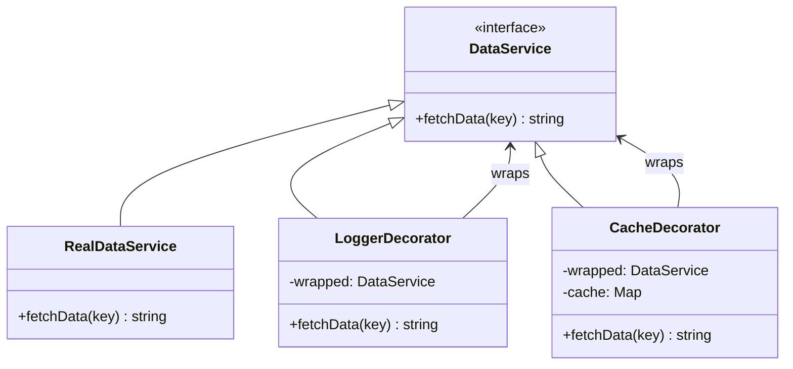

## The problem

You have an object that does its job well, and you want to add behavior to it: logging, caching, retries, authentication checks. The obvious route is subclassing, but that leads to a class for every combination. Logging + caching? One subclass. Logging + caching + retries? Another. With four behaviors you're looking at sixteen subclasses before you've written any business logic.

The Decorator pattern cuts through that by wrapping the real object in another object that implements the same interface. The wrapper holds a reference to the wrapped object, calls through to it, and adds behavior before or after. Because every decorator is itself a valid instance of the interface, you can stack them in any order and add or remove layers without touching the wrapped object at all. This is composition over inheritance in its most literal form.

## Structure



## When to use

- You need to add behavior to individual objects without affecting others of the same class.
- Subclassing would produce an explosion of combinations (logging + caching + retry + auth = 16 subclasses for 4 behaviors).
- The additional behaviors are optional or composable at runtime rather than fixed at compile time.
- You want to follow the open/closed principle: extend behavior without modifying existing code.

## TypeScript

`DataService` is the shared interface. `RealDataService` does the actual work. `LoggerDecorator` and `CacheDecorator` each hold a reference to any `DataService` and call through to it. Stack them in any order.

```typescript
interface DataService {
  fetchData(key: string): string;
}

class RealDataService implements DataService {
  fetchData(key: string): string {
    console.log(`  [DB] Fetching key: ${key}`);
    return `value_for_${key}`;
  }
}

class LoggerDecorator implements DataService {
  constructor(private wrapped: DataService) {}

  fetchData(key: string): string {
    console.log(`[LOG] fetchData called with key="${key}"`);
    const result = this.wrapped.fetchData(key);
    console.log(`[LOG] fetchData returned "${result}"`);
    return result;
  }
}

class CacheDecorator implements DataService {
  private cache = new Map<string, string>();

  constructor(private wrapped: DataService) {}

  fetchData(key: string): string {
    if (this.cache.has(key)) {
      console.log(`[CACHE] hit for "${key}"`);
      return this.cache.get(key)!;
    }
    const result = this.wrapped.fetchData(key);
    this.cache.set(key, result);
    console.log(`[CACHE] stored "${key}"`);
    return result;
  }
}

// Stack: Cache wraps Logger wraps Real
const service: DataService = new CacheDecorator(
  new LoggerDecorator(
    new RealDataService()
  )
);

console.log('--- First call ---');
service.fetchData('user:42');
// [LOG] fetchData called with key="user:42"
//   [DB] Fetching key: user:42
// [LOG] fetchData returned "value_for_user:42"
// [CACHE] stored "user:42"

console.log('--- Second call (cache hit) ---');
service.fetchData('user:42');
// [CACHE] hit for "user:42"
```

## Python

The class-based decorator below matches the GoF pattern exactly: `DataService` is an abstract base class, and each decorator holds a `_wrapped` reference and delegates to it.

```python
from __future__ import annotations
from abc import ABC, abstractmethod


class DataService(ABC):
    @abstractmethod
    def fetch_data(self, key: str) -> str: ...


class RealDataService(DataService):
    def fetch_data(self, key: str) -> str:
        print(f'  [DB] Fetching key: {key}')
        return f'value_for_{key}'


class LoggerDecorator(DataService):
    def __init__(self, wrapped: DataService) -> None:
        self._wrapped = wrapped

    def fetch_data(self, key: str) -> str:
        print(f'[LOG] fetch_data called with key="{key}"')
        result = self._wrapped.fetch_data(key)
        print(f'[LOG] fetch_data returned "{result}"')
        return result


class CacheDecorator(DataService):
    def __init__(self, wrapped: DataService) -> None:
        self._wrapped = wrapped
        self._cache: dict[str, str] = {}

    def fetch_data(self, key: str) -> str:
        if key in self._cache:
            print(f'[CACHE] hit for "{key}"')
            return self._cache[key]
        result = self._wrapped.fetch_data(key)
        self._cache[key] = result
        print(f'[CACHE] stored "{key}"')
        return result


service: DataService = CacheDecorator(LoggerDecorator(RealDataService()))

print('--- First call ---')
service.fetch_data('user:42')

print('--- Second call ---')
service.fetch_data('user:42')
```

Python also has a built-in `@` decorator syntax for transforming functions at definition time. It is related in spirit but different in mechanism.

```python
import functools


def log_calls(func):
    @functools.wraps(func)
    def wrapper(*args, **kwargs):
        print(f'[LOG] calling {func.__name__}')
        result = func(*args, **kwargs)
        print(f'[LOG] returned {result!r}')
        return result
    return wrapper


@log_calls
def get_user(user_id: int) -> str:
    return f'User {user_id}'


get_user(42)
# [LOG] calling get_user
# [LOG] returned 'User 42'
```

The `@` syntax wraps a function once at import time. The GoF class decorator wraps an object instance at runtime and can be stacked or removed dynamically. Both are called "decorators" in Python, but they serve different purposes.

## Go

Go has no abstract classes. The idiomatic approach is to define an interface, then have each decorator hold a reference to another value of that interface. The compiler verifies that both `LoggerDecorator` and `CacheDecorator` satisfy `DataService`.

```go
package main

import "fmt"

type DataService interface {
	FetchData(key string) string
}

// Compile-time interface checks.
var _ DataService = (*LoggerDecorator)(nil)
var _ DataService = (*CacheDecorator)(nil)

type RealDataService struct{}

func (r *RealDataService) FetchData(key string) string {
	fmt.Printf("  [DB] Fetching key: %s\n", key)
	return "value_for_" + key
}

type LoggerDecorator struct {
	wrapped DataService
}

func (l *LoggerDecorator) FetchData(key string) string {
	fmt.Printf("[LOG] FetchData called with key=%q\n", key)
	result := l.wrapped.FetchData(key)
	fmt.Printf("[LOG] FetchData returned %q\n", result)
	return result
}

type CacheDecorator struct {
	wrapped DataService
	cache   map[string]string
}

func NewCacheDecorator(wrapped DataService) *CacheDecorator {
	return &CacheDecorator{wrapped: wrapped, cache: make(map[string]string)}
}

func (c *CacheDecorator) FetchData(key string) string {
	if val, ok := c.cache[key]; ok {
		fmt.Printf("[CACHE] hit for %q\n", key)
		return val
	}
	result := c.wrapped.FetchData(key)
	c.cache[key] = result
	fmt.Printf("[CACHE] stored %q\n", key)
	return result
}

func main() {
	var service DataService = NewCacheDecorator(
		&LoggerDecorator{wrapped: &RealDataService{}},
	)

	fmt.Println("--- First call ---")
	service.FetchData("user:42")

	fmt.Println("--- Second call ---")
	service.FetchData("user:42")
}
```

## Tradeoffs

| Pro | Con |
| --- | --- |
| Add behavior without modifying existing classes | A stack of decorators can be hard to debug |
| Decorators are composable: stack in any order | Each decorator adds a function-call hop |
| Respects open/closed principle | Order matters: `Cache(Logger(Real))` differs from `Logger(Cache(Real))` |
| Far fewer classes than a subclass hierarchy | A decorator that forgets to call through silently breaks the chain |

## Gotchas

- In Python, the GoF Decorator (class-based wrapper) and the Python `@` syntax (function-based transformer) are both called "decorators." They are different mechanisms. The `@` form transforms functions at definition time. The GoF form wraps object instances at runtime.
- Stacking order has observable consequences. `Logger(Cache(Real))` logs every call, including cache hits. `Cache(Logger(Real))` only logs when the cache misses. Choose intentionally.
- In Go, there are no abstract classes. Implement the interface on a struct that holds a reference to another `DataService`. This is idiomatic Go. The blank assignment trick confirms interface compliance at compile time with zero runtime cost.
- A decorator that does not call through to the wrapped object is not a decorator: it is a replacement. Always delegate unless the entire point is to block the call (in which case, use a [Proxy](../proxy/)).
- When writing tests, test each decorator in isolation by passing in a mock that satisfies the interface. Do not test the whole stack in a unit test.

## References

- [Design Patterns: Elements of Reusable Object-Oriented Software](https://www.oreilly.com/library/view/design-patterns-elements/0201633612/), the original GoF entry for Decorator (p. 175)
- [Decorator pattern, Refactoring.Guru](https://refactoring.guru/design-patterns/decorator), illustrated walkthrough with before/after diagrams
- [SourceMaking: Decorator](https://sourcemaking.com/design_patterns/decorator), discussion of the pattern and common pitfalls
- [Head First Design Patterns, Freeman & Robson](https://www.oreilly.com/library/view/head-first-design/0596007124/), chapter 3 covers Decorator with a coffee-beverage example that makes stacking concrete

## Related topics

- [Design Patterns](../), the full GoF catalog
- [Proxy](../proxy/), also wraps via the same interface, but for access control or lazy loading rather than added behavior
- [Singleton](../singleton/), often used alongside a decorator to wrap a single shared service instance
- [Facade](../facade/), simplifies a subsystem rather than wrapping a single object
