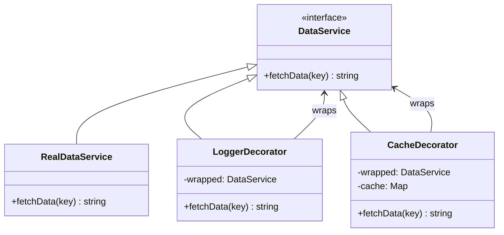

import { Tabs, TabItem } from '@astrojs/starlight/components';
import TypeScriptRepl from '../../../../../components/TypeScriptRepl.astro';
import PythonRepl from '../../../../../components/PythonRepl.astro';
import GoRepl from '../../../../../components/GoRepl.astro';
import tsCode from './decorator.ts?raw';
import pyCode from './decorator.py?raw';
import goCode from './decorator.go?raw';

## The problem

You have an object that does its job well, and you want to add behavior to it: logging, caching, retries, authentication checks. The obvious route is subclassing, but that leads to a class for every combination. Logging + caching? One subclass. Logging + caching + retries? Another. With four behaviors you're looking at sixteen subclasses before you've written any business logic.

The Decorator pattern cuts through that by wrapping the real object in another object that implements the same interface. The wrapper holds a reference to the wrapped object, calls through to it, and adds behavior before or after. Because every decorator is itself a valid instance of the interface, you can stack them in any order and add or remove layers without touching the wrapped object at all. This is composition over inheritance in its most literal form.

## Structure

## When to use

- You need to add behavior to individual objects without affecting others of the same class.
- Subclassing would produce an explosion of combinations (logging + caching + retry + auth = 16 subclasses for 4 behaviors).
- The additional behaviors are optional or composable at runtime rather than fixed at compile time.
- You want to follow the open/closed principle: extend behavior without modifying existing code.

## Implementation

`DataService` is the shared interface; `RealDataService` does the actual work; `LoggerDecorator` and `CacheDecorator` each hold a reference to any `DataService` and call through to it. Stack them in any order. Python uses `abc.ABC` with `@abstractmethod` for the interface and mirrors the GoF class-based pattern exactly (note: Python's built-in `@` decorator syntax is related in spirit but wraps functions at definition time, not object instances at runtime). Go has no abstract classes, so each decorator holds a reference to another `DataService` interface value, and blank assignments like `var _ DataService = (*LoggerDecorator)(nil)` confirm interface compliance at compile time with zero runtime cost.

<Tabs>
<TabItem label="TypeScript">
<TypeScriptRepl code={tsCode} id="decorator-ts" />
</TabItem>
<TabItem label="Python">
<PythonRepl code={pyCode} id="decorator-py" />
</TabItem>
<TabItem label="Go">
<GoRepl code={goCode} id="decorator-go" />
</TabItem>
</Tabs>

## Tradeoffs

| Pro | Con |
| --- | --- |
| Add behavior without modifying existing classes | A stack of decorators can be hard to debug |
| Decorators are composable: stack in any order | Each decorator adds a function-call hop |
| Respects open/closed principle | Order matters: `Cache(Logger(Real))` differs from `Logger(Cache(Real))` |
| Far fewer classes than a subclass hierarchy | A decorator that forgets to call through silently breaks the chain |

## Gotchas

- In Python, the GoF Decorator (class-based wrapper) and the Python `@` syntax (function-based transformer) are both called "decorators." They are different mechanisms. The `@` form transforms functions at definition time. The GoF form wraps object instances at runtime.
- Stacking order has observable consequences. `Logger(Cache(Real))` logs every call, including cache hits. `Cache(Logger(Real))` only logs when the cache misses. Choose intentionally.
- In Go, there are no abstract classes. Implement the interface on a struct that holds a reference to another `DataService`. This is idiomatic Go. The blank assignment trick confirms interface compliance at compile time with zero runtime cost.
- A decorator that does not call through to the wrapped object is not a decorator: it is a replacement. Always delegate unless the entire point is to block the call (in which case, use a [Proxy](../proxy/)).
- When writing tests, test each decorator in isolation by passing in a mock that satisfies the interface. Do not test the whole stack in a unit test.

## References

- [Design Patterns: Elements of Reusable Object-Oriented Software](https://www.oreilly.com/library/view/design-patterns-elements/0201633612/), the original GoF entry for Decorator (p. 175)
- [Decorator pattern, Refactoring.Guru](https://refactoring.guru/design-patterns/decorator), illustrated walkthrough with before/after diagrams
- [SourceMaking: Decorator](https://sourcemaking.com/design_patterns/decorator), discussion of the pattern and common pitfalls
- [Head First Design Patterns, Freeman & Robson](https://www.oreilly.com/library/view/head-first-design/0596007124/), chapter 3 covers Decorator with a coffee-beverage example that makes stacking concrete

## Related topics

- [Design Patterns](../), the full GoF catalog
- [Proxy](../proxy/), also wraps via the same interface, but for access control or lazy loading rather than added behavior
- [Singleton](../singleton/), often used alongside a decorator to wrap a single shared service instance
- [Facade](../facade/), simplifies a subsystem rather than wrapping a single object
