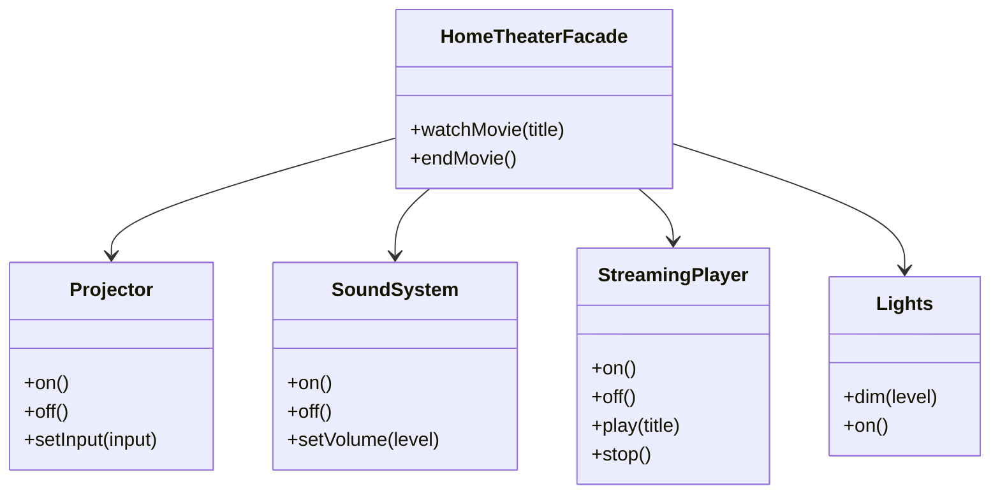

## The problem

A subsystem often grows into a tangle of interdependent classes, each responsible for one narrow slice of behavior. To accomplish anything useful, a caller has to know the order in which to call them, which state to set on each one, and what to do if any step fails. The caller ends up duplicating that coordination logic everywhere it needs the same workflow.

The Facade pattern cuts that knot by putting a single object in front of the subsystem. The facade knows the sequence, owns the coordination, and exposes only the verbs a caller actually needs. The subsystem classes stay intact and are still accessible directly when needed. The facade is a convenience layer, not a lock.

## Structure



## When to use

- A subsystem has grown complex enough that callers have to learn several classes just to accomplish a routine task.
- You want a simpler default API without preventing callers from using the subsystem directly when they need full control.
- You are wrapping a legacy system and want to expose a clean surface to new code.
- You are integrating a third-party library and want to isolate your code from its API changes.

## TypeScript

Four subsystem classes plus a `HomeTheaterFacade` that sequences them into two high-level operations.

```typescript
class Projector {
  on(): void  { console.log('Projector on'); }
  off(): void { console.log('Projector off'); }
  setInput(input: string): void { console.log(`Projector input: ${input}`); }
}

class SoundSystem {
  on(): void  { console.log('Sound system on'); }
  off(): void { console.log('Sound system off'); }
  setVolume(level: number): void { console.log(`Volume: ${level}`); }
}

class StreamingPlayer {
  on(): void  { console.log('Streaming player on'); }
  off(): void { console.log('Streaming player off'); }
  play(title: string): void { console.log(`Playing: ${title}`); }
  stop(): void { console.log('Stopped'); }
}

class Lights {
  dim(level: number): void { console.log(`Lights dimmed to ${level}%`); }
  on(): void { console.log('Lights on'); }
}

class HomeTheaterFacade {
  constructor(
    private projector: Projector,
    private sound: SoundSystem,
    private player: StreamingPlayer,
    private lights: Lights,
  ) {}

  watchMovie(title: string): void {
    this.lights.dim(10);
    this.projector.on();
    this.projector.setInput('HDMI');
    this.sound.on();
    this.sound.setVolume(40);
    this.player.on();
    this.player.play(title);
  }

  endMovie(): void {
    this.player.stop();
    this.player.off();
    this.sound.off();
    this.projector.off();
    this.lights.on();
  }
}

const theater = new HomeTheaterFacade(
  new Projector(),
  new SoundSystem(),
  new StreamingPlayer(),
  new Lights(),
);

theater.watchMovie('The Matrix');
// Lights dimmed to 10%
// Projector on
// Projector input: HDMI
// Sound system on
// Volume: 40
// Streaming player on
// Playing: The Matrix

theater.endMovie();
// Stopped
// Streaming player off
// Sound system off
// Projector off
// Lights on
```

## Python

Same structure using plain classes. The facade takes subsystem instances through its constructor so they can be replaced in tests.

```python
class Projector:
    def on(self) -> None:  print('Projector on')
    def off(self) -> None: print('Projector off')
    def set_input(self, source: str) -> None: print(f'Projector input: {source}')

class SoundSystem:
    def on(self) -> None:  print('Sound system on')
    def off(self) -> None: print('Sound system off')
    def set_volume(self, level: int) -> None: print(f'Volume: {level}')

class StreamingPlayer:
    def on(self) -> None:   print('Streaming player on')
    def off(self) -> None:  print('Streaming player off')
    def play(self, title: str) -> None: print(f'Playing: {title}')
    def stop(self) -> None: print('Stopped')

class Lights:
    def dim(self, level: int) -> None: print(f'Lights dimmed to {level}%')
    def on(self) -> None: print('Lights on')


class HomeTheaterFacade:
    def __init__(
        self,
        projector: Projector,
        sound: SoundSystem,
        player: StreamingPlayer,
        lights: Lights,
    ) -> None:
        self._projector = projector
        self._sound = sound
        self._player = player
        self._lights = lights

    def watch_movie(self, title: str) -> None:
        self._lights.dim(10)
        self._projector.on()
        self._projector.set_input('HDMI')
        self._sound.on()
        self._sound.set_volume(40)
        self._player.on()
        self._player.play(title)

    def end_movie(self) -> None:
        self._player.stop()
        self._player.off()
        self._sound.off()
        self._projector.off()
        self._lights.on()


theater = HomeTheaterFacade(Projector(), SoundSystem(), StreamingPlayer(), Lights())
theater.watch_movie('The Matrix')
theater.end_movie()
```

## Go

Same structure using structs and methods. The facade holds concrete pointers; swap them for interfaces if you need testability.

```go
package main

import "fmt"

type Projector struct{}
func (p *Projector) On()               { fmt.Println("Projector on") }
func (p *Projector) Off()              { fmt.Println("Projector off") }
func (p *Projector) SetInput(s string) { fmt.Printf("Projector input: %s\n", s) }

type SoundSystem struct{}
func (s *SoundSystem) On()             { fmt.Println("Sound system on") }
func (s *SoundSystem) Off()            { fmt.Println("Sound system off") }
func (s *SoundSystem) SetVolume(n int) { fmt.Printf("Volume: %d\n", n) }

type StreamingPlayer struct{}
func (p *StreamingPlayer) On()               { fmt.Println("Streaming player on") }
func (p *StreamingPlayer) Off()              { fmt.Println("Streaming player off") }
func (p *StreamingPlayer) Play(title string) { fmt.Printf("Playing: %s\n", title) }
func (p *StreamingPlayer) Stop()             { fmt.Println("Stopped") }

type Lights struct{}
func (l *Lights) Dim(level int) { fmt.Printf("Lights dimmed to %d%%\n", level) }
func (l *Lights) On()           { fmt.Println("Lights on") }

type HomeTheaterFacade struct {
	projector *Projector
	sound     *SoundSystem
	player    *StreamingPlayer
	lights    *Lights
}

func (f *HomeTheaterFacade) WatchMovie(title string) {
	f.lights.Dim(10)
	f.projector.On()
	f.projector.SetInput("HDMI")
	f.sound.On()
	f.sound.SetVolume(40)
	f.player.On()
	f.player.Play(title)
}

func (f *HomeTheaterFacade) EndMovie() {
	f.player.Stop()
	f.player.Off()
	f.sound.Off()
	f.projector.Off()
	f.lights.On()
}

func main() {
	theater := &HomeTheaterFacade{
		projector: &Projector{},
		sound:     &SoundSystem{},
		player:    &StreamingPlayer{},
		lights:    &Lights{},
	}
	theater.WatchMovie("The Matrix")
	theater.EndMovie()
}
```

## Tradeoffs

| Pro | Con |
| --- | --- |
| Reduces coupling between callers and subsystem | Facade can become a "god object" if it grows too large |
| Provides a simpler API for common workflows | Subsystem is still accessible directly; facade is not enforcement |
| Easy to swap the subsystem behind the facade | A thin facade that does nothing useful is just indirection |
| Good for legacy system integration | Hides complexity that callers might legitimately need |

## Gotchas

- The facade does not prevent callers from using the subsystem directly. It offers a convenience layer, not a guard. Use a [Proxy](../proxy/) if you need access control.
- A facade that grows to 20+ methods covering every subsystem operation has absorbed too much. Split by workflow or introduce multiple facades.
- In Go, a facade often wraps an interface rather than a concrete subsystem so the subsystem can be swapped in tests.
- Python's duck typing means you don't need to define subsystem interfaces unless you want testability. The facade itself is the testing seam.

## References

- [Head First Design Patterns, Freeman & Robson](https://www.oreilly.com/library/view/head-first-design/0596007124/), chapter 7 covers Facade with a home theater example
- [Design Patterns: Elements of Reusable Object-Oriented Software](https://www.oreilly.com/library/view/design-patterns-elements/0201633612/), the original GoF entry for Facade (p. 185)
- [Facade pattern, Refactoring.Guru](https://refactoring.guru/design-patterns/facade), illustrated walkthrough with multiple language examples
- [SourceMaking: Facade](https://sourcemaking.com/design_patterns/facade), discussion of when the pattern is and isn't worth the indirection

## Related topics

- [Design Patterns](../), the full GoF catalog
- [Proxy](../proxy/), another structural wrapper, but focused on access control rather than simplification
- [Adapter](../adapter/), makes incompatible interfaces compatible rather than simplifying a subsystem
- [Functional Core, Imperative Shell](../functional-core-imperative-shell/), a related idea: one clean boundary between callers and a complex interior
