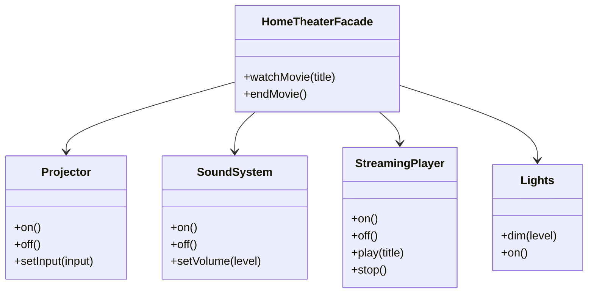

import { Tabs, TabItem } from '@astrojs/starlight/components';
import TypeScriptRepl from '../../../../../components/TypeScriptRepl.astro';
import PythonRepl from '../../../../../components/PythonRepl.astro';
import GoRepl from '../../../../../components/GoRepl.astro';
import tsCode from './facade.ts?raw';
import pyCode from './facade.py?raw';
import goCode from './facade.go?raw';

## The problem

A subsystem often grows into a tangle of interdependent classes, each responsible for one narrow slice of behavior. To accomplish anything useful, a caller has to know the order in which to call them, which state to set on each one, and what to do if any step fails. The caller ends up duplicating that coordination logic everywhere it needs the same workflow.

The Facade pattern cuts that knot by putting a single object in front of the subsystem. The facade knows the sequence, owns the coordination, and exposes only the verbs a caller actually needs. The subsystem classes stay intact and are still accessible directly when needed. The facade is a convenience layer, not a lock.

## Structure

## When to use

- A subsystem has grown complex enough that callers have to learn several classes just to accomplish a routine task.
- You want a simpler default API without preventing callers from using the subsystem directly when they need full control.
- You are wrapping a legacy system and want to expose a clean surface to new code.
- You are integrating a third-party library and want to isolate your code from its API changes.

## Implementation

All three show four subsystem classes (`Projector`, `SoundSystem`, `StreamingPlayer`, `Lights`) and a `HomeTheaterFacade` that sequences them into two high-level operations (`watchMovie` / `endMovie`). Each implementation takes subsystem instances through the facade constructor so they can be replaced in tests. The Python version uses plain classes with no interface declarations (duck typing provides the testing seam). The Go version holds concrete struct pointers in the facade; swap those fields for interface types if you need to inject fakes in tests.

<Tabs>
<TabItem label="TypeScript">
<TypeScriptRepl code={tsCode} id="facade-ts" />
</TabItem>
<TabItem label="Python">
<PythonRepl code={pyCode} id="facade-py" />
</TabItem>
<TabItem label="Go">
<GoRepl code={goCode} id="facade-go" />
</TabItem>
</Tabs>

## Tradeoffs

| Pro | Con |
| --- | --- |
| Reduces coupling between callers and subsystem | Facade can become a "god object" if it grows too large |
| Provides a simpler API for common workflows | Subsystem is still accessible directly; facade is not enforcement |
| Easy to swap the subsystem behind the facade | A thin facade that does nothing useful is just indirection |
| Good for legacy system integration | Hides complexity that callers might legitimately need |

## Gotchas

- The facade does not prevent callers from using the subsystem directly. It offers a convenience layer, not a guard. Use a [Proxy](../proxy/) if you need access control.
- A facade that grows to 20+ methods covering every subsystem operation has absorbed too much. Split by workflow or introduce multiple facades.
- In Go, a facade often wraps an interface rather than a concrete subsystem so the subsystem can be swapped in tests.
- Python's duck typing means you don't need to define subsystem interfaces unless you want testability. The facade itself is the testing seam.

## References

- [Head First Design Patterns, Freeman & Robson](https://www.oreilly.com/library/view/head-first-design/0596007124/), chapter 7 covers Facade with a home theater example
- [Design Patterns: Elements of Reusable Object-Oriented Software](https://www.oreilly.com/library/view/design-patterns-elements/0201633612/), the original GoF entry for Facade (p. 185)
- [Facade pattern, Refactoring.Guru](https://refactoring.guru/design-patterns/facade), illustrated walkthrough with multiple language examples
- [SourceMaking: Facade](https://sourcemaking.com/design_patterns/facade), discussion of when the pattern is and isn't worth the indirection

## Related topics

- [Design Patterns](../), the full GoF catalog
- [Proxy](../proxy/), another structural wrapper, but focused on access control rather than simplification
- [Adapter](../adapter/), makes incompatible interfaces compatible rather than simplifying a subsystem
- [Functional Core, Imperative Shell](../../functional-core-imperative-shell/), a related idea: one clean boundary between callers and a complex interior
