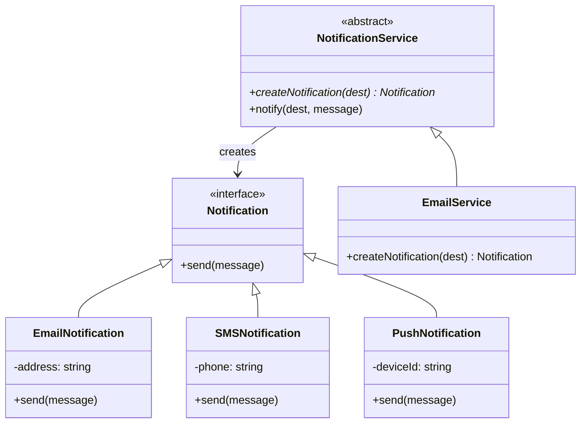

## The problem

When call sites instantiate concrete classes directly, they accumulate knowledge they should not have. A module that calls `new EmailNotification(address)` now knows that email notifications exist, how to construct one, and that the constructor takes an address. If you add SMS support, every call site changes. If you want to test with a fake notification, you have to modify the code under test or reach for a mocking library.

The Factory pattern centralizes object creation behind a function or method. Call sites ask for "a notification" and receive one, without knowing the concrete type. Adding a new notification channel means adding a case to the factory, not touching the code that uses notifications. Test code can provide a factory that returns a spy. The pattern comes in two forms covered here: a simple factory function (not from the GoF, but the most common form in practice) and the GoF Factory Method pattern, where subclasses override a protected creation method.

## Structure



## When to use

- Call sites should not depend on a specific concrete class; they only need the interface.
- You want to swap implementations at runtime or inject test doubles without changing the consuming code.
- A family of related classes shares a creation pattern and you want one authoritative place for that logic.
- You need extensibility: new types should be addable without touching existing call sites.

## TypeScript

The example first shows a simple factory function, which covers most real-world cases. Then it shows the GoF Factory Method pattern, where `NotificationService` is an abstract class with a protected `createNotification` method that subclasses override. Abstract Factory (a factory of factories) is not shown in full because it compounds the complexity without adding new concepts; use it when you need to produce *families* of related objects consistently.

```typescript
interface Notification {
  send(message: string): void;
}

class EmailNotification implements Notification {
  constructor(private address: string) {}
  send(message: string): void {
    console.log(`Email to ${this.address}: ${message}`);
  }
}

class SMSNotification implements Notification {
  constructor(private phone: string) {}
  send(message: string): void {
    console.log(`SMS to ${this.phone}: ${message}`);
  }
}

class PushNotification implements Notification {
  constructor(private deviceId: string) {}
  send(message: string): void {
    console.log(`Push to device ${this.deviceId}: ${message}`);
  }
}

// Simple factory function (not GoF, but common)
function createNotification(
  type: 'email' | 'sms' | 'push',
  destination: string
): Notification {
  switch (type) {
    case 'email': return new EmailNotification(destination);
    case 'sms':   return new SMSNotification(destination);
    case 'push':  return new PushNotification(destination);
  }
}

// GoF Factory Method: abstract creator with a factory method
abstract class NotificationService {
  protected abstract createNotification(destination: string): Notification;

  notify(destination: string, message: string): void {
    const notification = this.createNotification(destination);
    notification.send(message);
  }
}

class EmailService extends NotificationService {
  protected createNotification(email: string): Notification {
    return new EmailNotification(email);
  }
}

class SMSService extends NotificationService {
  protected createNotification(phone: string): Notification {
    return new SMSNotification(phone);
  }
}

// Usage
const n = createNotification('email', 'user@example.com');
n.send('Your order shipped');
// Email to user@example.com: Your order shipped

const service = new EmailService();
service.notify('admin@example.com', 'Server alert');
// Email to admin@example.com: Server alert
```

## Python

Python uses `abc.ABC` for the `Notification` interface and the abstract `NotificationService`. The simple factory function uses `match` (Python 3.10+) for the dispatch. For older Python, a `dict` mapping type strings to classes is cleaner than an `if/elif` chain.

```python
from __future__ import annotations
from abc import ABC, abstractmethod


class Notification(ABC):
    @abstractmethod
    def send(self, message: str) -> None: ...


class EmailNotification(Notification):
    def __init__(self, address: str) -> None:
        self._address = address

    def send(self, message: str) -> None:
        print(f'Email to {self._address}: {message}')


class SMSNotification(Notification):
    def __init__(self, phone: str) -> None:
        self._phone = phone

    def send(self, message: str) -> None:
        print(f'SMS to {self._phone}: {message}')


class PushNotification(Notification):
    def __init__(self, device_id: str) -> None:
        self._device_id = device_id

    def send(self, message: str) -> None:
        print(f'Push to {self._device_id}: {message}')


def create_notification(type_: str, destination: str) -> Notification:
    match type_:
        case 'email': return EmailNotification(destination)
        case 'sms':   return SMSNotification(destination)
        case 'push':  return PushNotification(destination)
        case _: raise ValueError(f'Unknown type: {type_}')


class NotificationService(ABC):
    @abstractmethod
    def create_notification(self, destination: str) -> Notification: ...

    def notify(self, destination: str, message: str) -> None:
        notification = self.create_notification(destination)
        notification.send(message)


class EmailService(NotificationService):
    def create_notification(self, destination: str) -> Notification:
        return EmailNotification(destination)


n = create_notification('email', 'user@example.com')
n.send('Your order shipped')
# Email to user@example.com: Your order shipped

service = EmailService()
service.notify('admin@example.com', 'Server alert')
# Email to admin@example.com: Server alert
```

## Go

Go has no abstract classes. The Factory Method pattern maps to an interface with a `Create` method. The `NotificationService` struct holds a factory and calls it in `Notify`, which is the same structure as the abstract creator in other languages. The simple factory function handles the common case where you just need a concrete object by name.

```go
package main

import "fmt"

type Notification interface {
	Send(message string)
}

type EmailNotification struct{ Address string }
func (n *EmailNotification) Send(msg string) { fmt.Printf("Email to %s: %s\n", n.Address, msg) }

type SMSNotification struct{ Phone string }
func (n *SMSNotification) Send(msg string) { fmt.Printf("SMS to %s: %s\n", n.Phone, msg) }

type PushNotification struct{ DeviceID string }
func (n *PushNotification) Send(msg string) { fmt.Printf("Push to %s: %s\n", n.DeviceID, msg) }

// Simple factory function
func CreateNotification(notifType, destination string) Notification {
	switch notifType {
	case "email":
		return &EmailNotification{Address: destination}
	case "sms":
		return &SMSNotification{Phone: destination}
	case "push":
		return &PushNotification{DeviceID: destination}
	default:
		panic("unknown notification type: " + notifType)
	}
}

// Factory Method: interface with a factory method
type NotificationFactory interface {
	Create(destination string) Notification
}

type NotificationService struct {
	factory NotificationFactory
}

func (s *NotificationService) Notify(destination, message string) {
	n := s.factory.Create(destination)
	n.Send(message)
}

type EmailFactory struct{}
func (f *EmailFactory) Create(dest string) Notification { return &EmailNotification{Address: dest} }

func main() {
	n := CreateNotification("email", "user@example.com")
	n.Send("Your order shipped")
	// Email to user@example.com: Your order shipped

	svc := &NotificationService{factory: &EmailFactory{}}
	svc.Notify("admin@example.com", "Server alert")
	// Email to admin@example.com: Server alert
}
```

## Tradeoffs

| Pro | Con |
| --- | --- |
| Callers depend on abstractions, not concrete types | Adds a layer of indirection |
| New types added without changing call sites | Simple factory function does not enforce the open-closed principle |
| Enables dependency injection and test doubles | Factory Method requires subclassing, which can proliferate classes |
| Centralizes construction logic | Abstract Factory adds another level and can become complex |

## Gotchas

- **Simple factory vs. Factory Method**: a simple factory function is not a GoF pattern, but it is often what you actually need. Reach for Factory Method only when you need extensibility through subclassing. Starting with a function and graduating to a class is the right order.
- **Python `match` requires 3.10+**: for older Python, a dict mapping strings to constructors (`{'email': EmailNotification, 'sms': SMSNotification}`) is readable and fast. Avoid long `if/elif` chains.
- **Go and abstract classes**: Go has no abstract classes. Simulate Factory Method with an interface that carries a `Create` method, then inject the factory as a field. This also makes it trivial to inject a fake factory in tests.
- **Abstract Factory for families**: Abstract Factory (a factory that produces multiple related objects that must be used together) is a separate pattern. If you only have one product type, Factory Method is enough. Add Abstract Factory when you have a coherent set of products that vary together (e.g. a UI theme that produces buttons, inputs, and modals all in the same style).
- **Factory functions and exhaustiveness**: TypeScript's discriminated union with `switch` gives exhaustiveness checking. Python's `match` with a `case _` fallthrough gives a runtime error on unknown types. Go's `switch` with a `default: panic` does the same. All three are correct. The danger is a factory that silently returns `nil` on an unknown type.

## References

- [Design Patterns: Elements of Reusable Object-Oriented Software](https://www.goodreads.com/book/show/85009.Design_Patterns), GoF, pp. 107-116 (Factory Method) and pp. 87-95 (Abstract Factory)
- [Factory Method Pattern, Refactoring Guru](https://refactoring.guru/design-patterns/factory-method), worked examples in multiple languages
- [Abstract Factory Pattern, Refactoring Guru](https://refactoring.guru/design-patterns/abstract-factory), when Factory Method is not enough
- [Factory Functions in JavaScript, Eric Elliott](https://medium.com/javascript-scene/javascript-factory-functions-with-es6-4d224591a8b1), the functional approach to object creation without classes

## Related topics

- [Design Patterns](../), the full GoF catalog and pattern index
- [Builder](../builder/), another creational pattern for multi-step construction
- [Strategy](../strategy/), often paired with factories to inject different algorithm implementations
