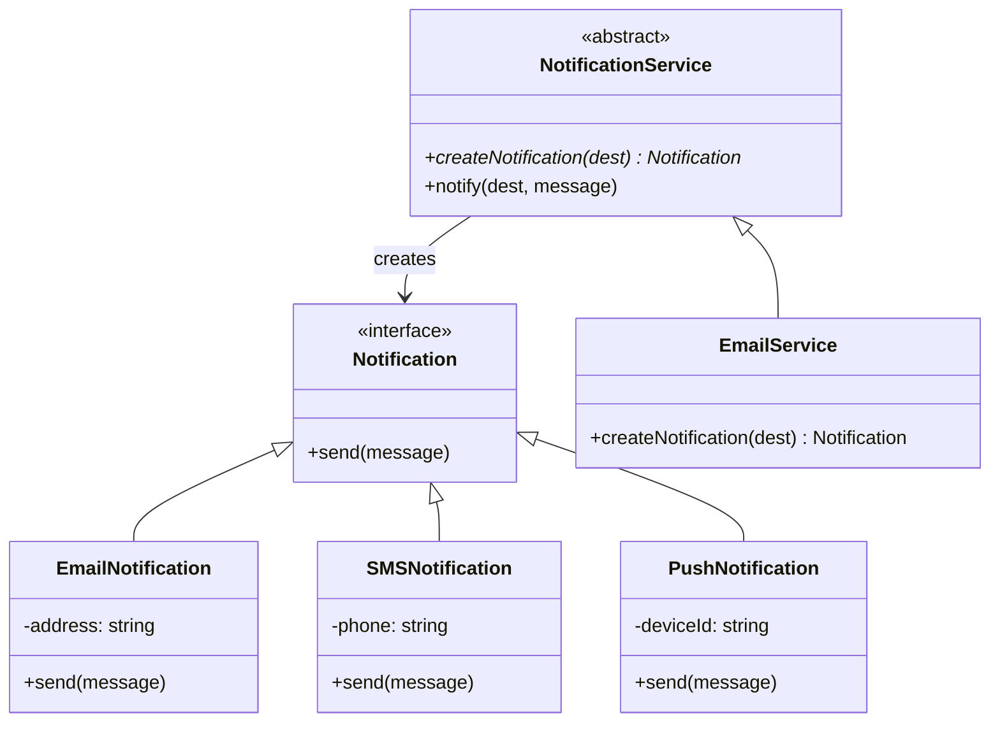

import { Tabs, TabItem } from '@astrojs/starlight/components';
import TypeScriptRepl from '../../../../../components/TypeScriptRepl.astro';
import PythonRepl from '../../../../../components/PythonRepl.astro';
import GoRepl from '../../../../../components/GoRepl.astro';
import tsCode from './factory.ts?raw';
import pyCode from './factory.py?raw';
import goCode from './factory.go?raw';

## The problem

When call sites instantiate concrete classes directly, they accumulate knowledge they should not have. A module that calls `new EmailNotification(address)` now knows that email notifications exist, how to construct one, and that the constructor takes an address. If you add SMS support, every call site changes. If you want to test with a fake notification, you have to modify the code under test or reach for a mocking library.

The Factory pattern centralizes object creation behind a function or method. Call sites ask for "a notification" and receive one, without knowing the concrete type. Adding a new notification channel means adding a case to the factory, not touching the code that uses notifications. Test code can provide a factory that returns a spy. The pattern comes in two forms covered here: a simple factory function (not from the GoF, but the most common form in practice) and the GoF Factory Method pattern, where subclasses override a protected creation method.

## Structure

## When to use

- Call sites should not depend on a specific concrete class; they only need the interface.
- You want to swap implementations at runtime or inject test doubles without changing the consuming code.
- A family of related classes shares a creation pattern and you want one authoritative place for that logic.
- You need extensibility: new types should be addable without touching existing call sites.

## Implementation

Each example shows a simple factory function first (the common case), then the GoF Factory Method pattern where an abstract creator delegates construction to subclasses. Abstract Factory is not shown in full because it adds complexity without new concepts; use it when you need to produce families of related objects together. Python uses `abc.ABC` for both the `Notification` interface and the abstract service, and the simple factory uses `match` (Python 3.10+; use a `dict` mapping for older versions). Go has no abstract classes, so Factory Method maps to an interface with a `Create` method injected as a struct field.

<Tabs>
<TabItem label="TypeScript">
<TypeScriptRepl code={tsCode} id="factory-ts" />
</TabItem>
<TabItem label="Python">
<PythonRepl code={pyCode} id="factory-py" />
</TabItem>
<TabItem label="Go">
<GoRepl code={goCode} id="factory-go" />
</TabItem>
</Tabs>

## Tradeoffs

| Pro | Con |
| --- | --- |
| Callers depend on abstractions, not concrete types | Adds a layer of indirection |
| New types added without changing call sites | Simple factory function does not enforce the open-closed principle |
| Enables dependency injection and test doubles | Factory Method requires subclassing, which can proliferate classes |
| Centralizes construction logic | Abstract Factory adds another level and can become complex |

## Gotchas

- **Simple factory vs. Factory Method**: a simple factory function is not a GoF pattern, but it is often what you actually need. Reach for Factory Method only when you need extensibility through subclassing. Starting with a function and graduating to a class is the right order.
- **Python `match` requires 3.10+**: for older Python, a dict mapping strings to constructors (`{'email': EmailNotification, 'sms': SMSNotification}`) is readable and fast. Avoid long `if/elif` chains.
- **Go and abstract classes**: Go has no abstract classes. Simulate Factory Method with an interface that carries a `Create` method, then inject the factory as a field. This also makes it trivial to inject a fake factory in tests.
- **Abstract Factory for families**: Abstract Factory (a factory that produces multiple related objects that must be used together) is a separate pattern. If you only have one product type, Factory Method is enough. Add Abstract Factory when you have a coherent set of products that vary together (e.g. a UI theme that produces buttons, inputs, and modals all in the same style).
- **Factory functions and exhaustiveness**: TypeScript's discriminated union with `switch` gives exhaustiveness checking. Python's `match` with a `case _` fallthrough gives a runtime error on unknown types. Go's `switch` with a `default: panic` does the same. All three are correct. The danger is a factory that silently returns `nil` on an unknown type.

## References

- [Design Patterns: Elements of Reusable Object-Oriented Software](https://www.goodreads.com/book/show/85009.Design_Patterns), GoF, pp. 107-116 (Factory Method) and pp. 87-95 (Abstract Factory)
- [Factory Method Pattern, Refactoring Guru](https://refactoring.guru/design-patterns/factory-method), worked examples in multiple languages
- [Abstract Factory Pattern, Refactoring Guru](https://refactoring.guru/design-patterns/abstract-factory), when Factory Method is not enough
- [Factory Functions in JavaScript, Eric Elliott](https://medium.com/javascript-scene/javascript-factory-functions-with-es6-4d224591a8b1), the functional approach to object creation without classes

## Related topics

- [Design Patterns](../), the full GoF catalog and pattern index
- [Builder](../builder/), another creational pattern for multi-step construction
- [Strategy](../strategy/), often paired with factories to inject different algorithm implementations
