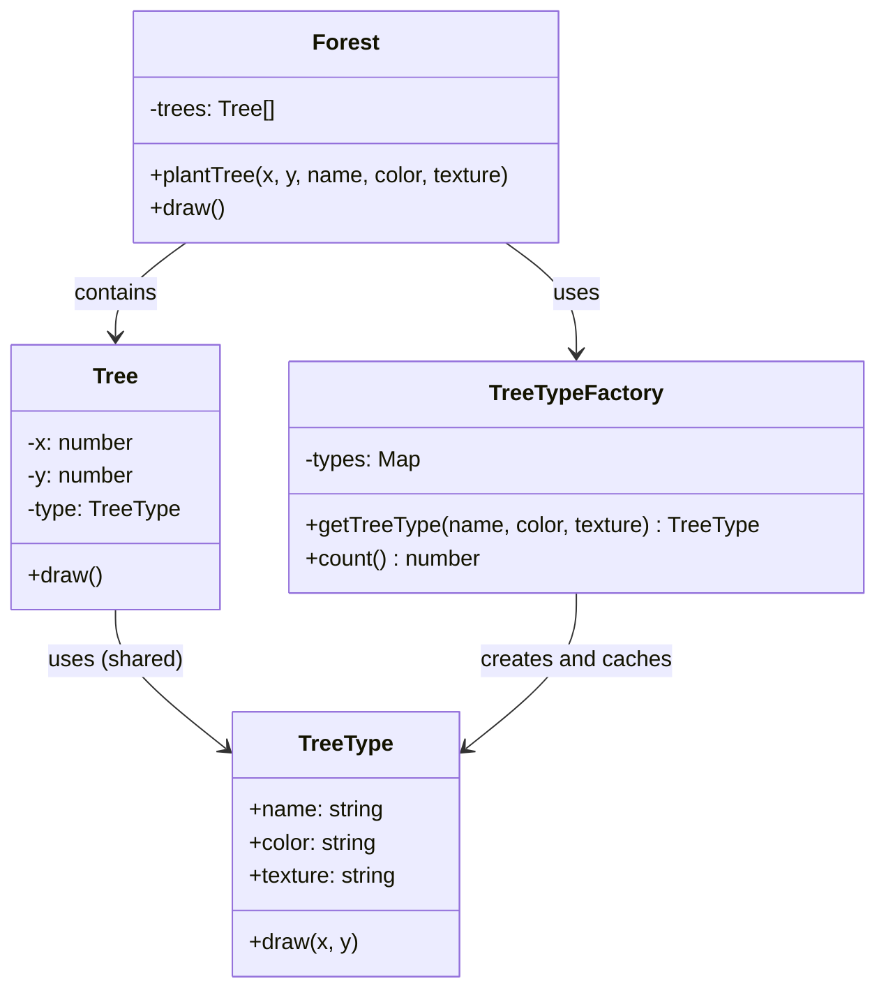

import { Tabs, TabItem } from '@astrojs/starlight/components';

## The problem

Some applications create enormous numbers of nearly identical objects. A game rendering a forest of 100,000 trees can't afford 100,000 independent objects each carrying the full tree species name, color, and texture data. A text editor displaying a million characters can't store the full font descriptor on every glyph. The memory cost of repeated identical state adds up to something the application can't sustain.

The Flyweight pattern separates object state into two buckets. Intrinsic state is shared and context-independent: tree species, color, texture. Extrinsic state is per-instance and context-dependent: the x/y coordinates where this particular tree is planted. The flyweight object stores only intrinsic state and is cached so that all instances sharing the same intrinsic values reuse one object. Extrinsic state is passed in at call time, not stored on the flyweight.

## Structure



## When to use

- You have a large number of objects (hundreds to millions) and memory is a measurable constraint.
- Most of the per-object state is identical across many instances and can be extracted as intrinsic state.
- The application does not require each object to have its own unique identity for the shared portion of its state.
- The extrinsic state can be computed or passed in at call time without burdening callers significantly.

## Implementation

<Tabs>
<TabItem label="TypeScript">

A `Forest` plants trees using a shared `TreeType` for species data (intrinsic) and per-tree coordinates (extrinsic). Four trees share only two `TreeType` instances.

```typescript
class TreeType {
  constructor(
    readonly name: string,
    readonly color: string,
    readonly texture: string,
  ) {}

  draw(x: number, y: number): void {
    console.log(
      `Drawing ${this.name} (${this.color}) at (${x}, ${y}) [texture: ${this.texture}]`
    );
  }
}

class TreeTypeFactory {
  private static types = new Map<string, TreeType>();

  static getTreeType(name: string, color: string, texture: string): TreeType {
    const key = `${name}|${color}|${texture}`;
    if (!this.types.has(key)) {
      this.types.set(key, new TreeType(name, color, texture));
    }
    return this.types.get(key)!;
  }

  static count(): number { return this.types.size; }
}

class Tree {
  constructor(
    private x: number,
    private y: number,
    private type: TreeType,
  ) {}

  draw(): void { this.type.draw(this.x, this.y); }
}

class Forest {
  private trees: Tree[] = [];

  plantTree(x: number, y: number, name: string, color: string, texture: string): void {
    const type = TreeTypeFactory.getTreeType(name, color, texture);
    this.trees.push(new Tree(x, y, type));
  }

  draw(): void { this.trees.forEach(t => t.draw()); }
}

const forest = new Forest();
forest.plantTree(10, 20, 'Oak', 'dark green', 'rough');
forest.plantTree(30, 40, 'Oak', 'dark green', 'rough');   // reuses existing TreeType
forest.plantTree(50, 60, 'Pine', 'light green', 'smooth');
forest.plantTree(70, 80, 'Oak', 'dark green', 'rough');   // reuses existing TreeType

forest.draw();
console.log(`TreeType instances: ${TreeTypeFactory.count()}`); // 2, not 4
```

</TabItem>
<TabItem label="Python">

Same structure with a module-level `_tree_types` dict acting as the factory cache. The dict key is a tuple of the intrinsic fields, which is hashable and unambiguous.

```python
from __future__ import annotations

_tree_types: dict[tuple[str, str, str], TreeType] = {}


class TreeType:
    def __init__(self, name: str, color: str, texture: str) -> None:
        self.name = name
        self.color = color
        self.texture = texture

    def draw(self, x: int, y: int) -> None:
        print(f'Drawing {self.name} ({self.color}) at ({x}, {y}) [texture: {self.texture}]')


def get_tree_type(name: str, color: str, texture: str) -> TreeType:
    key = (name, color, texture)
    if key not in _tree_types:
        _tree_types[key] = TreeType(name, color, texture)
    return _tree_types[key]


class Tree:
    def __init__(self, x: int, y: int, tree_type: TreeType) -> None:
        self._x = x
        self._y = y
        self._type = tree_type

    def draw(self) -> None:
        self._type.draw(self._x, self._y)


class Forest:
    def __init__(self) -> None:
        self._trees: list[Tree] = []

    def plant_tree(self, x: int, y: int, name: str, color: str, texture: str) -> None:
        tree_type = get_tree_type(name, color, texture)
        self._trees.append(Tree(x, y, tree_type))

    def draw(self) -> None:
        for tree in self._trees:
            tree.draw()


forest = Forest()
forest.plant_tree(10, 20, 'Oak', 'dark green', 'rough')
forest.plant_tree(30, 40, 'Oak', 'dark green', 'rough')   # reuses
forest.plant_tree(50, 60, 'Pine', 'light green', 'smooth')
forest.plant_tree(70, 80, 'Oak', 'dark green', 'rough')   # reuses

forest.draw()
print(f'TreeType instances: {len(_tree_types)}')  # 2, not 4
```

</TabItem>
<TabItem label="Go">

`TreeType` holds the intrinsic state. A `treeTypeFactory` with a mutex-guarded map caches instances. `Tree` and `Forest` hold only extrinsic state.

```go
package main

import (
	"fmt"
	"sync"
)

type TreeType struct {
	Name    string
	Color   string
	Texture string
}

func (t *TreeType) Draw(x, y int) {
	fmt.Printf(
		"Drawing %s (%s) at (%d, %d) [texture: %s]\n",
		t.Name, t.Color, x, y, t.Texture,
	)
}

type treeTypeFactory struct {
	mu    sync.Mutex
	types map[string]*TreeType
}

var factory = &treeTypeFactory{types: make(map[string]*TreeType)}

func (f *treeTypeFactory) Get(name, color, texture string) *TreeType {
	key := name + "|" + color + "|" + texture
	f.mu.Lock()
	defer f.mu.Unlock()
	if t, ok := f.types[key]; ok {
		return t
	}
	t := &TreeType{Name: name, Color: color, Texture: texture}
	f.types[key] = t
	return t
}

func (f *treeTypeFactory) Count() int {
	f.mu.Lock()
	defer f.mu.Unlock()
	return len(f.types)
}

type Tree struct {
	x, y     int
	treeType *TreeType
}

func (t *Tree) Draw() { t.treeType.Draw(t.x, t.y) }

type Forest struct {
	trees []*Tree
}

func (f *Forest) PlantTree(x, y int, name, color, texture string) {
	t := factory.Get(name, color, texture)
	f.trees = append(f.trees, &Tree{x: x, y: y, treeType: t})
}

func (f *Forest) Draw() {
	for _, t := range f.trees {
		t.Draw()
	}
}

func main() {
	forest := &Forest{}
	forest.PlantTree(10, 20, "Oak", "dark green", "rough")
	forest.PlantTree(30, 40, "Oak", "dark green", "rough")   // reuses
	forest.PlantTree(50, 60, "Pine", "light green", "smooth")
	forest.PlantTree(70, 80, "Oak", "dark green", "rough")   // reuses

	forest.Draw()
	fmt.Printf("TreeType instances: %d\n", factory.Count()) // 2, not 4
}
```

</TabItem>
</Tabs>

## Tradeoffs

| Pro | Con |
| --- | --- |
| Large memory savings when many objects share state | Extrinsic state must be passed to every method call |
| Reduces object creation cost | Code is harder to read: state lives in two places |
| Works transparently once the factory is in place | Thread-safety requires locking the factory cache |
| Classic use: game engines, text renderers | Only worthwhile at scale (hundreds to millions of objects) |

## Gotchas

- If the intrinsic state is truly unique per object, Flyweight achieves nothing. Profile first before restructuring around it.
- The flyweight object must be immutable. If callers can modify shared state, all users of that flyweight are affected at once.
- In Python, `__slots__` on the flyweight class eliminates the per-instance `__dict__`, squeezing out additional memory. Pair with a `weakref.WeakValueDictionary` for the cache if you want automatic eviction when no external references remain.
- In Go, protect the factory map with a `sync.Mutex` or use `sync.Map` for concurrent access. A plain map with no locking will race under goroutines.
- Don't apply Flyweight as a premature optimization. The intrinsic/extrinsic split makes the code meaningfully harder to follow. Only reach for it when a profiler confirms memory is the bottleneck.

## References

- [Design Patterns: Elements of Reusable Object-Oriented Software](https://www.oreilly.com/library/view/design-patterns-elements/0201633612/), the original GoF entry for Flyweight (p. 195)
- [Flyweight pattern, Refactoring.Guru](https://refactoring.guru/design-patterns/flyweight), illustrated walkthrough with a forest rendering example
- [SourceMaking: Flyweight](https://sourcemaking.com/design_patterns/flyweight), discussion of intrinsic vs. extrinsic state
- [Game Programming Patterns: Flyweight](https://gameprogrammingpatterns.com/flyweight.html), Robert Nystrom's take with game-engine context and clear diagrams

## Related topics

- [Design Patterns](../), the full GoF catalog
- [Proxy](../proxy/), also a structural wrapper, but for access control rather than memory sharing
- [Decorator](../decorator/), wraps objects to add behavior; Flyweight shares objects to save memory
- [Facade](../facade/), reduces visible complexity; Flyweight reduces memory footprint
