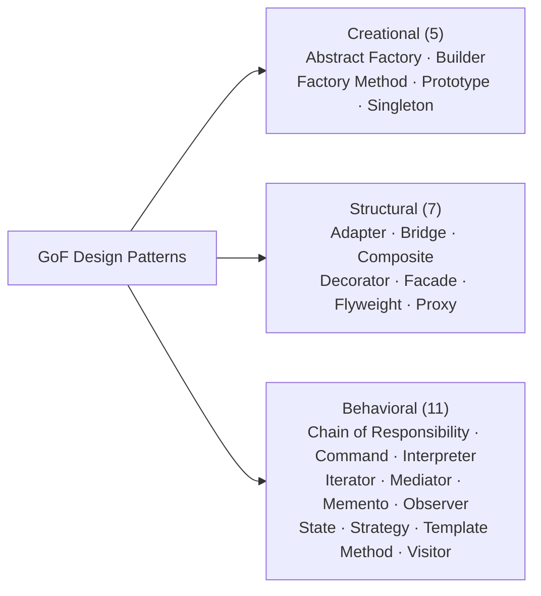

## What design patterns are

A design pattern is a named, reusable solution to a recurring problem in object-oriented design. The term was formalized in 1994 by Erich Gamma, Richard Helm, Ralph Johnson, and John Vlissides in *Design Patterns: Elements of Reusable Object-Oriented Software*. The book cataloged 23 patterns drawn from production codebases and organized them by intent: creational, structural, and behavioral.

Patterns are not code libraries. They describe relationships between classes and objects. The value is a shared vocabulary: saying "use an Observer here" communicates structure, relationships, and tradeoffs in a way that a paragraph of prose cannot.

## The Gang of Four book

| Field | Detail |
| --- | --- |
| Title | *Design Patterns: Elements of Reusable Object-Oriented Software* |
| Authors | Erich Gamma, Richard Helm, Ralph Johnson, John Vlissides |
| Year | 1994 |
| Publisher | Addison-Wesley |
| Patterns | 23 |

The book's nickname "the Gang of Four book" refers to its four authors. Each pattern entry follows a fixed template: intent, motivation, applicability, structure (as a UML diagram), participants, collaboration, consequences, implementation notes, sample code in C++ and Smalltalk, known uses, and related patterns.

## The three categories

## Creational patterns

Creational patterns separate object construction from use, hiding the concrete classes that get instantiated.

| Pattern | Intent |
| --- | --- |
| Abstract Factory | Produce families of related objects without specifying concrete classes |
| [Builder](./builder/) | Build complex objects step by step, separating construction from representation |
| [Factory Method](./factory/) | Delegate instantiation to subclasses |
| Prototype | Clone an existing object rather than constructing a new one |
| [Singleton](./singleton/) | Ensure one instance and provide a global access point |

## Structural patterns

Structural patterns deal with how classes and objects are composed to form larger structures.

| Pattern | Intent |
| --- | --- |
| [Adapter](./adapter/) | Make incompatible interfaces work together |
| Bridge | Decouple an abstraction from its implementation |
| Composite | Compose objects into trees for uniform treatment |
| [Decorator](./decorator/) | Add behavior by wrapping, not subclassing |
| [Facade](./facade/) | Provide a simplified interface to a complex subsystem |
| [Flyweight](./flyweight/) | Share fine-grained objects to reduce memory |
| [Proxy](./proxy/) | Control access to another object |

## Behavioral patterns

Behavioral patterns focus on communication and responsibility between objects.

| Pattern | Intent |
| --- | --- |
| Chain of Responsibility | Pass a request along a chain of handlers |
| [Command](./command/) | Encapsulate a request as an object |
| Interpreter | Define a grammar and an interpreter for a language |
| Iterator | Sequential element access without exposing internals |
| Mediator | Centralize communication between objects |
| Memento | Capture and restore an object's state |
| [Observer](./observer/) | Notify dependents automatically when state changes |
| State | Alter behavior when internal state changes |
| [Strategy](./strategy/) | Define a family of algorithms, encapsulate each, make them interchangeable |
| Template Method | Define the skeleton of an algorithm, leave steps to subclasses |
| Visitor | Add new operations to a class hierarchy without modifying it |

## Patterns you will encounter most

A handful account for the large majority of real-world encounters:

- **Observer**: React state, DOM events, RxJS, EventEmitter.
- **Strategy**: Payment providers, auth backends, serialization formats.
- **Factory Method**: ORM base classes, plugin systems, test doubles.
- **Builder**: Query builders, HTTP client config, gRPC message construction.
- **Facade**: SDK wrappers, service clients, third-party API adapters.
- **Command**: Undo/redo, task queues, CLI argument parsing.
- **Decorator**: Express middleware, Django middleware, logging wrappers.

## A note on overuse

GoF patterns solve specific problems. Applied where those problems do not exist, they add indirection without value. Several patterns also compensate for missing language features. Visitor compensates for languages without multiple dispatch. Singleton compensates for languages without module-level singletons. In Python, Go, and modern TypeScript, idiomatic solutions exist that do not require the full ceremony of the pattern.

Read each pattern for the problem it solves.

## Subtopics

- [Builder](./builder/), step-by-step object construction with a fluent interface
- [Facade](./facade/), a simplified surface over a complex subsystem
- [Flyweight](./flyweight/), shared intrinsic state to reduce memory use
- [Command](./command/), requests as first-class objects with undo and queuing
- [Observer](./observer/), automatic notification of dependents on state change
- [Strategy](./strategy/), swappable algorithm families
- [Factory](./factory/), centralized object creation with Factory Method and Abstract Factory
- [Decorator](./decorator/), behavior added by wrapping without subclassing
- [Singleton](./singleton/), one instance, global access
- [Adapter](./adapter/), incompatible interfaces made compatible
- [Proxy](./proxy/), controlled access through a surrogate

## References

- [Design Patterns, GoF, Addison-Wesley 1994](https://www.informit.com/store/design-patterns-elements-of-reusable-object-oriented-9780201633610), the source text
- [Refactoring Guru: Design Patterns](https://refactoring.guru/design-patterns), modern catalog with examples in multiple languages
- [SourceMaking: Design Patterns](https://sourcemaking.com/design_patterns), another comprehensive catalog
- [Head First Design Patterns (Freeman et al.)](https://www.oreilly.com/library/view/head-first-design/0596007124/), accessible visual introduction

## Related topics

- [Functional Core, Imperative Shell](../functional-core-imperative-shell/), Gary Bernhardt's architecture pattern: pairs well with patterns like Strategy and Command
- [Technology Laws](../technology-laws/), named principles that give context to design decisions
- [Named Algorithms](../named-algorithms/), the algorithm canon worth knowing by sight
