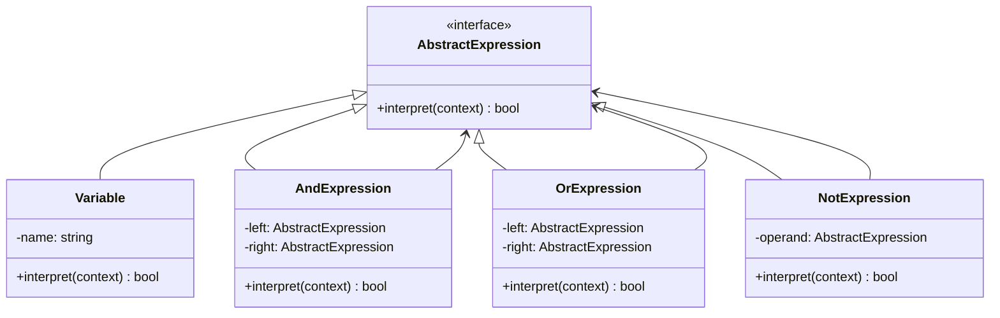

import { Tabs, TabItem } from '@astrojs/starlight/components';
import TypeScriptRepl from '../../../../../components/TypeScriptRepl.astro';
import PythonRepl from '../../../../../components/PythonRepl.astro';
import GoRepl from '../../../../../components/GoRepl.astro';
import tsCode from './interpreter.ts?raw';
import pyCode from './interpreter.py?raw';
import goCode from './interpreter.go?raw';

## The problem

You have a small, domain-specific language: configuration rules, boolean filter expressions, math formulas, search queries. The straightforward approach is an ad-hoc parser with nested `if/else` blocks that checks tokens and computes results inline. That works for three keywords. At ten it becomes unmaintainable, and adding `XOR` or `NAND` requires touching the parser, the evaluator, and the tests all at once.

Interpreter formalizes the grammar as a class hierarchy. Each grammar rule becomes a class with an `interpret` method. Compound expressions (`AND`, `OR`) hold references to sub-expressions and delegate to them recursively. Terminal expressions (`Variable`) look up their value in a context map. The result is a tree, specifically an AST, where evaluation is a single recursive call on the root. Adding a new operator means adding a new class, not modifying existing ones.

## Structure

## When to use

- You have a well-defined, stable grammar with a modest number of rules (roughly under 20 distinct constructs).
- The grammar needs to be evaluated repeatedly against different contexts: filter rules, access-control policies, spreadsheet formulas.
- You want each grammar rule to be independently testable and composable without changing existing classes.
- A formal parser generator (ANTLR, PEG.js) would be overkill for the scale of the language.

## Implementation

Each expression class implements a single `interpret(context)` method against a plain context map, with the tree built manually to keep the focus on the pattern rather than parsing. Python uses a `Protocol` for type-checker coverage without requiring inheritance, keeping each class a small pure function over its children. In Go, interfaces are satisfied implicitly, so short-circuit evaluation in `AndExpression` and `OrExpression` follows naturally from `&&` and `||`. A nil `Expression` field in Go causes a nil-pointer panic at `Interpret` time, so guard non-terminal constructors or document that nil is not a valid operand.

<Tabs>
<TabItem label="TypeScript">
<TypeScriptRepl code={tsCode} id="interpreter-ts" />
</TabItem>
<TabItem label="Python">
<PythonRepl code={pyCode} id="interpreter-py" />
</TabItem>
<TabItem label="Go">
<GoRepl code={goCode} id="interpreter-go" />
</TabItem>
</Tabs>

## Tradeoffs

| Pro | Con |
| --- | --- |
| Each grammar rule is an isolated, testable class | Class count grows linearly with grammar size |
| Adding a new operator requires only a new class | Deep trees can overflow the call stack for large inputs |
| The tree structure makes short-circuit evaluation free | No built-in parser: you still need to build or generate the AST |
| Context is decoupled from the expression tree | Complex grammars are better served by a dedicated parser generator |
| Easy to add new operations via Visitor without touching existing nodes | Shared sub-expressions are re-evaluated unless you memoize |

## Gotchas

- Interpreter produces an AST, which is a [Composite](../composite/) tree. The two patterns cooperate: Composite gives you the recursive structure, Interpreter gives each node meaning.
- The pattern covers evaluation, not parsing. If you need to parse `(x AND y) OR (NOT z)` from a string, write a recursive-descent parser or use a library. Interpreter only tells you what to do once the tree exists.
- Shared sub-expression nodes are safe only if `interpret` has no side effects. A node that mutates state during evaluation will produce wrong results when the same node appears in multiple branches of the tree.
- For grammars with more than roughly 15 to 20 constructs, the class explosion becomes unwieldy. Consider a table-driven interpreter or a parser combinator library instead.
- In Go, a nil `Expression` field causes a nil-pointer panic at `Interpret` time. Guard non-terminal constructors or document that nil is not a valid operand.

## References

- [Design Patterns: Interpreter, GoF](https://www.informit.com/store/design-patterns-elements-of-reusable-object-oriented-9780201633610), the canonical definition and motivation
- [Refactoring Guru: Interpreter](https://refactoring.guru/design-patterns/interpreter), diagrams and worked examples
- [SourceMaking: Interpreter](https://sourcemaking.com/design_patterns/interpreter), additional context and known uses

## Related topics

- [Design Patterns](../), the full GoF catalog
- [Composite](../composite/), the AST is a Composite tree
- [Visitor](../visitor/), Visitor can add new operations (like pretty-printing) to the same AST without modifying expression classes
- [Iterator](../iterator/), can traverse the expression tree node by node
