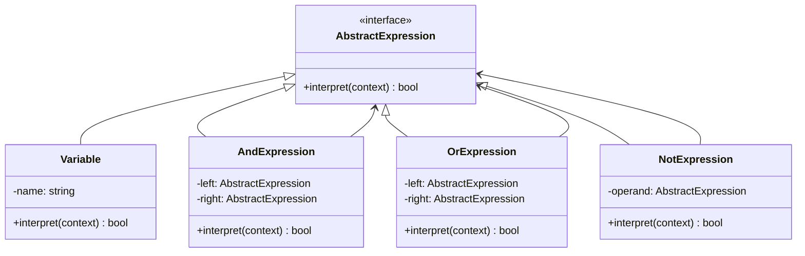

import { Tabs, TabItem } from '@astrojs/starlight/components';

## The problem

You have a small, domain-specific language: configuration rules, boolean filter expressions, math formulas, search queries. The straightforward approach is an ad-hoc parser with nested `if/else` blocks that checks tokens and computes results inline. That works for three keywords. At ten it becomes unmaintainable, and adding `XOR` or `NAND` requires touching the parser, the evaluator, and the tests all at once.

Interpreter formalizes the grammar as a class hierarchy. Each grammar rule becomes a class with an `interpret` method. Compound expressions (`AND`, `OR`) hold references to sub-expressions and delegate to them recursively. Terminal expressions (`Variable`) look up their value in a context map. The result is a tree, specifically an AST, where evaluation is a single recursive call on the root. Adding a new operator means adding a new class, not modifying existing ones.

## Structure



## When to use

- You have a well-defined, stable grammar with a modest number of rules (roughly under 20 distinct constructs).
- The grammar needs to be evaluated repeatedly against different contexts: filter rules, access-control policies, spreadsheet formulas.
- You want each grammar rule to be independently testable and composable without changing existing classes.
- A formal parser generator (ANTLR, PEG.js) would be overkill for the scale of the language.

## Implementation

<Tabs>
<TabItem label="TypeScript">

Each expression class implements a single `interpret(context)` method. The context is a plain `Map<string, boolean>`. Building the tree is manual here to keep the focus on the pattern itself; a real system would generate the tree from a parser.

```typescript
type Context = Map<string, boolean>;

interface AbstractExpression {
  interpret(context: Context): boolean;
}

class Variable implements AbstractExpression {
  constructor(private name: string) {}
  interpret(context: Context): boolean {
    return context.get(this.name) ?? false;
  }
}

class AndExpression implements AbstractExpression {
  constructor(
    private left: AbstractExpression,
    private right: AbstractExpression
  ) {}
  interpret(context: Context): boolean {
    return this.left.interpret(context) && this.right.interpret(context);
  }
}

class OrExpression implements AbstractExpression {
  constructor(
    private left: AbstractExpression,
    private right: AbstractExpression
  ) {}
  interpret(context: Context): boolean {
    return this.left.interpret(context) || this.right.interpret(context);
  }
}

class NotExpression implements AbstractExpression {
  constructor(private operand: AbstractExpression) {}
  interpret(context: Context): boolean {
    return !this.operand.interpret(context);
  }
}

// (x AND y) OR (NOT z)
const x = new Variable('x');
const y = new Variable('y');
const z = new Variable('z');
const expr = new OrExpression(
  new AndExpression(x, y),
  new NotExpression(z)
);

const ctx: Context = new Map([['x', true], ['y', false], ['z', false]]);
console.log(expr.interpret(ctx)); // true  (NOT z is true)

const ctx2: Context = new Map([['x', true], ['y', true], ['z', true]]);
console.log(expr.interpret(ctx2)); // true  (x AND y is true)
```

</TabItem>
<TabItem label="Python">

Python's duck typing makes the abstract base optional. The `Protocol` below provides type-checker coverage without requiring inheritance. Each class is a small, pure function over its children.

```python
from __future__ import annotations
from typing import Protocol


Context = dict[str, bool]


class AbstractExpression(Protocol):
    def interpret(self, context: Context) -> bool: ...


class Variable:
    def __init__(self, name: str) -> None:
        self._name = name

    def interpret(self, context: Context) -> bool:
        return context.get(self._name, False)


class AndExpression:
    def __init__(self, left: AbstractExpression, right: AbstractExpression) -> None:
        self._left = left
        self._right = right

    def interpret(self, context: Context) -> bool:
        return self._left.interpret(context) and self._right.interpret(context)


class OrExpression:
    def __init__(self, left: AbstractExpression, right: AbstractExpression) -> None:
        self._left = left
        self._right = right

    def interpret(self, context: Context) -> bool:
        return self._left.interpret(context) or self._right.interpret(context)


class NotExpression:
    def __init__(self, operand: AbstractExpression) -> None:
        self._operand = operand

    def interpret(self, context: Context) -> bool:
        return not self._operand.interpret(context)


# (x AND y) OR (NOT z)
x, y, z = Variable('x'), Variable('y'), Variable('z')
expr = OrExpression(AndExpression(x, y), NotExpression(z))

ctx = {'x': True, 'y': False, 'z': False}
print(expr.interpret(ctx))  # True  (NOT z is true)

ctx2 = {'x': True, 'y': True, 'z': True}
print(expr.interpret(ctx2))  # True  (x AND y is true)
```

</TabItem>
<TabItem label="Go">

Go interfaces are satisfied implicitly. Every concrete type with an `Interpret(ctx)` method satisfies `Expression` without declaring it. Short-circuit evaluation in `AndExpression` and `OrExpression` follows naturally from `&&` and `||`.

```go
package main

import "fmt"

type Context map[string]bool

type Expression interface {
	Interpret(ctx Context) bool
}

type Variable struct{ Name string }

func (v *Variable) Interpret(ctx Context) bool {
	return ctx[v.Name]
}

type AndExpression struct{ Left, Right Expression }

func (a *AndExpression) Interpret(ctx Context) bool {
	return a.Left.Interpret(ctx) && a.Right.Interpret(ctx)
}

type OrExpression struct{ Left, Right Expression }

func (o *OrExpression) Interpret(ctx Context) bool {
	return o.Left.Interpret(ctx) || o.Right.Interpret(ctx)
}

type NotExpression struct{ Operand Expression }

func (n *NotExpression) Interpret(ctx Context) bool {
	return !n.Operand.Interpret(ctx)
}

func main() {
	// (x AND y) OR (NOT z)
	x, y, z := &Variable{"x"}, &Variable{"y"}, &Variable{"z"}
	expr := &OrExpression{
		Left:  &AndExpression{Left: x, Right: y},
		Right: &NotExpression{Operand: z},
	}

	ctx := Context{"x": true, "y": false, "z": false}
	fmt.Println(expr.Interpret(ctx)) // true  (NOT z is true)

	ctx2 := Context{"x": true, "y": true, "z": true}
	fmt.Println(expr.Interpret(ctx2)) // true  (x AND y is true)
}
```

</TabItem>
</Tabs>

## Tradeoffs

| Pro | Con |
| --- | --- |
| Each grammar rule is an isolated, testable class | Class count grows linearly with grammar size |
| Adding a new operator requires only a new class | Deep trees can overflow the call stack for large inputs |
| The tree structure makes short-circuit evaluation free | No built-in parser: you still need to build or generate the AST |
| Context is decoupled from the expression tree | Complex grammars are better served by a dedicated parser generator |
| Easy to add new operations via Visitor without touching existing nodes | Shared sub-expressions are re-evaluated unless you memoize |

## Gotchas

- Interpreter produces an AST, which is a [Composite](../composite/) tree. The two patterns cooperate: Composite gives you the recursive structure, Interpreter gives each node meaning.
- The pattern covers evaluation, not parsing. If you need to parse `(x AND y) OR (NOT z)` from a string, write a recursive-descent parser or use a library. Interpreter only tells you what to do once the tree exists.
- Shared sub-expression nodes are safe only if `interpret` has no side effects. A node that mutates state during evaluation will produce wrong results when the same node appears in multiple branches of the tree.
- For grammars with more than roughly 15 to 20 constructs, the class explosion becomes unwieldy. Consider a table-driven interpreter or a parser combinator library instead.
- In Go, a nil `Expression` field causes a nil-pointer panic at `Interpret` time. Guard non-terminal constructors or document that nil is not a valid operand.

## References

- [Design Patterns: Interpreter, GoF](https://www.informit.com/store/design-patterns-elements-of-reusable-object-oriented-9780201633610), the canonical definition and motivation
- [Refactoring Guru: Interpreter](https://refactoring.guru/design-patterns/interpreter), diagrams and worked examples
- [SourceMaking: Interpreter](https://sourcemaking.com/design_patterns/interpreter), additional context and known uses

## Related topics

- [Design Patterns](../), the full GoF catalog
- [Composite](../composite/), the AST is a Composite tree
- [Visitor](../visitor/), Visitor can add new operations (like pretty-printing) to the same AST without modifying expression classes
- [Iterator](../iterator/), can traverse the expression tree node by node
