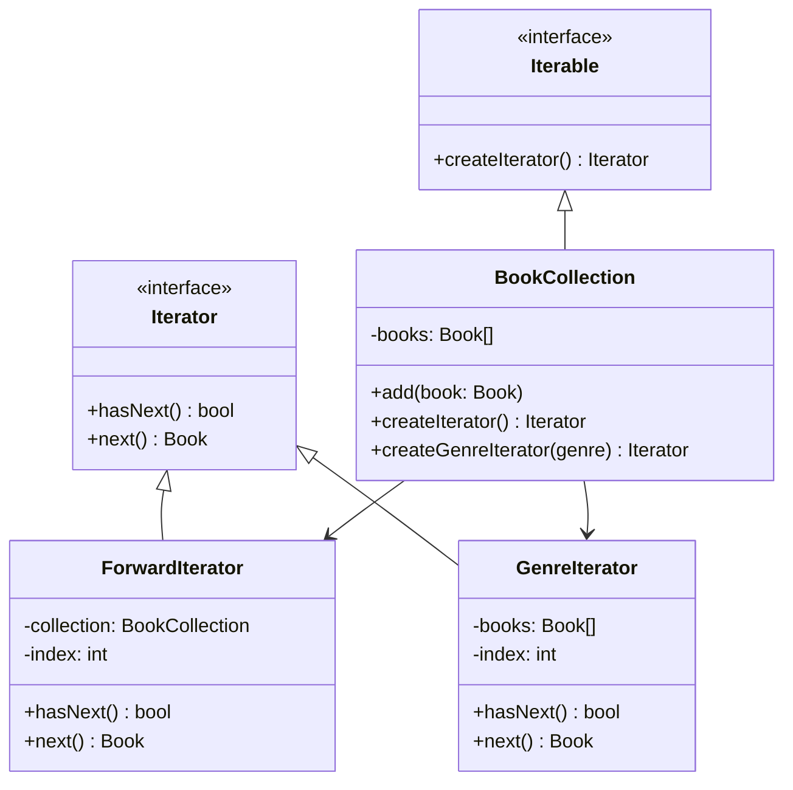

import { Tabs, TabItem } from '@astrojs/starlight/components';

## The problem

A collection class holds a set of objects. Client code needs to loop over them. The obvious solution is to expose the internal structure directly: return the array, let callers index into the list, or leak the tree's node pointers. That coupling means every caller breaks when the backing store changes. A `BookCollection` backed by an array today might be backed by a database cursor tomorrow. Callers should not need to change.

Iterator solves this by placing the traversal logic behind a two-method interface: `hasNext()` and `next()`. The collection creates and returns an iterator object. Client code talks only to that interface. The backing store can be an array, a linked list, a B-tree, or a lazy generator; the loop looks identical in all cases. New traversal orders (forward, reverse, by genre) become new iterator classes, not new branches inside the collection or the client.

## Structure



## When to use

- A collection's backing store may change and you want traversal code to be insulated from that change.
- You need multiple traversal strategies (forward, reverse, filtered) without polluting the collection class with that logic.
- You want to provide a uniform loop interface over several unrelated collection types.
- The collection is too large to materialize in memory at once and traversal needs to be lazy.

## Implementation

<Tabs>
<TabItem label="TypeScript">

TypeScript's built-in `Iterator<T>` protocol uses `next()` returning `{ value, done }`. Implementing it lets the collection work with `for...of` loops and spread syntax without any extra adapter code.

```typescript
interface Book {
  title: string;
  genre: string;
}

class BookCollection implements Iterable<Book> {
  private books: Book[] = [];

  add(book: Book): void {
    this.books.push(book);
  }

  [Symbol.iterator](): Iterator<Book> {
    let index = 0;
    const books = this.books;
    return {
      next(): IteratorResult<Book> {
        if (index < books.length) {
          return { value: books[index++], done: false };
        }
        return { value: undefined as unknown as Book, done: true };
      },
    };
  }

  byGenre(genre: string): Iterable<Book> {
    const filtered = this.books.filter((b) => b.genre === genre);
    return {
      [Symbol.iterator](): Iterator<Book> {
        let index = 0;
        return {
          next(): IteratorResult<Book> {
            if (index < filtered.length) {
              return { value: filtered[index++], done: false };
            }
            return { value: undefined as unknown as Book, done: true };
          },
        };
      },
    };
  }
}

const collection = new BookCollection();
collection.add({ title: 'Dune', genre: 'sci-fi' });
collection.add({ title: 'Foundation', genre: 'sci-fi' });
collection.add({ title: 'Shogun', genre: 'historical' });

for (const book of collection) {
  console.log(book.title);
}
// Dune
// Foundation
// Shogun

for (const book of collection.byGenre('sci-fi')) {
  console.log(book.title);
}
// Dune
// Foundation
```

</TabItem>
<TabItem label="Python">

Python's iterator protocol requires `__iter__` (returns `self`) and `__next__` (returns the next value or raises `StopIteration`). A class that implements both is a proper Python iterator and works with `for` loops, `list()`, and any function that accepts an iterable.

```python
from __future__ import annotations
from typing import Iterator


class Book:
    def __init__(self, title: str, genre: str) -> None:
        self.title = title
        self.genre = genre


class ForwardIterator(Iterator[Book]):
    def __init__(self, books: list[Book]) -> None:
        self._books = books
        self._index = 0

    def __iter__(self) -> ForwardIterator:
        return self

    def __next__(self) -> Book:
        if self._index >= len(self._books):
            raise StopIteration
        book = self._books[self._index]
        self._index += 1
        return book


class GenreIterator(Iterator[Book]):
    def __init__(self, books: list[Book], genre: str) -> None:
        self._books = [b for b in books if b.genre == genre]
        self._index = 0

    def __iter__(self) -> GenreIterator:
        return self

    def __next__(self) -> Book:
        if self._index >= len(self._books):
            raise StopIteration
        book = self._books[self._index]
        self._index += 1
        return book


class BookCollection:
    def __init__(self) -> None:
        self._books: list[Book] = []

    def add(self, book: Book) -> None:
        self._books.append(book)

    def __iter__(self) -> ForwardIterator:
        return ForwardIterator(self._books)

    def by_genre(self, genre: str) -> GenreIterator:
        return GenreIterator(self._books, genre)


collection = BookCollection()
collection.add(Book('Dune', 'sci-fi'))
collection.add(Book('Foundation', 'sci-fi'))
collection.add(Book('Shogun', 'historical'))

for book in collection:
    print(book.title)
# Dune
# Foundation
# Shogun

for book in collection.by_genre('sci-fi'):
    print(book.title)
# Dune
# Foundation
```

</TabItem>
<TabItem label="Go">

Go has no built-in iterator protocol before 1.23. The conventional pre-1.23 approach is a struct with `HasNext() bool` and `Next() Book` methods. Each traversal strategy is a separate struct; the collection constructs and returns the appropriate one.

```go
package main

import "fmt"

type Book struct {
	Title string
	Genre string
}

type Iterator interface {
	HasNext() bool
	Next() Book
}

type ForwardIterator struct {
	books []Book
	index int
}

func (it *ForwardIterator) HasNext() bool { return it.index < len(it.books) }
func (it *ForwardIterator) Next() Book {
	b := it.books[it.index]
	it.index++
	return b
}

type GenreIterator struct {
	books []Book
	index int
}

func (it *GenreIterator) HasNext() bool { return it.index < len(it.books) }
func (it *GenreIterator) Next() Book {
	b := it.books[it.index]
	it.index++
	return b
}

type BookCollection struct {
	books []Book
}

func (c *BookCollection) Add(b Book) { c.books = append(c.books, b) }

func (c *BookCollection) CreateIterator() Iterator {
	return &ForwardIterator{books: c.books}
}

func (c *BookCollection) CreateGenreIterator(genre string) Iterator {
	var filtered []Book
	for _, b := range c.books {
		if b.Genre == genre {
			filtered = append(filtered, b)
		}
	}
	return &GenreIterator{books: filtered}
}

func main() {
	collection := &BookCollection{}
	collection.Add(Book{Title: "Dune", Genre: "sci-fi"})
	collection.Add(Book{Title: "Foundation", Genre: "sci-fi"})
	collection.Add(Book{Title: "Shogun", Genre: "historical"})

	it := collection.CreateIterator()
	for it.HasNext() {
		fmt.Println(it.Next().Title)
	}
	// Dune
	// Foundation
	// Shogun

	genre := collection.CreateGenreIterator("sci-fi")
	for genre.HasNext() {
		fmt.Println(genre.Next().Title)
	}
	// Dune
	// Foundation
}
```

</TabItem>
</Tabs>

## Tradeoffs

| Pro | Con |
| --- | --- |
| Decouples traversal logic from the collection's internal structure | One extra class per traversal strategy |
| Open/closed: add new iteration orders without modifying the collection | Concurrent modification of the collection during iteration is undefined behavior |
| Multiple independent iterators can traverse the same collection simultaneously | Stateful iterators are single-use; a second pass requires a new instance |
| Client code is uniform across collections with different backing stores | Lazy iterators can be harder to reason about than a simple indexed loop |

## Gotchas

- An iterator holds a snapshot of the index, not a snapshot of the data. If the collection grows or shrinks during iteration, `hasNext()` can skip items or run past the end. Either document that mutation during iteration is forbidden or copy the data into the iterator at construction time.
- In Python, a class that implements `__iter__` but delegates to a fresh iterator object (rather than returning `self`) is an iterable, not an iterator. The distinction matters when you need to iterate the same object twice; iterators are exhausted after one pass, iterables are not.
- In TypeScript, returning `{ value: undefined, done: true }` requires the cast shown in the example because the `IteratorResult<T>` type is a discriminated union. The done branch never actually reads the value, so the cast is safe.
- Iterator and Composite appear together often enough to be mistaken for a single pattern. Composite structures the tree; Iterator traverses it. Keep them separate.
- In Go, calling `Next()` on an exhausted iterator (one where `HasNext()` returned `false`) will panic on the index access. Add a bounds check in `Next()` or treat an exhausted iterator as a programming error that panics loudly.

## References

- [Design Patterns: Iterator, GoF](https://www.informit.com/store/design-patterns-elements-of-reusable-object-oriented-9780201633610), the canonical definition
- [Refactoring Guru: Iterator](https://refactoring.guru/design-patterns/iterator), diagrams and multiple-language examples
- [SourceMaking: Iterator](https://sourcemaking.com/design_patterns/iterator), additional context and known uses

## Related topics

- [Design Patterns](../), the full GoF catalog
- [Composite](../composite/), Iterator is often used to traverse Composite trees
- [Visitor](../visitor/), Visitor frequently pairs with Iterator for tree traversal
