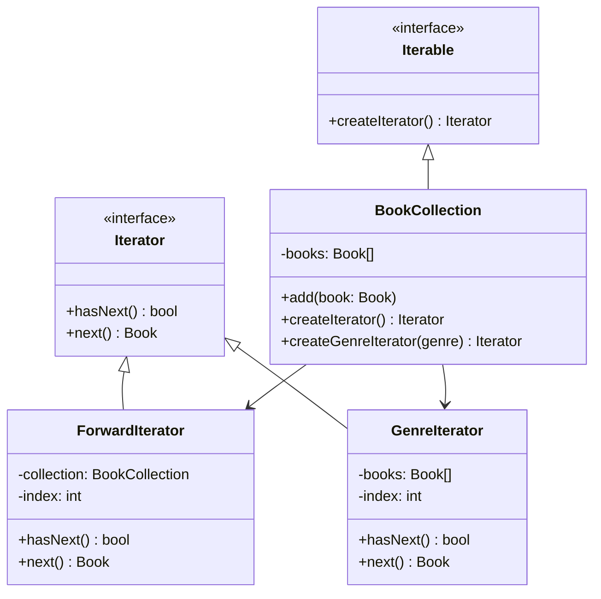

import { Tabs, TabItem } from '@astrojs/starlight/components';
import TypeScriptRepl from '../../../../../components/TypeScriptRepl.astro';
import PythonRepl from '../../../../../components/PythonRepl.astro';
import GoRepl from '../../../../../components/GoRepl.astro';
import tsCode from './iterator.ts?raw';
import pyCode from './iterator.py?raw';
import goCode from './iterator.go?raw';

## The problem

A collection class holds a set of objects. Client code needs to loop over them. The obvious solution is to expose the internal structure directly: return the array, let callers index into the list, or leak the tree's node pointers. That coupling means every caller breaks when the backing store changes. A `BookCollection` backed by an array today might be backed by a database cursor tomorrow. Callers should not need to change.

Iterator solves this by placing the traversal logic behind a two-method interface: `hasNext()` and `next()`. The collection creates and returns an iterator object. Client code talks only to that interface. The backing store can be an array, a linked list, a B-tree, or a lazy generator; the loop looks identical in all cases. New traversal orders (forward, reverse, by genre) become new iterator classes, not new branches inside the collection or the client.

## Structure

## When to use

- A collection's backing store may change and you want traversal code to be insulated from that change.
- You need multiple traversal strategies (forward, reverse, filtered) without polluting the collection class with that logic.
- You want to provide a uniform loop interface over several unrelated collection types.
- The collection is too large to materialize in memory at once and traversal needs to be lazy.

## Implementation

TypeScript's built-in `Iterator<T>` protocol uses `next()` returning `{ value, done }`, so implementing `[Symbol.iterator]` lets the collection work with `for...of` loops and spread syntax without any adapter code. Python's iterator protocol requires `__iter__` (returns `self`) and `__next__` (returns the next value or raises `StopIteration`), making any class that implements both compatible with `for` loops and `list()`. Go has no built-in iterator protocol before 1.23, so the conventional approach uses a struct with `HasNext() bool` and `Next() Book` methods, with each traversal strategy as a separate struct constructed by the collection.

<Tabs>
<TabItem label="TypeScript">
<TypeScriptRepl code={tsCode} id="iterator-ts" />
</TabItem>
<TabItem label="Python">
<PythonRepl code={pyCode} id="iterator-py" />
</TabItem>
<TabItem label="Go">
<GoRepl code={goCode} id="iterator-go" />
</TabItem>
</Tabs>

## Tradeoffs

| Pro | Con |
| --- | --- |
| Decouples traversal logic from the collection's internal structure | One extra class per traversal strategy |
| Open/closed: add new iteration orders without modifying the collection | Concurrent modification of the collection during iteration is undefined behavior |
| Multiple independent iterators can traverse the same collection simultaneously | Stateful iterators are single-use; a second pass requires a new instance |
| Client code is uniform across collections with different backing stores | Lazy iterators can be harder to reason about than a simple indexed loop |

## Gotchas

- An iterator holds a snapshot of the index, not a snapshot of the data. If the collection grows or shrinks during iteration, `hasNext()` can skip items or run past the end. Either document that mutation during iteration is forbidden or copy the data into the iterator at construction time.
- In Python, a class that implements `__iter__` but delegates to a fresh iterator object (rather than returning `self`) is an iterable, not an iterator. The distinction matters when you need to iterate the same object twice; iterators are exhausted after one pass, iterables are not.
- In TypeScript, returning `{ value: undefined, done: true }` requires the cast shown in the example because the `IteratorResult<T>` type is a discriminated union. The done branch never actually reads the value, so the cast is safe.
- Iterator and Composite appear together often enough to be mistaken for a single pattern. Composite structures the tree; Iterator traverses it. Keep them separate.
- In Go, calling `Next()` on an exhausted iterator (one where `HasNext()` returned `false`) will panic on the index access. Add a bounds check in `Next()` or treat an exhausted iterator as a programming error that panics loudly.

## References

- [Design Patterns: Iterator, GoF](https://www.informit.com/store/design-patterns-elements-of-reusable-object-oriented-9780201633610), the canonical definition
- [Refactoring Guru: Iterator](https://refactoring.guru/design-patterns/iterator), diagrams and multiple-language examples
- [SourceMaking: Iterator](https://sourcemaking.com/design_patterns/iterator), additional context and known uses

## Related topics

- [Design Patterns](../), the full GoF catalog
- [Composite](../composite/), Iterator is often used to traverse Composite trees
- [Visitor](../visitor/), Visitor frequently pairs with Iterator for tree traversal
