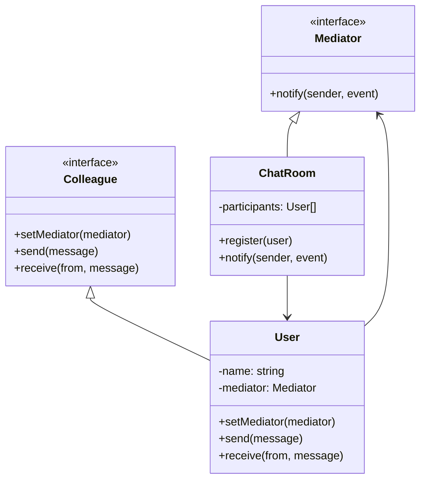

import { Tabs, TabItem } from '@astrojs/starlight/components';

## The problem

As a system grows, objects accumulate direct references to each other. A chat room where every `User` holds a list of other `User` instances is the classic example: adding a new user means updating every existing user's contact list, removing a user means hunting down every reference, and broadcasting a message means iterating over every held reference. The web of object-to-object connections becomes a maintenance and debugging burden. Each object now depends on the concrete types of all its peers.

Mediator cuts those direct connections by routing communication through a central object. Each participant only knows about the mediator. When a user sends a message, it hands that message to the `ChatRoom`, which decides who receives it. Users are unaware of each other. Adding or removing a participant is a change to the mediator alone, not to every other object in the graph.

## Structure



## When to use

- A set of objects communicate in well-defined but complex ways, and the resulting dependencies are hard to understand or change.
- Reusing an object is difficult because it holds references to many other objects.
- Behavior distributed across several classes should be customizable without heavy subclassing.
- You want to replace a many-to-many object graph with a one-to-many hub-and-spoke topology.

## Implementation

<Tabs>
<TabItem label="TypeScript">

`ChatRoom` holds the participant list and routes every message. Each `User` calls `chatRoom.send(this, message)` and never touches another `User` directly.

```typescript
interface Mediator {
  register(user: User): void;
  send(sender: User, message: string): void;
}

class ChatRoom implements Mediator {
  private participants: User[] = [];

  register(user: User): void {
    this.participants.push(user);
    user.setMediator(this);
  }

  send(sender: User, message: string): void {
    for (const participant of this.participants) {
      if (participant !== sender) {
        participant.receive(sender.name, message);
      }
    }
  }
}

class User {
  private mediator: Mediator | null = null;

  constructor(public readonly name: string) {}

  setMediator(mediator: Mediator): void {
    this.mediator = mediator;
  }

  send(message: string): void {
    console.log(`${this.name} sends: "${message}"`);
    this.mediator?.send(this, message);
  }

  receive(from: string, message: string): void {
    console.log(`${this.name} receives from ${from}: "${message}"`);
  }
}

const room = new ChatRoom();
const alice = new User('Alice');
const bob = new User('Bob');
const carol = new User('Carol');

room.register(alice);
room.register(bob);
room.register(carol);

alice.send('Hello, everyone!');
// Alice sends: "Hello, everyone!"
// Bob receives from Alice: "Hello, everyone!"
// Carol receives from Alice: "Hello, everyone!"
```

</TabItem>
<TabItem label="Python">

Python's `Protocol` describes the mediator contract without forcing `ChatRoom` to inherit from anything concrete. Each `User` stores a reference to the mediator only after `register` is called.

```python
from __future__ import annotations
from typing import Protocol


class Mediator(Protocol):
    def register(self, user: User) -> None: ...
    def send(self, sender: User, message: str) -> None: ...


class ChatRoom:
    def __init__(self) -> None:
        self._participants: list[User] = []

    def register(self, user: User) -> None:
        self._participants.append(user)
        user.set_mediator(self)

    def send(self, sender: User, message: str) -> None:
        for participant in self._participants:
            if participant is not sender:
                participant.receive(sender.name, message)


class User:
    def __init__(self, name: str) -> None:
        self.name = name
        self._mediator: Mediator | None = None

    def set_mediator(self, mediator: Mediator) -> None:
        self._mediator = mediator

    def send(self, message: str) -> None:
        print(f'{self.name} sends: "{message}"')
        if self._mediator:
            self._mediator.send(self, message)

    def receive(self, from_name: str, message: str) -> None:
        print(f'{self.name} receives from {from_name}: "{message}"')


room = ChatRoom()
alice, bob, carol = User('Alice'), User('Bob'), User('Carol')
for user in (alice, bob, carol):
    room.register(user)

alice.send('Hello, everyone!')
# Alice sends: "Hello, everyone!"
# Bob receives from Alice: "Hello, everyone!"
# Carol receives from Alice: "Hello, everyone!"
```

</TabItem>
<TabItem label="Go">

Go interfaces are satisfied implicitly, so `ChatRoom` satisfies `Mediator` without any declaration. A `User` created without calling `Register` on a room has a nil mediator; `Send` guards against that to avoid a panic.

```go
package main

import "fmt"

type Mediator interface {
	Register(user *User)
	Send(sender *User, message string)
}

type ChatRoom struct {
	participants []*User
}

func (r *ChatRoom) Register(user *User) {
	r.participants = append(r.participants, user)
	user.mediator = r
}

func (r *ChatRoom) Send(sender *User, message string) {
	for _, p := range r.participants {
		if p != sender {
			p.Receive(sender.Name, message)
		}
	}
}

type User struct {
	Name     string
	mediator Mediator
}

func (u *User) Send(message string) {
	fmt.Printf("%s sends: %q\n", u.Name, message)
	if u.mediator != nil {
		u.mediator.Send(u, message)
	}
}

func (u *User) Receive(from, message string) {
	fmt.Printf("%s receives from %s: %q\n", u.Name, from, message)
}

func main() {
	room := &ChatRoom{}
	alice := &User{Name: "Alice"}
	bob := &User{Name: "Bob"}
	carol := &User{Name: "Carol"}

	room.Register(alice)
	room.Register(bob)
	room.Register(carol)

	alice.Send("Hello, everyone!")
	// Alice sends: "Hello, everyone!"
	// Bob receives from Alice: "Hello, everyone!"
	// Carol receives from Alice: "Hello, everyone!"
}
```

</TabItem>
</Tabs>

## Tradeoffs

| Pro | Con |
| --- | --- |
| Eliminates direct object-to-object references, making participants independently reusable | The mediator itself can become a god object that knows too much |
| Adding or removing participants requires changes in one place | Logic that feels natural spread across colleagues ends up concentrated in the mediator |
| Participants are independently testable with a mock mediator | Indirection makes call flow harder to follow in a debugger |
| Replaces a tightly coupled mesh with a single, inspectable routing point | A mediator with many special cases is harder to reason about than the mesh it replaced |

## Gotchas

- The mediator pattern solves coupling, not complexity. If the routing logic is intricate, the mediator will be intricate. Factor complex routing into smaller, named methods rather than one large `notify` switch.
- Observer and Mediator are often confused. Observer lets publishers broadcast to unknown subscribers. Mediator centralizes control: it knows all participants and decides who hears what. If the mediator is just re-broadcasting everything, you probably want Observer instead.
- Bidirectional coupling is easy to introduce accidentally: if the mediator calls a method on a colleague that then calls back into the mediator, you have a cycle. Keep the flow unidirectional: colleagues call the mediator, the mediator calls colleagues.
- In Go, a zero-value `User` with a nil `mediator` field silently drops messages. Either require a mediator at construction time or guard every `Send` call, as shown above.
- Avoid putting business logic inside `receive` methods on the colleague. Message handling belongs in the mediator or in a dedicated handler; colleagues should stay thin.

## References

- [Design Patterns: Mediator, GoF](https://www.informit.com/store/design-patterns-elements-of-reusable-object-oriented-9780201633610), the canonical definition
- [Refactoring Guru: Mediator](https://refactoring.guru/design-patterns/mediator), diagrams and multiple-language examples
- [SourceMaking: Mediator](https://sourcemaking.com/design_patterns/mediator), additional context and known uses

## Related topics

- [Design Patterns](../), the full GoF catalog
- [Observer](../observer/), Observer distributes communication to unknown subscribers; Mediator centralizes it to a known set
- [Facade](../facade/), Facade simplifies a subsystem interface; Mediator coordinates peers that talk to each other
