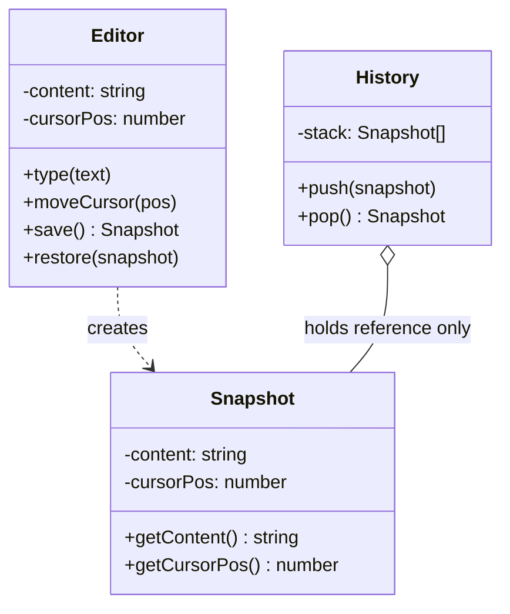

import { Tabs, TabItem } from '@astrojs/starlight/components';
import TypeScriptRepl from '../../../../../components/TypeScriptRepl.astro';
import PythonRepl from '../../../../../components/PythonRepl.astro';
import GoRepl from '../../../../../components/GoRepl.astro';
import tsCode from './memento.ts?raw';
import pyCode from './memento.py?raw';
import goCode from './memento.go?raw';

## The problem

A text editor needs undo. The naive approach stores the entire document string in a list on every keystroke. That works until you realize the document also has cursor position, selection range, scroll offset, and formatting state. Now every undo operation needs to restore all of that together, not just the text. You could expose setters for each field and let the undo manager coordinate them, but that forces the manager to know the editor's internals. Any refactor of the editor's internal representation breaks the undo manager too.

Memento solves this by letting the `Editor` (Originator) package its own state into an opaque `Snapshot` (Memento) object. The `History` stack (Caretaker) stores those snapshots and hands them back on undo. The Caretaker never reads the snapshot's contents. Only the Editor knows how to create a snapshot and how to restore from one. Encapsulation stays intact on both sides.

## Structure

The key relationship: `History` holds a reference to `Snapshot` but never calls `getContent` or `getCursorPos`. It only stores and returns the opaque object. The Editor is the sole interpreter of snapshot data.

## When to use

- You need undo/redo and the object's state is complex or encapsulated.
- You want to take a point-in-time snapshot of an object without coupling the snapshot holder to the object's internals.
- A transaction needs to roll back to a known-good state on failure.
- You are implementing checkpoints in a long-running process (game saves, wizard steps, form drafts).

## Implementation

In TypeScript, `Snapshot` is a private nested class inside `Editor`: code outside `Editor` holds a reference but cannot construct one or read its fields directly. Python uses a `dataclass` with single-underscore-prefixed fields as a convention signal. The Caretaker treats the snapshot as opaque by practice rather than compiler enforcement. In Go, the snapshot struct uses unexported fields, so only code in the same package can construct or read one. External Caretaker code can store and return the pointer but cannot inspect the state inside.

<Tabs>
<TabItem label="TypeScript">
<TypeScriptRepl code={tsCode} id="memento-ts" />
</TabItem>
<TabItem label="Python">
<PythonRepl code={pyCode} id="memento-py" />
</TabItem>
<TabItem label="Go">
<GoRepl code={goCode} id="memento-go" />
</TabItem>
</Tabs>

## Tradeoffs

| Pro | Con |
| --- | --- |
| Undo/redo without exposing internal state | Frequent snapshots can consume significant memory |
| Originator controls what gets captured | Caretaker must manage snapshot lifecycle (eviction, limits) |
| Simple Caretaker: no domain logic, just a stack | Deep object graphs are hard to snapshot correctly |
| Rollback is atomic: restore replaces all state at once | Languages without true access control rely on convention for encapsulation |

## Gotchas

- Snapshots capture state by value. If the Originator holds references to mutable objects (collections, nested objects), a shallow copy produces a snapshot that drifts when the original mutates. Deep-copy or serialize the state explicitly.
- Caretaker memory grows unbounded without a cap. In production, limit the history depth or use a ring buffer. Text editors typically cap undo at 100-200 steps.
- Memento and serialization solve overlapping problems. If you already serialize the Originator to JSON for persistence, that JSON can double as the snapshot. Avoid maintaining two snapshot formats.
- In Go, because `snapshot` is unexported but lives in the same package as `Editor`, the package boundary is the encapsulation unit. Splitting Editor and History into separate packages forces you to export the snapshot type, which weakens the guarantee. Design your package structure first.
- A snapshot from a stale schema causes restore failures after code changes. If you persist snapshots across sessions (game saves, drafts), version the snapshot format and handle migrations.

## References

- [Design Patterns: Memento, GoF](https://www.informit.com/store/design-patterns-elements-of-reusable-object-oriented-9780201633610), the canonical definition and known uses
- [Refactoring Guru: Memento](https://refactoring.guru/design-patterns/memento), diagrams and multiple-language examples
- [SourceMaking: Memento](https://sourcemaking.com/design_patterns/memento), additional context and known uses

## Related topics

- [Design Patterns](../), the full GoF catalog
- [Command](../command/), Command often uses Memento to implement undo by storing snapshots alongside each command
- [State](../state/), State and Memento both deal with an object's internal condition, but State controls behavior while Memento preserves history
