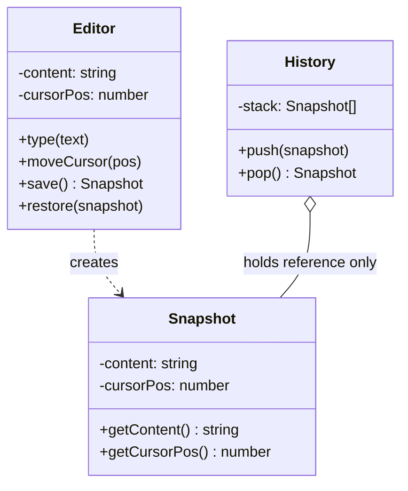

import { Tabs, TabItem } from '@astrojs/starlight/components';

## The problem

A text editor needs undo. The naive approach stores the entire document string in a list on every keystroke. That works until you realize the document also has cursor position, selection range, scroll offset, and formatting state. Now every undo operation needs to restore all of that together, not just the text. You could expose setters for each field and let the undo manager coordinate them, but that forces the manager to know the editor's internals. Any refactor of the editor's internal representation breaks the undo manager too.

Memento solves this by letting the `Editor` (Originator) package its own state into an opaque `Snapshot` (Memento) object. The `History` stack (Caretaker) stores those snapshots and hands them back on undo. The Caretaker never reads the snapshot's contents. Only the Editor knows how to create a snapshot and how to restore from one. Encapsulation stays intact on both sides.

## Structure



The key relationship: `History` holds a reference to `Snapshot` but never calls `getContent` or `getCursorPos`. It only stores and returns the opaque object. The Editor is the sole interpreter of snapshot data.

## When to use

- You need undo/redo and the object's state is complex or encapsulated.
- You want to take a point-in-time snapshot of an object without coupling the snapshot holder to the object's internals.
- A transaction needs to roll back to a known-good state on failure.
- You are implementing checkpoints in a long-running process (game saves, wizard steps, form drafts).

## Implementation

<Tabs>
<TabItem label="TypeScript">

`Snapshot` is a private nested class inside `Editor`. Code outside `Editor` receives a `Snapshot` reference and can pass it back, but cannot construct one or read its fields directly. This is as close as TypeScript gets to true Memento encapsulation without a module boundary.

```typescript
class Editor {
  private content: string = '';
  private cursorPos: number = 0;

  // Snapshot is private to Editor: outsiders hold a reference but cannot read fields.
  private static Snapshot = class {
    constructor(
      readonly content: string,
      readonly cursorPos: number
    ) {}
  };

  type(text: string): void {
    this.content =
      this.content.slice(0, this.cursorPos) +
      text +
      this.content.slice(this.cursorPos);
    this.cursorPos += text.length;
  }

  moveCursor(pos: number): void {
    this.cursorPos = Math.max(0, Math.min(pos, this.content.length));
  }

  save(): InstanceType<typeof Editor.Snapshot> {
    return new Editor.Snapshot(this.content, this.cursorPos);
  }

  restore(snapshot: InstanceType<typeof Editor.Snapshot>): void {
    this.content = snapshot.content;
    this.cursorPos = snapshot.cursorPos;
  }

  toString(): string {
    return `"${this.content}" (cursor: ${this.cursorPos})`;
  }
}

class History {
  private stack: InstanceType<typeof (Editor as any)['Snapshot']>[] = [];

  push(snapshot: object): void {
    this.stack.push(snapshot as any);
  }

  pop(): object | undefined {
    return this.stack.pop();
  }
}

const editor = new Editor();
const history = new History();

history.push(editor.save());   // snapshot: "" cursor 0
editor.type('Hello');
history.push(editor.save());   // snapshot: "Hello" cursor 5
editor.type(', world');
console.log(editor.toString()); // "Hello, world" (cursor: 12)

const prev = history.pop();
if (prev) editor.restore(prev as any);
console.log(editor.toString()); // "Hello" (cursor: 5)

const initial = history.pop();
if (initial) editor.restore(initial as any);
console.log(editor.toString()); // "" (cursor: 0)
```

</TabItem>
<TabItem label="Python">

Python uses a `dataclass` for the snapshot. The single-underscore convention signals "internal use only," but nothing technically prevents the `History` from reading the fields. In practice, you treat the snapshot as opaque by convention and rely on type annotations to communicate intent.

```python
from __future__ import annotations
from dataclasses import dataclass


@dataclass
class Snapshot:
    # Prefixed with _ to signal: Caretaker should not inspect these.
    _content: str
    _cursor_pos: int


class Editor:
    def __init__(self) -> None:
        self._content: str = ''
        self._cursor_pos: int = 0

    def type(self, text: str) -> None:
        self._content = (
            self._content[: self._cursor_pos]
            + text
            + self._content[self._cursor_pos :]
        )
        self._cursor_pos += len(text)

    def move_cursor(self, pos: int) -> None:
        self._cursor_pos = max(0, min(pos, len(self._content)))

    def save(self) -> Snapshot:
        return Snapshot(self._content, self._cursor_pos)

    def restore(self, snapshot: Snapshot) -> None:
        self._content = snapshot._content
        self._cursor_pos = snapshot._cursor_pos

    def __str__(self) -> str:
        return f'"{self._content}" (cursor: {self._cursor_pos})'


class History:
    def __init__(self) -> None:
        self._stack: list[Snapshot] = []

    def push(self, snapshot: Snapshot) -> None:
        self._stack.append(snapshot)

    def pop(self) -> Snapshot | None:
        return self._stack.pop() if self._stack else None


editor = Editor()
history = History()

history.push(editor.save())     # "" cursor 0
editor.type('Hello')
history.push(editor.save())     # "Hello" cursor 5
editor.type(', world')
print(editor)                   # "Hello, world" (cursor: 12)

prev = history.pop()
if prev:
    editor.restore(prev)
print(editor)                   # "Hello" (cursor: 5)

initial = history.pop()
if initial:
    editor.restore(initial)
print(editor)                   # "" (cursor: 0)
```

</TabItem>
<TabItem label="Go">

The snapshot struct uses unexported fields (`content`, `cursorPos`), so only code in the same package can construct or read one. External packages that act as Caretaker can store and return the pointer, but cannot inspect or modify the state inside.

```go
package main

import "fmt"

// snapshot has unexported fields: only editor.go can read or write them.
type snapshot struct {
	content   string
	cursorPos int
}

type Editor struct {
	content   string
	cursorPos int
}

func (e *Editor) Type(text string) {
	e.content = e.content[:e.cursorPos] + text + e.content[e.cursorPos:]
	e.cursorPos += len(text)
}

func (e *Editor) MoveCursor(pos int) {
	if pos < 0 {
		pos = 0
	}
	if pos > len(e.content) {
		pos = len(e.content)
	}
	e.cursorPos = pos
}

func (e *Editor) Save() *snapshot {
	return &snapshot{content: e.content, cursorPos: e.cursorPos}
}

func (e *Editor) Restore(s *snapshot) {
	e.content = s.content
	e.cursorPos = s.cursorPos
}

func (e *Editor) String() string {
	return fmt.Sprintf("%q (cursor: %d)", e.content, e.cursorPos)
}

type History struct {
	stack []*snapshot
}

func (h *History) Push(s *snapshot) {
	h.stack = append(h.stack, s)
}

func (h *History) Pop() *snapshot {
	if len(h.stack) == 0 {
		return nil
	}
	last := h.stack[len(h.stack)-1]
	h.stack = h.stack[:len(h.stack)-1]
	return last
}

func main() {
	editor := &Editor{}
	history := &History{}

	history.Push(editor.Save())  // "" cursor 0
	editor.Type("Hello")
	history.Push(editor.Save())  // "Hello" cursor 5
	editor.Type(", world")
	fmt.Println(editor)          // "Hello, world" (cursor: 12)

	editor.Restore(history.Pop())
	fmt.Println(editor)          // "Hello" (cursor: 5)

	editor.Restore(history.Pop())
	fmt.Println(editor)          // "" (cursor: 0)
}
```

</TabItem>
</Tabs>

## Tradeoffs

| Pro | Con |
| --- | --- |
| Undo/redo without exposing internal state | Frequent snapshots can consume significant memory |
| Originator controls what gets captured | Caretaker must manage snapshot lifecycle (eviction, limits) |
| Simple Caretaker: no domain logic, just a stack | Deep object graphs are hard to snapshot correctly |
| Rollback is atomic: restore replaces all state at once | Languages without true access control rely on convention for encapsulation |

## Gotchas

- Snapshots capture state by value. If the Originator holds references to mutable objects (collections, nested objects), a shallow copy produces a snapshot that drifts when the original mutates. Deep-copy or serialize the state explicitly.
- Caretaker memory grows unbounded without a cap. In production, limit the history depth or use a ring buffer. Text editors typically cap undo at 100-200 steps.
- Memento and serialization solve overlapping problems. If you already serialize the Originator to JSON for persistence, that JSON can double as the snapshot. Avoid maintaining two snapshot formats.
- In Go, because `snapshot` is unexported but lives in the same package as `Editor`, the package boundary is the encapsulation unit. Splitting Editor and History into separate packages forces you to export the snapshot type, which weakens the guarantee. Design your package structure first.
- A snapshot from a stale schema causes restore failures after code changes. If you persist snapshots across sessions (game saves, drafts), version the snapshot format and handle migrations.

## References

- [Design Patterns: Memento, GoF](https://www.informit.com/store/design-patterns-elements-of-reusable-object-oriented-9780201633610), the canonical definition and known uses
- [Refactoring Guru: Memento](https://refactoring.guru/design-patterns/memento), diagrams and multiple-language examples
- [SourceMaking: Memento](https://sourcemaking.com/design_patterns/memento), additional context and known uses

## Related topics

- [Design Patterns](../), the full GoF catalog
- [Command](../command/), Command often uses Memento to implement undo by storing snapshots alongside each command
- [State](../state/), State and Memento both deal with an object's internal condition, but State controls behavior while Memento preserves history
