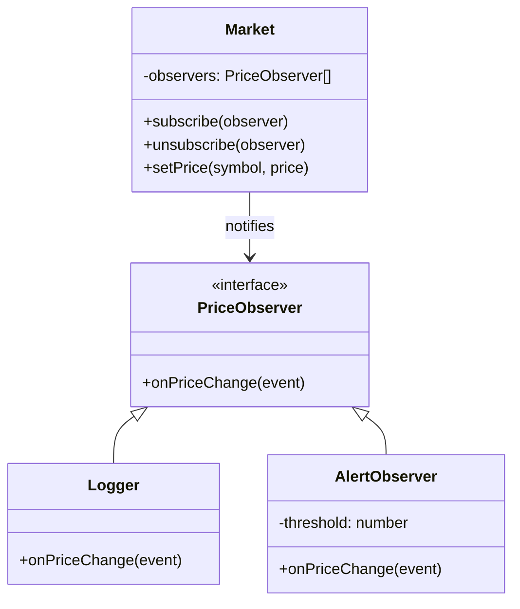

import { Tabs, TabItem } from '@astrojs/starlight/components';
import TypeScriptRepl from '../../../../../components/TypeScriptRepl.astro';
import PythonRepl from '../../../../../components/PythonRepl.astro';
import GoRepl from '../../../../../components/GoRepl.astro';
import tsCode from './observer.ts?raw';
import pyCode from './observer.py?raw';
import goCode from './observer.go?raw';

## The problem

You have an object whose state matters to other parts of the system, but you do not want it to know anything specific about those dependents. The naive approach is to call each dependent directly, which creates tight coupling: the subject needs to import and call every listener, adding a new subscriber requires changing the subject, and removing one requires hunting down the call site.

The Observer pattern solves this by introducing a subscription contract. The subject (also called the publisher or event source) maintains a list of observers and calls a single method on each when state changes. Observers register and deregister themselves. The subject never imports a concrete observer class. You can add, remove, or swap observers at runtime without touching the subject's code.

## Structure

## When to use

- One object's state change should trigger reactions in other objects, and you do not know how many or which ones at compile time.
- You want to avoid polling: instead of consumers checking for changes on a timer, the subject pushes updates as they happen.
- You are building an event bus, a reactive UI layer, or any publish/subscribe system.
- You need to decouple a domain object from logging, metrics, or notification side effects.

## Implementation

All three implementations build a generic event emitter backed by a listener registry. TypeScript uses a generic `Events` type parameter (a record mapping event names to payload types) so misspelled event names and wrong payload shapes are caught at compile time. Python uses `defaultdict` to avoid key-existence boilerplate and identity comparison (`is not`) in `off` so two listeners that happen to do the same thing are not confused. Go uses an interface-based observer contract with a `sync.RWMutex`: `Subscribe` and `Unsubscribe` take an exclusive write lock, and `SetPrice` snapshots the observer slice under a read lock before iterating so a concurrent `Subscribe` cannot corrupt the loop.

<Tabs>
<TabItem label="TypeScript">
<TypeScriptRepl code={tsCode} id="observer-ts" />
</TabItem>
<TabItem label="Python">
<PythonRepl code={pyCode} id="observer-py" />
</TabItem>
<TabItem label="Go">
<GoRepl code={goCode} id="observer-go" />
</TabItem>
</Tabs>

## Tradeoffs

| Pro | Con |
| --- | --- |
| Loose coupling: subject knows only the observer interface | Order of notification is undefined unless explicitly managed |
| Open/closed: add observers without changing the subject | Memory leaks if observers are not removed when done |
| Foundation for event-driven architecture | Cascading updates can be hard to trace |
| Go's channels offer a natural alternative for same-process pub/sub | Push model sends all data; observers cannot ask for a subset |

## Gotchas

- Remove observers when they are no longer needed. In browser JS, failing to call `removeEventListener` is the most common source of observer-related memory leaks.
- Copy the observer slice before iterating in Go (or any concurrent context). A `Subscribe` call during notification will corrupt the iteration.
- In Python, `listener is not listener_ref` identity comparison works for named functions. Lambdas create a new object each call, so you cannot remove a lambda you did not store a reference to.
- Deep observer chains (A notifies B which notifies C) produce hard-to-debug causality. Keep notification shallow. Prefer choreography over cascades.
- If two observers modify shared state in response to the same event, the interaction depends on notification order, which is insertion order by default. Make that dependency explicit or eliminate the shared state.

## References

- [Design Patterns: Observer, GoF](https://www.informit.com/store/design-patterns-elements-of-reusable-object-oriented-9780201633610), the canonical definition
- [Refactoring Guru: Observer](https://refactoring.guru/design-patterns/observer), diagrams and examples in multiple languages
- [Node.js EventEmitter docs](https://nodejs.org/api/events.html), the standard library implementation for reference
- [MDN: EventTarget](https://developer.mozilla.org/en-US/docs/Web/API/EventTarget), the browser DOM variant

## Related topics

- [Design Patterns](../), the full GoF catalog
- [Command](../command/), another behavioral pattern for decoupling action from invocation
- [Strategy](../strategy/), swappable behaviors that complement Observer for flexible systems
- [Functional Core, Imperative Shell](../../functional-core-imperative-shell/), pairs well here: keep observer callbacks in the imperative shell, pure computations in the core
