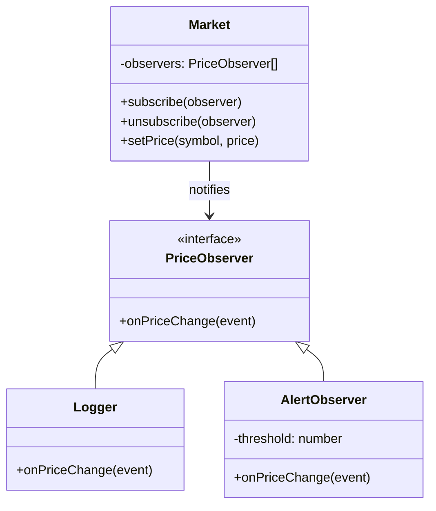

import { Tabs, TabItem } from '@astrojs/starlight/components';

## The problem

You have an object whose state matters to other parts of the system, but you do not want it to know anything specific about those dependents. The naive approach is to call each dependent directly, which creates tight coupling: the subject needs to import and call every listener, adding a new subscriber requires changing the subject, and removing one requires hunting down the call site.

The Observer pattern solves this by introducing a subscription contract. The subject (also called the publisher or event source) maintains a list of observers and calls a single method on each when state changes. Observers register and deregister themselves. The subject never imports a concrete observer class. You can add, remove, or swap observers at runtime without touching the subject's code.

## Structure



## When to use

- One object's state change should trigger reactions in other objects, and you do not know how many or which ones at compile time.
- You want to avoid polling: instead of consumers checking for changes on a timer, the subject pushes updates as they happen.
- You are building an event bus, a reactive UI layer, or any publish/subscribe system.
- You need to decouple a domain object from logging, metrics, or notification side effects.

## Implementation

<Tabs>
<TabItem label="TypeScript">

TypeScript's type system makes it straightforward to build a generic `EventEmitter` that carries typed payloads per event name. The `Events` type parameter is a record mapping event names to their payload types, so misspelled event names or wrong payload shapes are caught at compile time.

```typescript
type Listener<T> = (data: T) => void;

class EventEmitter<Events extends Record<string, unknown>> {
  private listeners = new Map<keyof Events, Set<Listener<unknown>>>();

  on<K extends keyof Events>(event: K, listener: Listener<Events[K]>): this {
    const set = this.listeners.get(event) ?? new Set();
    set.add(listener as Listener<unknown>);
    this.listeners.set(event, set);
    return this;
  }

  off<K extends keyof Events>(event: K, listener: Listener<Events[K]>): this {
    this.listeners.get(event)?.delete(listener as Listener<unknown>);
    return this;
  }

  emit<K extends keyof Events>(event: K, data: Events[K]): void {
    this.listeners.get(event)?.forEach(l => l(data));
  }
}

// Usage: stock market with typed events
interface MarketEvents {
  priceChange: { symbol: string; price: number };
  marketClose: { timestamp: number };
}

const market = new EventEmitter<MarketEvents>();

const priceLogger = (e: { symbol: string; price: number }) =>
  console.log(`${e.symbol}: $${e.price}`);

market.on('priceChange', priceLogger);
market.on('priceChange', e => {
  if (e.price > 1000) console.log(`Alert: ${e.symbol} exceeded $1000`);
});

market.emit('priceChange', { symbol: 'AAPL', price: 185.5 });
// AAPL: $185.5

market.emit('priceChange', { symbol: 'GOOG', price: 1050.0 });
// GOOG: $1050
// Alert: GOOG exceeded $1000

market.off('priceChange', priceLogger);
market.emit('priceChange', { symbol: 'AAPL', price: 186.0 });
// (only alert observer fires now)
```

</TabItem>
<TabItem label="Python">

Python's `defaultdict` removes the boilerplate of checking whether a key exists before appending. The `off` method uses identity comparison (`is not`) rather than equality, so two listeners that happen to do the same thing are not confused with each other.

```python
from __future__ import annotations
from collections import defaultdict
from typing import Callable


class EventEmitter:
    def __init__(self) -> None:
        self._listeners: dict[str, list[Callable]] = defaultdict(list)

    def on(self, event: str, listener: Callable) -> None:
        self._listeners[event].append(listener)

    def off(self, event: str, listener: Callable) -> None:
        self._listeners[event] = [
            l for l in self._listeners[event] if l is not listener
        ]

    def emit(self, event: str, **kwargs) -> None:
        for listener in list(self._listeners[event]):
            listener(**kwargs)


market = EventEmitter()

def log_price(symbol: str, price: float) -> None:
    print(f'{symbol}: ${price}')

def alert_high(symbol: str, price: float) -> None:
    if price > 1000:
        print(f'Alert: {symbol} exceeded $1000')

market.on('price_change', log_price)
market.on('price_change', alert_high)

market.emit('price_change', symbol='AAPL', price=185.5)
# AAPL: $185.5

market.emit('price_change', symbol='GOOG', price=1050.0)
# GOOG: $1050.0
# Alert: GOOG exceeded $1000

market.off('price_change', log_price)
market.emit('price_change', symbol='AAPL', price=186.0)
# (only alert fires)
```

</TabItem>
<TabItem label="Go">

Go's interface-based approach keeps the observer contract explicit without inheritance. The `sync.RWMutex` lets multiple goroutines read the observer list concurrently while `Subscribe` and `Unsubscribe` take an exclusive write lock. `SetPrice` copies the observer slice under a read lock before iterating, so a `Subscribe` call during notification does not corrupt the loop.

```go
package main

import (
	"fmt"
	"sync"
)

type PriceEvent struct {
	Symbol string
	Price  float64
}

type PriceObserver interface {
	OnPriceChange(PriceEvent)
}

type Market struct {
	mu        sync.RWMutex
	observers []PriceObserver
}

func (m *Market) Subscribe(o PriceObserver) {
	m.mu.Lock()
	defer m.mu.Unlock()
	m.observers = append(m.observers, o)
}

func (m *Market) Unsubscribe(o PriceObserver) {
	m.mu.Lock()
	defer m.mu.Unlock()
	out := m.observers[:0]
	for _, obs := range m.observers {
		if obs != o {
			out = append(out, obs)
		}
	}
	m.observers = out
}

func (m *Market) SetPrice(symbol string, price float64) {
	event := PriceEvent{Symbol: symbol, Price: price}
	m.mu.RLock()
	snapshot := make([]PriceObserver, len(m.observers))
	copy(snapshot, m.observers)
	m.mu.RUnlock()
	for _, o := range snapshot {
		o.OnPriceChange(event)
	}
}

type Logger struct{}

func (l *Logger) OnPriceChange(e PriceEvent) {
	fmt.Printf("%s: $%.2f\n", e.Symbol, e.Price)
}

type AlertObserver struct{ Threshold float64 }

func (a *AlertObserver) OnPriceChange(e PriceEvent) {
	if e.Price > a.Threshold {
		fmt.Printf("Alert: %s exceeded $%.0f\n", e.Symbol, a.Threshold)
	}
}

func main() {
	m := &Market{}
	logger := &Logger{}
	m.Subscribe(logger)
	m.Subscribe(&AlertObserver{Threshold: 1000})

	m.SetPrice("AAPL", 185.5)
	// AAPL: $185.50

	m.SetPrice("GOOG", 1050.0)
	// GOOG: $1050.00
	// Alert: GOOG exceeded $1000

	m.Unsubscribe(logger)
	m.SetPrice("AAPL", 186.0)
	// (only alert fires)
}
```

</TabItem>
</Tabs>

## Tradeoffs

| Pro | Con |
| --- | --- |
| Loose coupling: subject knows only the observer interface | Order of notification is undefined unless explicitly managed |
| Open/closed: add observers without changing the subject | Memory leaks if observers are not removed when done |
| Foundation for event-driven architecture | Cascading updates can be hard to trace |
| Go's channels offer a natural alternative for same-process pub/sub | Push model sends all data; observers cannot ask for a subset |

## Gotchas

- Remove observers when they are no longer needed. In browser JS, failing to call `removeEventListener` is the most common source of observer-related memory leaks.
- Copy the observer slice before iterating in Go (or any concurrent context). A `Subscribe` call during notification will corrupt the iteration.
- In Python, `listener is not listener_ref` identity comparison works for named functions. Lambdas create a new object each call, so you cannot remove a lambda you did not store a reference to.
- Deep observer chains (A notifies B which notifies C) produce hard-to-debug causality. Keep notification shallow. Prefer choreography over cascades.
- If two observers modify shared state in response to the same event, the interaction depends on notification order, which is insertion order by default. Make that dependency explicit or eliminate the shared state.

## References

- [Design Patterns: Observer, GoF](https://www.informit.com/store/design-patterns-elements-of-reusable-object-oriented-9780201633610), the canonical definition
- [Refactoring Guru: Observer](https://refactoring.guru/design-patterns/observer), diagrams and examples in multiple languages
- [Node.js EventEmitter docs](https://nodejs.org/api/events.html), the standard library implementation for reference
- [MDN: EventTarget](https://developer.mozilla.org/en-US/docs/Web/API/EventTarget), the browser DOM variant

## Related topics

- [Design Patterns](../), the full GoF catalog
- [Command](../command/), another behavioral pattern for decoupling action from invocation
- [Strategy](../strategy/), swappable behaviors that complement Observer for flexible systems
- [Functional Core, Imperative Shell](../../functional-core-imperative-shell/), pairs well here: keep observer callbacks in the imperative shell, pure computations in the core
