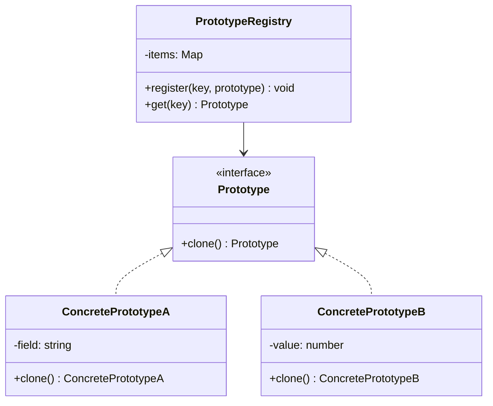

import { Tabs, TabItem } from '@astrojs/starlight/components';
import TypeScriptRepl from '../../../../../components/TypeScriptRepl.astro';
import PythonRepl from '../../../../../components/PythonRepl.astro';
import GoRepl from '../../../../../components/GoRepl.astro';
import tsCode from './prototype.ts?raw';
import pyCode from './prototype.py?raw';
import goCode from './prototype.go?raw';

## The problem

Some objects are expensive to create. Building a fresh database connection, parsing a configuration file, or assembling a complex document from scratch on every request wastes time and resources. You may also want a working copy you can modify safely without touching the original.

The Prototype pattern solves both problems. Instead of constructing a new object from scratch, you ask an existing object to copy itself. The copy is independent: you can mutate it freely. The original stays intact.

This also decouples client code from concrete classes. A factory or registry hands back a clone, and the caller never needs to know the concrete type.

## Structure

**Participants:**

- **Prototype**: the interface declaring `clone()`.
- **ConcretePrototype**: implements `clone()` by copying itself.
- **PrototypeRegistry**: stores named prototypes and returns fresh clones on demand.
- **Client**: asks the registry for a clone without knowing the concrete type.

## When to use

- Object construction is expensive (network calls, file I/O, heavy computation) and a working copy is a cheap alternative.
- You need many similar objects that differ only in a few fields.
- You want to avoid a parallel class hierarchy of factories.
- The concrete types are not known until runtime (e.g., loaded from config or a plugin system).
- You need an undo/history mechanism where each state is a snapshot.

## Implementation

TypeScript requires manual deep-copying of mutable fields: spread the tags array and map over nested arrays. Python's `copy.deepcopy` handles nested mutable state automatically, and implementing `__copy__`/`__deepcopy__` lets you plug into the standard library copy protocol directly. Go has no built-in clone mechanism; the convention is a `Clone()` method on each concrete type, and you must explicitly copy every slice since the slice header copies by value but the backing array is shared.

<Tabs>
<TabItem label="TypeScript">
<TypeScriptRepl code={tsCode} id="prototype-ts" />
</TabItem>
<TabItem label="Python">
<PythonRepl code={pyCode} id="prototype-py" />
</TabItem>
<TabItem label="Go">
<GoRepl code={goCode} id="prototype-go" />
</TabItem>
</Tabs>

## Tradeoffs

| Pro | Con |
|-----|-----|
| Avoids repeated expensive initialization; clone cost is proportional to object size, not construction complexity. | Deep copying complex object graphs is error-prone; missing a pointer or nested slice silently shares state. |
| Decouples client code from concrete classes; the registry API never changes even when new document types are added. | No language-level enforcement: Go and older Java require hand-written Clone methods that fall out of sync with new fields. |
| Simplifies creating objects that differ by a small variation; clone then mutate is far less code than a full constructor call. | Circular references break naive deep-copy implementations and require memo-table tracking (Python's `deepcopy` handles this; others do not). |
| Enables snapshot-based undo/history without extra infrastructure; each clone is a self-contained state. | Registry adds indirection: debugging requires tracing which prototype was used and what mutations happened after cloning. |
| Works well with dependency injection; the registry can swap prototypes without changing callers. | Cloning bypasses constructors, so invariant-checking logic in `__init__` or constructors is silently skipped on the copy. |

## Gotchas

**Shallow vs. deep copy:** Copying an object's value fields is easy. Pointer fields, slices, and maps share backing memory between original and clone unless you explicitly copy them. The TypeScript and Go examples show the manual approach; Python's `copy.deepcopy` handles it automatically but can be slow on large graphs.

**Constructors are skipped:** A clone is not constructed: it is copied. Any validation or side-effect logic in a constructor runs only for the prototype, not the clone. If a clone can end up in an invalid state, add a `validate()` step after cloning.

**Circular references:** If an object graph contains a cycle (`A` references `B`, `B` references `A`), a naive recursive deep-copy loops forever. Python's `deepcopy` tracks visited objects with a memo dict. In Go and TypeScript, you must implement the same bookkeeping yourself or break the cycle by storing IDs instead of pointers.

**Registry key collisions:** Using plain strings as registry keys is fragile. Two modules registering `"default"` silently overwrite each other. Prefer namespaced keys (`"documents/report/v2"`) or typed constants.

**Thread safety:** A shared registry read by multiple goroutines (Go) or threads (Python) must be protected. In Go, use `sync.RWMutex`. In Python, use `threading.Lock`. The registry in the examples above is single-threaded only.

## References

- [Design Patterns: Elements of Reusable Object-Oriented Software](https://www.informit.com/store/design-patterns-elements-of-reusable-object-oriented-9780201633610) (GoF book, the original source)
- [Refactoring Guru: Prototype](https://refactoring.guru/design-patterns/prototype) (illustrations, code examples in many languages)
- [SourceMaking: Prototype](https://sourcemaking.com/design_patterns/prototype) (concise summary with intent and applicability)

## Related topics

- [Design Patterns](../): the full GoF catalog, all 23 patterns grouped by category
- [Builder](../builder/): another creational pattern; use Builder when the construction process has many steps, Prototype when you want a copy of a finished object
- [Abstract Factory](../abstract-factory/): creates families of related objects; combine with Prototype when the factory itself stores prototypes to clone
