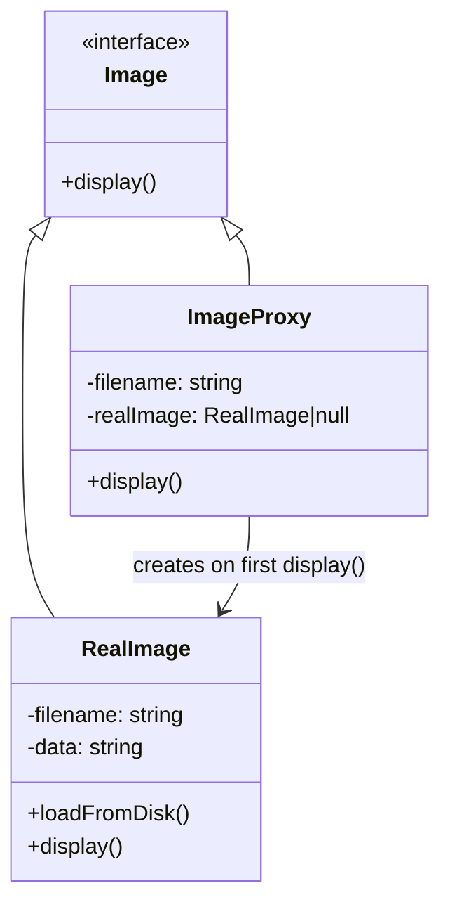

## The problem

Sometimes you can't or shouldn't hand a caller a direct reference to a real object. The object might be expensive to create and shouldn't be instantiated until someone actually needs it. It might live in another process or on a remote server. It might require permission checks before any method can run. Or it might benefit from caching so that repeated calls don't repeat expensive work.

In every case, the answer is the same: put a surrogate in front of the real object. The surrogate implements the same interface, so callers don't need to change. The surrogate intercepts calls, does its cross-cutting work (lazy init, auth, caching, serialization), and delegates to the real object when appropriate. Four variants cover most situations: virtual (lazy load), protection (permissions), caching, and remote.

## Structure



## When to use

- Construction of the real object is expensive and should be deferred until the object is actually used (virtual proxy).
- Access to the real object must be gated by permission or role checks (protection proxy).
- Results from the real object can be cached to avoid repeated expensive calls (caching proxy).
- The real object lives in another process, machine, or service and the caller needs a local stand-in (remote proxy).

## TypeScript

A virtual proxy defers loading an image from disk until `display()` is first called. Subsequent calls reuse the already-loaded instance.

```typescript
interface Image {
  display(): void;
}

class RealImage implements Image {
  private data: string;

  constructor(private filename: string) {
    this.data = this.loadFromDisk();
  }

  private loadFromDisk(): string {
    console.log(`Loading ${this.filename} from disk...`);
    return `<image data for ${this.filename}>`;
  }

  display(): void {
    console.log(`Displaying ${this.filename}: ${this.data}`);
  }
}

class ImageProxy implements Image {
  private realImage: RealImage | null = null;

  constructor(private filename: string) {}

  display(): void {
    if (!this.realImage) {
      this.realImage = new RealImage(this.filename);
    }
    this.realImage.display();
  }
}

// With RealImage, disk load happens at construction time.
// With ImageProxy, disk load is deferred until display() is called.
const image = new ImageProxy('photo.jpg');
console.log('Proxy created, no disk access yet');

image.display(); // loads now
// Loading photo.jpg from disk...
// Displaying photo.jpg: <image data for photo.jpg>

image.display(); // uses cached RealImage
// Displaying photo.jpg: <image data for photo.jpg>
```

A protection proxy adds a permission check before delegating. The caller gets the same `UserService` interface either way.

```typescript
interface UserService {
  getUser(id: string): string;
  deleteUser(id: string): void;
}

class RealUserService implements UserService {
  getUser(id: string): string { return `User ${id}`; }
  deleteUser(id: string): void { console.log(`Deleted user ${id}`); }
}

class AuthUserServiceProxy implements UserService {
  constructor(
    private service: RealUserService,
    private role: string,
  ) {}

  getUser(id: string): string {
    return this.service.getUser(id);
  }

  deleteUser(id: string): void {
    if (this.role !== 'admin') {
      throw new Error('Permission denied: admin role required');
    }
    this.service.deleteUser(id);
  }
}

const adminProxy = new AuthUserServiceProxy(new RealUserService(), 'admin');
adminProxy.deleteUser('42'); // Deleted user 42

const userProxy = new AuthUserServiceProxy(new RealUserService(), 'user');
try {
  userProxy.deleteUser('42');
} catch (e) {
  console.log((e as Error).message); // Permission denied: admin role required
}
```

## Python

Virtual proxy using an abstract base class. The protection proxy follows the same pattern: check a condition before calling `self._real_image`.

```python
from __future__ import annotations
from abc import ABC, abstractmethod


class Image(ABC):
    @abstractmethod
    def display(self) -> None: ...


class RealImage(Image):
    def __init__(self, filename: str) -> None:
        self._filename = filename
        self._data = self._load_from_disk()

    def _load_from_disk(self) -> str:
        print(f'Loading {self._filename} from disk...')
        return f'<image data for {self._filename}>'

    def display(self) -> None:
        print(f'Displaying {self._filename}: {self._data}')


class ImageProxy(Image):
    def __init__(self, filename: str) -> None:
        self._filename = filename
        self._real_image: RealImage | None = None

    def display(self) -> None:
        if self._real_image is None:
            self._real_image = RealImage(self._filename)
        self._real_image.display()


image = ImageProxy('photo.jpg')
print('Proxy created, no disk access yet')

image.display()  # loads now
# Loading photo.jpg from disk...
# Displaying photo.jpg: <image data for photo.jpg>

image.display()  # uses cached instance
# Displaying photo.jpg: <image data for photo.jpg>
```

## Go

`Image` interface, `RealImage`, and `ImageProxy`. The proxy is assigned to an `Image` variable so the compiler verifies interface satisfaction at the call site.

```go
package main

import "fmt"

type Image interface {
	Display()
}

// Compile-time interface check.
var _ Image = (*ImageProxy)(nil)

type RealImage struct {
	filename string
	data     string
}

func NewRealImage(filename string) *RealImage {
	img := &RealImage{filename: filename}
	img.data = img.loadFromDisk()
	return img
}

func (r *RealImage) loadFromDisk() string {
	fmt.Printf("Loading %s from disk...\n", r.filename)
	return fmt.Sprintf("<image data for %s>", r.filename)
}

func (r *RealImage) Display() {
	fmt.Printf("Displaying %s: %s\n", r.filename, r.data)
}

type ImageProxy struct {
	filename  string
	realImage *RealImage
}

func NewImageProxy(filename string) *ImageProxy {
	return &ImageProxy{filename: filename}
}

func (p *ImageProxy) Display() {
	if p.realImage == nil {
		p.realImage = NewRealImage(p.filename)
	}
	p.realImage.Display()
}

func main() {
	var image Image = NewImageProxy("photo.jpg")
	fmt.Println("Proxy created, no disk access yet")

	image.Display() // loads now
	image.Display() // uses cached
}
```

## The four proxy types

| Proxy type | What it does | Common use |
| --- | --- | --- |
| Virtual | Defers creation of expensive object | Lazy-load images, database connections |
| Protection | Checks permissions before delegating | Role-based access control, API auth |
| Caching | Returns cached result on repeat calls | HTTP caching, memoization layers |
| Remote | Represents an object in another process | gRPC stubs, RMI, SOAP client proxies |

## Tradeoffs

| Pro | Con |
| --- | --- |
| Transparent to the caller (same interface) | Adds a layer; debugging steps through two objects |
| Lazy init, caching, access control without touching the real object | Can hide errors if the proxy swallows exceptions |
| Testable in isolation: proxy can be tested without the real object | Caching proxy introduces stale-data risk |
| Easy to layer multiple proxies | Overusing proxies creates indirection soup |

## Gotchas

- A protection proxy that logs but never blocks is audit logging, not access control. Be explicit about which one you are building.
- Virtual proxies create the real object on first use. If construction can fail, handle the error at that point rather than silently storing a partially initialized object.
- In Python, `__getattr__` lets you build a generic proxy that forwards everything, but it bypasses type checking. Prefer an explicit interface when the proxy is part of a public API.
- In Go, the proxy must implement the same interface as the real object. A blank assignment (`var _ Image = (*ImageProxy)(nil)`) confirms this at compile time with no runtime cost.
- Layering a caching proxy on top of a mutable real object can serve stale data. Define an explicit invalidation strategy before deploying a caching proxy in production.

## References

- [Design Patterns: Elements of Reusable Object-Oriented Software](https://www.oreilly.com/library/view/design-patterns-elements/0201633612/), the original GoF entry for Proxy (p. 207)
- [Proxy pattern, Refactoring.Guru](https://refactoring.guru/design-patterns/proxy), illustrated walkthrough covering all four proxy types
- [SourceMaking: Proxy](https://sourcemaking.com/design_patterns/proxy), discussion of virtual, protection, and remote variants
- [Head First Design Patterns, Freeman & Robson](https://www.oreilly.com/library/view/head-first-design/0596007124/), chapter 11 covers Proxy with a remote proxy and a virtual proxy example side by side

## Related topics

- [Design Patterns](../), the full GoF catalog
- [Decorator](../decorator/), also wraps an object behind the same interface, but to add behavior rather than to control access
- [Facade](../facade/), simplifies a subsystem rather than controlling access to a single object
- [Flyweight](../flyweight/), another structural pattern concerned with object overhead, but via sharing rather than interception
