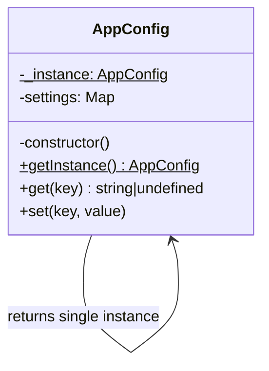

import { Tabs, TabItem } from '@astrojs/starlight/components';
import TypeScriptRepl from '../../../../../components/TypeScriptRepl.astro';
import PythonRepl from '../../../../../components/PythonRepl.astro';
import GoRepl from '../../../../../components/GoRepl.astro';
import tsCode from './singleton.ts?raw';
import pyCode from './singleton.py?raw';
import goCode from './singleton.go?raw';

## The problem

Some resources should exist exactly once in a process: the application config, a database connection pool, a shared logger. Creating a second instance of any of these is either wasteful (two pools doing the same work) or incorrect (two configs diverging silently). You need a way to guarantee that no matter how many times a caller asks for the object, they always get the same one.

The Singleton pattern solves this by making the class itself responsible for managing its own instance. Construction is hidden behind a static access point. The first call creates the instance and stores it. Every subsequent call returns the stored instance. The class controls its own lifecycle, and the caller never has to think about it.

One honest caveat before you reach for this pattern: Singleton is in the original GoF catalog, and it is genuinely useful for config stores, connection pools, and loggers. It is also one of the most frequently overused patterns. When you find yourself thinking "this should be global," consider whether dependency injection would serve you better. The sections below cover both when the pattern fits and when it does not.

## Structure

## When to use

- Exactly one instance must coordinate across the whole program: a shared logger, a connection pool, a config store.
- Construction is expensive and the result is safe to share across callers.
- You need lazy initialization: the instance should not exist until something first requests it.
- The alternative is passing the same object through many layers of function calls, and that threading cost is higher than the coupling cost of a global.

## Implementation

Each language offers two approaches. TypeScript shows the classic GoF form (private constructor plus `static getInstance()`) and then the idiomatic module-level instance that Node.js module caching makes equivalent. Python shows a `__new__` override and the simpler module-level instance (the `__new__` approach works but is unusual; prefer the module-level form unless you need lazy initialization or subclassing). Go uses `sync.Once`, which guarantees the initializer runs exactly once under concurrent access without any locks you have to manage manually. Note that `sync.Once` covers creation only; individual `Get` and `Set` calls still need their own `sync.RWMutex` to be safe under concurrent reads and writes.

<Tabs>
<TabItem label="TypeScript">
<TypeScriptRepl code={tsCode} id="singleton-ts" />
</TabItem>
<TabItem label="Python">
<PythonRepl code={pyCode} id="singleton-py" />
</TabItem>
<TabItem label="Go">
<GoRepl code={goCode} id="singleton-go" />
</TabItem>
</Tabs>

## When the pattern fits and when it does not

The Singleton is appropriate when:

- One instance must coordinate across the whole process: a shared logger, a connection pool, a config store.
- Construction is expensive and the result is safe to share.
- The instance is stateless or its state is intentionally global (e.g., feature flags loaded once at startup).

It is less appropriate when:

- Tests need to reset global state between runs. A singleton shared across tests produces flaky, order-dependent results. Prefer dependency injection so tests can supply their own instance.
- The "global" use case is really just avoiding parameter threading. Module-level variables in Python and Go cover most needs without any class ceremony.
- The object holds mutable state that different callers need independently. That is not a singleton: it is a registry or a service locator, and those deserve different patterns.

## Tradeoffs

| Pro | Con |
| --- | --- |
| Guarantees one instance across the process | Global state is hard to test in isolation |
| Controls access to a shared resource | Introduces hidden coupling between callers |
| Lazy initialization possible: create on first use | Thread safety requires explicit synchronization |
| Familiar and well understood | Often a code smell for a design that needs dependency injection |

## Gotchas

- In Python, the `__new__` approach works but is unusual. Module-level instances are idiomatic and avoid the boilerplate. Use the class approach only when you need lazy initialization or subclassing.
- In Go, always use `sync.Once`. A naive `if instance == nil` check is a data race on any path where two goroutines reach it simultaneously. The race detector will catch it.
- In TypeScript and Node.js, the module system provides singleton behavior for free. A module is loaded once and cached by the runtime. A module-level `export const config = new Config()` is a singleton without the pattern's ceremony.
- Tests that need a clean config should accept an injected config rather than calling `getInstance()`. If you find yourself resetting `AppConfig.instance = null` in test setup, that is a sign the code needs dependency injection instead.
- The private constructor trick in TypeScript prevents direct instantiation, but it does not prevent someone from bypassing it via `Object.create(AppConfig.prototype)`. This is rarely a real concern, but it is not a security boundary.

## References

- [Design Patterns: Elements of Reusable Object-Oriented Software](https://www.oreilly.com/library/view/design-patterns-elements/0201633612/), the original GoF entry for Singleton (p. 127)
- [Singleton pattern, Refactoring.Guru](https://refactoring.guru/design-patterns/singleton), illustrated walkthrough covering lazy init, thread safety, and common pitfalls
- [SourceMaking: Singleton](https://sourcemaking.com/design_patterns/singleton), discussion of the pattern and when to avoid it
- [sync.Once, Go standard library](https://pkg.go.dev/sync#Once), the idiomatic Go mechanism for one-time initialization

## Related topics

- [Design Patterns](../), the full GoF catalog
- [Factory](../factory/), often used alongside Singleton to control instance creation
- [Decorator](../decorator/), can wrap a singleton to add logging or caching without modifying it
- [Proxy](../proxy/), another wrapping pattern useful for adding access control around a shared instance
