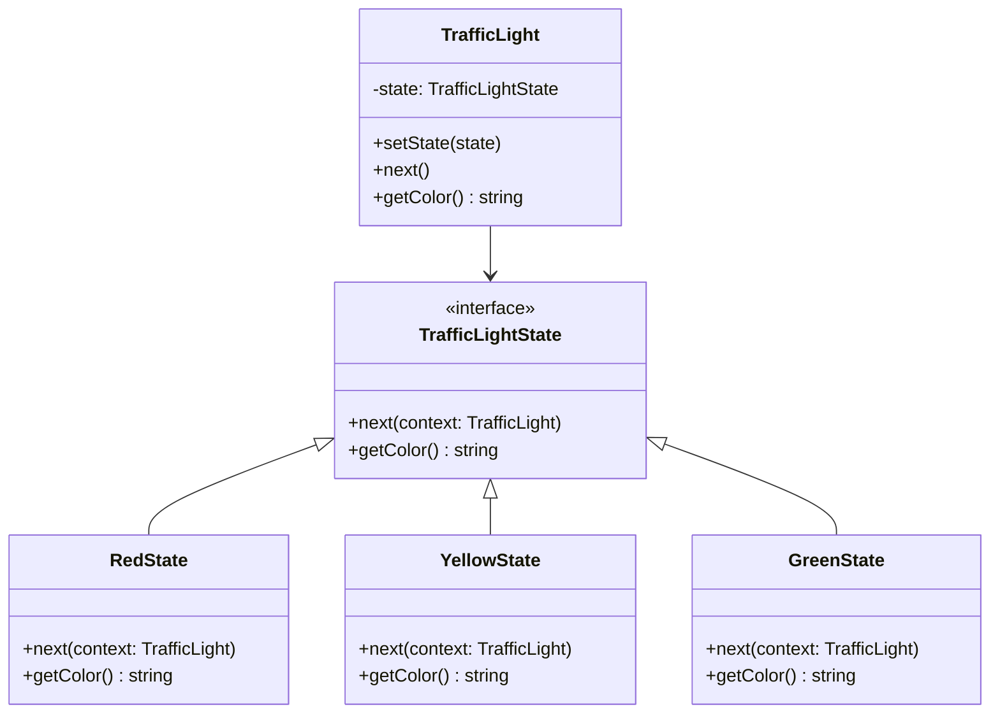

import { Tabs, TabItem } from '@astrojs/starlight/components';
import TypeScriptRepl from '../../../../../components/TypeScriptRepl.astro';
import PythonRepl from '../../../../../components/PythonRepl.astro';
import GoRepl from '../../../../../components/GoRepl.astro';
import tsCode from './state.ts?raw';
import pyCode from './state.py?raw';
import goCode from './state.go?raw';

## The problem

An object's behavior depends on its current state, and that state changes at runtime. The naive solution is a sprawling `switch` or `if/else` inside every method that checks `this.state` and branches accordingly. A traffic light has a `next()` method that must behave differently for `Red`, `Yellow`, and `Green`. With inline conditionals, every new state means editing every method. Every method must know every state. The logic scatters, and adding a fourth state (say, a flashing `Yellow`) requires hunting down every branch in every method.

State moves each state's behavior into its own class. The context holds a reference to the current state object and delegates calls to it. Transitioning to a new state is a single assignment on the context. Each state class knows only its own logic and which state follows it. Adding a new state requires a new class, not edits to existing ones.

## Structure

## When to use

- An object's behavior changes dramatically based on internal state and the number of states is large or growing.
- You have methods with parallel `switch` statements that all switch on the same state variable.
- State transitions have explicit rules that belong with the state, not scattered across the context.
- You want to add new states without modifying existing state classes or the context.

## Implementation

Each concrete state class handles transitions by calling `setState` (or `set_state`) on the context with the next state object. In TypeScript and Python, the context never needs to know the transition rules. Python uses `Protocol` for the state interface, avoiding mandatory inheritance. In Go, interfaces are satisfied implicitly; each state struct receives a pointer to the context to call `SetState`. A zero-value `TrafficLight` with a nil state field will panic, so always initialize with a concrete state.

<Tabs>
<TabItem label="TypeScript">
<TypeScriptRepl code={tsCode} id="state-ts" />
</TabItem>
<TabItem label="Python">
<PythonRepl code={pyCode} id="state-py" />
</TabItem>
<TabItem label="Go">
<GoRepl code={goCode} id="state-go" />
</TabItem>
</Tabs>

## Tradeoffs

| Pro | Con |
| --- | --- |
| Eliminates parallel `switch` blocks scattered across methods | One class per state; a machine with many states means many files |
| Open/closed: new states require no changes to existing state classes | State classes are tightly coupled to the context type they accept |
| Transition logic lives with the state that owns it | Shared state between state objects requires careful coordination |
| Each state class is independently testable in isolation | Can be overkill when an object has only two states that rarely change |

## Gotchas

- State and Strategy look almost identical in structure. The difference is intent: Strategy swaps algorithms the client chooses; State manages transitions the object controls internally.
- Circular references are normal here. `RedState` knows about `GreenState`, which knows about `YellowState`, which knows about `RedState`. Use forward declarations or lazy instantiation in languages that require it.
- If state objects are stateless (no instance data), they can be singletons. Creating a new instance on every transition is wasteful when the state carries no data.
- Transition logic can live in the context or in the state classes. Putting it in the states keeps transitions close to the behavior they govern. Putting it in the context gives a single place to read the full machine. Pick one and stay consistent.
- In Go, passing a pointer to the context through every state method ties the interface to one concrete context type. If you need the same states reused across multiple context types, introduce a narrower interface for the context argument.

## References

- [Design Patterns: State, GoF](https://www.informit.com/store/design-patterns-elements-of-reusable-object-oriented-9780201633610), the canonical definition
- [Refactoring Guru: State](https://refactoring.guru/design-patterns/state), diagrams and multiple-language examples
- [SourceMaking: State](https://sourcemaking.com/design_patterns/state), additional context and known uses

## Related topics

- [Design Patterns](../), the full GoF catalog
- [Strategy](../strategy/), also externalizes behavior but does not manage transitions
- [Observer](../observer/), often used alongside State to broadcast state changes
