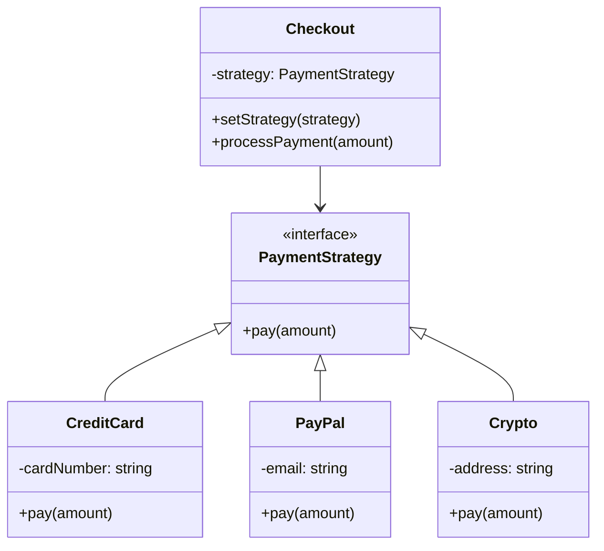

import { Tabs, TabItem } from '@astrojs/starlight/components';

## The problem

A class needs to perform some operation, but the exact algorithm depends on context: a payment system needs to support credit cards, PayPal, and crypto; a sorter might need to switch between merge sort and radix sort based on input size; a compressor might switch between gzip and brotli based on content type. The straightforward solution is a long `if/else` or `switch` inside the class. That conditional grows with every new algorithm, every branch gets harder to test in isolation, and the class violates the open/closed principle every time you add a variant.

Strategy moves each algorithm into its own class behind a shared interface. The context class holds a reference to that interface, not a concrete implementation. Swapping the algorithm at runtime is a single assignment. Adding a new algorithm requires writing a new class, not modifying the context. Each algorithm is independently testable.

## Structure



## When to use

- A class needs to switch between multiple variants of an algorithm at runtime.
- You want to isolate algorithm implementations so each can be tested without the context.
- A family of similar classes differs only in behavior. Strategy replaces subclassing with composition.
- You are accumulating `if/else` branches that select different behaviors based on type or configuration.

## Implementation

<Tabs>
<TabItem label="TypeScript">

The `Checkout` context takes a `PaymentStrategy` in its constructor and exposes `setStrategy` for runtime swaps. None of the concrete strategy classes know about each other or about `Checkout`.

```typescript
interface PaymentStrategy {
  pay(amount: number): void;
}

class CreditCard implements PaymentStrategy {
  constructor(private cardNumber: string) {}
  pay(amount: number): void {
    console.log(
      `Charged $${amount} to card ending ${this.cardNumber.slice(-4)}`
    );
  }
}

class PayPal implements PaymentStrategy {
  constructor(private email: string) {}
  pay(amount: number): void {
    console.log(`Sent $${amount} via PayPal to ${this.email}`);
  }
}

class Crypto implements PaymentStrategy {
  constructor(private address: string) {}
  pay(amount: number): void {
    console.log(`Transferred $${amount} worth of BTC to ${this.address}`);
  }
}

class Checkout {
  constructor(private strategy: PaymentStrategy) {}

  setStrategy(strategy: PaymentStrategy): void {
    this.strategy = strategy;
  }

  processPayment(amount: number): void {
    this.strategy.pay(amount);
  }
}

const checkout = new Checkout(new CreditCard('4111111111111111'));
checkout.processPayment(99.99);
// Charged $99.99 to card ending 1111

checkout.setStrategy(new PayPal('user@example.com'));
checkout.processPayment(49.99);
// Sent $49.99 via PayPal to user@example.com

checkout.setStrategy(new Crypto('1A2B3C4D...'));
checkout.processPayment(19.99);
// Transferred $19.99 worth of BTC to 1A2B3C4D...
```

</TabItem>
<TabItem label="Python">

Python duck typing means the abstract base class is optional. The `Protocol` approach used here gives type checkers and IDEs the information they need to catch mismatches without requiring `CreditCard` or `PayPal` to inherit from anything.

```python
from __future__ import annotations
from typing import Protocol


class PaymentStrategy(Protocol):
    def pay(self, amount: float) -> None: ...


class CreditCard:
    def __init__(self, card_number: str) -> None:
        self._card = card_number

    def pay(self, amount: float) -> None:
        print(f'Charged ${amount} to card ending {self._card[-4:]}')


class PayPal:
    def __init__(self, email: str) -> None:
        self._email = email

    def pay(self, amount: float) -> None:
        print(f'Sent ${amount} via PayPal to {self._email}')


class Crypto:
    def __init__(self, address: str) -> None:
        self._address = address

    def pay(self, amount: float) -> None:
        print(f'Transferred ${amount} worth of BTC to {self._address}')


class Checkout:
    def __init__(self, strategy: PaymentStrategy) -> None:
        self._strategy = strategy

    def set_strategy(self, strategy: PaymentStrategy) -> None:
        self._strategy = strategy

    def process_payment(self, amount: float) -> None:
        self._strategy.pay(amount)


checkout = Checkout(CreditCard('4111111111111111'))
checkout.process_payment(99.99)
# Charged $99.99 to card ending 1111

checkout.set_strategy(PayPal('user@example.com'))
checkout.process_payment(49.99)
# Sent $49.99 via PayPal to user@example.com
```

</TabItem>
<TabItem label="Go">

Go interfaces are satisfied implicitly, so `CreditCard`, `PayPal`, and `Crypto` implement `PaymentStrategy` without any declaration. A nil strategy panics at call time: initialize `Checkout` with a concrete strategy or add a nil guard in `ProcessPayment`.

```go
package main

import "fmt"

type PaymentStrategy interface {
	Pay(amount float64)
}

type CreditCard struct{ CardNumber string }

func (c *CreditCard) Pay(amount float64) {
	last4 := c.CardNumber[len(c.CardNumber)-4:]
	fmt.Printf("Charged $%.2f to card ending %s\n", amount, last4)
}

type PayPal struct{ Email string }

func (p *PayPal) Pay(amount float64) {
	fmt.Printf("Sent $%.2f via PayPal to %s\n", amount, p.Email)
}

type Crypto struct{ Address string }

func (c *Crypto) Pay(amount float64) {
	fmt.Printf("Transferred $%.2f worth of BTC to %s\n", amount, c.Address)
}

type Checkout struct{ strategy PaymentStrategy }

func (c *Checkout) SetStrategy(s PaymentStrategy) { c.strategy = s }
func (c *Checkout) ProcessPayment(amount float64)  { c.strategy.Pay(amount) }

func main() {
	checkout := &Checkout{strategy: &CreditCard{CardNumber: "4111111111111111"}}
	checkout.ProcessPayment(99.99)
	// Charged $99.99 to card ending 1111

	checkout.SetStrategy(&PayPal{Email: "user@example.com"})
	checkout.ProcessPayment(49.99)
	// Sent $49.99 via PayPal to user@example.com

	checkout.SetStrategy(&Crypto{Address: "1A2B3C4D..."})
	checkout.ProcessPayment(19.99)
	// Transferred $19.99 worth of BTC to 1A2B3C4D...
}
```

</TabItem>
</Tabs>

## Tradeoffs

| Pro | Con |
| --- | --- |
| Eliminates conditionals in the context class | One extra class per algorithm |
| Open/closed: add strategies without changing Checkout | Clients must know which strategies exist to pick one |
| Strategies are independently testable | Overkill if there are only two algorithms that rarely change |
| Works naturally with dependency injection | Stateful strategies need care around shared data |

## Gotchas

- Strategy and Factory often appear together: a factory creates the strategy, the context uses it. Keep them separate in code; they solve different problems.
- In Python, a plain function can serve as a strategy when the interface has only one method. Passing `credit_card.pay` directly is valid duck typing and avoids a wrapper class.
- Strategies that carry mutable state can cause subtle bugs when the same instance is shared across contexts. Prefer stateless strategies or create fresh instances per use.
- In Go, a zero-value `Checkout` with a nil `strategy` field panics on the first call. Initialize with a sensible default or check for nil in `ProcessPayment`.
- Avoid putting infrastructure concerns (logging, metrics) inside strategy implementations. Those cross-cutting concerns belong at the context level or in middleware.

## References

- [Design Patterns: Strategy, GoF](https://www.informit.com/store/design-patterns-elements-of-reusable-object-oriented-9780201633610), the canonical definition
- [Refactoring Guru: Strategy](https://refactoring.guru/design-patterns/strategy), diagrams and multiple-language examples
- [SourceMaking: Strategy](https://sourcemaking.com/design_patterns/strategy), additional context and known uses
- [Head First Design Patterns, Chapter 1](https://www.oreilly.com/library/view/head-first-design/0596007124/), the duck-simulator example that opens the book illustrates Strategy

## Related topics

- [Design Patterns](../), the full GoF catalog
- [Factory](../factory/), frequently used to create strategy instances
- [Observer](../observer/), another behavioral pattern for flexible, decoupled systems
- [Functional Core, Imperative Shell](../../functional-core-imperative-shell/), strategies fit cleanly into the functional core when they are pure functions over values
