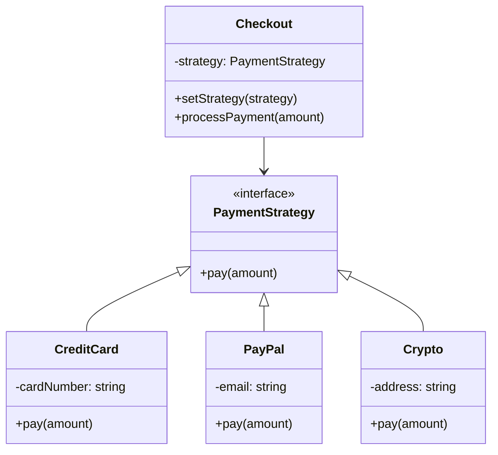

import { Tabs, TabItem } from '@astrojs/starlight/components';
import TypeScriptRepl from '../../../../../components/TypeScriptRepl.astro';
import PythonRepl from '../../../../../components/PythonRepl.astro';
import GoRepl from '../../../../../components/GoRepl.astro';
import tsCode from './strategy.ts?raw';
import pyCode from './strategy.py?raw';
import goCode from './strategy.go?raw';

## The problem

A class needs to perform some operation, but the exact algorithm depends on context: a payment system needs to support credit cards, PayPal, and crypto; a sorter might need to switch between [merge sort](../named-algorithms/merge-sort/) and radix sort based on input size; a compressor might switch between gzip and brotli based on content type. The straightforward solution is a long `if/else` or `switch` inside the class. That conditional grows with every new algorithm, every branch gets harder to test in isolation, and the class violates the open/closed principle every time you add a variant.

Strategy moves each algorithm into its own class behind a shared interface. The context class holds a reference to that interface, not a concrete implementation. Swapping the algorithm at runtime is a single assignment. Adding a new algorithm requires writing a new class, not modifying the context. Each algorithm is independently testable.

## Structure

## When to use

- A class needs to switch between multiple variants of an algorithm at runtime.
- You want to isolate algorithm implementations so each can be tested without the context.
- A family of similar classes differs only in behavior. Strategy replaces subclassing with composition.
- You are accumulating `if/else` branches that select different behaviors based on type or configuration.

## Implementation

All three show the same payment example: a `Checkout` context that holds a `PaymentStrategy` reference and delegates to whichever concrete strategy is active. The `Checkout` class takes a strategy in its constructor and exposes `setStrategy` for runtime swaps; none of the concrete strategy classes know about each other or about `Checkout`. Python uses `typing.Protocol` rather than an abstract base class, so `CreditCard` and `PayPal` satisfy the interface without inheriting from anything. Go interfaces are satisfied implicitly, which means `CreditCard`, `PayPal`, and `Crypto` implement `PaymentStrategy` without any explicit declaration. Note that a zero-value `Checkout` with a nil `strategy` field will panic on the first call in Go: always initialize with a concrete strategy.

<Tabs>
<TabItem label="TypeScript">
<TypeScriptRepl code={tsCode} id="strategy-ts" />
</TabItem>
<TabItem label="Python">
<PythonRepl code={pyCode} id="strategy-py" />
</TabItem>
<TabItem label="Go">
<GoRepl code={goCode} id="strategy-go" />
</TabItem>
</Tabs>

## Tradeoffs

| Pro | Con |
| --- | --- |
| Eliminates conditionals in the context class | One extra class per algorithm |
| Open/closed: add strategies without changing Checkout | Clients must know which strategies exist to pick one |
| Strategies are independently testable | Overkill if there are only two algorithms that rarely change |
| Works naturally with dependency injection | Stateful strategies need care around shared data |

## Gotchas

- Strategy and Factory often appear together: a factory creates the strategy, the context uses it. Keep them separate in code; they solve different problems.
- In Python, a plain function can serve as a strategy when the interface has only one method. Passing `credit_card.pay` directly is valid duck typing and avoids a wrapper class.
- Strategies that carry mutable state can cause subtle bugs when the same instance is shared across contexts. Prefer stateless strategies or create fresh instances per use.
- In Go, a zero-value `Checkout` with a nil `strategy` field panics on the first call. Initialize with a sensible default or check for nil in `ProcessPayment`.
- Avoid putting infrastructure concerns (logging, metrics) inside strategy implementations. Those cross-cutting concerns belong at the context level or in middleware.

## References

- [Design Patterns: Strategy, GoF](https://www.informit.com/store/design-patterns-elements-of-reusable-object-oriented-9780201633610), the canonical definition
- [Refactoring Guru: Strategy](https://refactoring.guru/design-patterns/strategy), diagrams and multiple-language examples
- [SourceMaking: Strategy](https://sourcemaking.com/design_patterns/strategy), additional context and known uses
- [Head First Design Patterns, Chapter 1](https://www.oreilly.com/library/view/head-first-design/0596007124/), the duck-simulator example that opens the book illustrates Strategy

## Related topics

- [Design Patterns](../), the full GoF catalog
- [Factory](../factory/), frequently used to create strategy instances
- [Observer](../observer/), another behavioral pattern for flexible, decoupled systems
- [Functional Core, Imperative Shell](../../functional-core-imperative-shell/), strategies fit cleanly into the functional core when they are pure functions over values
