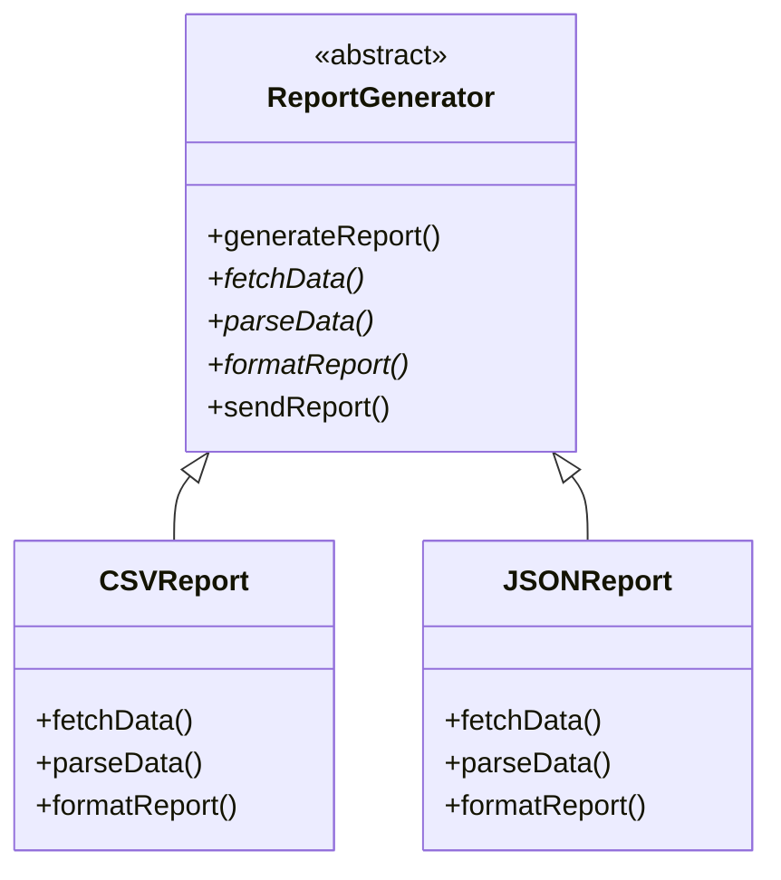

import { Tabs, TabItem } from '@astrojs/starlight/components';
import TypeScriptRepl from '../../../../../components/TypeScriptRepl.astro';
import PythonRepl from '../../../../../components/PythonRepl.astro';
import GoRepl from '../../../../../components/GoRepl.astro';
import tsCode from './template-method.ts?raw';
import pyCode from './template-method.py?raw';
import goCode from './template-method.go?raw';

## The problem

A family of related processes shares the same high-level sequence of steps, but individual steps differ by type. A report generator always fetches data, parses it, formats the output, and sends the result. A CSV report and a JSON report follow that exact sequence: only the parse and format steps are different. The naive solution duplicates the shared scaffolding in every variant, spreads the sequence logic across multiple classes, and makes it easy for one variant to accidentally skip a step or execute steps out of order.

Template Method captures the invariant sequence in a single base class method (the template method) and declares the variable steps as abstract methods. Each subclass fills in only the steps that differ. The sequence is defined once, in one place, and subclasses cannot change it.

## Structure

## When to use

- Multiple classes share the same algorithm structure but differ in one or more steps.
- You want to enforce a fixed sequence of operations and prevent subclasses from reordering steps.
- Common behavior should live in one place to avoid duplication across related classes.
- You are writing a framework and want to give callers extension points without exposing the full algorithm.

## Implementation

In TypeScript, `ReportGenerator` declares `generateReport` as the template method and marks `parseData` and `formatReport` abstract; subclasses inherit the orchestration and supply only their specific steps. Python's `abc` module enforces the abstract contract at instantiation time: a subclass with missing overrides raises `TypeError` before any code runs. Go has no inheritance, so the pattern uses a `ReportSteps` interface passed into a top-level `GenerateReport` function that owns the sequence; embedding does not provide method overriding in Go.

<Tabs>
<TabItem label="TypeScript">
<TypeScriptRepl code={tsCode} id="template-method-ts" />
</TabItem>
<TabItem label="Python">
<PythonRepl code={pyCode} id="template-method-py" />
</TabItem>
<TabItem label="Go">
<GoRepl code={goCode} id="template-method-go" />
</TabItem>
</Tabs>

## Tradeoffs

| Pro | Con |
| --- | --- |
| The sequence lives in one place; subclasses cannot reorder steps | Inheritance couples subclasses to the base class; changes ripple downward |
| New variants add a class, not a conditional | Deep hierarchies become hard to follow when hooks and overrides stack up |
| Base class can provide sensible defaults for optional steps (hooks) | Subclasses can accidentally override the template method itself if it is not marked `final` |
| Framework authors can expose extension points without exposing internal logic | The Liskov substitution principle is easy to violate if a subclass dramatically changes a step's contract |

## Gotchas

- Mark the template method `final` (Java) or leave it non-overridable by convention in Python. A subclass that overrides `generateReport` itself defeats the whole pattern.
- "Hooks" are optional steps with a no-op default in the base class. Use them for before/after callbacks that only some subclasses need. Document which methods are abstract (required) and which are hooks (optional).
- Template Method and Strategy solve similar problems with opposite tools: Template Method uses inheritance, Strategy uses composition. Prefer Strategy when the variant behavior needs to be swapped at runtime or when you want to avoid an inheritance hierarchy.
- In Go, the natural expression is a `steps` interface plus a top-level function (shown above), not embedded structs trying to simulate inheritance. Embedding does not give method overriding.
- Avoid putting too many abstract steps in one template method. If callers override six of eight steps, the base class is providing almost no value. Split the algorithm or consider a different pattern.

## References

- [Design Patterns: Template Method, GoF](https://www.informit.com/store/design-patterns-elements-of-reusable-object-oriented-9780201633610), the canonical definition
- [Refactoring Guru: Template Method](https://refactoring.guru/design-patterns/template-method), diagrams and multiple-language examples
- [SourceMaking: Template Method](https://sourcemaking.com/design_patterns/template_method), additional context and known uses

## Related topics

- [Design Patterns](../), the full GoF catalog
- [Strategy](../strategy/), achieves similar variation through composition rather than inheritance
- [Factory](../factory/), Factory Method is a specialization of Template Method
