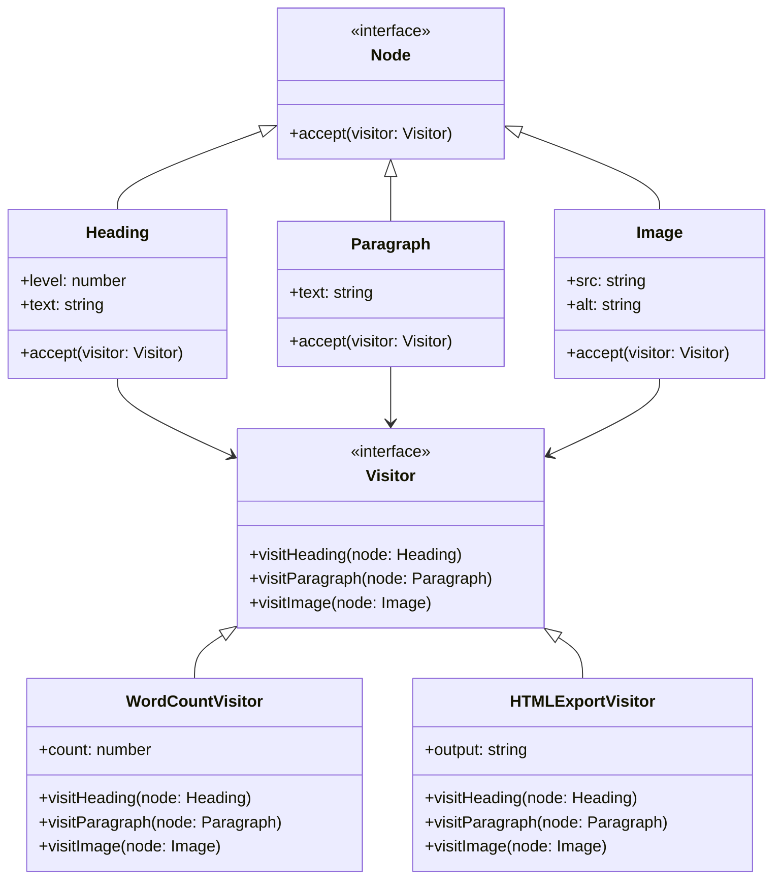

import { Tabs, TabItem } from '@astrojs/starlight/components';

## The problem

A document AST holds `Heading`, `Paragraph`, and `Image` nodes. You need to export it to HTML, count words, check accessibility, and validate links. The straightforward approach is to add an `exportHTML()` method, a `countWords()` method, and so on to each node class. Every new operation touches every node class. The node classes accumulate unrelated logic, become hard to test in isolation, and have to change for reasons that have nothing to do with their core responsibility.

Visitor turns this inside out. Each node class gets a single `accept(visitor)` method that calls back to the visitor with itself. The visitor holds all the operation logic for every element type in one place. Adding a new operation means writing a new visitor class, not modifying the node classes. The node hierarchy stays closed to modification and the operations stay open to extension.

## Structure



## When to use

- You need to perform many unrelated operations on an object structure and do not want to pollute the element classes with those operations.
- The object structure is stable (element classes rarely change) but new operations are added frequently.
- You want to gather related behavior in one class rather than scattering it across an entire hierarchy.
- You are traversing a tree or graph and need to apply different algorithms at each node type without a large `instanceof` chain.

## Implementation

<Tabs>
<TabItem label="TypeScript">

Each node calls `visitor.visitHeading(this)` (or the appropriate method) inside `accept`. The visitor receives the concrete type, so no casting is needed. Both visitors traverse the same tree without touching the node classes.

```typescript
interface Visitor {
  visitHeading(node: Heading): void;
  visitParagraph(node: Paragraph): void;
  visitImage(node: Image): void;
}

interface Node {
  accept(visitor: Visitor): void;
}

class Heading implements Node {
  constructor(public level: number, public text: string) {}
  accept(visitor: Visitor): void {
    visitor.visitHeading(this);
  }
}

class Paragraph implements Node {
  constructor(public text: string) {}
  accept(visitor: Visitor): void {
    visitor.visitParagraph(this);
  }
}

class Image implements Node {
  constructor(public src: string, public alt: string) {}
  accept(visitor: Visitor): void {
    visitor.visitImage(this);
  }
}

class WordCountVisitor implements Visitor {
  count = 0;

  visitHeading(node: Heading): void {
    this.count += node.text.split(/\s+/).filter(Boolean).length;
  }
  visitParagraph(node: Paragraph): void {
    this.count += node.text.split(/\s+/).filter(Boolean).length;
  }
  visitImage(_node: Image): void {
    // images contribute no words
  }
}

class HTMLExportVisitor implements Visitor {
  output = '';

  visitHeading(node: Heading): void {
    this.output += `<h${node.level}>${node.text}</h${node.level}>\n`;
  }
  visitParagraph(node: Paragraph): void {
    this.output += `<p>${node.text}</p>\n`;
  }
  visitImage(node: Image): void {
    this.output += `\n`;
  }
}

const tree: Node[] = [
  new Heading(1, 'Hello World'),
  new Paragraph('The quick brown fox'),
  new Image('fox.png', 'A fox'),
  new Paragraph('jumps over the lazy dog'),
];

const counter = new WordCountVisitor();
tree.forEach(node => node.accept(counter));
console.log(counter.count); // 9

const exporter = new HTMLExportVisitor();
tree.forEach(node => node.accept(exporter));
console.log(exporter.output);
// <h1>Hello World</h1>
// <p>The quick brown fox</p>
// 
// <p>jumps over the lazy dog</p>
```

</TabItem>
<TabItem label="Python">

Python does not enforce the double-dispatch ceremony the way statically typed languages do. The `accept` method works as shown, but `functools.singledispatch` is a compelling alternative: register a handler per type and call `visit(node)` directly, skipping `accept` entirely and making the visitor look more like a plain function dispatch table.

```python
from __future__ import annotations
from dataclasses import dataclass, field
from typing import Protocol


class Visitor(Protocol):
    def visit_heading(self, node: Heading) -> None: ...
    def visit_paragraph(self, node: Paragraph) -> None: ...
    def visit_image(self, node: Image) -> None: ...


@dataclass
class Heading:
    level: int
    text: str

    def accept(self, visitor: Visitor) -> None:
        visitor.visit_heading(self)


@dataclass
class Paragraph:
    text: str

    def accept(self, visitor: Visitor) -> None:
        visitor.visit_paragraph(self)


@dataclass
class Image:
    src: str
    alt: str

    def accept(self, visitor: Visitor) -> None:
        visitor.visit_image(self)


class WordCountVisitor:
    def __init__(self) -> None:
        self.count = 0

    def visit_heading(self, node: Heading) -> None:
        self.count += len(node.text.split())

    def visit_paragraph(self, node: Paragraph) -> None:
        self.count += len(node.text.split())

    def visit_image(self, node: Image) -> None:
        pass  # images contribute no words


class HTMLExportVisitor:
    def __init__(self) -> None:
        self.output = ''

    def visit_heading(self, node: Heading) -> None:
        self.output += f'<h{node.level}>{node.text}</h{node.level}>\n'

    def visit_paragraph(self, node: Paragraph) -> None:
        self.output += f'<p>{node.text}</p>\n'

    def visit_image(self, node: Image) -> None:
        self.output += f'\n'


tree = [
    Heading(1, 'Hello World'),
    Paragraph('The quick brown fox'),
    Image('fox.png', 'A fox'),
    Paragraph('jumps over the lazy dog'),
]

counter = WordCountVisitor()
for node in tree:
    node.accept(counter)
print(counter.count)  # 9

exporter = HTMLExportVisitor()
for node in tree:
    node.accept(exporter)
print(exporter.output)
# <h1>Hello World</h1>
# <p>The quick brown fox</p>
# 
# <p>jumps over the lazy dog</p>
```

</TabItem>
<TabItem label="Go">

Go interfaces are satisfied implicitly. Each node's `Accept` method calls back to the visitor with the concrete receiver, giving the visitor full type information without a type switch. Adding a new visitor requires no changes to the node structs.

```go
package main

import (
	"fmt"
	"strings"
)

type Visitor interface {
	VisitHeading(n *Heading)
	VisitParagraph(n *Paragraph)
	VisitImage(n *Image)
}

type Node interface {
	Accept(v Visitor)
}

type Heading struct {
	Level int
	Text  string
}

func (h *Heading) Accept(v Visitor) { v.VisitHeading(h) }

type Paragraph struct{ Text string }

func (p *Paragraph) Accept(v Visitor) { v.VisitParagraph(p) }

type Image struct {
	Src string
	Alt string
}

func (i *Image) Accept(v Visitor) { v.VisitImage(i) }

// WordCountVisitor -----------------------------------------------------------

type WordCountVisitor struct{ Count int }

func (w *WordCountVisitor) VisitHeading(n *Heading) {
	w.Count += len(strings.Fields(n.Text))
}
func (w *WordCountVisitor) VisitParagraph(n *Paragraph) {
	w.Count += len(strings.Fields(n.Text))
}
func (w *WordCountVisitor) VisitImage(_ *Image) {}

// HTMLExportVisitor ----------------------------------------------------------

type HTMLExportVisitor struct{ Output strings.Builder }

func (h *HTMLExportVisitor) VisitHeading(n *Heading) {
	fmt.Fprintf(&h.Output, "<h%d>%s</h%d>\n", n.Level, n.Text, n.Level)
}
func (h *HTMLExportVisitor) VisitParagraph(n *Paragraph) {
	fmt.Fprintf(&h.Output, "<p>%s</p>\n", n.Text)
}
func (h *HTMLExportVisitor) VisitImage(n *Image) {
	fmt.Fprintf(&h.Output, ``+"\n", n.Src, n.Alt)
}

func main() {
	tree := []Node{
		&Heading{Level: 1, Text: "Hello World"},
		&Paragraph{Text: "The quick brown fox"},
		&Image{Src: "fox.png", Alt: "A fox"},
		&Paragraph{Text: "jumps over the lazy dog"},
	}

	counter := &WordCountVisitor{}
	for _, node := range tree {
		node.Accept(counter)
	}
	fmt.Println(counter.Count) // 9

	exporter := &HTMLExportVisitor{}
	for _, node := range tree {
		node.Accept(exporter)
	}
	fmt.Print(exporter.Output.String())
	// <h1>Hello World</h1>
	// <p>The quick brown fox</p>
	// 
	// <p>jumps over the lazy dog</p>
}
```

</TabItem>
</Tabs>

## Tradeoffs

| Pro | Con |
| --- | --- |
| New operations require a new class only, not changes to element classes | Adding a new element type requires updating every existing visitor |
| All logic for one operation lives in one class, not scattered across the hierarchy | `accept` boilerplate on every element class can feel ceremonial |
| Visitors can accumulate state across the entire traversal | Breaks encapsulation: elements must expose enough data for every possible visitor |
| Works naturally with Composite trees for recursive traversal | Double dispatch is non-obvious and surprises developers unfamiliar with the pattern |
| Operations are independently testable without constructing the full element hierarchy | Visitor and element hierarchies must stay in sync; a forgotten `visit` method is a silent bug in dynamic languages |

## Gotchas

- The classic pain point: when you add a new element type, every visitor must add a corresponding `visit` method. Statically typed languages catch the omission at compile time. Python and JavaScript do not, so a missing method causes a runtime `AttributeError` or `TypeError` deep inside a traversal.
- Double dispatch is the mechanism, not the goal. `accept` calls the visitor, the visitor calls the right method for the concrete type. If you flatten this to `visitor.visit(node)` with an `isinstance` chain inside, you have lost the point and added fragility.
- Visitors that accumulate state (like `WordCountVisitor`) are not thread-safe by default. Create a fresh visitor per traversal or guard shared state explicitly.
- Visitor pairs poorly with a volatile element hierarchy. If element classes change every sprint, the maintenance cost of updating every visitor outweighs the benefit. Prefer Strategy or simple method dispatch when the hierarchy is young.
- In Python, `functools.singledispatch` is a viable alternative to the `accept` protocol: register a handler for each concrete type and call `visit(node)` without needing `accept` at all. It is cleaner for a single module but loses the explicit interface contract that `Protocol` or an ABC provides.

## References

- [Design Patterns: Visitor, GoF](https://www.informit.com/store/design-patterns-elements-of-reusable-object-oriented-9780201633610), the canonical definition
- [Refactoring Guru: Visitor](https://refactoring.guru/design-patterns/visitor), diagrams and multiple-language examples
- [SourceMaking: Visitor](https://sourcemaking.com/design_patterns/visitor), additional context and known uses

## Related topics

- [Design Patterns](../), the full GoF catalog
- [Composite](../composite/), Visitor frequently traverses Composite trees
- [Iterator](../iterator/), often used together with Visitor to traverse collections
- [Strategy](../strategy/), also externalizes behavior but modifies the algorithm rather than the operation on elements
