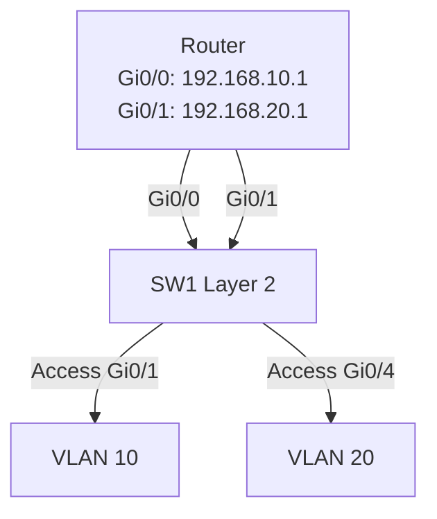
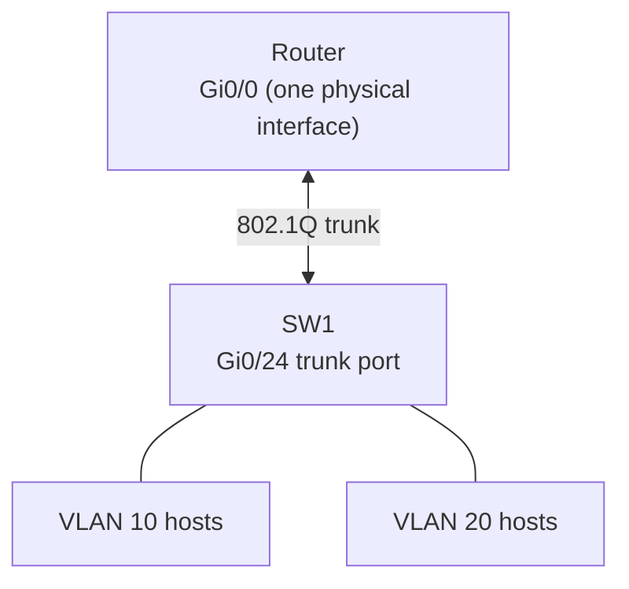
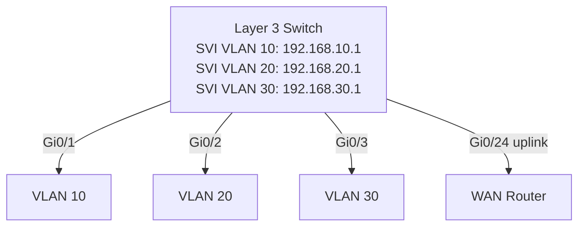
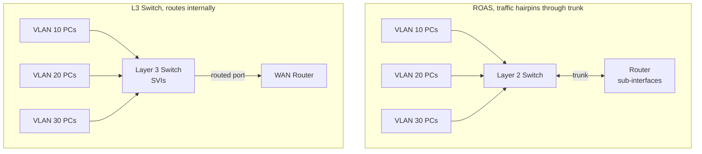

VLANs isolate broadcast domains, which is exactly what you want for segmentation. But isolation is a two-edged sword: a host in VLAN 10 cannot reach a host in VLAN 20 without crossing Layer 3. That crossing requires a router or a Layer 3 switch. This part covers the three ways to make it happen and why two of them belong only in labs and legacy closets.

## Why it matters

Inter-VLAN routing is how an enterprise LAN actually functions. Sales in VLAN 10 needs to reach the file server in VLAN 30. Finance in VLAN 20 needs DHCP from a server in VLAN 40. Every one of those flows goes through whatever inter-VLAN routing mechanism you have deployed. Get this wrong and segments are silently isolated or, worse, traffic is routed through an unexpected path.

## The problem, stated precisely

Layer 2 switches forward frames based on MAC addresses within a VLAN. They have no concept of IP routing. When Host A (192.168.10.10, VLAN 10) wants to reach Host B (192.168.20.10, VLAN 20):

1. Host A sees that 192.168.20.10 is not in its subnet.
2. Host A sends the packet to its default gateway.
3. The default gateway must be a Layer 3 device with interfaces (or sub-interfaces) in both VLAN 10 and VLAN 20.
4. The router receives the packet, looks up the destination in its routing table, and forwards it out the interface associated with VLAN 20.
5. The switch delivers the frame to Host B within VLAN 20.

The question is: how does the router (or Layer 3 switch) connect to multiple VLANs?

## Approach 1: Legacy per-interface routing

One physical router interface per VLAN. The router has a dedicated port patched to a dedicated switch port for each VLAN.



Configuration on the router:

```text
R1(config)# interface GigabitEthernet0/0
R1(config-if)# ip address 192.168.10.1 255.255.255.0
R1(config-if)# no shutdown

R1(config)# interface GigabitEthernet0/1
R1(config-if)# ip address 192.168.20.1 255.255.255.0
R1(config-if)# no shutdown
```

This works but does not scale. A router with 4 VLANs needs 4 physical interfaces. A network with 50 VLANs is impossible. This approach is legacy and appears on the CCNA primarily as a foil to understand why the next two approaches exist.

## Approach 2: Router-on-a-stick (ROAS)

One physical link carries all VLANs as a trunk between the router and switch. The router uses logical sub-interfaces, one per VLAN. Each sub-interface has its own IP address and processes frames tagged with a specific VLAN ID.



The physical interface has no IP address. Sub-interfaces do:

```text
R1(config)# interface GigabitEthernet0/0
R1(config-if)# no shutdown
R1(config-if)# no ip address
R1(config-if)# exit

R1(config)# interface GigabitEthernet0/0.10
R1(config-subif)# encapsulation dot1Q 10
R1(config-subif)# ip address 192.168.10.1 255.255.255.0
R1(config-subif)# exit

R1(config)# interface GigabitEthernet0/0.20
R1(config-subif)# encapsulation dot1Q 20
R1(config-subif)# ip address 192.168.20.1 255.255.255.0
R1(config-subif)# exit

R1(config)# interface GigabitEthernet0/0.30
R1(config-subif)# encapsulation dot1Q 30
R1(config-subif)# ip address 192.168.30.1 255.255.255.0
R1(config-subif)# exit
```

The switch side needs a trunk port:

```text
SW1(config)# interface GigabitEthernet0/24
SW1(config-if)# switchport mode trunk
SW1(config-if)# switchport trunk allowed vlan 10,20,30
SW1(config-if)# switchport trunk native vlan 99
```

For the native VLAN on the router side, add the `native` keyword:

```text
R1(config)# interface GigabitEthernet0/0.99
R1(config-subif)# encapsulation dot1Q 99 native
R1(config-subif)# ip address 192.168.99.1 255.255.255.0
```

ROAS scales better than the legacy approach. You can support dozens of VLANs on one physical link. But all inter-VLAN traffic flows through that single link twice: in from the source VLAN, back out to the destination VLAN. The trunk link is a bottleneck and a single point of failure.

## Approach 3: Layer 3 switch with SVIs

A Layer 3 switch runs routing in hardware using dedicated ASICs. SVIs (Switched Virtual Interfaces) are virtual Layer 3 interfaces, one per VLAN, that live entirely inside the switch. Traffic between VLANs never leaves the switch chassis.



Configuration:

```text
SW1(config)# ip routing

SW1(config)# interface vlan 10
SW1(config-if)# ip address 192.168.10.1 255.255.255.0
SW1(config-if)# no shutdown
SW1(config-if)# exit

SW1(config)# interface vlan 20
SW1(config-if)# ip address 192.168.20.1 255.255.255.0
SW1(config-if)# no shutdown
SW1(config-if)# exit

SW1(config)# interface vlan 30
SW1(config-if)# ip address 192.168.30.1 255.255.255.0
SW1(config-if)# no shutdown
SW1(config-if)# exit
```

`ip routing` is the critical command. Without it, the SVIs exist but the switch does not route between them. This is the single most common mistake when setting up Layer 3 switching.

An SVI comes up only when at least one port in that VLAN is active (up/up). If no ports are in VLAN 10 or all of them are down, the VLAN 10 SVI stays down regardless of configuration.

### Routed ports

A Layer 3 switch can also convert individual physical ports into routed Layer 3 ports using `no switchport`. This is used for uplinks to routers or WAN devices:

```text
SW1(config)# interface GigabitEthernet0/24
SW1(config-if)# no switchport
SW1(config-if)# ip address 10.0.0.2 255.255.255.252
SW1(config-if)# no shutdown
```

A routed port behaves like a router interface: it has an IP address, participates in routing protocols, and does not belong to any VLAN.

## ROAS vs L3 switch topology diagrams



## Comparison table

| Criterion | Legacy (per-interface) | Router-on-a-stick | Layer 3 switch (SVIs) |
|---|---|---|---|
| [Scalability](../../system-design/scalability/) | Poor (1 interface per VLAN) | Moderate (1 link, many sub-ifs) | Excellent (hundreds of VLANs) |
| Cost | High (router ports are expensive) | Low (one router port) | Moderate (L3 switch costs more than L2) |
| Performance | Good (dedicated links) | Poor at scale (trunk bottleneck) | Excellent (hardware ASIC routing) |
| Complexity | Low | Low | Moderate (ip routing, SVI up conditions) |
| Single point of failure | Per-VLAN link | Trunk link and router | Switch chassis |
| Used in production | Rarely (legacy) | Small sites, labs | Enterprise standard |

## Verification

```text
SW1# show ip route
Codes: C - connected, S - static, R - RIP, ...
       O - OSPF, IA - OSPF inter area

Gateway of last resort is 10.0.0.1 to network 0.0.0.0

C     192.168.10.0/24 is directly connected, Vlan10
C     192.168.20.0/24 is directly connected, Vlan20
C     192.168.30.0/24 is directly connected, Vlan30
C     10.0.0.0/30 is directly connected, GigabitEthernet0/24
S*    0.0.0.0/0 [1/0] via 10.0.0.1
```

```text
SW1# show interfaces vlan 10
Vlan10 is up, line protocol is up
  Hardware is EtherSVI, address is 0012.3456.7890
  Internet address is 192.168.10.1/24
  MTU 1500 bytes, BW 1000000 Kbit/sec, DLY 10 usec,
```

If `show interfaces vlan 10` shows `Vlan10 is up, line protocol is down`, no ports in VLAN 10 are active.

## Gotchas and traps

**Forgetting `ip routing`.** SVIs will be configured and up, but the switch will not route between them. Hosts will be able to ping the SVI gateway address but cannot reach other VLANs. `show ip route` will show only connected routes for each SVI with no routing between them. Adding `ip routing` fixes it immediately without a reboot.

**ROAS trunk bottleneck.** All inter-VLAN traffic traverses the single physical link between the switch and the router, in both directions. A 1 Gbps trunk link shared among 20 VLANs with heavy cross-VLAN traffic will saturate. Monitor with `show interfaces GigabitEthernet0/0` and watch the load values.

**SVI stays down with no active ports.** Create the VLAN, assign a port to it, bring the port up. Only then will the SVI come up. This trips up anyone who creates SVIs on a fresh switch without connecting end devices.

**Sub-interface numbering convention.** Sub-interface numbers (the `.10` in `GigabitEthernet0/0.10`) do not have to match VLAN IDs -- the `encapsulation dot1Q 10` command controls which VLAN the sub-interface handles. But matching them is universal convention and deviating from it causes confusion during troubleshooting.

**Native VLAN on ROAS.** The native VLAN sub-interface uses the `native` keyword in the `encapsulation dot1Q` command. If you omit it, frames tagged with the native VLAN ID will be processed correctly, but untagged native VLAN frames from the switch will land on the physical interface (which has no IP) and be dropped.

## References


## Related topics

- [Part 7: VLANs](../part-07-vlans/)
- [Part 13: Static Routing](../part-13-static-routing/)
- [Part 14: OSPF](../part-14-ospf/)
