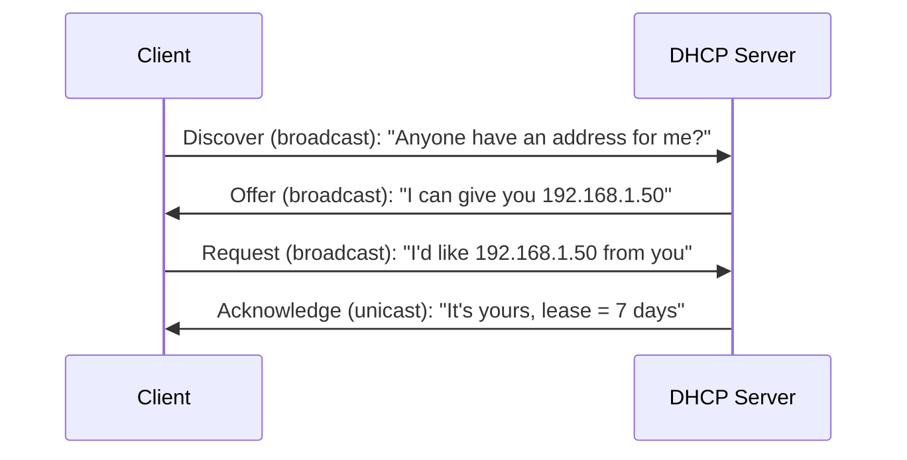
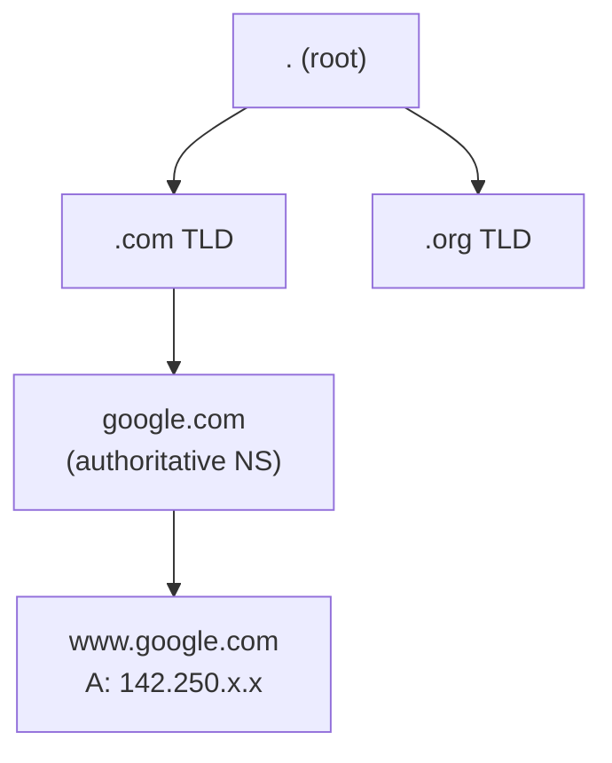
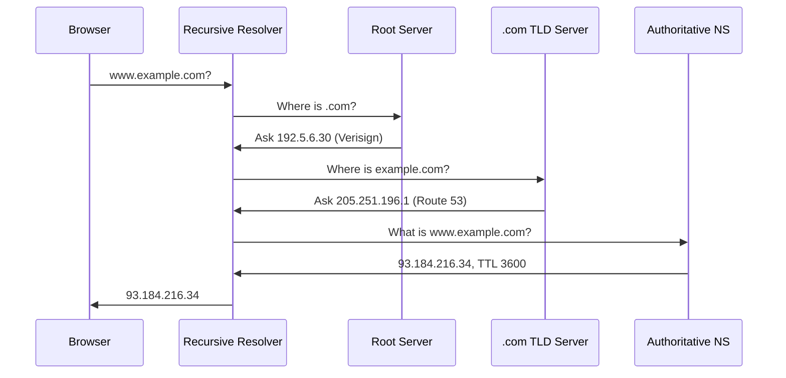

Every device on a network needs an IP address before it can communicate. Two protocols handle this automatically in nearly every network: DHCP assigns addresses without manual configuration, and DNS translates human-readable names into the IP addresses those packets need. Together they are the reason you can connect a laptop to a new network and browse the web within seconds.

## Why it matters

Without DHCP, every device on your network would need a statically configured IP address, subnet mask, default gateway, and DNS server. In a home network with ten devices that is inconvenient. In an enterprise with thousands of endpoints it is unmanageable. Without DNS, users would need to type raw IP addresses to reach every service. Both protocols solve real operational pain and are tested heavily on the CCNA exam.

## DHCP: Dynamic Host Configuration Protocol

DHCP automates the assignment of IP addresses and network parameters (subnet mask, default gateway, DNS server, lease time) to clients on a network.

### The DORA process

Client and server exchange four messages to complete address assignment:



Key details:

- **Discover**: the client has no IP yet, so it broadcasts to 255.255.255.255 from 0.0.0.0.
- **Offer**: the server unicasts or broadcasts an available address back to the client.
- **Request**: the client broadcasts (not unicasts) to notify all DHCP servers that it accepted one particular offer. Other servers see this and retract their offers.
- **Acknowledge**: the server confirms the lease. The client now owns the address for the lease duration.

### DHCP lease lifecycle

A lease is not permanent. The client holds the address for the configured lease time:

- At **50%** of the lease time, the client sends a unicast Renew request to the original server.
- At **87.5%** of the lease time, if renewal failed, the client broadcasts to any server.
- If the lease expires without renewal, the client releases the address and restarts DORA.

### Configuring a DHCP server on Cisco IOS

```text
R1(config)# ip dhcp excluded-address 192.168.1.1 192.168.1.20
R1(config)# ip dhcp pool LAN_POOL
R1(dhcp-config)# network 192.168.1.0 255.255.255.0
R1(dhcp-config)# default-router 192.168.1.1
R1(dhcp-config)# dns-server 8.8.8.8 8.8.4.4
R1(dhcp-config)# lease 7
```

Always configure `ip dhcp excluded-address` before creating the pool. Excluded addresses (routers, servers, printers with static IPs) are skipped when the server assigns leases. The `lease 7` command sets a 7-day lease period.

### DHCP relay agent (ip helper-address)

DHCP Discover is a broadcast and does not cross router boundaries by default. When the DHCP server lives on a different subnet than the clients, you need a relay agent.

```text
R1(config)# interface GigabitEthernet0/0
R1(config-if)# ip helper-address 10.0.0.10
```

This command tells the router to listen for DHCP broadcasts arriving on Gi0/0 and forward them as unicast packets to the DHCP server at 10.0.0.10. The server sees the client's original subnet in the `giaddr` field and assigns an address from the correct pool.

### DHCPv6

IPv6 has two addressing modes:

| Mode | Who assigns address | Who assigns DNS/options |
|---|---|---|
| Stateless (SLAAC) | Client generates via EUI-64 | DHCPv6 server (stateless) |
| Stateful DHCPv6 | DHCPv6 server | DHCPv6 server |

In stateless mode, the client uses Router Advertisement flags (M=0, O=1) to self-assign its address but still queries a DHCPv6 server for DNS and other options. In stateful mode (M=1), the server assigns the full address as in IPv4 DHCP.

### Verifying DHCP on Cisco IOS

```text
R1# show ip dhcp binding
Bindings from all pools not associated with VRF:
IP address      Client-ID               Lease expiration
192.168.1.21    0100.1c6f.65a2.b4       May 20 2026 03:41 PM

R1# show ip dhcp pool
Pool LAN_POOL :
 Utilization mark (high/low)    : 100 / 0
 Subnet size (first/next)       : 0 / 0
 Total addresses                : 254
 Leased addresses               : 1
 Excluded addresses             : 20
 Pending event                  : none

R1# show ip dhcp conflict
IP address      Detection method   Detection time
(none if clean)
```

`show ip dhcp conflict` lists addresses the server detected were already in use (via ping or ARP before assigning). If there are conflicts, clear them with `clear ip dhcp conflict *` after fixing the duplicate.

---

## DNS: Domain Name System

DNS translates hostnames (like `google.com`) into IP addresses. It is a globally distributed, hierarchical database.

### DNS hierarchy



The hierarchy from top to bottom:

1. **Root zone** (`.`): 13 root server clusters worldwide; know where TLD servers live.
2. **Top-level domains (TLDs)**: `.com`, `.org`, `.net`, country codes like `.uk`.
3. **Authoritative nameservers**: hold the actual records for a domain; managed by the domain owner.
4. **Zones**: a contiguous portion of the DNS namespace delegated to one set of nameservers.

### DNS record types

| Record | Purpose | Example |
|---|---|---|
| A | Maps hostname to IPv4 address | `www.example.com → 93.184.216.34` |
| AAAA | Maps hostname to IPv6 address | `www.example.com → 2606:2800::1` |
| CNAME | Alias from one name to another | `blog.example.com → example.com` |
| MX | Mail server for a domain | `example.com → mail.example.com` |
| NS | Nameserver for a domain | `example.com → ns1.example.com` |
| PTR | Reverse lookup (IP to hostname) | `34.216.184.93.in-addr.arpa → www.example.com` |
| TXT | Arbitrary text; used for SPF, DKIM, site verification | `"v=spf1 include:_spf.google.com ~all"` |

### DNS resolution process



The recursive resolver does the heavy lifting. End clients only talk to their configured resolver.

### DNS caching and TTL

Every DNS record has a TTL (Time to Live) in seconds. Resolvers cache records for the TTL duration. This reduces upstream query volume but delays propagation of changes.

Operational rule: before changing an IP address for a hostname, lower the TTL to 60-300 seconds at least one full TTL period before the change. This ensures the old TTL expires quickly after the switch. After the change is stable, restore a longer TTL (3600 or higher).

### DNS troubleshooting tools

These run on a host OS (not Cisco IOS):

```bash
# Query A record for example.com
nslookup example.com

# Specify a nameserver explicitly
nslookup example.com 8.8.8.8

# dig: more detailed output, shows TTL and authoritative flag
dig www.example.com

# dig for MX records
dig example.com MX

# Reverse DNS lookup
dig -x 93.184.216.34
```

`dig` is preferred in professional environments because it shows the full DNS response including flags, TTL, and which nameserver answered.

---

## Gotchas

**Rogue DHCP servers**: without DHCP snooping, any device connected to the network can respond to DHCP Discovers. If a rogue server answers first, it assigns itself as the default gateway and becomes a man-in-the-middle. DHCP snooping (covered in Part 19) prevents this by dropping server messages on untrusted switch ports.

**DNS TTL propagation lag**: when you change a DNS record, resolvers that already cached the old record will continue returning the old IP until the TTL expires. Reducing TTL before planned changes is a discipline that prevents prolonged outages during migrations.

**DHCP relay missing**: when a DHCP server is on a separate subnet and clients cannot get addresses, the most common cause is a missing or misconfigured `ip helper-address`. Confirm it is on the client-facing interface, not the server-facing one.

**Pool exhaustion**: a pool with 254 addresses can be exhausted by stale leases or by devices that do not release addresses cleanly. Monitor with `show ip dhcp pool` and adjust lease times or pool size as needed.

---

## References

- [Cisco IOS DHCP Configuration Guide](https://www.cisco.com/c/en/us/td/docs/ios-xml/ios/ipaddr_dhcp/configuration/xe-16/dhcp-xe-16-book.html)
- [RFC 2131: Dynamic Host Configuration Protocol](https://datatracker.ietf.org/doc/html/rfc2131)
- [RFC 1034: Domain Names -- Concepts and Facilities](https://datatracker.ietf.org/doc/html/rfc1034)
- [Cisco DNS Configuration Reference](https://www.cisco.com/c/en/us/support/docs/ip/domain-name-system-dns/12188-net-config.html)

## Related topics

- [Part 16: IPv6 Addressing and Routing](./part-16-ipv6-addressing-and-routing)
- [Part 18: Access Control Lists](./part-18-access-control-lists)
- [Part 19: Network Security Fundamentals](./part-19-network-security-fundamentals)
