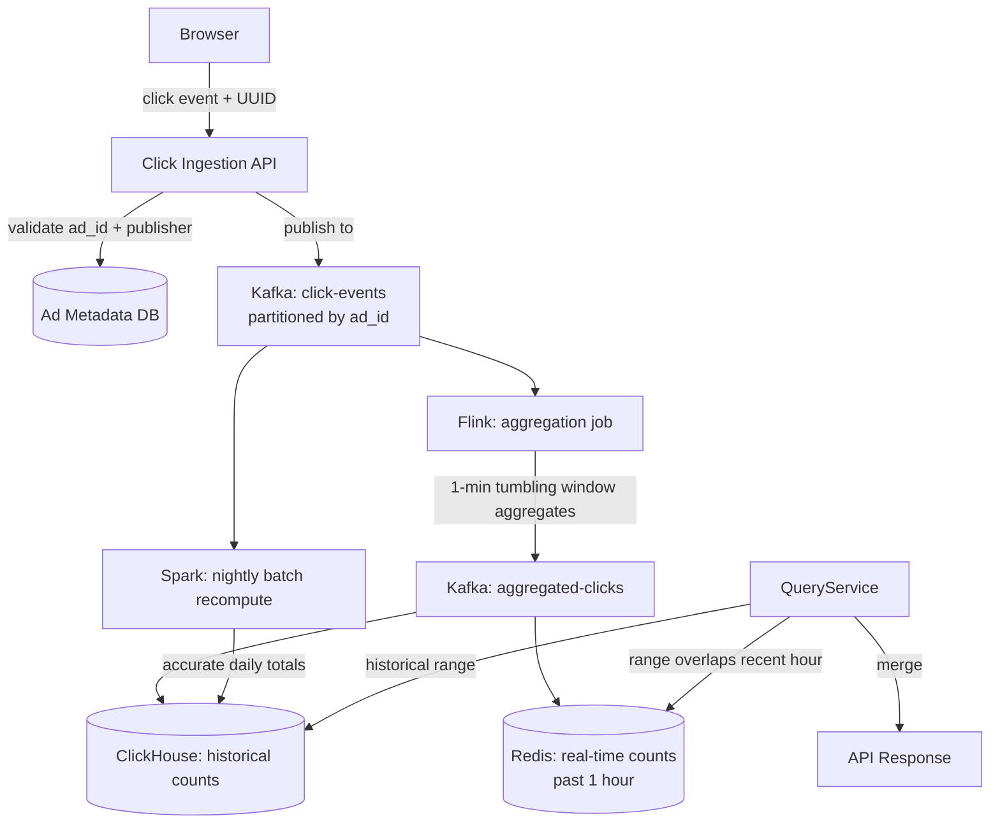

The ad click aggregator looks like a simple counter at first glance: a click arrives, increment a number. The depth appears when you consider that clicks affect billing. If the same click is counted twice, an advertiser is charged twice. If a click is lost, revenue is forfeited. The Kafka at-least-once delivery guarantee means duplicate events are a certainty, not a possibility. Idempotency becomes the first thing to design, not an afterthought.

## Series concepts

### Introduced here

- **Time-windowed aggregation**: clicks are counted per ad per time window (minute, hour, day) and per dimension (geography, device, publisher). This requires event-time semantics: a click that arrives late (network delay, client buffer) must be assigned to the window it belongs to, not the window it arrived in.
- **Idempotent click counting**: Kafka at-least-once delivery means the same click event can arrive twice. A client-side UUID per click, checked against a short-lived Redis set keyed by `(ad_id, minute_bucket)`, filters duplicates before aggregation.
- **Lambda architecture**: two parallel paths for the same data. The speed layer (Redis) maintains real-time counts for the past hour, served with sub-millisecond latency. The batch layer (Spark job) recomputes accurate historical counts nightly. The query layer merges both for any time range.
- **Count-Min Sketch for approximate counting**: a probabilistic data structure that answers "how many times has this ad been clicked?" in O(1) space per query with a bounded overcount error (~1-2%). Useful for real-time dashboards where approximate counts are acceptable and memory is constrained.
- **Write amplification**: one click fans out to multiple aggregation dimensions. A single click on ad 12345 from a user in Germany on a mobile device generates writes to: `clicks:ad:12345:minute`, `clicks:ad:12345:hour`, `clicks:ad:12345:day`, `clicks:ad:12345:country:DE`, `clicks:ad:12345:device:mobile`. Design for this fan-out from the start.

### Carried forward from prior entries

- **Kafka click event stream**: same async pipeline from [URL Shortener](../url-shortener/). The Bitly analytics pipeline publishes one event per redirect; here each click is a higher-stakes event that must be counted exactly once across multiple dimensions.
- **Consistent hashing for partitioning**: Kafka partitions clicks by `ad_id` so all events for a given ad flow to the same consumer partition. Same sharding concept from [URL Shortener](../url-shortener/) and [Web Crawler](../web-crawler/).
- **Redis for real-time counts**: same write cache pattern, now used for accumulation rather than simple key-value lookup. Redis INCR is atomic and O(1).
- **Snowflake ID generation**: click event IDs use the same distributed ID service for deduplication keys.

## Clarifying questions

Ask these before drawing anything:

- **Billing implications**: are click counts used directly for advertiser billing, or is billing a separate reconciliation process?
- **Query patterns**: do advertisers query in real time, or is a 1-hour delay acceptable?
- **Aggregation dimensions**: by time only, or also by geography, device, publisher?
- **Click validation**: fraud detection? Bot filtering? Out-of-scope or in-scope?
- **Retention**: how long must raw click events be retained?

What the answers reveal:
- Direct billing means exactly-once semantics are required end-to-end, not just best-effort
- Real-time queries drive the speed layer requirement; batch-only is simpler but insufficient
- Each additional aggregation dimension multiplies the write amplification factor
- Fraud detection is a common follow-up scope expansion that adds a classification step before the counting pipeline
- 90-day raw retention at 5B clicks/day is ~90 TB; compression brings this to ~30-45 TB

For this walkthrough: 5B clicks/day, direct billing use, real-time queries required for past 1 hour, aggregation by time, country, and device, no fraud detection in scope, 90-day raw retention.

## Estimation

```
Click ingestion QPS:
  5B clicks/day / 86,400 = 57,870 click QPS

Write amplification:
  Each click fans out to 5 aggregation dimensions:
    ad+minute, ad+hour, ad+day, ad+country, ad+device
  57,870 * 5 = 289,350 aggregation writes/sec

Kafka throughput:
  57,870 events/sec * 200 bytes/event = 11.6 MB/sec
  Kafka handles this comfortably on a 3-node cluster

Deduplication window:
  Need to detect duplicates within a 1-hour window
  57,870 click/sec * 3,600 sec = 208M unique click IDs per hour
  Redis set per (ad_id, minute_bucket): ~10K entries/bucket avg

Storage:
  Raw events: 5B * 200 bytes = 1 TB/day
  90-day retention: 90 TB raw (compressed ~30 TB)
  Aggregated counts in ClickHouse: much smaller (summary rows)
```

**Capacity driver**: the write amplification (289K aggregation writes/sec) is the primary scaling concern, not raw click ingestion. The deduplication layer must be fast (Redis) and bounded (TTL on dedup keys to prevent unbounded growth).

## High-level design



API endpoints:

```
POST /clicks
  body:    { ad_id, publisher_id, event_id (UUID), user_agent, geo_ip, timestamp }
  returns: { status: "accepted" }

GET /ads/{ad_id}/clicks
  params:  start_time, end_time, granularity (minute|hour|day), dimensions (country,device)
  returns: { ad_id, time_series: [{ timestamp, count, breakdown: {...} }] }

GET /ads/{ad_id}/clicks/realtime
  returns: { ad_id, last_minute, last_hour, last_day }
```

## Deep dive: idempotent click ingestion

Each click event carries a client-generated UUID. The deduplication check happens at the Flink consumer, not at the ingestion API (to keep the API on the fast path):

```python
import redis
import json
from datetime import datetime, timezone

r = redis.Redis(host='redis-dedup', decode_responses=True)

def process_click_event(event: dict) -> bool:
    """Returns True if this is a new (non-duplicate) click."""
    ad_id = event["ad_id"]
    event_id = event["event_id"]  # client-generated UUID
    event_ts = datetime.fromisoformat(event["timestamp"])

    # Bucket by minute for dedup key scoping
    minute_bucket = event_ts.strftime("%Y%m%d%H%M")
    dedup_key = f"dedup:{ad_id}:{minute_bucket}"

    # SADD returns 1 if element was added (new), 0 if already present (duplicate)
    is_new = r.sadd(dedup_key, event_id)

    if is_new:
        # Set TTL on first add to bound memory usage
        r.expire(dedup_key, 3600)  # 1 hour: enough to catch late-arriving duplicates

    return bool(is_new)

def handle_click(event: dict):
    if not process_click_event(event):
        return  # duplicate, skip

    # Fan out to aggregation dimensions
    fanout_to_aggregations(event)
```

```typescript
import { createClient } from 'redis';

const client = createClient({ url: 'redis://redis-dedup:6379' });
await client.connect();

interface ClickEvent {
  ad_id: string;
  event_id: string; // client-generated UUID
  timestamp: string;
}

async function processClickEvent(event: ClickEvent): Promise<boolean> {
  const eventTs = new Date(event.timestamp);
  // Bucket by minute for dedup key scoping
  const minuteBucket = eventTs.toISOString().slice(0, 16).replace(/[-T:]/g, '');
  const dedupKey = `dedup:${event.ad_id}:${minuteBucket}`;

  // sAdd returns the number of elements added (1 = new, 0 = duplicate)
  const added = await client.sAdd(dedupKey, event.event_id);

  if (added > 0) {
    // Set TTL on first add to bound memory usage
    await client.expire(dedupKey, 3600); // 1 hour: enough to catch late-arriving duplicates
  }

  return added > 0;
}

async function handleClick(event: ClickEvent): Promise<void> {
  const isNew = await processClickEvent(event);
  if (!isNew) {
    return; // duplicate, skip
  }

  // Fan out to aggregation dimensions
  await fanoutToAggregations(event);
}
```

```go
package main

import (
	"context"
	"fmt"
	"time"

	"github.com/redis/go-redis/v9"
)

var rdb = redis.NewClient(&redis.Options{
	Addr: "redis-dedup:6379",
})

type ClickEvent struct {
	AdID      string `json:"ad_id"`
	EventID   string `json:"event_id"` // client-generated UUID
	Timestamp string `json:"timestamp"`
}

func processClickEvent(ctx context.Context, event ClickEvent) (bool, error) {
	eventTs, err := time.Parse(time.RFC3339, event.Timestamp)
	if err != nil {
		return false, err
	}

	// Bucket by minute for dedup key scoping
	minuteBucket := eventTs.UTC().Format("200601021504")
	dedupKey := fmt.Sprintf("dedup:%s:%s", event.AdID, minuteBucket)

	// SAdd returns the number of elements added (1 = new, 0 = duplicate)
	added, err := rdb.SAdd(ctx, dedupKey, event.EventID).Result()
	if err != nil {
		return false, err
	}

	if added > 0 {
		// Set TTL on first add to bound memory usage
		rdb.Expire(ctx, dedupKey, time.Hour) // 1 hour: enough to catch late-arriving duplicates
	}

	return added > 0, nil
}

func handleClick(ctx context.Context, event ClickEvent) error {
	isNew, err := processClickEvent(ctx, event)
	if err != nil {
		return err
	}
	if !isNew {
		return nil // duplicate, skip
	}

	// Fan out to aggregation dimensions
	return fanoutToAggregations(ctx, event)
}
```

Why client-side UUID rather than server-assigned ID: network retries. If the client's POST to `/clicks` times out, it retries. Without a client-side UUID, the server sees two distinct requests and counts both. With the UUID, the deduplication set catches the retry even if it arrives minutes later.

The 1-hour TTL on the dedup set means duplicates arriving more than one hour late will slip through. This is an explicit tradeoff: duplicate events that arrive within 1 hour are filtered (covers 99.9%+ of network retries), and late-arriving duplicates beyond 1 hour are corrected by the nightly Spark batch job which re-reads the raw Kafka log and recomputes exact counts.

## Deep dive: Flink stream aggregation

The Flink job aggregates clicks into 1-minute tumbling windows and fans out to each aggregation dimension:

```python
from pyflink.datastream import StreamExecutionEnvironment
from pyflink.datastream.window import TumblingEventTimeWindows
from pyflink.common.watermark_strategy import WatermarkStrategy
from datetime import timedelta

env = StreamExecutionEnvironment.get_execution_environment()

# Allow events up to 5 minutes late (handles clock skew and buffered mobile clicks)
watermark_strategy = (WatermarkStrategy
    .for_bounded_out_of_orderness(timedelta(minutes=5))
    .with_timestamp_assigner(lambda event, _: event["timestamp_ms"]))

click_stream = (env
    .add_source(kafka_source("click-events"))
    .assign_timestamps_and_watermarks(watermark_strategy))

# Aggregate by ad_id + 1-minute tumbling window
def aggregate_by_ad(stream):
    return (stream
        .filter(lambda e: e["is_new"])  # deduplication already applied upstream
        .map(lambda e: ((e["ad_id"],), 1))
        .key_by(lambda x: x[0])
        .window(TumblingEventTimeWindows.of(timedelta(minutes=1)))
        .sum(1))

# Aggregate by ad_id + country + 1-minute window
def aggregate_by_ad_country(stream):
    return (stream
        .filter(lambda e: e["is_new"])
        .map(lambda e: ((e["ad_id"], e["country"]), 1))
        .key_by(lambda x: x[0])
        .window(TumblingEventTimeWindows.of(timedelta(minutes=1)))
        .sum(1))

# Emit all aggregations to the aggregated-clicks Kafka topic
aggregated = aggregate_by_ad(click_stream).union(
    aggregate_by_ad_country(click_stream),
    aggregate_by_ad_device(click_stream),
)
aggregated.add_sink(kafka_sink("aggregated-clicks"))
```

```typescript
import { Kafka } from 'kafkajs';

// Note: production Flink-equivalent stream processing in Node.js typically uses
// a framework like Apache Kafka Streams or a custom consumer loop.
// This shows the equivalent aggregation logic as a Kafka consumer.

const kafka = new Kafka({ brokers: ['kafka:9092'] });
const consumer = kafka.consumer({ groupId: 'click-aggregator' });

interface ClickEvent {
  ad_id: string;
  country: string;
  device: string;
  timestamp_ms: number;
  is_new: boolean;
}

interface AggregationKey {
  ad_id: string;
  dimension?: string;
  minute_bucket: string;
}

// In-memory tumbling window accumulator (flushed to Kafka every minute)
const windowCounts = new Map<string, number>();

function getMinuteBucket(timestampMs: number): string {
  const d = new Date(timestampMs);
  return d.toISOString().slice(0, 16).replace(/[-T:]/g, '');
}

function aggregateByAd(event: ClickEvent): void {
  if (!event.is_new) return; // deduplication already applied upstream
  const bucket = getMinuteBucket(event.timestamp_ms);
  const key = `ad:${event.ad_id}:${bucket}`;
  windowCounts.set(key, (windowCounts.get(key) ?? 0) + 1);
}

function aggregateByAdCountry(event: ClickEvent): void {
  if (!event.is_new) return;
  const bucket = getMinuteBucket(event.timestamp_ms);
  const key = `ad:${event.ad_id}:country:${event.country}:${bucket}`;
  windowCounts.set(key, (windowCounts.get(key) ?? 0) + 1);
}

function aggregateByAdDevice(event: ClickEvent): void {
  if (!event.is_new) return;
  const bucket = getMinuteBucket(event.timestamp_ms);
  const key = `ad:${event.ad_id}:device:${event.device}:${bucket}`;
  windowCounts.set(key, (windowCounts.get(key) ?? 0) + 1);
}

async function runAggregator(): Promise<void> {
  await consumer.connect();
  await consumer.subscribe({ topic: 'click-events', fromBeginning: false });

  await consumer.run({
    eachMessage: async ({ message }) => {
      const event: ClickEvent = JSON.parse(message.value!.toString());
      aggregateByAd(event);
      aggregateByAdCountry(event);
      aggregateByAdDevice(event);
    },
  });

  // Flush window counts to aggregated-clicks topic every 60 seconds
  // Allow events up to 5 minutes late (handles clock skew and buffered mobile clicks)
  setInterval(() => flushWindowCounts(), 60_000);
}
```

```go
package main

import (
	"context"
	"encoding/json"
	"fmt"
	"sync"
	"time"

	"github.com/segmentio/kafka-go"
)

type ClickEvent struct {
	AdID        string `json:"ad_id"`
	Country     string `json:"country"`
	Device      string `json:"device"`
	TimestampMs int64  `json:"timestamp_ms"`
	IsNew       bool   `json:"is_new"`
}

// In-memory tumbling window accumulator (flushed to Kafka every minute)
var (
	windowCounts = make(map[string]int64)
	windowMu     sync.Mutex
)

func getMinuteBucket(tsMs int64) string {
	t := time.UnixMilli(tsMs).UTC()
	return t.Format("200601021504")
}

func aggregateByAd(event ClickEvent) {
	if !event.IsNew {
		return // deduplication already applied upstream
	}
	bucket := getMinuteBucket(event.TimestampMs)
	key := fmt.Sprintf("ad:%s:%s", event.AdID, bucket)
	windowMu.Lock()
	windowCounts[key]++
	windowMu.Unlock()
}

func aggregateByAdCountry(event ClickEvent) {
	if !event.IsNew {
		return
	}
	bucket := getMinuteBucket(event.TimestampMs)
	key := fmt.Sprintf("ad:%s:country:%s:%s", event.AdID, event.Country, bucket)
	windowMu.Lock()
	windowCounts[key]++
	windowMu.Unlock()
}

func aggregateByAdDevice(event ClickEvent) {
	if !event.IsNew {
		return
	}
	bucket := getMinuteBucket(event.TimestampMs)
	key := fmt.Sprintf("ad:%s:device:%s:%s", event.AdID, event.Device, bucket)
	windowMu.Lock()
	windowCounts[key]++
	windowMu.Unlock()
}

func runAggregator(ctx context.Context) error {
	r := kafka.NewReader(kafka.ReaderConfig{
		Brokers: []string{"kafka:9092"},
		Topic:   "click-events",
		GroupID: "click-aggregator",
	})
	defer r.Close()

	// Allow events up to 5 minutes late (handles clock skew and buffered mobile clicks)
	// Flush window counts to aggregated-clicks topic every 60 seconds
	go func() {
		for {
			time.Sleep(time.Minute)
			flushWindowCounts(ctx)
		}
	}()

	for {
		msg, err := r.ReadMessage(ctx)
		if err != nil {
			return err
		}
		var event ClickEvent
		if err := json.Unmarshal(msg.Value, &event); err != nil {
			continue
		}
		aggregateByAd(event)
		aggregateByAdCountry(event)
		aggregateByAdDevice(event)
	}
}
```

The 5-minute watermark means the job waits up to 5 minutes after a window closes before emitting the final count. Events arriving after 5 minutes are treated as late and handled by the batch recompute. This tradeoff balances latency (dashboards update within 6 minutes) against correctness (captures most mobile buffering scenarios).

## Deep dive: lambda architecture query merge

The query service merges real-time Redis counts with historical ClickHouse counts based on the requested time range:

```python
from datetime import datetime, timedelta, timezone

REALTIME_HORIZON = timedelta(hours=1)

def query_clicks(ad_id: str, start: datetime, end: datetime, granularity: str) -> list:
    now = datetime.now(timezone.utc)
    realtime_cutoff = now - REALTIME_HORIZON

    results = []

    # Historical portion: ClickHouse
    if start < realtime_cutoff:
        historical_end = min(end, realtime_cutoff)
        rows = clickhouse_client.execute("""
            SELECT
                toStartOfInterval(window_start, INTERVAL 1 {gran}) AS bucket,
                sum(click_count) AS clicks
            FROM click_aggregates
            WHERE ad_id = %(ad_id)s
              AND window_start >= %(start)s
              AND window_start < %(end)s
            GROUP BY bucket
            ORDER BY bucket
        """, {"ad_id": ad_id, "start": start, "end": historical_end, "gran": granularity})
        results.extend(rows)

    # Real-time portion: Redis
    if end > realtime_cutoff:
        rt_start = max(start, realtime_cutoff)
        rt_rows = query_redis_realtime(ad_id, rt_start, end, granularity)
        results.extend(rt_rows)

    return merge_and_sort(results)

def query_redis_realtime(ad_id: str, start: datetime, end: datetime, granularity: str) -> list:
    buckets = generate_minute_buckets(start, end)
    results = []
    for bucket in buckets:
        count = r.get(f"clicks:{ad_id}:{bucket}") or 0
        results.append({"bucket": bucket, "clicks": int(count)})
    return results
```

```typescript
import { createClient } from 'redis';

const redis = createClient({ url: 'redis://redis-realtime:6379' });
await redis.connect();

const REALTIME_HORIZON_MS = 60 * 60 * 1000; // 1 hour

interface ClickBucket {
  bucket: string;
  clicks: number;
}

async function queryClicks(
  adId: string,
  start: Date,
  end: Date,
  granularity: string
): Promise<ClickBucket[]> {
  const now = new Date();
  const realtimeCutoff = new Date(now.getTime() - REALTIME_HORIZON_MS);

  const results: ClickBucket[] = [];

  // Historical portion: ClickHouse
  if (start < realtimeCutoff) {
    const historicalEnd = end < realtimeCutoff ? end : realtimeCutoff;
    const rows = await clickhouseClient.query({
      query: `
        SELECT
          toStartOfInterval(window_start, INTERVAL 1 {gran:String}) AS bucket,
          sum(click_count) AS clicks
        FROM click_aggregates
        WHERE ad_id = {adId:String}
          AND window_start >= {start:DateTime}
          AND window_start < {end:DateTime}
        GROUP BY bucket
        ORDER BY bucket
      `,
      query_params: { adId, start: start.toISOString(), end: historicalEnd.toISOString(), gran: granularity },
    });
    results.push(...rows);
  }

  // Real-time portion: Redis
  if (end > realtimeCutoff) {
    const rtStart = start > realtimeCutoff ? start : realtimeCutoff;
    const rtRows = await queryRedisRealtime(adId, rtStart, end);
    results.push(...rtRows);
  }

  return mergeAndSort(results);
}

async function queryRedisRealtime(
  adId: string,
  start: Date,
  end: Date
): Promise<ClickBucket[]> {
  const buckets = generateMinuteBuckets(start, end);
  const results: ClickBucket[] = [];
  for (const bucket of buckets) {
    const raw = await redis.get(`clicks:${adId}:${bucket}`);
    results.push({ bucket, clicks: raw ? parseInt(raw, 10) : 0 });
  }
  return results;
}
```

```go
package main

import (
	"context"
	"fmt"
	"time"

	"github.com/redis/go-redis/v9"
)

const realtimeHorizon = time.Hour

type ClickBucket struct {
	Bucket string
	Clicks int64
}

func queryClicks(ctx context.Context, adID string, start, end time.Time, granularity string) ([]ClickBucket, error) {
	now := time.Now().UTC()
	realtimeCutoff := now.Add(-realtimeHorizon)

	var results []ClickBucket

	// Historical portion: ClickHouse
	if start.Before(realtimeCutoff) {
		historicalEnd := end
		if end.After(realtimeCutoff) {
			historicalEnd = realtimeCutoff
		}
		rows, err := queryClickHouse(ctx, adID, start, historicalEnd, granularity)
		if err != nil {
			return nil, err
		}
		results = append(results, rows...)
	}

	// Real-time portion: Redis
	if end.After(realtimeCutoff) {
		rtStart := start
		if start.Before(realtimeCutoff) {
			rtStart = realtimeCutoff
		}
		rtRows, err := queryRedisRealtime(ctx, adID, rtStart, end)
		if err != nil {
			return nil, err
		}
		results = append(results, rtRows...)
	}

	return mergeAndSort(results), nil
}

func queryRedisRealtime(ctx context.Context, adID string, start, end time.Time) ([]ClickBucket, error) {
	buckets := generateMinuteBuckets(start, end)
	results := make([]ClickBucket, 0, len(buckets))
	for _, bucket := range buckets {
		key := fmt.Sprintf("clicks:%s:%s", adID, bucket)
		val, err := rdb.Get(ctx, key).Int64()
		if err == redis.Nil {
			val = 0
		} else if err != nil {
			return nil, err
		}
		results = append(results, ClickBucket{Bucket: bucket, Clicks: val})
	}
	return results, nil
}
```

The merge is simple because the two data sources cover non-overlapping time ranges. The only edge case is the boundary minute (currently being aggregated by Flink): counts for the current minute may be incomplete in both Redis and ClickHouse. The API response includes a `last_complete_minute` timestamp so dashboards can indicate incomplete data.

## Failure modes

**Kafka consumer lag**: if the Flink job falls behind, aggregation windows are delayed. Dashboards show stale data. Monitor Kafka consumer group lag; alert at 5 minutes of lag. Scale Flink task managers horizontally: add more parallelism on the `ad_id` key space.

**Redis dedup set overflow**: if dedup TTLs are not set correctly, sets grow unbounded. The `expire` call on first insert handles this. As a safety net, monitor Redis memory usage and alert at 80% capacity.

**ClickHouse write failure**: aggregated counts from the Flink job are not stored. The raw Kafka log is the source of truth; the batch recompute job re-derives all counts from raw events. ClickHouse writes are idempotent (upsert by `(ad_id, window_start, dimension)` primary key).

**Late-arriving events beyond watermark**: Flink discards events that arrive more than 5 minutes after their window closed. These events show up in the nightly Spark batch recompute, which reads the full raw Kafka log and produces exact counts for every completed day. The real-time counts are acknowledged as approximate in the API contract.

## Key takeaways

**Idempotency is the first design decision, not the last.** The Kafka at-least-once guarantee combined with billing implications means duplicate suppression must be explicit. The client-side UUID plus the server-side dedup set is the canonical pattern.

**Write amplification multiplies with each aggregation dimension.** A single click at 57,870 QPS becomes 289,350 aggregation writes/sec with five dimensions. State this number early and design storage (ClickHouse, Redis) to absorb it rather than discovering it after the fact.

**Lambda architecture is the correct tradeoff for billing accuracy.** Real-time approximate counts serve dashboards. Accurate batch recompute serves billing reconciliation. Do not try to make the real-time path exact; accept the tradeoff explicitly and build the batch correction path.

**Count-Min Sketch is the right structure for per-ad approximate counts.** When memory is constrained and exact counts are not needed for every ad (billions of ads, most with zero clicks), the Count-Min Sketch provides O(1) space per query with a bounded overcount error.

**The aggregation pipeline is the analytics pipeline from URL Shortener at billing scale.** The structural similarity is direct: event published to Kafka, consumer updates a store. The difference is that billing implications make every design decision more consequential.

## References

- [Real-time exactly-once ad event processing at Uber](https://www.uber.com/en-AE/blog/real-time-exactly-once-ad-event-processing/)
- [Lambda Architecture (Nathan Marz)](https://nathanmarz.com/blog/how-to-beat-the-cap-theorem.html)
- [ClickHouse for Analytical Workloads](https://clickhouse.com/docs/en/intro)
- [Count-Min Sketch (Cormode & Muthukrishnan)](https://dimacs.rutgers.edu/~graham/pubs/papers/cmencyc.pdf)
- [System Design Interview Vol 2, Alex Xu, Chapter 11](https://bytebytego.com/)

## Related topics

- [Case Study: URL Shortener](../url-shortener/), the analytics pipeline this builds on
- [Case Study: Web Crawler](../web-crawler/), consistent hashing and Kafka partitioning patterns
- [Message Queues](../../message-queues/), Kafka at-least-once delivery and consumer groups
- [Databases](../../databases/), ClickHouse columnar storage for aggregation queries
- [Caching](../../caching/), Redis for real-time accumulation and dedup sets
- [Consistent Hashing](../../consistent-hashing/), partitioning aggregation workers by ad_id
