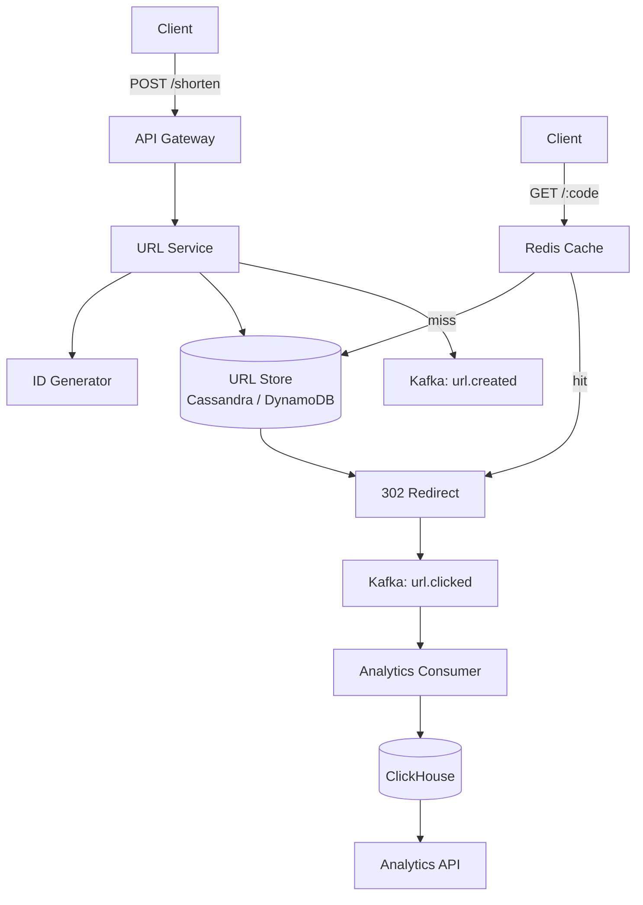

Bitly is the canonical URL shortener problem, and it is the opening entry in this case study series for a reason: it introduces three foundational patterns that appear in every system after it. The key insight is that storage (38 TB over five years) is the architectural constraint, not compute. The ID generation choice (base62 vs UUID vs Snowflake) is the real interview question hiding inside what looks like a simple key-value lookup.

An older [URL Shortener case study](../url-shortener/) covers the same fundamentals at a high level. This entry is the series anchor and focuses on the three patterns it passes forward to Dropbox, Ticketmaster, News Feed, and WhatsApp.

## Series concepts

### Introduced here

- **ID generation (base62 encoding, Snowflake-style distributed ID service):** every system needs to mint unique identifiers at high throughput. This entry walks through three strategies and explains why Snowflake wins. The same decision recurs in Dropbox (block IDs), WhatsApp (message IDs), and LeetCode (submission IDs).
- **Redis as a read cache:** short-code-to-URL lookups are read-heavy with extreme Zipf skew. Redis with LRU eviction exploits this. The same pattern appears in Ticketmaster (seat inventory), News Feed (sorted sets), and Uber (driver locations).
- **Async analytics pipeline via Kafka:** writing analytics synchronously in the redirect path doubles latency. Every entry after this one decouples a secondary write path using Kafka. Learn it once here.

### Carried forward from prior entries

None -- this is the first entry in the series.

## Clarifying questions

Ask these before drawing anything:

- **Scale**: how many URLs created per day? How many redirects per day?
- **URL lifetime**: do URLs expire? If so, when?
- **Custom aliases**: can users specify a custom short code (e.g. `bit.ly/my-campaign`)?
- **Analytics**: do we need click tracking (count, geo, device, referrer)?
- **Authentication**: can anonymous users create URLs, or is an account required?

What the answers reveal:

- 100M creates/day vs 1M/day changes the ID space and sharding decision
- No expiration means storage grows indefinitely: plan for tiered storage
- Custom aliases require a separate uniqueness check and reservation system
- Analytics drives a separate write path (cannot be synchronous with redirect)

For this walkthrough: 100M URLs/day, 10:1 read/write ratio, no expiration, analytics required, no auth required.

## Estimation

```
Write QPS:
  100M / 86,400 = 1,157 writes/sec
  Peak (3x): ~3,500 writes/sec

Read QPS (redirects):
  1B / 86,400 = 11,574 reads/sec
  Peak (3x): ~34,700 reads/sec

Storage (5-year retention):
  100M/day * 365 * 5 = 182.5B URLs
  Per record: short_code(8) + long_url(avg 100B) + metadata(~100B) = ~210 bytes
  182.5B * 210 bytes = ~38 TB

Bandwidth:
  Read: 34,700 * 100 bytes = 3.5 MB/s (trivial)
  Write: 3,500 * 210 bytes = 0.7 MB/s (trivial)

Cache sizing:
  Zipf distribution: 1% of URLs = ~80% of traffic
  Hot URLs: 182.5B * 1% = 1.825B
  Per entry: short_code(8) + long_url(100B) + overhead = ~200 bytes
  10 GB Redis holds ~50M mappings -- covers the hottest URLs with high hit rate
```

**Design consequence**: storage (38 TB) is the constraint, not CPU or bandwidth. A single-node database cannot hold 38 TB efficiently; this system needs sharding or a distributed KV store.

## High-level design



Two endpoints:

```
POST /shorten
  body:    { long_url: string, custom_alias?: string, expires_at?: timestamp }
  returns: { short_url: string, short_code: string, created_at: timestamp }

GET /{short_code}
  returns: 302 redirect to long_url
           (or 404 if not found, 410 if expired)
```

## Deep dive: ID generation

This is the most interesting part of the problem. You need to generate a short code (7 characters) that is globally unique across all servers, not easily guessable, and produced without a round-trip to the database on every write.

**Option 1: Auto-increment + base62 encoding**

Use a database auto-increment integer, then encode it in base62 (characters 0-9, a-z, A-Z). 62^7 = 3.5 trillion possible codes, more than enough for any realistic system.

```python
import string

CHARS = string.digits + string.ascii_lowercase + string.ascii_uppercase  # 62 chars

def encode_base62(n: int) -> str:
    if n == 0:
        return CHARS[0]
    result = []
    while n:
        result.append(CHARS[n % 62])
        n //= 62
    return ''.join(reversed(result))

def decode_base62(s: str) -> int:
    result = 0
    for ch in s:
        result = result * 62 + CHARS.index(ch)
    return result

print(encode_base62(1))           # '1'
print(encode_base62(100_000))     # 'q0U'
print(encode_base62(1_000_000))   # '4c92'
print(decode_base62('4c92'))      # 1000000
```

```typescript
const CHARS = '0123456789abcdefghijklmnopqrstuvwxyzABCDEFGHIJKLMNOPQRSTUVWXYZ'; // 62 chars

function encodeBase62(n: number): string {
  if (n === 0) return CHARS[0];
  const result: string[] = [];
  while (n > 0) {
    result.push(CHARS[n % 62]);
    n = Math.floor(n / 62);
  }
  return result.reverse().join('');
}

function decodeBase62(s: string): number {
  let result = 0;
  for (const ch of s) {
    result = result * 62 + CHARS.indexOf(ch);
  }
  return result;
}

console.log(encodeBase62(1));         // '1'
console.log(encodeBase62(100000));    // 'q0U'
console.log(encodeBase62(1000000));   // '4c92'
console.log(decodeBase62('4c92'));    // 1000000
```

```go
package main

import (
	"fmt"
	"strings"
)

const chars = "0123456789abcdefghijklmnopqrstuvwxyzABCDEFGHIJKLMNOPQRSTUVWXYZ"

func encodeBase62(n int) string {
	if n == 0 {
		return string(chars[0])
	}
	result := []byte{}
	for n > 0 {
		result = append([]byte{chars[n%62]}, result...)
		n /= 62
	}
	return string(result)
}

func decodeBase62(s string) int {
	result := 0
	for _, ch := range s {
		result = result*62 + strings.IndexRune(chars, ch)
	}
	return result
}

func main() {
	fmt.Println(encodeBase62(1))         // "1"
	fmt.Println(encodeBase62(100000))    // "q0U"
	fmt.Println(encodeBase62(1000000))   // "4c92"
	fmt.Println(decodeBase62("4c92"))    // 1000000
}
```

Problem: the database auto-increment becomes a write bottleneck at 3,500 writes/sec. Every write must hit the primary to get the next ID. If the primary is down, URL creation halts.

**Option 2: Snowflake-style distributed ID service**

A separate ID service generates unique IDs without database involvement. Each ID embeds a timestamp, machine ID, and sequence number:

```
[ 41 bits: millisecond timestamp ] [ 10 bits: machine ID ] [ 12 bits: sequence ]
= 63-bit integer
= ~4,096 IDs/ms per machine
= unique across 1,024 machines
= valid for ~69 years from epoch
```

```python
import time

EPOCH = 1_700_000_000_000  # custom epoch (milliseconds)

class SnowflakeGenerator:
    def __init__(self, machine_id: int):
        assert 0 <= machine_id < 1024
        self.machine_id = machine_id
        self.sequence = 0
        self.last_ms = -1

    def next_id(self) -> int:
        ms = int(time.time() * 1000) - EPOCH
        if ms == self.last_ms:
            self.sequence = (self.sequence + 1) & 0xFFF  # 12-bit mask
            if self.sequence == 0:
                # sequence exhausted: wait for next millisecond
                while ms <= self.last_ms:
                    ms = int(time.time() * 1000) - EPOCH
        else:
            self.sequence = 0
        self.last_ms = ms
        return (ms << 22) | (self.machine_id << 12) | self.sequence

gen = SnowflakeGenerator(machine_id=1)
id1 = gen.next_id()
print(encode_base62(id1))  # 7-character short code
```

```typescript
const EPOCH = 1_700_000_000_000n; // custom epoch (milliseconds), BigInt for bit ops

class SnowflakeGenerator {
  private machineId: bigint;
  private sequence: bigint = 0n;
  private lastMs: bigint = -1n;

  constructor(machineId: number) {
    if (machineId < 0 || machineId >= 1024) throw new Error('machineId must be 0-1023');
    this.machineId = BigInt(machineId);
  }

  nextId(): bigint {
    let ms = BigInt(Date.now()) - EPOCH;
    if (ms === this.lastMs) {
      this.sequence = (this.sequence + 1n) & 0xFFFn; // 12-bit mask
      if (this.sequence === 0n) {
        // sequence exhausted: wait for next millisecond
        while (ms <= this.lastMs) {
          ms = BigInt(Date.now()) - EPOCH;
        }
      }
    } else {
      this.sequence = 0n;
    }
    this.lastMs = ms;
    return (ms << 22n) | (this.machineId << 12n) | this.sequence;
  }
}

const gen = new SnowflakeGenerator(1);
const id1 = gen.nextId();
console.log(encodeBase62(Number(id1))); // 7-character short code
```

```go
package main

import (
	"fmt"
	"sync"
	"time"
)

const snowflakeEpoch = int64(1_700_000_000_000) // custom epoch (milliseconds)

type SnowflakeGenerator struct {
	mu        sync.Mutex
	machineID int64
	sequence  int64
	lastMs    int64
}

func NewSnowflakeGenerator(machineID int64) *SnowflakeGenerator {
	return &SnowflakeGenerator{machineID: machineID, lastMs: -1}
}

func (g *SnowflakeGenerator) NextID() int64 {
	g.mu.Lock()
	defer g.mu.Unlock()

	ms := time.Now().UnixMilli() - snowflakeEpoch
	if ms == g.lastMs {
		g.sequence = (g.sequence + 1) & 0xFFF // 12-bit mask
		if g.sequence == 0 {
			// sequence exhausted: wait for next millisecond
			for ms <= g.lastMs {
				ms = time.Now().UnixMilli() - snowflakeEpoch
			}
		}
	} else {
		g.sequence = 0
	}
	g.lastMs = ms
	return (ms << 22) | (g.machineID << 12) | g.sequence
}

func main() {
	gen := NewSnowflakeGenerator(1)
	id1 := gen.NextID()
	fmt.Println(encodeBase62(int(id1))) // 7-character short code
}
```

App servers request IDs from the service in bulk (10,000 at a time), then serve from local memory. This removes the ID bottleneck entirely and survives brief service outages via local buffer.

**Option 3: Hash the long URL**

`short_code = base62(MD5(long_url))[:7]`

Deterministic: the same long URL always produces the same short code (built-in deduplication).

Problem: MD5 collisions. Two different URLs can produce the same 7-character prefix. Must detect collisions and handle them (append a counter, rehash). Collision probability with 7 chars from a 128-bit hash is low (~1 in 3.5T) but non-zero and grows as the database fills.

**Recommendation**: use the Snowflake-style ID service. It removes the single-point bottleneck, produces globally unique IDs, and is simple to reason about.

## Deep dive: redirect semantics (301 vs 302)

This is a detail most candidates miss. When redirecting `bit.ly/abc` to the original URL:

**301 Moved Permanently**: the browser caches the redirect. Future requests never hit your server.

- Pro: saves server load
- Con: analytics become inaccurate (subsequent clicks are never counted)

**302 Found (temporary redirect)**: the browser does not cache. Every click goes through your server.

- Pro: every click is counted -- analytics are accurate
- Con: higher server load

**Decision**: if analytics matter, use 302. In most interview scenarios where analytics are mentioned, the answer is 302.

## Deep dive: caching redirects

Redirects are the dominant read load (34,700 QPS peak). The access pattern has extreme Zipf skew: roughly 1% of URLs generate 80% of redirects.

```python
import redis

r = redis.Redis(host='cache-cluster', port=6379)

def redirect(short_code: str) -> str | None:
    # 1. Check cache
    cached = r.get(f"url:{short_code}")
    if cached:
        return cached.decode()

    # 2. Cache miss: fetch from DB
    record = db.query_one(
        "SELECT long_url, expires_at FROM urls WHERE short_code = %s",
        short_code
    )
    if not record:
        return None

    # 3. Populate cache (skip expired URLs)
    if not record['expires_at'] or record['expires_at'] > now():
        r.setex(f"url:{short_code}", 3600, record['long_url'])

    return record['long_url']
```

```typescript
import { createClient } from 'redis';

const client = createClient({ url: 'redis://cache-cluster:6379' });
await client.connect();

async function redirect(shortCode: string): Promise<string | null> {
  // 1. Check cache
  const cached = await client.get(`url:${shortCode}`);
  if (cached) return cached;

  // 2. Cache miss: fetch from DB
  const record = await db.queryOne<{ longUrl: string; expiresAt: Date | null }>(
    'SELECT long_url, expires_at FROM urls WHERE short_code = $1',
    [shortCode]
  );
  if (!record) return null;

  // 3. Populate cache (skip expired URLs)
  if (!record.expiresAt || record.expiresAt > new Date()) {
    await client.setEx(`url:${shortCode}`, 3600, record.longUrl);
  }

  return record.longUrl;
}
```

```go
package main

import (
	"context"
	"fmt"
	"time"

	"github.com/redis/go-redis/v9"
)

var rdb = redis.NewClient(&redis.Options{Addr: "cache-cluster:6379"})

type URLRecord struct {
	LongURL   string
	ExpiresAt *time.Time
}

func redirect(ctx context.Context, shortCode string) (string, error) {
	// 1. Check cache
	cached, err := rdb.Get(ctx, fmt.Sprintf("url:%s", shortCode)).Result()
	if err == nil {
		return cached, nil
	}

	// 2. Cache miss: fetch from DB
	record, err := dbQueryOne(ctx, shortCode)
	if err != nil {
		return "", err
	}

	// 3. Populate cache (skip expired URLs)
	if record.ExpiresAt == nil || record.ExpiresAt.After(time.Now()) {
		rdb.SetEx(ctx, fmt.Sprintf("url:%s", shortCode), record.LongURL, time.Hour)
	}

	return record.LongURL, nil
}
```

Cache sizing: 10 GB Redis holds roughly 50M URL mappings at ~200 bytes each. The hot 1% of 5B URLs is 50M entries. A 10 GB cluster covers the hot tail entirely. Cache hit rate in production exceeds 99% for a mature system.

LRU eviction means cold URLs age out naturally. If a URL goes viral after being cold for six months, it gets cached again on first hit.

## Deep dive: analytics pipeline

Never write analytics synchronously in the redirect path. Adding a DB write to every redirect doubles latency and halves throughput.

Instead, publish an event to Kafka on each redirect. The redirect path returns before the event is acknowledged:

```python
from kafka import KafkaProducer
import json

producer = KafkaProducer(
    bootstrap_servers=['kafka-1:9092', 'kafka-2:9092'],
    value_serializer=lambda v: json.dumps(v).encode()
)

def handle_redirect(short_code: str, request) -> str | None:
    long_url = redirect(short_code)
    if not long_url:
        return None

    # fire-and-forget analytics event
    producer.send('url.clicked', {
        'short_code': short_code,
        'timestamp': now_iso(),
        'ip': request.remote_addr,
        'user_agent': request.headers.get('User-Agent'),
        'referrer': request.headers.get('Referer'),
    })

    return long_url  # caller issues 302

# Kafka consumer -- runs separately
def analytics_consumer():
    from kafka import KafkaConsumer
    consumer = KafkaConsumer(
        'url.clicked',
        bootstrap_servers=['kafka-1:9092'],
        group_id='analytics-writers'
    )
    for msg in consumer:
        event = json.loads(msg.value)
        clickhouse_client.execute(
            "INSERT INTO clicks VALUES",
            [event]
        )
```

```typescript
import { Kafka } from 'kafkajs';

interface ClickEvent {
  shortCode: string;
  timestamp: string;
  ip: string;
  userAgent: string;
  referrer: string;
}

const kafka = new Kafka({ brokers: ['kafka-1:9092', 'kafka-2:9092'] });
const producer = kafka.producer();
await producer.connect();

async function handleRedirect(shortCode: string, req: Request): Promise<string | null> {
  const longUrl = await redirect(shortCode);
  if (!longUrl) return null;

  // fire-and-forget analytics event
  producer.send({
    topic: 'url.clicked',
    messages: [{
      value: JSON.stringify({
        shortCode,
        timestamp: new Date().toISOString(),
        ip: req.headers.get('x-forwarded-for') ?? '',
        userAgent: req.headers.get('user-agent') ?? '',
        referrer: req.headers.get('referer') ?? '',
      } satisfies ClickEvent),
    }],
  });

  return longUrl; // caller issues 302
}

// Kafka consumer -- runs separately
async function analyticsConsumer(): Promise<void> {
  const consumer = kafka.consumer({ groupId: 'analytics-writers' });
  await consumer.connect();
  await consumer.subscribe({ topic: 'url.clicked' });

  await consumer.run({
    eachMessage: async ({ message }) => {
      const event: ClickEvent = JSON.parse(message.value!.toString());
      await clickhouseClient.insert('INSERT INTO clicks VALUES', [event]);
    },
  });
}
```

```go
package main

import (
	"context"
	"encoding/json"
	"log"
	"net/http"
	"time"

	"github.com/segmentio/kafka-go"
)

type ClickEvent struct {
	ShortCode string `json:"short_code"`
	Timestamp string `json:"timestamp"`
	IP        string `json:"ip"`
	UserAgent string `json:"user_agent"`
	Referrer  string `json:"referrer"`
}

var writer = &kafka.Writer{
	Addr:  kafka.TCP("kafka-1:9092", "kafka-2:9092"),
	Topic: "url.clicked",
}

func handleRedirect(ctx context.Context, shortCode string, r *http.Request) (string, error) {
	longURL, err := redirectLookup(ctx, shortCode)
	if err != nil || longURL == "" {
		return "", err
	}

	// fire-and-forget analytics event
	event := ClickEvent{
		ShortCode: shortCode,
		Timestamp: time.Now().UTC().Format(time.RFC3339),
		IP:        r.RemoteAddr,
		UserAgent: r.Header.Get("User-Agent"),
		Referrer:  r.Header.Get("Referer"),
	}
	payload, _ := json.Marshal(event)
	go writer.WriteMessages(ctx, kafka.Message{Value: payload})

	return longURL, nil // caller issues 302
}

// Kafka consumer -- runs separately
func analyticsConsumer(ctx context.Context) {
	reader := kafka.NewReader(kafka.ReaderConfig{
		Brokers: []string{"kafka-1:9092"},
		Topic:   "url.clicked",
		GroupID: "analytics-writers",
	})
	defer reader.Close()

	for {
		msg, err := reader.ReadMessage(ctx)
		if err != nil {
			log.Printf("consumer error: %v", err)
			break
		}
		var event ClickEvent
		if err := json.Unmarshal(msg.Value, &event); err != nil {
			continue
		}
		clickhouseInsert(ctx, event)
	}
}
```

The redirect path stays at under 10ms. The analytics pipeline has seconds of latency, but nobody needs real-time click analytics to the millisecond.

## Failure modes

**ID service outage**: short URL creation fails. App servers have pre-fetched ID ranges locally, so they continue creating URLs for their remaining local buffer (typically thousands of IDs). After exhaustion, they fail gracefully with a 503. Mitigation: run multiple ID service replicas; each generates IDs from a different machine_id partition.

**Cache cluster failure**: redirects fall through to the database. Read load spikes from 11,574 QPS to full load with no cache hits. The database must handle peak read QPS alone. Mitigate with read replicas and connection pooling (PgBouncer). This is why read replicas matter even when you have Redis.

**Database full**: 38 TB over five years is manageable on modern hardware, but plan a storage lifecycle early. URLs with no clicks in 90+ days move to cold storage (S3 Glacier). Only the warm tier needs fast reads.

**URL expiration race**: a URL expires at exactly the moment two requests arrive. One reads from the cache (still valid), one gets a 410 from the database. Use the cache TTL to match the expiration time exactly: when the URL expires, the cache entry expires simultaneously.

**Kafka lag**: if the analytics consumer falls behind, redirect events queue up in Kafka. This does not affect redirect latency (the producer is fire-and-forget), but analytics dashboards show stale data. Monitor consumer lag; add consumer instances to catch up.

## Key takeaways

**ID generation is the interview's real question.** The choice between database auto-increment (simple but creates a hotspot), UUID (no hotspot but wastes space and is unordered), and Snowflake (complex but scales) is what interviewers are probing. Know all three options and their tradeoffs.

**301 vs 302 is a signal detail.** It is easy to mention and almost always missed. Bringing it up unprompted shows you have thought about analytics, not just the happy path.

**Compute storage before designing the DB.** 38 TB rules out a single-node Postgres setup. The number forces a conversation about sharding, distributed KV stores, or tiered storage. Let the numbers drive the decision.

**The analytics pipeline is a fanout problem.** Every redirect fans out to an analytics write. Decoupling this with Kafka is the canonical pattern that reappears in notifications, audit logs, and activity feeds throughout this series.

**Cache hit rate depends on Zipf skew.** The Zipf distribution of URL access means a small Redis cluster dramatically reduces database read load. Sizing the cache to cover the hot 1% of URLs is sufficient to achieve 99%+ hit rates.

## References

- [System Design Interview Vol 1, Alex Xu, Chapter 8](https://bytebytego.com/)
- [Twitter Snowflake: announcing Snowflake](https://blog.twitter.com/engineering/en_us/a/2010/announcing-snowflake)
- [Bitly engineering: building a shorter URL](https://word.bitly.com/post/28969443108/ten-billion-clicks)
- [ClickHouse for analytics workloads](https://clickhouse.com/docs/en/intro)

## Related topics

- [URL Shortener case study](../url-shortener/), the foundational walkthrough this entry extends
- [Dropbox case study](../dropbox/), carries forward Snowflake ID generation and Kafka
- [WhatsApp case study](../whatsapp/), carries forward Kafka and Redis connection routing
- [Caching](../../caching/), full treatment of Redis cache patterns
- [Consistent Hashing](../../consistent-hashing/), approach to sharding the URL store
- [Rate Limiting](../../rate-limiting/), needed to prevent abuse of the shorten endpoint
- [Databases](../../databases/), sharding strategies for 38 TB URL storage
