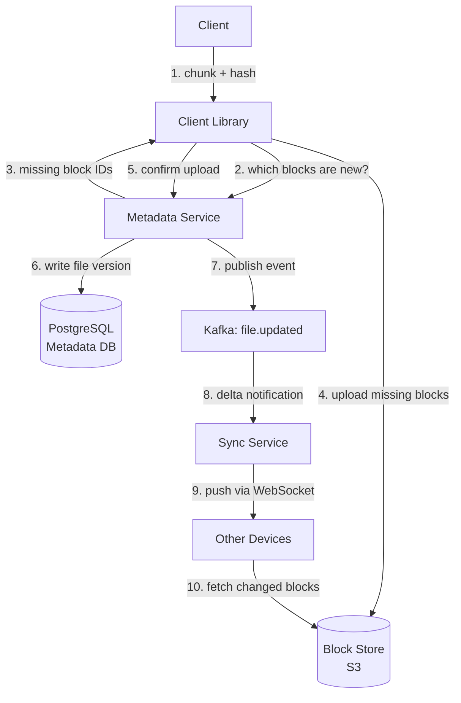

Dropbox looks like a file storage problem but is really a deduplication problem. The key insight: by splitting every file into fixed-size blocks and using the SHA-256 hash of each block as its storage key (content-addressable storage), two users uploading identical files share the same blocks in S3. Storage consumption is proportional to unique content, not to the number of copies. At 500M users, this difference is the margin between a viable business and bankruptcy.

## Series concepts

### Introduced here

- **Chunked upload with content-addressable storage:** files split into 4 MB blocks; each block's S3 key is `SHA-256(block_bytes)`. Two identical blocks, regardless of who uploaded them, occupy one slot in S3. Enables deduplication, resumable uploads, and delta sync simultaneously.
- **Delta sync:** the client maintains a local block index. On file edit, only the changed blocks are uploaded. A 100 MB file with a 4 MB edit uploads 4 MB, not 100 MB.
- **Metadata service vs block store split:** two separate systems with separate scaling profiles. The metadata service is ACID (PostgreSQL, sharded by user_id); the block store is eventually consistent (S3). Neither is a substitute for the other.

### Carried forward from prior entries

- **ID generation ([Bitly](../bitly/)):** block IDs are SHA-256 hashes (content-derived, not Snowflake), but file IDs and version IDs use Snowflake-style generation.
- **Kafka:** upload completion events publish to Kafka; consumers notify connected devices of new versions to sync.
- **Redis:** upload session state (which blocks have been confirmed uploaded for an in-progress session) is tracked in Redis.

## Clarifying questions

Ask these before drawing anything:

- **Scale**: how many users? How many DAU? Average file size?
- **File types**: any restrictions (executables, archives)?
- **Versioning**: how many versions per file? How long are old versions retained?
- **Sharing**: can users share files or folders with other users?
- **Collaboration**: do multiple users edit the same file simultaneously?
- **Mobile clients**: are there mobile apps with background sync?

What the answers reveal:

- Large average file size (video vs documents) changes the block size and dedup ratio
- Versioning depth drives metadata storage growth
- Sharing means access control must be enforced at the metadata layer, not just S3
- Simultaneous edits require a conflict resolution policy
- Mobile sync must handle intermittent connectivity: resumable uploads are mandatory

For this walkthrough: 500M users, 50M DAU, avg file 500 KB, 180-day version retention, sharing supported, last-write-wins conflict resolution.

## Estimation

```
Upload QPS:
  50M DAU * 2 uploads/day = 100M uploads/day
  100M / 86,400 = 1,157 uploads/sec
  Peak (3x): ~3,500 uploads/sec

Raw storage ingested per day:
  100M uploads * 500 KB avg = 50 TB/day raw

After deduplication (30% dedup rate assumed):
  50 TB * 0.70 = 35 TB/day net new blocks in S3

5-year storage:
  35 TB/day * 365 * 5 = ~64 PB

Metadata:
  100M file records/day * 200 bytes = 20 GB/day metadata
  5 years: ~36 TB metadata (fits in sharded PostgreSQL)

Block store:
  50 TB/day raw * 30 dedup = 35 TB/day unique blocks
  Average block: 4 MB -> ~8.75M new blocks/day
  At 32 bytes per block record: ~280 MB/day block index growth
```

**Storage split**: block storage (64 PB) requires S3 or equivalent object storage -- no on-premises solution is cost-competitive. Metadata (36 TB) fits in a sharded relational database. The two systems scale independently.

## High-level design



Core endpoints:

```
POST /upload/init
  body:    { filename, size, block_hashes: string[] }
  returns: { upload_id, missing_blocks: string[] }

PUT /upload/{upload_id}/block/{block_hash}
  body:    raw block bytes
  returns: { block_hash, stored: true }

POST /upload/{upload_id}/complete
  body:    { block_hashes: string[], parent_version_id?: string }
  returns: { file_id, version_id, created_at }

GET /files/{file_id}/versions
  returns: [ { version_id, created_at, block_hashes, size } ]

GET /blocks/{block_hash}
  returns: block bytes (served from S3 or CDN)
```

## Deep dive: block chunking and deduplication

The client splits every file into 4 MB fixed-size blocks (last block may be smaller). For each block, it computes `block_id = SHA-256(block_bytes)`. The SHA-256 hash serves as both a globally unique identifier and a data integrity check.

```python
import hashlib
from pathlib import Path

BLOCK_SIZE = 4 * 1024 * 1024  # 4 MB

def chunk_file(filepath: str) -> list[tuple[str, bytes]]:
    """Returns list of (block_hash, block_bytes) tuples."""
    blocks = []
    with open(filepath, 'rb') as f:
        while True:
            data = f.read(BLOCK_SIZE)
            if not data:
                break
            block_hash = hashlib.sha256(data).hexdigest()
            blocks.append((block_hash, data))
    return blocks

def upload_file(filepath: str, metadata_client, s3_client):
    blocks = chunk_file(filepath)
    block_hashes = [h for h, _ in blocks]

    # ask metadata service which blocks it has never seen
    resp = metadata_client.post('/upload/init', {
        'filename': Path(filepath).name,
        'size': Path(filepath).stat().st_size,
        'block_hashes': block_hashes,
    })
    upload_id = resp['upload_id']
    missing = set(resp['missing_blocks'])

    # upload only the blocks the server does not already have
    for block_hash, block_bytes in blocks:
        if block_hash in missing:
            s3_client.put_object(
                Bucket='dropbox-blocks',
                Key=block_hash,    # content-addressable: key IS the hash
                Body=block_bytes,
            )
            metadata_client.put(f'/upload/{upload_id}/block/{block_hash}')

    return metadata_client.post(f'/upload/{upload_id}/complete', {
        'block_hashes': block_hashes,
    })
```

```typescript
import * as fs from 'fs';
import * as path from 'path';
import * as crypto from 'crypto';

const BLOCK_SIZE = 4 * 1024 * 1024; // 4 MB

interface Block {
  blockHash: string;
  blockBytes: Buffer;
}

interface InitResponse {
  uploadId: string;
  missingBlocks: string[];
}

function chunkFile(filepath: string): Block[] {
  const blocks: Block[] = [];
  const fd = fs.openSync(filepath, 'r');
  const buf = Buffer.alloc(BLOCK_SIZE);
  let bytesRead: number;
  while ((bytesRead = fs.readSync(fd, buf, 0, BLOCK_SIZE, null)) > 0) {
    const blockBytes = buf.slice(0, bytesRead);
    const blockHash = crypto.createHash('sha256').update(blockBytes).digest('hex');
    blocks.push({ blockHash, blockBytes: Buffer.from(blockBytes) });
  }
  fs.closeSync(fd);
  return blocks;
}

async function uploadFile(filepath: string, metadataClient: MetadataClient, s3Client: S3Client): Promise<unknown> {
  const blocks = chunkFile(filepath);
  const blockHashes = blocks.map(b => b.blockHash);

  // ask metadata service which blocks it has never seen
  const resp: InitResponse = await metadataClient.post('/upload/init', {
    filename: path.basename(filepath),
    size: fs.statSync(filepath).size,
    blockHashes,
  });
  const { uploadId } = resp;
  const missing = new Set(resp.missingBlocks);

  // upload only the blocks the server does not already have
  for (const { blockHash, blockBytes } of blocks) {
    if (missing.has(blockHash)) {
      await s3Client.putObject({
        Bucket: 'dropbox-blocks',
        Key: blockHash,    // content-addressable: key IS the hash
        Body: blockBytes,
      });
      await metadataClient.put(`/upload/${uploadId}/block/${blockHash}`);
    }
  }

  return metadataClient.post(`/upload/${uploadId}/complete`, { blockHashes });
}
```

```go
package main

import (
	"bytes"
	"context"
	"crypto/sha256"
	"encoding/hex"
	"io"
	"os"
)

const blockSize = 4 * 1024 * 1024 // 4 MB

type Block struct {
	BlockHash  string
	BlockBytes []byte
}

type InitResponse struct {
	UploadID      string   `json:"upload_id"`
	MissingBlocks []string `json:"missing_blocks"`
}

func chunkFile(filepath string) ([]Block, error) {
	f, err := os.Open(filepath)
	if err != nil {
		return nil, err
	}
	defer f.Close()

	var blocks []Block
	buf := make([]byte, blockSize)
	for {
		n, err := io.ReadFull(f, buf)
		if n == 0 {
			break
		}
		data := make([]byte, n)
		copy(data, buf[:n])
		sum := sha256.Sum256(data)
		blocks = append(blocks, Block{
			BlockHash:  hex.EncodeToString(sum[:]),
			BlockBytes: data,
		})
		if err == io.EOF || err == io.ErrUnexpectedEOF {
			break
		}
	}
	return blocks, nil
}

func uploadFile(ctx context.Context, filepath string, metaClient MetadataClient, s3Client S3Client) error {
	blocks, err := chunkFile(filepath)
	if err != nil {
		return err
	}

	blockHashes := make([]string, len(blocks))
	for i, b := range blocks {
		blockHashes[i] = b.BlockHash
	}

	// ask metadata service which blocks it has never seen
	info, err := os.Stat(filepath)
	if err != nil {
		return err
	}
	resp, err := metaClient.PostInit(ctx, path.Base(filepath), info.Size(), blockHashes)
	if err != nil {
		return err
	}

	missing := make(map[string]struct{}, len(resp.MissingBlocks))
	for _, h := range resp.MissingBlocks {
		missing[h] = struct{}{}
	}

	// upload only the blocks the server does not already have
	for _, b := range blocks {
		if _, ok := missing[b.BlockHash]; ok {
			if err := s3Client.PutObject(ctx, "dropbox-blocks", b.BlockHash, bytes.NewReader(b.BlockBytes)); err != nil {
				return err
			}
			if err := metaClient.PutBlock(ctx, resp.UploadID, b.BlockHash); err != nil {
				return err
			}
		}
	}

	return metaClient.PostComplete(ctx, resp.UploadID, blockHashes)
}
```

When two users upload the same file, the second user's `/upload/init` call receives `missing_blocks: []` because all block hashes already exist. The second upload costs zero bytes of S3 storage and completes in milliseconds.

## Deep dive: sync protocol and delta sync

The sync service maintains a persistent connection (WebSocket or long-poll) to each active client. When a file changes, only the diff (changed blocks) is transmitted.

```python
import json
import websockets
import asyncio

class SyncClient:
    def __init__(self, user_id: str, device_id: str):
        self.user_id = user_id
        self.device_id = device_id
        self.local_index: dict[str, list[str]] = {}  # file_id -> [block_hashes]

    async def listen(self, ws_url: str):
        async with websockets.connect(ws_url) as ws:
            await ws.send(json.dumps({
                'type': 'auth',
                'user_id': self.user_id,
                'device_id': self.device_id,
            }))
            async for message in ws:
                event = json.loads(message)
                if event['type'] == 'file.updated':
                    await self.handle_file_update(event)

    async def handle_file_update(self, event: dict):
        file_id = event['file_id']
        new_hashes = event['block_hashes']
        old_hashes = self.local_index.get(file_id, [])

        # compute which blocks we don't have locally
        old_set = set(old_hashes)
        missing = [h for h in new_hashes if h not in old_set]

        # download only missing blocks
        for block_hash in missing:
            block_bytes = await fetch_block(block_hash)
            write_block_to_disk(block_hash, block_bytes)

        # reassemble file from blocks (in order)
        reassemble_file(file_id, new_hashes)
        self.local_index[file_id] = new_hashes
```

```typescript
import WebSocket from 'ws';

interface FileUpdatedEvent {
  type: 'file.updated';
  fileId: string;
  blockHashes: string[];
}

interface AuthMessage {
  type: 'auth';
  userId: string;
  deviceId: string;
}

class SyncClient {
  private localIndex: Map<string, string[]> = new Map(); // fileId -> blockHashes

  constructor(private userId: string, private deviceId: string) {}

  async listen(wsUrl: string): Promise<void> {
    const ws = new WebSocket(wsUrl);

    ws.on('open', () => {
      const auth: AuthMessage = { type: 'auth', userId: this.userId, deviceId: this.deviceId };
      ws.send(JSON.stringify(auth));
    });

    ws.on('message', async (data: WebSocket.RawData) => {
      const event = JSON.parse(data.toString());
      if (event.type === 'file.updated') {
        await this.handleFileUpdate(event as FileUpdatedEvent);
      }
    });
  }

  async handleFileUpdate(event: FileUpdatedEvent): Promise<void> {
    const { fileId, blockHashes: newHashes } = event;
    const oldHashes = this.localIndex.get(fileId) ?? [];

    // compute which blocks we don't have locally
    const oldSet = new Set(oldHashes);
    const missing = newHashes.filter(h => !oldSet.has(h));

    // download only missing blocks
    for (const blockHash of missing) {
      const blockBytes = await fetchBlock(blockHash);
      writeBlockToDisk(blockHash, blockBytes);
    }

    // reassemble file from blocks (in order)
    reassembleFile(fileId, newHashes);
    this.localIndex.set(fileId, newHashes);
  }
}
```

```go
package main

import (
	"context"
	"encoding/json"
	"log"

	"nhooyr.io/websocket"
)

type FileUpdatedEvent struct {
	Type        string   `json:"type"`
	FileID      string   `json:"file_id"`
	BlockHashes []string `json:"block_hashes"`
}

type AuthMessage struct {
	Type     string `json:"type"`
	UserID   string `json:"user_id"`
	DeviceID string `json:"device_id"`
}

type SyncClient struct {
	userID     string
	deviceID   string
	localIndex map[string][]string // fileID -> blockHashes
}

func NewSyncClient(userID, deviceID string) *SyncClient {
	return &SyncClient{userID: userID, deviceID: deviceID, localIndex: make(map[string][]string)}
}

func (c *SyncClient) Listen(ctx context.Context, wsURL string) error {
	conn, _, err := websocket.Dial(ctx, wsURL, nil)
	if err != nil {
		return err
	}
	defer conn.Close(websocket.StatusNormalClosure, "")

	auth := AuthMessage{Type: "auth", UserID: c.userID, DeviceID: c.deviceID}
	authBytes, _ := json.Marshal(auth)
	if err := conn.Write(ctx, websocket.MessageText, authBytes); err != nil {
		return err
	}

	for {
		_, data, err := conn.Read(ctx)
		if err != nil {
			return err
		}
		var event FileUpdatedEvent
		if err := json.Unmarshal(data, &event); err != nil {
			log.Printf("parse error: %v", err)
			continue
		}
		if event.Type == "file.updated" {
			if err := c.handleFileUpdate(ctx, event); err != nil {
				log.Printf("handle error: %v", err)
			}
		}
	}
}

func (c *SyncClient) handleFileUpdate(ctx context.Context, event FileUpdatedEvent) error {
	newHashes := event.BlockHashes
	oldHashes := c.localIndex[event.FileID]

	// compute which blocks we don't have locally
	oldSet := make(map[string]struct{}, len(oldHashes))
	for _, h := range oldHashes {
		oldSet[h] = struct{}{}
	}

	// download only missing blocks
	for _, blockHash := range newHashes {
		if _, exists := oldSet[blockHash]; !exists {
			blockBytes, err := fetchBlock(ctx, blockHash)
			if err != nil {
				return err
			}
			writeBlockToDisk(blockHash, blockBytes)
		}
	}

	// reassemble file from blocks (in order)
	reassembleFile(event.FileID, newHashes)
	c.localIndex[event.FileID] = newHashes
	return nil
}
```

On the server side, Kafka carries the delta event:

```python
from kafka import KafkaConsumer, KafkaProducer

# When a file version is confirmed, publish delta
def publish_file_updated(file_id: str, user_id: str, block_hashes: list[str]):
    producer.send('file.updated', {
        'file_id': file_id,
        'user_id': user_id,
        'block_hashes': block_hashes,
        'timestamp': now_iso(),
    })

# Sync service consumes and pushes to connected WebSockets
consumer = KafkaConsumer('file.updated', group_id='sync-delivery')
for msg in consumer:
    event = json.loads(msg.value)
    user_id = event['user_id']
    # look up which WebSocket connections belong to this user
    connections = connection_registry.get_connections(user_id)
    for conn in connections:
        conn.send(event)
```

```typescript
import { Kafka } from 'kafkajs';

interface FileUpdatedMessage {
  fileId: string;
  userId: string;
  blockHashes: string[];
  timestamp: string;
}

const kafka = new Kafka({ brokers: ['kafka-1:9092', 'kafka-2:9092'] });
const producer = kafka.producer();
await producer.connect();

// When a file version is confirmed, publish delta
async function publishFileUpdated(fileId: string, userId: string, blockHashes: string[]): Promise<void> {
  await producer.send({
    topic: 'file.updated',
    messages: [{
      value: JSON.stringify({
        fileId,
        userId,
        blockHashes,
        timestamp: new Date().toISOString(),
      } satisfies FileUpdatedMessage),
    }],
  });
}

// Sync service consumes and pushes to connected WebSockets
async function startSyncConsumer(): Promise<void> {
  const consumer = kafka.consumer({ groupId: 'sync-delivery' });
  await consumer.connect();
  await consumer.subscribe({ topic: 'file.updated' });

  await consumer.run({
    eachMessage: async ({ message }) => {
      const event: FileUpdatedMessage = JSON.parse(message.value!.toString());
      const { userId } = event;
      // look up which WebSocket connections belong to this user
      const connections = connectionRegistry.getConnections(userId);
      for (const conn of connections) {
        conn.send(JSON.stringify(event));
      }
    },
  });
}
```

```go
package main

import (
	"context"
	"encoding/json"
	"log"
	"time"

	"github.com/segmentio/kafka-go"
)

type FileUpdatedMessage struct {
	FileID      string   `json:"file_id"`
	UserID      string   `json:"user_id"`
	BlockHashes []string `json:"block_hashes"`
	Timestamp   string   `json:"timestamp"`
}

var writer = &kafka.Writer{
	Addr:  kafka.TCP("kafka-1:9092", "kafka-2:9092"),
	Topic: "file.updated",
}

// When a file version is confirmed, publish delta
func publishFileUpdated(ctx context.Context, fileID, userID string, blockHashes []string) error {
	msg := FileUpdatedMessage{
		FileID:      fileID,
		UserID:      userID,
		BlockHashes: blockHashes,
		Timestamp:   time.Now().UTC().Format(time.RFC3339),
	}
	payload, err := json.Marshal(msg)
	if err != nil {
		return err
	}
	return writer.WriteMessages(ctx, kafka.Message{Value: payload})
}

// Sync service consumes and pushes to connected WebSockets
func startSyncConsumer(ctx context.Context) {
	reader := kafka.NewReader(kafka.ReaderConfig{
		Brokers: []string{"kafka-1:9092"},
		Topic:   "file.updated",
		GroupID: "sync-delivery",
	})
	defer reader.Close()

	for {
		m, err := reader.ReadMessage(ctx)
		if err != nil {
			log.Printf("consumer error: %v", err)
			break
		}
		var event FileUpdatedMessage
		if err := json.Unmarshal(m.Value, &event); err != nil {
			continue
		}
		// look up which WebSocket connections belong to this user
		connections := connectionRegistry.GetConnections(event.UserID)
		for _, conn := range connections {
			conn.Send(event)
		}
	}
}
```

## Deep dive: metadata service

The metadata service is the system's consistency anchor. File versions must be atomic: a reader either sees all blocks of a version or none.

```python
# PostgreSQL schema (simplified)
CREATE TABLE files (
    file_id       BIGINT PRIMARY KEY,   -- Snowflake ID
    owner_id      BIGINT NOT NULL,      -- sharding key
    name          TEXT NOT NULL,
    created_at    TIMESTAMPTZ NOT NULL,
    deleted_at    TIMESTAMPTZ           -- soft delete
);

CREATE TABLE file_versions (
    version_id    BIGINT PRIMARY KEY,   -- Snowflake ID
    file_id       BIGINT NOT NULL REFERENCES files(file_id),
    block_hashes  TEXT[] NOT NULL,      -- ordered array of SHA-256 hashes
    size_bytes    BIGINT NOT NULL,
    created_at    TIMESTAMPTZ NOT NULL
);

CREATE INDEX ON file_versions (file_id, created_at DESC);
```

```typescript
// PostgreSQL schema (simplified) -- TypeScript model types

interface File {
  fileId: bigint;       // Snowflake ID, primary key
  ownerId: bigint;      // sharding key
  name: string;
  createdAt: Date;
  deletedAt: Date | null; // soft delete
}

interface FileVersion {
  versionId: bigint;    // Snowflake ID, primary key
  fileId: bigint;       // foreign key -> files.file_id
  blockHashes: string[]; // ordered array of SHA-256 hashes
  sizeBytes: bigint;
  createdAt: Date;
}

// Index: (file_id, created_at DESC) on file_versions
```

```go
package main

import "time"

// PostgreSQL schema (simplified) -- Go struct types

// File maps to the files table; sharded by OwnerID.
type File struct {
	FileID    int64      `db:"file_id"`   // Snowflake ID, primary key
	OwnerID   int64      `db:"owner_id"`  // sharding key
	Name      string     `db:"name"`
	CreatedAt time.Time  `db:"created_at"`
	DeletedAt *time.Time `db:"deleted_at"` // soft delete
}

// FileVersion maps to the file_versions table.
// Index: (file_id, created_at DESC).
type FileVersion struct {
	VersionID   int64     `db:"version_id"`   // Snowflake ID, primary key
	FileID      int64     `db:"file_id"`      // foreign key -> files.file_id
	BlockHashes []string  `db:"block_hashes"` // ordered SHA-256 hashes
	SizeBytes   int64     `db:"size_bytes"`
	CreatedAt   time.Time `db:"created_at"`
}
```

Sharding by `owner_id` keeps all files for a user on the same shard. Cross-user queries (shared folders) require a lookup in a separate sharing table, but single-user operations never cross shard boundaries.

```python
def get_latest_version(file_id: int, user_id: int) -> dict | None:
    shard = shard_for_user(user_id)
    row = shard.query_one("""
        SELECT v.version_id, v.block_hashes, v.size_bytes, v.created_at
        FROM file_versions v
        JOIN files f ON f.file_id = v.file_id
        WHERE v.file_id = %s AND f.owner_id = %s
        ORDER BY v.created_at DESC
        LIMIT 1
    """, file_id, user_id)
    return dict(row) if row else None
```

```typescript
interface VersionRow {
  versionId: bigint;
  blockHashes: string[];
  sizeBytes: bigint;
  createdAt: Date;
}

async function getLatestVersion(fileId: bigint, userId: bigint): Promise<VersionRow | null> {
  const shard = shardForUser(userId);
  const row = await shard.queryOne<VersionRow>(`
    SELECT v.version_id, v.block_hashes, v.size_bytes, v.created_at
    FROM file_versions v
    JOIN files f ON f.file_id = v.file_id
    WHERE v.file_id = $1 AND f.owner_id = $2
    ORDER BY v.created_at DESC
    LIMIT 1
  `, [fileId, userId]);
  return row ?? null;
}
```

```go
package main

import (
	"context"
	"time"
)

type VersionRow struct {
	VersionID   int64
	BlockHashes []string
	SizeBytes   int64
	CreatedAt   time.Time
}

func getLatestVersion(ctx context.Context, fileID, userID int64) (*VersionRow, error) {
	shard := shardForUser(userID)
	row, err := shard.QueryOne(ctx, `
		SELECT v.version_id, v.block_hashes, v.size_bytes, v.created_at
		FROM file_versions v
		JOIN files f ON f.file_id = v.file_id
		WHERE v.file_id = $1 AND f.owner_id = $2
		ORDER BY v.created_at DESC
		LIMIT 1
	`, fileID, userID)
	if err != nil {
		return nil, err
	}
	if row == nil {
		return nil, nil
	}
	return row.(*VersionRow), nil
}
```

## Deep dive: conflict resolution

Dropbox uses last-write-wins with a conflicted copy rather than operational transforms. This is simpler to implement and correct to reason about, at the cost of occasionally surprising users.

```python
def resolve_conflict(
    file_id: str,
    incoming_version: dict,
    current_version: dict,
    user_display_name: str,
) -> str:
    """
    If the incoming version's parent does not match the current version,
    a concurrent edit occurred. Create a conflicted copy rather than
    silently overwriting.
    """
    if incoming_version['parent_version_id'] != current_version['version_id']:
        # concurrent edit detected: save as a new file with "(conflicted copy)" suffix
        conflict_name = (
            f"{file_id}_conflicted_copy_{user_display_name}_{now_iso()}"
        )
        create_new_file(conflict_name, incoming_version['block_hashes'])
        return 'conflict_copy_created'

    # no conflict: apply the new version normally
    apply_version(file_id, incoming_version)
    return 'applied'
```

```typescript
interface Version {
  versionId: string;
  parentVersionId: string | null;
  blockHashes: string[];
}

type ConflictResult = 'conflict_copy_created' | 'applied';

async function resolveConflict(
  fileId: string,
  incomingVersion: Version,
  currentVersion: Version,
  userDisplayName: string,
): Promise<ConflictResult> {
  if (incomingVersion.parentVersionId !== currentVersion.versionId) {
    // concurrent edit detected: save as a new file with "(conflicted copy)" suffix
    const conflictName = `${fileId}_conflicted_copy_${userDisplayName}_${new Date().toISOString()}`;
    await createNewFile(conflictName, incomingVersion.blockHashes);
    return 'conflict_copy_created';
  }

  // no conflict: apply the new version normally
  await applyVersion(fileId, incomingVersion);
  return 'applied';
}
```

```go
package main

import (
	"context"
	"fmt"
	"time"
)

type Version struct {
	VersionID       string
	ParentVersionID string
	BlockHashes     []string
}

type ConflictResult string

const (
	ConflictCopyCreated ConflictResult = "conflict_copy_created"
	Applied             ConflictResult = "applied"
)

func resolveConflict(
	ctx context.Context,
	fileID string,
	incomingVersion, currentVersion Version,
	userDisplayName string,
) (ConflictResult, error) {
	if incomingVersion.ParentVersionID != currentVersion.VersionID {
		// concurrent edit detected: save as a new file with "(conflicted copy)" suffix
		conflictName := fmt.Sprintf(
			"%s_conflicted_copy_%s_%s",
			fileID, userDisplayName, time.Now().UTC().Format(time.RFC3339),
		)
		if err := createNewFile(ctx, conflictName, incomingVersion.BlockHashes); err != nil {
			return "", err
		}
		return ConflictCopyCreated, nil
	}

	// no conflict: apply the new version normally
	if err := applyVersion(ctx, fileID, incomingVersion); err != nil {
		return "", err
	}
	return Applied, nil
}
```

The user sees both the current file and their conflicted copy in the folder. They must manually reconcile. Simpler systems (Google Docs) use operational transforms for true real-time collaboration, but that is a much harder problem and not what Dropbox is optimized for.

## Failure modes

**S3 upload failure mid-file**: because uploads are block-by-block, a failure leaves some blocks in S3 and some missing. The upload session (tracked in Redis) records which blocks were confirmed. On retry, the client re-calls `/upload/init`, which reports only the still-missing blocks. Resumable uploads are free with content-addressable storage.

**Metadata DB shard outage**: users on the affected shard cannot read or write files. S3 is unaffected. Mitigate with hot standby replicas and automatic failover (Patroni for PostgreSQL).

**Block store corruption**: SHA-256 is used as both the key and the integrity check. On download, recompute `SHA-256(block_bytes)` and compare to the key. If they differ, the block is corrupt: retry from a different S3 region or replica.

**Sync storm on reconnect**: a device offline for a week reconnects and requests all delta events it missed. If many devices reconnect simultaneously (Monday morning), the sync service faces a thundering herd. Mitigate with jittered reconnect backoff and a dedicated catch-up path that reads directly from the database rather than replaying Kafka.

**Dedup ratio degradation**: encrypted or compressed files cannot be deduplicated because their blocks are unique even for identical source content. If users encrypt before uploading (common for sensitive documents), dedup ratios fall toward zero. This is a business model consideration, not purely a technical one.

## Key takeaways

**Content-addressable storage is the core insight.** Using `SHA-256(block_bytes)` as both the S3 key and the block identifier makes deduplication, integrity verification, and resumable uploads fall out naturally from a single design decision.

**Separate metadata from block storage.** Metadata needs ACID guarantees (file versions must be atomic); block storage needs scale and durability (S3). Neither system is a substitute for the other. Interview answers that use a single database for both will have scaling problems they cannot explain.

**Delta sync is only possible because of block chunking.** A system that stores files as single opaque blobs must re-upload the entire file on any change. Block chunking makes the diff explicit: the client uploads only the blocks whose hashes changed.

**The metadata service is the consistency boundary.** Even though blocks live in eventually-consistent S3, a user never sees a partial file version because the metadata service atomically commits the complete block_hashes array. Read the metadata first, then fetch the blocks.

**Conflict resolution should match user expectations, not theoretical elegance.** Operational transforms are correct but complex. Last-write-wins with a conflicted copy is simple, auditable, and keeps the user in control of the final state.

## References

- [Dropbox Tech Blog: Scaling to exabytes](https://dropbox.tech/infrastructure/magic-pocket-infrastructure)
- [Dropbox Tech Blog: How we optimized Magic Pocket for cold storage](https://dropbox.tech/infrastructure/optimizing-magic-pocket-cold-storage)
- [System Design Interview Vol 2, Alex Xu, Chapter 9](https://bytebytego.com/)
- [AWS S3: content-addressable storage patterns](https://docs.aws.amazon.com/AmazonS3/latest/userguide/Welcome.html)

## Related topics

- [Bitly case study](../bitly/), introduces ID generation and Kafka patterns used here
- [Ticketmaster case study](../ticketmaster/), carries forward Redis and Kafka
- [Databases](../../databases/), PostgreSQL sharding strategies for the metadata service
- [Message Queues](../../message-queues/), Kafka for sync event delivery
- [Caching](../../caching/), Redis for upload session state
- [Scalability](../../scalability/), sharding and replication for 64 PB at scale
