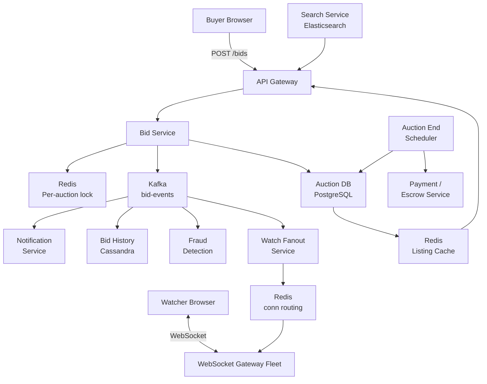

eBay combines two genuinely hard problems in one product: a marketplace (catalog, search, payments) and a real-time auction engine (bid placement under contention, proxy bidding, last-second snipes). Most candidates design the marketplace and skip the auction mechanics. That is a mistake. The auction engine is the interesting part: bid placement is a distributed locking problem, proxy bidding is a state machine problem, and the bid sniper problem (sniping all bids in the last 10 seconds) forces a design decision about auction fairness that has no clean technical answer.

## Series concepts

### Introduced here

- **Auction state machine**: PENDING -> ACTIVE -> ENDED, with bid placement only valid in ACTIVE state. Any bid past the end time is rejected. The state machine is the financial source of truth.
- **Proxy bidding**: users submit a maximum bid, not a specific bid amount. The system automatically outbids competitors on their behalf up to their maximum. This keeps the current price one increment above the second-highest max bid.
- **Bid sniper problem**: legitimate users place bids in the final seconds to deny others the chance to counter-bid. Anti-snipe extension (automatically extend the auction by N minutes if a bid arrives in the last M seconds) is a policy decision, not a technical one.
- **Payment escrow**: buyer pays immediately, funds held until seller ships and buyer confirms receipt. Escrow service sits between payment processor and seller payout.

### Carried forward from prior entries

- **Distributed locking** ([Ticketmaster](./ticketmaster/)): bid placement requires an atomic check-and-update. The same Redis `SET NX PX` lock that reserves a seat now ensures only one bid wins a race condition. Two users bidding at the same millisecond cannot both win.
- **Redis sorted sets** ([News Feed](./facebook-news-feed/), [LeetCode](./leetcode/)): active auctions sorted by end_time. `ZADD auctions:ending {end_timestamp} {auction_id}` enables efficient queries for "which auctions end in the next 10 minutes" -- the hot set that needs real-time bid traffic.
- **WebSocket connection routing** ([WhatsApp](./whatsapp/), [Uber](./uber/)): watchers of an active auction receive real-time bid updates. The same `conn:{user_id} -> gateway_server_id` Redis routing table pushes new bids to all connected watchers.
- **Kafka event pipeline** (all prior entries): every bid placed is published to a Kafka topic for downstream consumers -- analytics, fraud detection, notification service, and bid history storage.
- **ID generation** ([Bitly](./bitly/)): auction IDs, listing IDs, and bid IDs are all Snowflake-style 64-bit integers. Monotonically increasing IDs provide implicit ordering without a separate timestamp sort.
- **Idempotent writes** ([Ad Click Aggregator](./ad-click-aggregator/)): bids carry a client-generated idempotency key. A retry from a dropped network connection cannot create a duplicate bid.

## Clarifying questions

- **Auction types**: English auction (ascending price, highest wins) only, or also Dutch (descending), reserve price, buy-it-now?
- **Auction duration**: fixed end time, or rolling (extend on bid)?
- **Proxy bidding**: does the system auto-bid on the user's behalf, or do users place explicit bids?
- **Payment flow**: buyer pays at auction end, or pay-to-bid model?
- **Scale**: how many active auctions? How many bids per second at peak?
- **Search**: structured product catalog (taxonomy + attributes) or free-text only?

What the answers reveal:
- Buy-it-now + auction on the same listing adds inventory management complexity (must prevent both a bid and a buy-it-now from succeeding simultaneously)
- Auto-extension for anti-snipe changes the bid pipeline (must check time remaining on every bid and conditionally update the end_time)
- Proxy bidding requires storing max_bid per user per auction (sensitive data -- not visible to other users or the seller)

For this walkthrough: English auction, fixed end time (with optional anti-snipe extension), proxy bidding, buyer pays at auction close, 100M active listings, 10M auctions ending per day.

## Estimation

```
Active listings:   100M
Auctions ending:   10M/day = 116/sec
Bids/auction:      avg 30 bids over lifetime, 10 in final 60 seconds
Total bids/day:    10M * 30 = 300M bids/day = 3,472 bid QPS
Peak bid QPS:      auctions cluster at round times (9pm, Sunday)
                   assume 5% of daily auctions end in same hour
                   = 500K auctions/hour * 10 final-minute bids
                   = 5M bids/hour = 1,389 bids/sec peak
                   Burst (last 60s of popular auction): 100 bids/sec per auction

Listing reads:
  20M DAU * 30 page views = 600M reads/day = 6,944 read QPS

Active auction watchers:
  100K concurrent watchers across hot auctions at peak
  Each receives a WebSocket push per new bid
  Peak: 100 bids/sec * avg 50 watchers = 5,000 WebSocket pushes/sec

Storage:
  Listings: 100M * 5 KB (title, description, images metadata) = 500 GB
  Bids: 300M/day * 100 bytes * 365 days = 10.9 TB/year
  Images: avg 8 images/listing * 100M listings * 200 KB = 160 TB (S3)
```

**Conclusion**: bid QPS (3,472 steady, burst to 100/sec per auction) is manageable with a relational DB at the per-auction level, but not with a single global lock. The key is per-auction locking -- each auction's bids are independent, so 10M auctions provide 10M independent lock namespaces.

## High-level design



APIs:

```
POST /auctions
  body:    { listing_id, start_price, reserve_price?, end_time, buy_it_now_price? }
  returns: { auction_id, status: "pending" }

POST /auctions/{id}/bids
  body:    { max_bid: decimal, idempotency_key: uuid }
  returns: { bid_id, current_price, is_winning: bool }
          or 409 if outbid immediately by existing proxy bid
          or 410 if auction has ended

GET /auctions/{id}
  returns: { auction_id, current_price, bid_count, end_time, status,
             time_remaining_seconds, winning_bidder_id }

WebSocket /auctions/{id}/watch
  server pushes: { type: "new_bid", current_price, bid_count, time_remaining_seconds }
                 { type: "auction_ended", winner_id, final_price }
```

## Deep dive: bid placement with distributed lock

Bid placement is a check-and-write that must be atomic: check that the auction is still active, check that the new max_bid exceeds the current highest, update current_price, record the bid. Two concurrent bids must not both succeed at the same price.

```python
import redis
import uuid

r = redis.Redis()

def place_bid(auction_id: str, user_id: str, max_bid: float, idempotency_key: str) -> dict:
    lock_key = f"auction:lock:{auction_id}"
    lock_val = str(uuid.uuid4())
    # Acquire per-auction lock (10-second TTL -- enough for one bid processing cycle)
    acquired = r.set(lock_key, lock_val, nx=True, px=10_000)
    if not acquired:
        raise RetryableError("auction temporarily busy, retry")

    try:
        auction = db.get_auction(auction_id)

        if auction["status"] != "ACTIVE":
            raise AuctionEndedError()
        if auction["end_time"] <= now():
            raise AuctionEndedError()

        # Check for existing bid from this user (proxy bid update)
        existing = db.get_bid(auction_id, user_id)
        if existing and existing["max_bid"] >= max_bid:
            raise BidTooLowError("your existing max bid is already higher")

        # Proxy bid resolution: new current_price = min(max_bid, second_highest_max + increment)
        second_highest = db.get_second_highest_max_bid(auction_id, exclude_user=user_id)
        increment = get_bid_increment(auction["current_price"])
        new_current = min(max_bid, second_highest + increment) if second_highest else auction["start_price"]

        if max_bid <= auction["current_price"]:
            return {"is_winning": False, "current_price": auction["current_price"]}

        # Idempotency: check if this key was already processed
        if db.bid_exists_by_idempotency_key(idempotency_key):
            return db.get_bid_result(idempotency_key)

        bid_id = snowflake_id()
        db.write_bid(auction_id, user_id, bid_id, max_bid, new_current, idempotency_key)
        db.update_auction_current_price(auction_id, new_current, winning_bidder=user_id)

        # Anti-snipe: if bid arrives within 5 minutes of end, extend by 5 minutes
        if auction["end_time"] - now() < 300:
            db.extend_auction(auction_id, seconds=300)

        publish_bid_event(auction_id, bid_id, new_current)

        return {"bid_id": bid_id, "current_price": new_current, "is_winning": True}
    finally:
        # Release lock only if we still own it
        release_lock(r, lock_key, lock_val)
```

The per-auction lock (not a global lock) means 10M active auctions have 10M independent lock namespaces. Contention only occurs within a single auction, and only in the final minutes when bid frequency is highest.

## Deep dive: proxy bidding

Proxy bidding (eBay's "automatic bidding") means the user states their maximum willingness to pay, and the system bids on their behalf. The current displayed price is always the minimum amount needed to beat the second-highest bidder by one increment.

```python
BID_INCREMENTS = [
    (1.00,   0.05),
    (5.00,   0.25),
    (25.00,  0.50),
    (100.00, 1.00),
    (250.00, 2.50),
    (500.00, 5.00),
    (1000.00, 10.00),
    (2500.00, 25.00),
    (float("inf"), 50.00),
]

def get_bid_increment(current_price: float) -> float:
    for threshold, increment in BID_INCREMENTS:
        if current_price < threshold:
            return increment
    return 50.00

def resolve_proxy_bids(auction_id: str):
    """Re-resolve after any bid to set correct current price."""
    top_two = db.get_top_two_max_bids(auction_id)
    if len(top_two) < 2:
        return top_two[0]["max_bid"] if top_two else 0

    winner_max = top_two[0]["max_bid"]
    second_max = top_two[1]["max_bid"]
    increment = get_bid_increment(second_max)
    current_price = min(winner_max, second_max + increment)
    db.set_current_price(auction_id, current_price, winner=top_two[0]["user_id"])
    return current_price
```

A critical invariant: the displayed current price is always less than or equal to the winning bidder's max_bid, and always one increment above the second-highest max_bid. Max bids are never revealed to other users or the seller -- only the current price is visible.

## Deep dive: real-time bid updates

Watchers of an active auction receive live bid updates via WebSocket. The connection routing table from [WhatsApp](./whatsapp/) and [Uber](./uber/) is reused directly:

```python
def publish_bid_event(auction_id: str, bid_id: str, new_price: float):
    event = {
        "type": "new_bid",
        "auction_id": auction_id,
        "bid_id": bid_id,
        "current_price": new_price,
        "bid_count": db.get_bid_count(auction_id),
        "time_remaining_seconds": db.get_time_remaining(auction_id),
    }
    # Publish to Kafka for durability and fan-out
    kafka.produce("bid-events", key=auction_id, value=json.dumps(event))

# Watch fanout consumer
def handle_bid_event(event: dict):
    auction_id = event["auction_id"]
    watchers = db.get_auction_watchers(auction_id)  # users who have this auction open
    for user_id in watchers:
        gateway_id = r.get(f"conn:{user_id}")
        if gateway_id:
            r.publish(f"gateway:{gateway_id}", json.dumps({
                "user_id": user_id,
                "payload": event,
            }))
        # Offline watchers get a push notification via notification service
```

Auction watcher lists are stored in Redis as a set: `SADD watchers:{auction_id} {user_id}` on WebSocket connect, `SREM` on disconnect. TTL = auction end time. For a popular auction with 10,000 watchers and 100 bids/sec in the final minute, that is 1M Redis publishes/sec peak for that one auction. Mitigate with broadcast to a pub/sub channel instead of per-user publishes:

```python
# Instead of per-user publish, publish once to auction channel
r.publish(f"auction:{auction_id}:bids", json.dumps(event))

# Gateway servers subscribe to all auctions their connected users are watching
# On receiving a channel message, fan out to all local WebSocket connections watching that auction
```

## Deep dive: auction end and payment

When an auction ends, the Auction End Scheduler picks it up (polls `ZRANGEBYSCORE auctions:ending 0 {now}` every 10 seconds) and triggers the close flow:

```python
def close_auction(auction_id: str):
    with db.transaction():
        auction = db.lock_and_get(auction_id)
        if auction["status"] != "ACTIVE":
            return  # idempotent: already closed

        winner = db.get_winning_bidder(auction_id)
        final_price = auction["current_price"]

        if winner and final_price >= auction.get("reserve_price", 0):
            db.update_auction(auction_id, status="ENDED", winner_id=winner, final_price=final_price)
            payment_service.create_escrow(
                buyer_id=winner,
                seller_id=auction["seller_id"],
                amount=final_price,
                auction_id=auction_id,
            )
            kafka.produce("auction-ended", { "auction_id": auction_id, "winner": winner, "price": final_price })
        else:
            db.update_auction(auction_id, status="ENDED_NO_SALE")

        r.zrem("auctions:ending", auction_id)
```

The payment escrow flow: buyer is charged immediately. Funds are held by eBay. When the seller marks the item as shipped and the buyer confirms receipt (or a 14-day window expires), eBay releases funds to the seller. Disputes pause the release and route to customer support.

The escrow payment is idempotent: `create_escrow` uses `auction_id` as an idempotency key. Retries from crashes do not double-charge.

## Failure modes

**Bid service crash mid-auction**: the per-auction Redis lock has a 10-second TTL. If the bid service crashes while holding the lock, the lock expires and the next bid request acquires it. The interrupted bid may have partially written -- check for the idempotency key on recovery. If found, return the existing result; if not, the bid was never committed and the user should retry.

**Auction End Scheduler failure**: auctions past their end time remain in ACTIVE state. A watchdog alerts if any auction in `auctions:ending` has an end_time more than 60 seconds in the past without transitioning to ENDED. On recovery, the scheduler processes the backlog in end_time order. Late closure adds minutes of extra bidding time -- acceptable as a degraded mode.

**Redis connection routing table failure**: bid watchers do not receive real-time updates. They fall back to polling `GET /auctions/{id}` every 5 seconds. Bids are still accepted and recorded. The auction continues correctly -- only real-time delivery is degraded.

**Payment escrow service unavailable**: auction closes, winner is recorded in the DB, but escrow creation fails. A Kafka consumer retries the `create_escrow` call with exponential backoff. The idempotency key prevents double-charging when the service recovers.

**Fraudulent bid**: a user places a high bid and then never pays. Fraud detection (downstream Kafka consumer, ML model on bid velocity, account age, payment history) flags the bid. Post-auction: unpaid item process, negative feedback, account suspension. Pre-auction: require verified payment method before allowing bids above a threshold.

## Key takeaways

**Per-auction locking, not global locking, is the key insight.** A global lock for all bids would serialize every bid across every auction -- catastrophic at 3,472 bids/sec. Scoping the lock to `auction:{auction_id}` gives 10M independent lock namespaces. Contention only occurs within one auction, and only during the final high-activity minutes.

**Proxy bidding requires storing max bids as a secret.** The displayed current price is derived from the top two max bids -- but the max bids themselves are private. This means two separate values per user per auction: their max_bid (private) and the derived current_price (public). Never return max_bid in any API response to a user other than the owner.

**The bid sniper problem has no clean technical fix.** Anti-snipe extension (auto-extend on late bid) is a business policy, not a technical solution. Some marketplaces (Amazon auctions) use it; eBay does not. The design must make the policy configurable at the auction level, not hardcoded.

**The WebSocket fan-out pattern from WhatsApp and Uber is identical here.** The conn routing table, Redis pub/sub, and gateway architecture are the same. Recognizing this in an interview -- "this is the same real-time delivery layer we designed for the chat system" -- demonstrates pattern recognition across systems.

**Payment escrow needs its own idempotency layer.** The auction close flow spans multiple services (auction DB, payment service, notification). Any step can fail. The entire flow must be retryable with idempotent operations at each step. This is the saga pattern applied to the payment flow.

## References

- [eBay architecture overview (InfoQ)](https://www.infoq.com/presentations/ebay-architecture/)
- [Designing Data-Intensive Applications, Kleppmann, Chapter 9 (consistency and consensus)](https://dataintensive.net/)
- [Redis distributed locking (Redlock)](https://redis.io/docs/manual/patterns/distributed-locks/)
- [Martin Fowler: Saga pattern](https://martinfowler.com/articles/patterns-of-distributed-systems/saga.html)

## Related topics

- [Interview Framework](../interview-framework/), the 4-step approach used in this walkthrough
- [Distributed Locking](../../distributed-locking/), the Redis lock primitives used for bid placement
- [Message Queues](../../message-queues/), Kafka bid event pipeline
- [Ticketmaster](./ticketmaster/), the same distributed lock pattern for seat reservation
- [WhatsApp](./whatsapp/), the same WebSocket routing table for real-time bid delivery
- [Ad Click Aggregator](./ad-click-aggregator/), idempotent event recording
- [Saga Pattern](../../saga-pattern/), the payment escrow close flow
