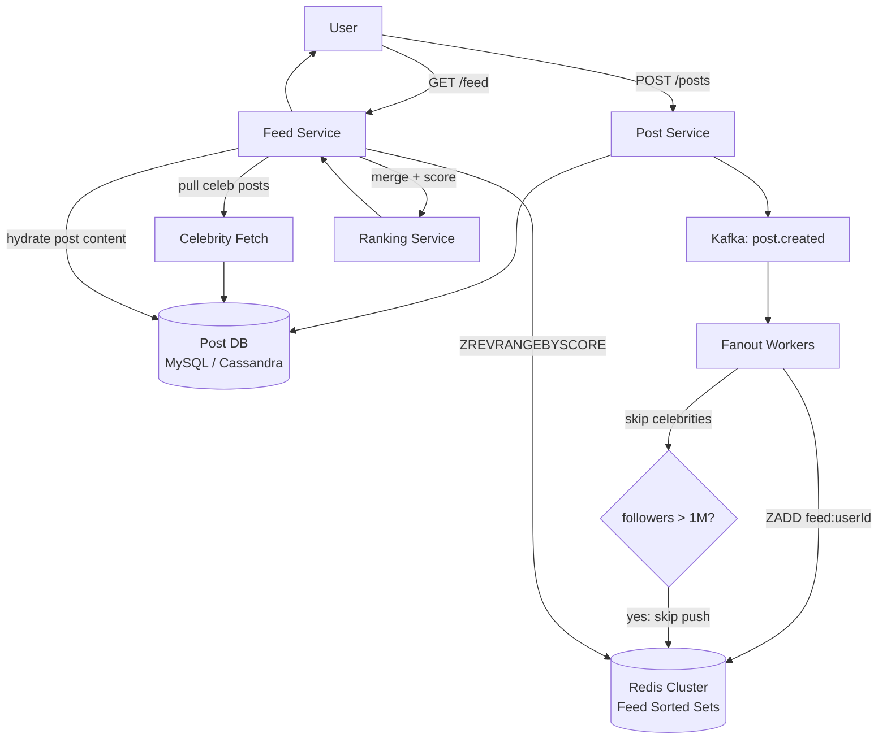

The Facebook News Feed is a read amplification problem. One post from a user with 5,000 friends must appear in 5,000 feeds within seconds. At 3 billion users and 100 million posts per day, the read-to-write ratio approaches 100:1. The architecture is driven entirely by this ratio: every design decision optimizes for read throughput, not write throughput. The most important interview question here is not "how do you store posts?" but "how do you fanout a post to follower feeds efficiently?" -- and the answer requires knowing when to push (fan-out on write) and when to pull (fan-out on read).

An existing [Social Feed case study](../social-feed/) covers this problem in depth from first principles. This entry focuses on the Facebook-specific angle (EdgeRank, the privacy graph, reactions) and on the fanout pattern that carries forward into WhatsApp and Ticketmaster.

## Series concepts

### Introduced here

- **Fan-out on write (push model):** on post creation, write the post_id into every follower's feed cache. Fast reads, expensive writes for high-follower accounts.
- **Fan-out on read (pull model):** on feed load, query all followees' recent posts and merge. Cheap writes, expensive reads. Impractical at 100:1 read/write ratio.
- **Celebrity problem:** fan-out on write for an account with 10 million followers means 10 million Redis writes per post. The hybrid strategy pushes for regular users and pulls for celebrities at read time.
- **Redis sorted set as a feed:** `ZADD feed:{user_id} {timestamp} {post_id}`. O(log n) insert, O(log n + k) range read. Score is timestamp; members are post IDs. Feed retrieval is a single Redis command.
- **ML ranking as a second pass:** the sorted set holds recency-ordered candidates; a scoring service re-ranks by engagement probability, affinity, and content quality before returning the top 20 to the client.

### Carried forward from prior entries

- **Kafka ([Bitly](../bitly/)):** post creation events publish to Kafka; fanout workers consume and write to follower feeds.
- **Redis ([Bitly](../bitly/)):** feed storage uses Redis sorted sets, same cluster introduced for URL caching.
- **Distributed locking ([Ticketmaster](../ticketmaster/)):** feed mutation consistency uses locking to prevent concurrent fanout workers from corrupting the same user's feed.

## Clarifying questions

Ask these before drawing anything:

- **Scale**: how many users? DAU? Posts per day?
- **Social graph type**: directed (follow) or undirected (friend)? Mutual required?
- **Feed composition**: only text/image posts, or also stories, ads, events, suggested content?
- **Privacy**: can users restrict who sees their posts?
- **Ranking**: chronological or algorithmic ranking?
- **Real-time**: how stale is acceptable? Minutes? Seconds?

What the answers reveal:

- Directed follow vs mutual friendship changes the fanout fan-in ratio (celebrities have asymmetric graphs)
- Ads and suggested content mean the feed service must merge organic content with separate ranked pipelines
- Privacy restrictions require filtering at fanout time or at read time
- Algorithmic ranking (EdgeRank) adds a scoring pipeline between candidate retrieval and delivery

For this walkthrough: 3B users, 1B DAU, directed follow graph, 0.1 posts/user/day, algorithmic ranking, privacy enforced at write time, posts stale by up to 10 seconds is acceptable.

## Estimation

```
Write QPS (posts):
  1B DAU * 0.1 posts/day = 100M posts/day
  100M / 86,400 = 1,157 post writes/sec

Fanout writes per post:
  Average follower count: 200
  Fanout writes/sec: 1,157 * 200 = 231,400 Redis writes/sec

Celebrity posts:
  Account with 10M followers: 10M Redis writes for 1 post
  Must be handled separately (pull strategy)

Feed reads:
  1B DAU * 10 feed loads/day = 10B reads/day
  10B / 86,400 = 115,741 read QPS
  Peak (3x): ~347,000 read QPS

Feed storage in Redis:
  500M active users (half of DAU have active feeds)
  1,000 post IDs per feed (trimmed)
  Each post ID: 8 bytes + sorted set overhead ~58 bytes/entry
  500M * 1,000 * 58 bytes = ~29 TB Redis Cluster required

Post content DB:
  100M posts/day * 1 KB average = 100 GB/day
  5 years: ~182 TB
```

**Capacity driver**: 115K read QPS dwarfs 1,157 write QPS. The system exists to serve reads. 29 TB of Redis requires a large cluster (Redis Cluster with 10+ shards). Feed storage is expensive; trimming feeds to 1,000 entries per user keeps memory bounded.

## High-level design



Core endpoints:

```
POST /posts
  body:    { content, media_urls: [], privacy: 'public' | 'friends' | 'custom' }
  returns: { post_id, created_at }

GET /feed
  params:  { cursor?: string, limit?: int }
  returns: { posts: [...], next_cursor: string }

POST /posts/{post_id}/reactions
  body:    { reaction_type: 'like' | 'love' | 'haha' | 'wow' | 'sad' | 'angry' }
  returns: { reaction_id, post_id, reaction_count }
```

## Deep dive: fan-out strategies

**Fan-out on write (push):** when a user posts, a fanout worker writes the post_id to every follower's feed sorted set.

```python
from kafka import KafkaConsumer
import json

r = redis.Redis(cluster=True, host='redis-cluster')

FEED_MAX_LENGTH = 1000
CELEBRITY_THRESHOLD = 1_000_000

def fanout_worker():
    consumer = KafkaConsumer('post.created', group_id='fanout-workers')
    for msg in consumer:
        event = json.loads(msg.value)
        post_id = event['post_id']
        author_id = event['author_id']
        timestamp = event['created_at_ms']  # Unix ms as score

        followers = get_followers(author_id)

        if len(followers) > CELEBRITY_THRESHOLD:
            # celebrity: skip push, will pull at read time
            mark_celebrity_post(author_id, post_id, timestamp)
            continue

        # push to all follower feeds
        pipe = r.pipeline(transaction=False)
        for follower_id in followers:
            feed_key = f"feed:{follower_id}"
            pipe.zadd(feed_key, {post_id: timestamp})
            # trim to max length (remove oldest entries beyond 1000)
            pipe.zremrangebyrank(feed_key, 0, -(FEED_MAX_LENGTH + 1))
        pipe.execute()
```

```typescript
import { Kafka } from 'kafkajs';
import { createClient } from 'redis';

const r = createClient({ url: 'redis://redis-cluster:6379' });
await r.connect();

const FEED_MAX_LENGTH = 1000;
const CELEBRITY_THRESHOLD = 1_000_000;

interface PostCreatedEvent {
  post_id: string;
  author_id: string;
  created_at_ms: number;
}

async function fanoutWorker(): Promise<void> {
  const kafka = new Kafka({ clientId: 'fanout', brokers: ['kafka:9092'] });
  const consumer = kafka.consumer({ groupId: 'fanout-workers' });
  await consumer.connect();
  await consumer.subscribe({ topic: 'post.created' });

  await consumer.run({
    eachMessage: async ({ message }) => {
      const event: PostCreatedEvent = JSON.parse(message.value!.toString());
      const { post_id, author_id, created_at_ms: timestamp } = event;

      const followers = await getFollowers(author_id);

      if (followers.length > CELEBRITY_THRESHOLD) {
        await markCelebrityPost(author_id, post_id, timestamp);
        return;
      }

      // push to all follower feeds
      const pipeline = r.multi();
      for (const followerId of followers) {
        const feedKey = `feed:${followerId}`;
        pipeline.zAdd(feedKey, [{ score: timestamp, value: post_id }]);
        pipeline.zRemRangeByRank(feedKey, 0, -(FEED_MAX_LENGTH + 1));
      }
      await pipeline.exec();
    },
  });
}
```

```go
package main

import (
	"context"
	"encoding/json"
	"fmt"

	"github.com/redis/go-redis/v9"
	kafka "github.com/segmentio/kafka-go"
)

var rdb = redis.NewClient(&redis.Options{Addr: "redis-cluster:6379"})

const feedMaxLength = 1000
const celebrityThreshold = 1_000_000

type PostCreatedEvent struct {
	PostID      string  `json:"post_id"`
	AuthorID    string  `json:"author_id"`
	CreatedAtMs float64 `json:"created_at_ms"`
}

func fanoutWorker(ctx context.Context) {
	reader := kafka.NewReader(kafka.ReaderConfig{
		Brokers: []string{"kafka:9092"},
		Topic:   "post.created",
		GroupID: "fanout-workers",
	})
	defer reader.Close()

	for {
		msg, err := reader.ReadMessage(ctx)
		if err != nil {
			break
		}

		var event PostCreatedEvent
		if err := json.Unmarshal(msg.Value, &event); err != nil {
			continue
		}

		followers, _ := getFollowers(ctx, event.AuthorID)

		if len(followers) > celebrityThreshold {
			markCelebrityPost(ctx, event.AuthorID, event.PostID, event.CreatedAtMs)
			continue
		}

		pipe := rdb.Pipeline()
		for _, followerID := range followers {
			feedKey := fmt.Sprintf("feed:%s", followerID)
			pipe.ZAdd(ctx, feedKey, redis.Z{Score: event.CreatedAtMs, Member: event.PostID})
			pipe.ZRemRangeByRank(ctx, feedKey, 0, int64(-(feedMaxLength + 1)))
		}
		pipe.Exec(ctx)
	}
}
```

**Fan-out on read (pull):** for celebrities, fetch their recent posts at read time and merge into the candidate set.

```python
def get_celebrity_posts(user_id: str) -> list[dict]:
    """Fetch recent posts from all celebrities the user follows."""
    celebrity_followees = get_celebrity_followees(user_id)
    all_posts = []
    for celeb_id in celebrity_followees:
        posts = post_db.query("""
            SELECT post_id, created_at
            FROM posts
            WHERE author_id = %s
            ORDER BY created_at DESC
            LIMIT 50
        """, celeb_id)
        all_posts.extend(posts)
    return all_posts
```

```typescript
async function getCelebrityPosts(userId: string): Promise<Array<{ post_id: string; created_at: number }>> {
  const celebrityFollowees = await getCelebrityFollowees(userId);
  const allPosts: Array<{ post_id: string; created_at: number }> = [];

  for (const celebId of celebrityFollowees) {
    const posts = await postDb.query(
      `SELECT post_id, created_at
       FROM posts
       WHERE author_id = $1
       ORDER BY created_at DESC
       LIMIT 50`,
      [celebId]
    );
    allPosts.push(...posts);
  }
  return allPosts;
}
```

```go
func getCelebrityPosts(ctx context.Context, userID string) ([]map[string]interface{}, error) {
	celebrityFollowees, err := getCelebrityFollowees(ctx, userID)
	if err != nil {
		return nil, err
	}

	var allPosts []map[string]interface{}
	for _, celebID := range celebrityFollowees {
		posts, err := postDB.QueryContext(ctx, `
			SELECT post_id, created_at
			FROM posts
			WHERE author_id = $1
			ORDER BY created_at DESC
			LIMIT 50`, celebID)
		if err != nil {
			continue
		}
		allPosts = append(allPosts, posts...)
	}
	return allPosts, nil
}
```

**Hybrid read path:**

```python
def get_feed_candidates(user_id: str, limit: int = 200) -> list[str]:
    # 1. read from push feed (regular followees)
    feed_key = f"feed:{user_id}"
    push_post_ids = r.zrevrangebyscore(
        feed_key, '+inf', '-inf', start=0, num=limit
    )

    # 2. pull from celebrities the user follows
    celeb_posts = get_celebrity_posts(user_id)
    celeb_post_ids = [p['post_id'] for p in celeb_posts]

    # 3. merge and deduplicate
    all_candidates = list(dict.fromkeys(push_post_ids + celeb_post_ids))
    return all_candidates[:limit]
```

```typescript
async function getFeedCandidates(userId: string, limit: number = 200): Promise<string[]> {
  const feedKey = `feed:${userId}`;

  // 1. read from push feed (regular followees)
  const pushEntries = await r.zRangeWithScores(feedKey, 0, limit - 1, { REV: true });
  const pushPostIds = pushEntries.map(e => e.value);

  // 2. pull from celebrities the user follows
  const celebPosts = await getCelebrityPosts(userId);
  const celebPostIds = celebPosts.map(p => p.post_id);

  // 3. merge and deduplicate
  const seen = new Set<string>();
  const allCandidates: string[] = [];
  for (const id of [...pushPostIds, ...celebPostIds]) {
    if (!seen.has(id)) {
      seen.add(id);
      allCandidates.push(id);
    }
  }
  return allCandidates.slice(0, limit);
}
```

```go
func getFeedCandidates(ctx context.Context, userID string, limit int) ([]string, error) {
	if limit == 0 {
		limit = 200
	}
	feedKey := fmt.Sprintf("feed:%s", userID)

	// 1. read from push feed (regular followees)
	pushEntries, err := rdb.ZRevRangeWithScores(ctx, feedKey, 0, int64(limit-1)).Result()
	if err != nil {
		return nil, err
	}
	pushPostIDs := make([]string, 0, len(pushEntries))
	for _, e := range pushEntries {
		pushPostIDs = append(pushPostIDs, e.Member.(string))
	}

	// 2. pull from celebrities the user follows
	celebPosts, _ := getCelebrityPosts(ctx, userID)
	celebPostIDs := make([]string, 0, len(celebPosts))
	for _, p := range celebPosts {
		celebPostIDs = append(celebPostIDs, fmt.Sprintf("%v", p["post_id"]))
	}

	// 3. merge and deduplicate
	seen := make(map[string]bool)
	var allCandidates []string
	for _, id := range append(pushPostIDs, celebPostIDs...) {
		if !seen[id] {
			seen[id] = true
			allCandidates = append(allCandidates, id)
		}
	}
	if len(allCandidates) > limit {
		allCandidates = allCandidates[:limit]
	}
	return allCandidates, nil
}
```

## Deep dive: feed storage with Redis sorted sets

A Redis sorted set maps score (timestamp) to member (post_id). ZADD is O(log n); ZREVRANGEBYSCORE is O(log n + k) where k is the number of results returned. The data structure is a perfect fit for recency-ordered feeds.

```python
import time

def add_to_feed(follower_id: str, post_id: str, timestamp_ms: float):
    """Add a post to a user's feed. Trim to max length."""
    key = f"feed:{follower_id}"
    r.zadd(key, {post_id: timestamp_ms})
    # keep only the 1000 most recent (highest scores)
    r.zremrangebyrank(key, 0, -(FEED_MAX_LENGTH + 1))

def read_feed_page(user_id: str, cursor_score: float = None, page_size: int = 20) -> tuple[list, float]:
    """
    Read a page of feed entries using cursor-based pagination.
    cursor_score is the score of the last item on the previous page.
    """
    key = f"feed:{user_id}"
    max_score = cursor_score - 1 if cursor_score else '+inf'

    entries = r.zrevrangebyscore(
        key,
        max_score,
        '-inf',
        start=0,
        num=page_size,
        withscores=True
    )

    post_ids = [post_id.decode() for post_id, _ in entries]
    next_cursor = entries[-1][1] if entries else None
    return post_ids, next_cursor
```

```typescript
async function addToFeed(followerId: string, postId: string, timestampMs: number): Promise<void> {
  const key = `feed:${followerId}`;
  await r.zAdd(key, [{ score: timestampMs, value: postId }]);
  // keep only the 1000 most recent (highest scores)
  await r.zRemRangeByRank(key, 0, -(FEED_MAX_LENGTH + 1));
}

interface FeedPage {
  postIds: string[];
  nextCursor: number | null;
}

async function readFeedPage(
  userId: string,
  cursorScore: number | null = null,
  pageSize: number = 20
): Promise<FeedPage> {
  const key = `feed:${userId}`;
  const maxScore = cursorScore != null ? cursorScore - 1 : '+inf';

  const entries = await r.zRangeByScoreWithScores(key, maxScore, '-inf', {
    REV: true,
    LIMIT: { offset: 0, count: pageSize },
  });

  const postIds = entries.map(e => e.value);
  const nextCursor = entries.length > 0 ? entries[entries.length - 1].score : null;
  return { postIds, nextCursor };
}
```

```go
func addToFeed(ctx context.Context, followerID string, postID string, timestampMs float64) error {
	key := fmt.Sprintf("feed:%s", followerID)
	if err := rdb.ZAdd(ctx, key, redis.Z{Score: timestampMs, Member: postID}).Err(); err != nil {
		return err
	}
	// keep only the 1000 most recent (highest scores)
	return rdb.ZRemRangeByRank(ctx, key, 0, int64(-(feedMaxLength+1))).Err()
}

type FeedPage struct {
	PostIDs    []string
	NextCursor *float64
}

func readFeedPage(ctx context.Context, userID string, cursorScore *float64, pageSize int) (FeedPage, error) {
	if pageSize == 0 {
		pageSize = 20
	}
	key := fmt.Sprintf("feed:%s", userID)

	maxScore := "+inf"
	if cursorScore != nil {
		maxScore = fmt.Sprintf("(%f", *cursorScore)
	}

	entries, err := rdb.ZRevRangeByScoreWithScores(ctx, key, &redis.ZRangeBy{
		Max:    maxScore,
		Min:    "-inf",
		Offset: 0,
		Count:  int64(pageSize),
	}).Result()
	if err != nil {
		return FeedPage{}, err
	}

	postIDs := make([]string, len(entries))
	for i, e := range entries {
		postIDs[i] = e.Member.(string)
	}

	var nextCursor *float64
	if len(entries) > 0 {
		s := entries[len(entries)-1].Score
		nextCursor = &s
	}
	return FeedPage{PostIDs: postIDs, NextCursor: nextCursor}, nil
}
```

The sorted set stores only post IDs, never content. At read time, post content is bulk-fetched from the post database (with read replicas) using a single multi-key lookup. This keeps Redis memory usage at 58 bytes/entry rather than 1 KB/entry, enabling 29 TB to fit in a manageable cluster.

## Deep dive: EdgeRank and ML ranking

Chronological order is not the same as relevance. Facebook's EdgeRank (now a deep learning model) re-ranks candidates by predicted engagement.

```python
from dataclasses import dataclass
from typing import Protocol

@dataclass
class Post:
    post_id: str
    author_id: str
    content_type: str  # 'text', 'photo', 'video', 'link'
    created_at_ms: float
    reaction_count: int
    comment_count: int
    share_count: int

class RankingFeatures:
    @staticmethod
    def affinity_score(viewer_id: str, author_id: str) -> float:
        """How much does viewer interact with author? (0.0 - 1.0)"""
        interactions = interaction_db.count_recent(
            viewer_id, author_id, days=90
        )
        return min(interactions / 100.0, 1.0)

    @staticmethod
    def edge_weight(post: Post) -> float:
        """Weight by content type and engagement signals."""
        type_weights = {'video': 1.5, 'photo': 1.2, 'link': 0.9, 'text': 1.0}
        base = type_weights.get(post.content_type, 1.0)
        engagement = (
            post.reaction_count * 1.0 +
            post.comment_count * 2.0 +
            post.share_count * 3.0
        )
        return base * (1 + 0.01 * engagement)

    @staticmethod
    def time_decay(post: Post, now_ms: float) -> float:
        """Newer posts score higher."""
        age_hours = (now_ms - post.created_at_ms) / 3_600_000
        return 1.0 / (1.0 + age_hours * 0.1)

def rank_candidates(viewer_id: str, candidates: list[Post]) -> list[Post]:
    now_ms = time.time() * 1000
    scored = []
    for post in candidates:
        score = (
            RankingFeatures.affinity_score(viewer_id, post.author_id)
            * RankingFeatures.edge_weight(post)
            * RankingFeatures.time_decay(post, now_ms)
        )
        scored.append((score, post))
    scored.sort(reverse=True)
    return [post for _, post in scored]
```

```typescript
interface Post {
  post_id: string;
  author_id: string;
  content_type: 'text' | 'photo' | 'video' | 'link';
  created_at_ms: number;
  reaction_count: number;
  comment_count: number;
  share_count: number;
}

class RankingFeatures {
  static async affinityScore(viewerId: string, authorId: string): Promise<number> {
    const interactions = await interactionDb.countRecent(viewerId, authorId, 90);
    return Math.min(interactions / 100.0, 1.0);
  }

  static edgeWeight(post: Post): number {
    const typeWeights: Record<string, number> = { video: 1.5, photo: 1.2, link: 0.9, text: 1.0 };
    const base = typeWeights[post.content_type] ?? 1.0;
    const engagement =
      post.reaction_count * 1.0 +
      post.comment_count * 2.0 +
      post.share_count * 3.0;
    return base * (1 + 0.01 * engagement);
  }

  static timeDecay(post: Post, nowMs: number): number {
    const ageHours = (nowMs - post.created_at_ms) / 3_600_000;
    return 1.0 / (1.0 + ageHours * 0.1);
  }
}

async function rankCandidates(viewerId: string, candidates: Post[]): Promise<Post[]> {
  const nowMs = Date.now();
  const scored: Array<[number, Post]> = await Promise.all(
    candidates.map(async post => {
      const score =
        (await RankingFeatures.affinityScore(viewerId, post.author_id)) *
        RankingFeatures.edgeWeight(post) *
        RankingFeatures.timeDecay(post, nowMs);
      return [score, post] as [number, Post];
    })
  );
  scored.sort((a, b) => b[0] - a[0]);
  return scored.map(([, post]) => post);
}
```

```go
type Post struct {
	PostID        string
	AuthorID      string
	ContentType   string // "text", "photo", "video", "link"
	CreatedAtMs   float64
	ReactionCount int
	CommentCount  int
	ShareCount    int
}

func affinityScore(ctx context.Context, viewerID, authorID string) float64 {
	interactions := interactionDB.CountRecent(ctx, viewerID, authorID, 90)
	score := float64(interactions) / 100.0
	if score > 1.0 {
		return 1.0
	}
	return score
}

func edgeWeight(post Post) float64 {
	typeWeights := map[string]float64{"video": 1.5, "photo": 1.2, "link": 0.9, "text": 1.0}
	base, ok := typeWeights[post.ContentType]
	if !ok {
		base = 1.0
	}
	engagement := float64(post.ReactionCount)*1.0 +
		float64(post.CommentCount)*2.0 +
		float64(post.ShareCount)*3.0
	return base * (1 + 0.01*engagement)
}

func timeDecay(post Post, nowMs float64) float64 {
	ageHours := (nowMs - post.CreatedAtMs) / 3_600_000
	return 1.0 / (1.0 + ageHours*0.1)
}

type scoredPost struct {
	score float64
	post  Post
}

func rankCandidates(ctx context.Context, viewerID string, candidates []Post) []Post {
	nowMs := float64(time.Now().UnixMilli())
	scored := make([]scoredPost, len(candidates))
	for i, post := range candidates {
		s := affinityScore(ctx, viewerID, post.AuthorID) *
			edgeWeight(post) *
			timeDecay(post, nowMs)
		scored[i] = scoredPost{score: s, post: post}
	}
	sort.Slice(scored, func(i, j int) bool {
		return scored[i].score > scored[j].score
	})
	result := make([]Post, len(scored))
	for i, sp := range scored {
		result[i] = sp.post
	}
	return result
}
```

The ML model in production is far more complex (hundreds of features, deep learning), but the pipeline shape is the same: candidates from the sorted set, features computed per candidate, ranked by predicted engagement score, top N returned to the client.

## Failure modes

**Fanout worker lag**: the Kafka consumer group falls behind during a traffic spike. Users see stale feeds. Add more fanout workers (they join the consumer group and split load immediately). The lag is not dangerous (no data loss), but user experience degrades.

**Redis cluster node failure**: if a node holding feed data fails, users on that shard see empty feeds. Mitigate with Redis Cluster replication (each primary has a replica); AOF persistence for durability on restart.

**Feed cache cold start**: after a Redis cluster replacement or major failure, all 500M feeds are cache-cold. Rebuilding 29 TB of sorted sets from the database is slow (hours to days). Mitigate by keeping read replicas warm (Replica Of No One pattern) and by graceful degradation: fall back to pure pull mode while feeds are rebuilt.

**Celebrity post causes read hotspot**: a celebrity with 50M followers posts once. 50M feed reads in the next minute all include a pull query for that celebrity's posts. Cache recent celebrity posts per celebrity in Redis with a 60-second TTL; celebrity reads become a single Redis lookup rather than 50M database queries.

**Privacy graph inconsistency**: a user updates their privacy settings after a post is published. Fanout has already written the post to some followers' feeds. Enforce privacy at read time (not just write time) as a second filter: if the post is no longer visible to the viewer, skip it during feed hydration.

## Key takeaways

**Design for reads, not writes.** The 100:1 read/write ratio means every architectural decision should optimize for the 115K read QPS path. Fan-out on write pre-computes the expensive read-time merge into a cheap Redis range scan.

**Celebrity accounts break fan-out on write.** A single design that fans out to all followers fails at 10M followers per post. The hybrid strategy (push for regular users, pull for celebrities at read time) is the only way to handle both extremes without over-engineering the common case.

**Sorted sets are the right data structure for time-ordered feeds.** ZADD and ZREVRANGEBYSCORE are O(log n); cursor-based pagination is trivially implementable with score as the cursor. Do not store full post content in the sorted set: store only IDs and hydrate separately.

**Ranking is a second-pass operation over candidates.** Never rank at write time (the ranker does not know who will read the feed or when). Produce candidates from the sorted set, then score and re-rank at read time with per-viewer features.

**Feed trimming bounds memory.** Keeping only the 1,000 most recent entries per user keeps the sorted set bounded. Users who scroll to the 1,001st post get a database query rather than a cache hit: acceptable because deep scrolling is rare.

## References

- [Meta Engineering: How the news feed works](https://engineering.fb.com/2021/01/26/ml-applications/news-feed-ranking/)
- [Meta Engineering: Scaling the Facebook news feed](https://engineering.fb.com/2012/03/22/core-infra/introduction-to-facebook-s-data-infrastructure/)
- [System Design Interview Vol 2, Alex Xu, Chapter 11](https://bytebytego.com/)
- [Redis sorted sets documentation](https://redis.io/docs/data-types/sorted-sets/)

## Related topics

- [Social Feed case study](../social-feed/), foundational walkthrough of the same problem
- [Ticketmaster case study](../ticketmaster/), distributed locking carried forward here
- [WhatsApp case study](../whatsapp/), carries forward Redis connection routing and Kafka
- [Caching](../../caching/), Redis sorted set patterns and cluster sizing
- [Message Queues](../../message-queues/), Kafka fanout worker design
- [Scalability](../../scalability/), handling 115K read QPS with Redis Cluster
- [Databases](../../databases/), read replicas for post content hydration
