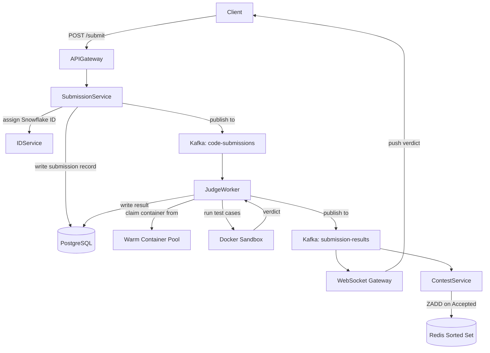

The online judge is one of the more unusual system design problems because the core bottleneck is not a database query or a network call: it is container startup time. Every other component in this system is straightforward to scale horizontally. The execution sandbox is not. Understanding that constraint early, and arriving at warm container pools as the solution, is what separates a strong answer from a mediocre one.

## Series concepts

### Introduced here

- **Sandboxed code execution**: Docker containers with seccomp profiles, cgroup resource limits (CPU, memory, wall-clock time), and disabled networking. The hard problem is isolating untrusted user code so one submission cannot affect another or harm the host.
- **Worker pool pattern**: a fixed pool of execution workers consumes from a bounded Kafka queue. Backpressure is signaled when the queue depth exceeds a threshold. Workers do not spin up on demand; pool size is tuned to the warm container count.
- **Warm container pool**: a background manager keeps N containers pre-started and idle. Submissions claim a container from the pool, execute, then return the container. Startup time drops from ~500ms (cold Docker pull + init) to under 50ms.
- **Test case runner**: each submission runs against N test cases sequentially. Execution halts on the first failure and returns the verdict: Accepted, Wrong Answer, Time Limit Exceeded, Memory Limit Exceeded, or Runtime Error.

### Carried forward from prior entries

- **Kafka job queue**: same async pipeline introduced in [URL Shortener](./url-shortener/) for analytics. Here it buffers code submissions between the API and the judge workers.
- **Redis sorted sets for leaderboard**: same data structure used in [Facebook News Feed](./facebook-news-feed/) for feed cache. Different semantics (score encodes penalty time rather than recency), same O(log N) insert and O(log N + K) range query.
- **WebSocket push**: same gateway routing pattern from [WhatsApp](./whatsapp/). When a submission result is ready, the result event flows back to the client over an open WebSocket connection.
- **Snowflake ID generation**: submission IDs use the same distributed ID service as [URL Shortener](./url-shortener/).

## Clarifying questions

Ask these before drawing anything:

- **Submission volume**: how many submissions per day? Is there a contest mode with burst traffic?
- **Languages supported**: Python, Java, C++? Each language has different runtime characteristics.
- **Test case count**: how many test cases per problem? Do test cases have large inputs?
- **Leaderboard requirements**: is a leaderboard needed? Real-time or periodically refreshed?
- **Plagiarism detection**: does the system need to detect copied solutions?

What the answers reveal:
- Contest mode (10x normal traffic) requires pre-scaling the container pool before the contest starts
- Language support determines which Docker images to maintain in the warm pool
- Large test cases (MB-scale inputs) affect I/O overhead and the wall-clock time limit
- Real-time leaderboard pushes every accepted submission through the Redis sorted set path

For this walkthrough: 10M DAU, 3 submissions/user/day average, contest mode supported, Python and C++ and Java, 100 test cases per problem, real-time leaderboard.

## Estimation

```
Submission QPS:
  10M DAU * 3 submissions/day = 30M submissions/day
  30M / 86,400 = 347 submission QPS (steady state)
  Contest peak (10x): 3,470 concurrent submissions

Execution time per submission:
  100 test cases * 10ms avg = 1 second per submission
  At 347 QPS: need 347 containers running in parallel
  At 3,470 peak: need 3,470 containers (pre-warm before contests)

Storage:
  Code: 30M * 2 KB avg = 60 GB/day raw submissions
  Test outputs: small (stdout comparison, KB-scale per submission)
  Problem metadata: static, CDN-served, negligible at origin

WebSocket connections:
  Active users during a contest: ~1M
  Each holds one WebSocket connection to a gateway node
  Gateway fleet: 100 nodes * 10K connections/node
```

**Conclusion**: the container pool size is the primary scaling knob. Storage and network are not the bottleneck. Plan to pre-scale container pools 30 minutes before any scheduled contest.

## High-level design



API endpoints:

```
POST /submissions
  body:    { problem_id, language, source_code }
  returns: { submission_id, status: "queued" }

GET /submissions/{submission_id}
  returns: { submission_id, status, verdict, runtime_ms, memory_kb, test_cases_passed }

WebSocket /ws/submissions/{submission_id}
  server pushes: { submission_id, verdict, runtime_ms, memory_kb }

GET /contests/{contest_id}/leaderboard?limit=100
  returns: [ { rank, user_id, username, score, problems_solved } ]
```

## Deep dive: sandboxed execution

The security boundary is the most critical engineering decision. User-submitted code can do anything: infinite loops, fork bombs, filesystem writes, network calls, or attempts to read other users' submissions from shared memory.

The sandbox layers work together:

```python
import subprocess
import resource

SANDBOX_LIMITS = {
    "cpu_seconds": 5,
    "memory_bytes": 256 * 1024 * 1024,  # 256 MB
    "wall_seconds": 10,
}

DOCKER_RUN_ARGS = [
    "docker", "run",
    "--rm",
    "--network=none",                        # no outbound network
    "--read-only",                           # read-only root filesystem
    "--tmpfs", "/tmp:size=64m",              # writable scratch space only in /tmp
    "--memory", "256m",                      # cgroup memory limit
    "--cpus", "1",                           # one CPU core
    "--security-opt", "seccomp=sandbox.json",# seccomp profile blocks dangerous syscalls
    "--pids-limit", "50",                    # prevent fork bombs
    "judge-runner:latest",
]

def run_submission(source_code: str, language: str, stdin: str) -> dict:
    container_id = pool.acquire()  # claim a pre-warmed container
    try:
        result = subprocess.run(
            DOCKER_RUN_ARGS + ["python3", "-c", source_code],
            input=stdin.encode(),
            capture_output=True,
            timeout=SANDBOX_LIMITS["wall_seconds"],
        )
        return {
            "stdout": result.stdout.decode(errors="replace"),
            "stderr": result.stderr.decode(errors="replace"),
            "exit_code": result.returncode,
        }
    except subprocess.TimeoutExpired:
        return {"verdict": "TLE", "stdout": "", "stderr": ""}
    finally:
        pool.release(container_id)
```

The seccomp profile (`sandbox.json`) blocks syscalls that are not needed for computation: `ptrace`, `clone` with `CLONE_NEWUSER`, `mount`, `unshare`, and raw socket creation. This shrinks the attack surface significantly without affecting normal code execution.

The warm container pool manager runs as a separate process:

```python
import threading
import queue

class ContainerPool:
    def __init__(self, size: int, image: str):
        self.pool = queue.Queue()
        self.image = image
        for _ in range(size):
            self.pool.put(self._start_container())
        # background thread maintains pool size
        threading.Thread(target=self._refill_loop, daemon=True).start()

    def _start_container(self) -> str:
        result = subprocess.run(
            ["docker", "run", "-d", "--network=none", self.image, "sleep", "infinity"],
            capture_output=True, text=True
        )
        return result.stdout.strip()

    def acquire(self) -> str:
        return self.pool.get(timeout=5)

    def release(self, container_id: str):
        # reset container state, return to pool
        subprocess.run(["docker", "exec", container_id, "rm", "-rf", "/tmp/*"])
        self.pool.put(container_id)

    def _refill_loop(self):
        while True:
            if self.pool.qsize() < 10:
                self.pool.put(self._start_container())
            time.sleep(0.1)
```

## Deep dive: test case runner

Each submission runs against all N test cases in sequence. Halting on first failure avoids wasting container time and gives users the earliest signal:

```python
def run_test_cases(submission_id: str, source_code: str, language: str, problem_id: str) -> dict:
    test_cases = load_test_cases(problem_id)  # fetched from S3, cached locally
    results = []

    for i, tc in enumerate(test_cases):
        output = run_in_sandbox(source_code, language, stdin=tc["input"])

        if output.get("verdict") == "TLE":
            return {
                "verdict": "Time Limit Exceeded",
                "failed_case": i + 1,
                "passed": i,
                "total": len(test_cases),
            }

        if output["exit_code"] != 0:
            return {
                "verdict": "Runtime Error",
                "failed_case": i + 1,
                "passed": i,
                "stderr": output["stderr"][:500],
            }

        expected = tc["expected_output"].strip()
        actual = output["stdout"].strip()
        if actual != expected:
            return {
                "verdict": "Wrong Answer",
                "failed_case": i + 1,
                "passed": i,
            }

    return {
        "verdict": "Accepted",
        "passed": len(test_cases),
        "total": len(test_cases),
    }
```

Test cases are stored in S3 keyed by `{problem_id}/{case_index}.json`. Workers cache test cases in local memory for the duration of a contest (the same problem is resubmitted hundreds of times). After the contest, evict from local cache and rely on S3 for cold reads.

## Deep dive: contest leaderboard

The leaderboard uses a Redis sorted set where the score encodes the penalty time. Lower score (less time spent, fewer wrong answers) means higher rank, so scores are stored negative for ZREVRANGE to return highest-rank first:

```python
import redis
import time

r = redis.Redis(host='redis-cluster', port=6379)

PENALTY_PER_WRONG = 20 * 60 * 1000  # 20 minutes in ms, ICPC style

def record_accepted_submission(contest_id: str, user_id: str, problem_id: str,
                                submission_time_ms: int, wrong_attempts: int):
    contest_start = get_contest_start_ms(contest_id)
    elapsed_ms = submission_time_ms - contest_start
    penalty_ms = wrong_attempts * PENALTY_PER_WRONG
    total_score_ms = elapsed_ms + penalty_ms

    # Sorted set key per contest
    # Score: negative so ZREVRANGE returns lowest-penalty first
    r.zadd(
        f"leaderboard:{contest_id}",
        {user_id: -total_score_ms},
        gt=True,  # only update if new score is greater (less penalty)
    )

def get_leaderboard(contest_id: str, top_n: int = 100):
    # Returns user_ids ordered by rank (lowest penalty = highest rank)
    entries = r.zrevrange(f"leaderboard:{contest_id}", 0, top_n - 1, withscores=True)
    return [
        {"rank": i + 1, "user_id": uid.decode(), "penalty_ms": -int(score)}
        for i, (uid, score) in enumerate(entries)
    ]
```

The sorted set is checkpointed to PostgreSQL every 60 seconds by a background job. This handles a Redis failover: the contest service rebuilds the sorted set from the checkpoint plus any Kafka replay of result events since the checkpoint.

## Failure modes

**Container pool exhaustion**: during a surprise traffic spike or a contest with more participants than anticipated, the pool runs out of warm containers. New submissions queue in Kafka. Workers spin up cold containers as backup (slower, but correct). Monitor pool depth; alert at 20% remaining.

**Judge worker crash mid-execution**: the submission record in PostgreSQL stays in `status=running`. A watchdog job scans for submissions that have been running more than 60 seconds and requeues them to Kafka. Idempotent by submission ID: the second run overwrites the first.

**Test case S3 latency**: S3 is not always fast. For the first submission against a problem, fetching 100 test cases from S3 adds 200-500ms. Warm the local cache explicitly at contest start by prefetching test cases for all contest problems to every worker node.

**Leaderboard Redis failure**: the sorted set is in-memory. On failover, rebuild from the PostgreSQL checkpoint. Expose a `last_updated_at` field in the leaderboard API response so clients know if they are seeing stale data.

## Key takeaways

**Container startup time is the defining constraint.** Every code judge at scale uses warm pools. The 500ms cold-start vs 50ms warm-start difference matters enormously at 3,470 concurrent submissions during a contest. State this number early in an interview.

**The leaderboard is the News Feed sorted set in disguise.** Both use Redis ZADD with a computed score, both use ZREVRANGE for top-K queries. Recognizing this structural similarity lets you reuse your knowledge of the pattern in a new context.

**WebSocket routing reuses the WhatsApp gateway pattern exactly.** Submission results flow back to the originating client through the same conn-table lookup used for chat message delivery. One pattern, two different product features.

**Test case locality is a meaningful optimization.** Caching test cases on worker nodes eliminates S3 round-trips for hot problems. During a contest where the same 5 problems receive thousands of submissions, this cuts per-submission latency by 200-500ms.

**Seccomp + cgroup + network disable is the security stack.** No single layer is sufficient on its own. Mention all three when discussing sandbox security: seccomp blocks dangerous syscalls, cgroups cap resource usage, and disabling the network prevents data exfiltration.

## References

- [How Codeforces' judge infrastructure scales](https://codeforces.com/blog/entry/85938)
- [gVisor: sandbox kernel for container isolation](https://gvisor.dev/docs/)
- [Docker seccomp security profiles](https://docs.docker.com/engine/security/seccomp/)
- [System Design Interview Vol 2, Alex Xu, Chapter 7](https://bytebytego.com/)

## Related topics

- [Message Queues](../message-queues/), how Kafka decouples submission ingestion from execution
- [Caching](../caching/), warm container pools and test case locality
- [Rate Limiting](../rate-limiting/), preventing submission floods from a single user
- [Distributed Locking](../distributed-locking/), atomic contest-start operations
- [Case Study: Facebook News Feed](./facebook-news-feed/), Redis sorted set leaderboard pattern
- [Case Study: WhatsApp](./whatsapp/), WebSocket gateway routing reused here
