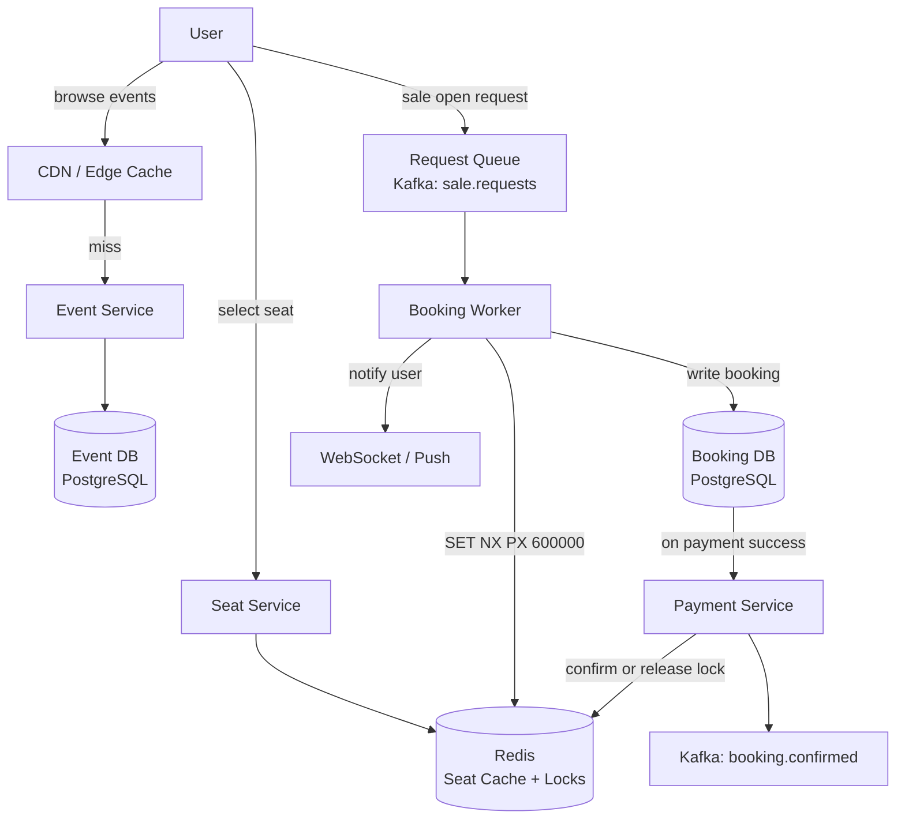

Ticketmaster is a concurrency problem dressed as a ticketing problem. The interesting challenge is not storing events or seats; it is handling 5 million concurrent users competing for 70,000 seats the moment a Taylor Swift sale opens. A naive "check then reserve" sequence creates a race condition that oversells inventory. The correct solution combines atomic reservation via distributed locking with a request queue to absorb the spike -- and this pattern generalizes to flash sales, hotel booking, and any system where scarce inventory must not be double-sold.

## Series concepts

### Introduced here

- **Inventory reservation with distributed locking:** `SET seat:{seat_id}:lock {user_id} NX PX 600000` atomically claims a seat for 10 minutes while the user completes payment. No other request can claim the same seat while the lock is held.
- **Flash sale queue (thundering herd mitigation):** route all incoming requests through a Kafka topic at sale open. Workers process sequentially. Users who cannot be served immediately receive a queue position and estimated wait time. The spike is absorbed; the database sees a steady drip.
- **Optimistic vs pessimistic locking tradeoff:** optimistic locking (compare-and-swap on a version column) works when conflicts are rare. Pessimistic locking (SELECT FOR UPDATE or Redis SET NX) is correct when conflicts are guaranteed at high concurrency. Flash sales require pessimistic.

### Carried forward from prior entries

- **Redis ([Bitly](./bitly/)):** seat availability cache; also used for the distributed lock that reserves seats.
- **Kafka ([Bitly](./bitly/), [Dropbox](./dropbox/)):** booking events and the flash sale request queue both route through Kafka.
- **ID generation ([Bitly](./bitly/)):** booking IDs generated via Snowflake-style service.

## Clarifying questions

Ask these before drawing anything:

- **Scale**: how many events? How many seats per event? What is the peak concurrent user load at a major sale?
- **Seat selection**: do users choose specific seats, or are they assigned?
- **Hold duration**: how long can a user hold a seat before payment times out?
- **Waitlist**: if a sale sells out, is there a waitlist for cancellations?
- **Resale**: does the platform support fan-to-fan resale?
- **Geography**: is this global or regional?

What the answers reveal:

- Specific seat selection (vs general admission) means the lock granularity is per seat, not per event
- Hold duration drives the Redis key TTL and the timeout window in the booking flow
- Waitlist adds a secondary queue that activates on lock expiry
- Resale means inventory can return to the pool after initial sellout

For this walkthrough: 500M users, 100K events/day, users choose specific seats, 10-minute hold, waitlist supported, global deployment.

## Estimation

```
Peak event scenario (Taylor Swift):
  70,000 seats
  5,000,000 concurrent users at sale open (10 AM sharp)
  Requests in first 60 seconds: ~5M
  Write QPS at sale open: 5M / 60 = ~83,000 requests/sec

Steady-state:
  100K events/day
  Average 5,000 seats/event = 500M seat transactions/day
  500M / 86,400 = ~5,787 bookings/sec average

Seat map reads (much heavier):
  Users browse seat maps before purchasing
  Read/write ratio: ~100:1 for seat availability queries
  Read QPS at peak: ~8M reads/sec (for major event)

Storage:
  Events: 100K/day * 365 * 5 = 182.5M events
  Seats: avg 5,000/event = 912.5B seat records
  Per seat record: ~200 bytes
  Total: ~182 TB (need sharding and archival)
```

**Conclusion**: the peak write QPS (83K/sec) during flash sale opens is the dominant design constraint. The system must absorb this spike without overselling inventory or degrading response time below 5 seconds.

## High-level design



Core endpoints:

```
GET /events/{event_id}/seats
  returns: seat map with availability status per seat

POST /bookings/reserve
  body:    { event_id, seat_ids: string[], idempotency_key: string }
  returns: { booking_id, held_until: timestamp, payment_url }

POST /bookings/{booking_id}/confirm
  body:    { payment_token }
  returns: { booking_id, confirmation_code, tickets: [...] }

DELETE /bookings/{booking_id}
  (release hold voluntarily, or called by timeout worker)
```

## Deep dive: seat reservation with distributed lock

The race condition happens here. Two users select the same seat at the same millisecond. Without a lock, both see "available" in the database, both attempt to book, and both succeed -- overselling the seat.

The correct primitive is Redis `SET key value NX PX milliseconds`: atomic, sets the key only if it does not exist (NX), expires after the hold window (PX).

```python
import redis
import uuid

r = redis.Redis(host='redis-cluster', port=6379)

HOLD_DURATION_MS = 10 * 60 * 1000  # 10 minutes

def try_reserve_seat(seat_id: str, user_id: str) -> bool:
    """
    Returns True if the seat was successfully locked for this user.
    Returns False if another user already holds it.
    """
    key = f"seat:lock:{seat_id}"
    acquired = r.set(key, user_id, nx=True, px=HOLD_DURATION_MS)
    return acquired is not None

def release_seat(seat_id: str, user_id: str) -> bool:
    """
    Release the lock only if this user holds it (Lua script for atomicity).
    """
    lua_script = """
    if redis.call("GET", KEYS[1]) == ARGV[1] then
        return redis.call("DEL", KEYS[1])
    else
        return 0
    end
    """
    result = r.eval(lua_script, 1, f"seat:lock:{seat_id}", user_id)
    return result == 1

def confirm_booking(booking_id: str, seat_ids: list[str], user_id: str):
    # Write confirmed booking to DB
    db.execute("""
        INSERT INTO bookings (booking_id, user_id, seat_ids, status, confirmed_at)
        VALUES (%s, %s, %s, 'confirmed', NOW())
    """, booking_id, user_id, seat_ids)

    # Mark seats as sold in the DB and cache
    for seat_id in seat_ids:
        db.execute(
            "UPDATE seats SET status = 'sold' WHERE seat_id = %s",
            seat_id
        )
        r.set(f"seat:status:{seat_id}", "sold")
        # lock can stay until it expires: confirmed booking supersedes it
```

```typescript
import { createClient } from 'redis';

const client = createClient({ url: 'redis://redis-cluster:6379' });
await client.connect();

const HOLD_DURATION_MS = 10 * 60 * 1000; // 10 minutes

async function tryReserveSeat(seatId: string, userId: string): Promise<boolean> {
  // SET key value NX PX milliseconds -- atomic, sets only if key does not exist
  const result = await client.set(`seat:lock:${seatId}`, userId, {
    NX: true,
    PX: HOLD_DURATION_MS,
  });
  return result !== null;
}

async function releaseSeat(seatId: string, userId: string): Promise<boolean> {
  // Lua script: release only if this user holds the lock
  const luaScript = `
    if redis.call("GET", KEYS[1]) == ARGV[1] then
      return redis.call("DEL", KEYS[1])
    else
      return 0
    end
  `;
  const result = await client.eval(luaScript, {
    keys: [`seat:lock:${seatId}`],
    arguments: [userId],
  });
  return result === 1;
}

async function confirmBooking(bookingId: string, seatIds: string[], userId: string): Promise<void> {
  // Write confirmed booking to DB
  await db.execute(
    `INSERT INTO bookings (booking_id, user_id, seat_ids, status, confirmed_at)
     VALUES ($1, $2, $3, 'confirmed', NOW())`,
    [bookingId, userId, seatIds]
  );

  // Mark seats as sold in the DB and cache
  for (const seatId of seatIds) {
    await db.execute('UPDATE seats SET status = $1 WHERE seat_id = $2', ['sold', seatId]);
    await client.set(`seat:status:${seatId}`, 'sold');
    // lock can stay until it expires: confirmed booking supersedes it
  }
}
```

```go
package main

import (
	"context"
	"fmt"
	"time"

	"github.com/redis/go-redis/v9"
)

var rdb = redis.NewClient(&redis.Options{Addr: "redis-cluster:6379"})

const holdDuration = 10 * time.Minute

func tryReserveSeat(ctx context.Context, seatID, userID string) (bool, error) {
	// SET key value NX PX -- atomic, sets only if key does not exist
	result, err := rdb.SetNX(ctx, fmt.Sprintf("seat:lock:%s", seatID), userID, holdDuration).Result()
	if err != nil {
		return false, err
	}
	return result, nil
}

// luaRelease releases the lock only if the caller is the lock holder.
var luaRelease = redis.NewScript(`
	if redis.call("GET", KEYS[1]) == ARGV[1] then
		return redis.call("DEL", KEYS[1])
	else
		return 0
	end
`)

func releaseSeat(ctx context.Context, seatID, userID string) (bool, error) {
	result, err := luaRelease.Run(ctx, rdb, []string{fmt.Sprintf("seat:lock:%s", seatID)}, userID).Int()
	if err != nil {
		return false, err
	}
	return result == 1, nil
}

func confirmBooking(ctx context.Context, bookingID string, seatIDs []string, userID string) error {
	// Write confirmed booking to DB
	if err := db.ExecContext(ctx, `
		INSERT INTO bookings (booking_id, user_id, seat_ids, status, confirmed_at)
		VALUES ($1, $2, $3, 'confirmed', NOW())`,
		bookingID, userID, seatIDs,
	); err != nil {
		return err
	}

	// Mark seats as sold in the DB and cache
	for _, seatID := range seatIDs {
		if err := db.ExecContext(ctx, "UPDATE seats SET status = 'sold' WHERE seat_id = $1", seatID); err != nil {
			return err
		}
		rdb.Set(ctx, fmt.Sprintf("seat:status:%s", seatID), "sold", 0)
		// lock can stay until it expires: confirmed booking supersedes it
	}
	return nil
}
```

The Lua script for release is critical: it checks that the caller is the lock holder before deleting. Without this check, a slow payment process could expire the lock, a second user could acquire it, and then the first user's delayed release would evict the second user's lock.

## Deep dive: flash sale queue

At 10:00:00 AM, 5 million requests arrive simultaneously. The seat service cannot handle 83,000 writes/sec. Without a queue, two outcomes are both bad: the service crashes (5M users get errors), or the database is overwhelmed (slow responses, potential oversell under load).

The correct pattern: treat the incoming spike as a Kafka topic. Workers drain the queue at a rate the database and Redis can sustain. Users get a queue position immediately; the system processes them in order.

```python
from kafka import KafkaProducer, KafkaConsumer
import json
import time

producer = KafkaProducer(
    bootstrap_servers=['kafka-1:9092'],
    value_serializer=lambda v: json.dumps(v).encode()
)

def enqueue_reservation_request(user_id: str, event_id: str, seat_ids: list[str]) -> str:
    """
    Accept the request immediately and return a queue position.
    The actual reservation happens asynchronously.
    """
    request_id = generate_snowflake_id()
    queue_position = get_queue_depth(event_id) + 1

    producer.send('sale.requests', {
        'request_id': request_id,
        'user_id': user_id,
        'event_id': event_id,
        'seat_ids': seat_ids,
        'enqueued_at': time.time(),
    })

    # store queue position in Redis for polling
    r.setex(f"queue:position:{request_id}", 3600, queue_position)

    return request_id

# Worker: drains the queue at a controlled rate
consumer = KafkaConsumer('sale.requests', group_id='booking-workers')

for msg in consumer:
    req = json.loads(msg.value)
    success = True

    for seat_id in req['seat_ids']:
        if not try_reserve_seat(seat_id, req['user_id']):
            # seat taken: notify user, suggest alternatives
            notify_user(req['user_id'], 'seat_unavailable', seat_id)
            success = False
            break

    if success:
        booking_id = create_pending_booking(req)
        notify_user(req['user_id'], 'seats_held', {
            'booking_id': booking_id,
            'held_until': time.time() + 600,
            'payment_url': f"/bookings/{booking_id}/pay",
        })
```

```typescript
import { Kafka } from 'kafkajs';
import { createClient } from 'redis';

interface SaleRequest {
  requestId: string;
  userId: string;
  eventId: string;
  seatIds: string[];
  enqueuedAt: number;
}

const kafka = new Kafka({ brokers: ['kafka-1:9092'] });
const producer = kafka.producer();
await producer.connect();

const redisClient = createClient({ url: 'redis://redis-cluster:6379' });
await redisClient.connect();

async function enqueueReservationRequest(
  userId: string,
  eventId: string,
  seatIds: string[],
): Promise<string> {
  const requestId = generateSnowflakeId();
  const queuePosition = (await getQueueDepth(eventId)) + 1;

  await producer.send({
    topic: 'sale.requests',
    messages: [{
      value: JSON.stringify({
        requestId,
        userId,
        eventId,
        seatIds,
        enqueuedAt: Date.now() / 1000,
      } satisfies SaleRequest),
    }],
  });

  // store queue position in Redis for polling
  await redisClient.setEx(`queue:position:${requestId}`, 3600, String(queuePosition));

  return requestId;
}

// Worker: drains the queue at a controlled rate
async function startBookingWorker(): Promise<void> {
  const consumer = kafka.consumer({ groupId: 'booking-workers' });
  await consumer.connect();
  await consumer.subscribe({ topic: 'sale.requests' });

  await consumer.run({
    eachMessage: async ({ message }) => {
      const req: SaleRequest = JSON.parse(message.value!.toString());
      let success = true;

      for (const seatId of req.seatIds) {
        const reserved = await tryReserveSeat(seatId, req.userId);
        if (!reserved) {
          // seat taken: notify user, suggest alternatives
          await notifyUser(req.userId, 'seat_unavailable', seatId);
          success = false;
          break;
        }
      }

      if (success) {
        const bookingId = await createPendingBooking(req);
        await notifyUser(req.userId, 'seats_held', {
          bookingId,
          heldUntil: Date.now() / 1000 + 600,
          paymentUrl: `/bookings/${bookingId}/pay`,
        });
      }
    },
  });
}
```

```go
package main

import (
	"context"
	"encoding/json"
	"fmt"
	"log"
	"time"

	"github.com/redis/go-redis/v9"
	"github.com/segmentio/kafka-go"
)

type SaleRequest struct {
	RequestID  string   `json:"request_id"`
	UserID     string   `json:"user_id"`
	EventID    string   `json:"event_id"`
	SeatIDs    []string `json:"seat_ids"`
	EnqueuedAt float64  `json:"enqueued_at"`
}

var saleWriter = &kafka.Writer{
	Addr:  kafka.TCP("kafka-1:9092"),
	Topic: "sale.requests",
}

func enqueueReservationRequest(ctx context.Context, userID, eventID string, seatIDs []string) (string, error) {
	requestID := generateSnowflakeID()
	queuePosition, err := getQueueDepth(ctx, eventID)
	if err != nil {
		return "", err
	}

	req := SaleRequest{
		RequestID:  requestID,
		UserID:     userID,
		EventID:    eventID,
		SeatIDs:    seatIDs,
		EnqueuedAt: float64(time.Now().UnixMilli()) / 1000,
	}
	payload, _ := json.Marshal(req)
	if err := saleWriter.WriteMessages(ctx, kafka.Message{Value: payload}); err != nil {
		return "", err
	}

	// store queue position in Redis for polling
	rdb.SetEx(ctx, fmt.Sprintf("queue:position:%s", requestID), fmt.Sprintf("%d", queuePosition+1), time.Hour)

	return requestID, nil
}

// startBookingWorker drains the queue at a controlled rate.
func startBookingWorker(ctx context.Context) {
	reader := kafka.NewReader(kafka.ReaderConfig{
		Brokers: []string{"kafka-1:9092"},
		Topic:   "sale.requests",
		GroupID: "booking-workers",
	})
	defer reader.Close()

	for {
		m, err := reader.ReadMessage(ctx)
		if err != nil {
			log.Printf("worker read error: %v", err)
			break
		}
		var req SaleRequest
		if err := json.Unmarshal(m.Value, &req); err != nil {
			continue
		}

		success := true
		for _, seatID := range req.SeatIDs {
			reserved, err := tryReserveSeat(ctx, seatID, req.UserID)
			if err != nil || !reserved {
				notifyUser(ctx, req.UserID, "seat_unavailable", seatID)
				success = false
				break
			}
		}

		if success {
			bookingID, _ := createPendingBooking(ctx, req)
			notifyUser(ctx, req.UserID, "seats_held", map[string]interface{}{
				"booking_id":  bookingID,
				"held_until":  time.Now().Unix() + 600,
				"payment_url": fmt.Sprintf("/bookings/%s/pay", bookingID),
			})
		}
	}
}
```

Workers can scale horizontally. Each worker processes one request at a time, performing the Redis SET NX and database write sequentially. The Redis lock ensures two workers never double-book the same seat even if they process requests concurrently.

## Deep dive: seat map caching

The seat map is read far more than it is written. Users browse availability for minutes before selecting; during a major sale, the map may be polled every few seconds by millions of users.

```python
def get_seat_availability(event_id: str) -> dict:
    cache_key = f"event:seats:{event_id}"

    # try cache first
    cached = r.get(cache_key)
    if cached:
        return json.loads(cached)

    # cache miss: query DB
    seats = db.query("""
        SELECT seat_id, section, row, number, status, price_tier
        FROM seats
        WHERE event_id = %s
        ORDER BY section, row, number
    """, event_id)

    # overlay lock status from Redis
    seat_map = {}
    for seat in seats:
        sid = seat['seat_id']
        lock_holder = r.get(f"seat:lock:{sid}")
        seat_map[sid] = {
            **seat,
            'status': 'held' if lock_holder else seat['status'],
        }

    # cache the merged result, short TTL during active sale
    r.setex(cache_key, 10, json.dumps(seat_map))  # 10-second TTL
    return seat_map
```

```typescript
import { createClient } from 'redis';

const client = createClient({ url: 'redis://redis-cluster:6379' });
await client.connect();

interface SeatRecord {
  seatId: string;
  section: string;
  row: string;
  number: number;
  status: string;
  priceTier: string;
}

interface SeatMapEntry extends SeatRecord {
  status: string; // may be overridden to 'held'
}

async function getSeatAvailability(eventId: string): Promise<Record<string, SeatMapEntry>> {
  const cacheKey = `event:seats:${eventId}`;

  // try cache first
  const cached = await client.get(cacheKey);
  if (cached) return JSON.parse(cached);

  // cache miss: query DB
  const seats = await db.query<SeatRecord>(
    `SELECT seat_id, section, row, number, status, price_tier
     FROM seats
     WHERE event_id = $1
     ORDER BY section, row, number`,
    [eventId]
  );

  // overlay lock status from Redis
  const seatMap: Record<string, SeatMapEntry> = {};
  for (const seat of seats) {
    const lockHolder = await client.get(`seat:lock:${seat.seatId}`);
    seatMap[seat.seatId] = {
      ...seat,
      status: lockHolder ? 'held' : seat.status,
    };
  }

  // cache the merged result, short TTL during active sale
  await client.setEx(cacheKey, 10, JSON.stringify(seatMap)); // 10-second TTL
  return seatMap;
}
```

```go
package main

import (
	"context"
	"encoding/json"
	"fmt"
	"time"

	"github.com/redis/go-redis/v9"
)

type SeatRecord struct {
	SeatID    string `json:"seat_id" db:"seat_id"`
	Section   string `json:"section" db:"section"`
	Row       string `json:"row"     db:"row"`
	Number    int    `json:"number"  db:"number"`
	Status    string `json:"status"  db:"status"`
	PriceTier string `json:"price_tier" db:"price_tier"`
}

func getSeatAvailability(ctx context.Context, eventID string) (map[string]SeatRecord, error) {
	cacheKey := fmt.Sprintf("event:seats:%s", eventID)

	// try cache first
	cached, err := rdb.Get(ctx, cacheKey).Result()
	if err == nil {
		var seatMap map[string]SeatRecord
		if jsonErr := json.Unmarshal([]byte(cached), &seatMap); jsonErr == nil {
			return seatMap, nil
		}
	}

	// cache miss: query DB
	seats, err := dbQuerySeats(ctx, eventID)
	if err != nil {
		return nil, err
	}

	// overlay lock status from Redis
	seatMap := make(map[string]SeatRecord, len(seats))
	for _, seat := range seats {
		lockHolder, _ := rdb.Get(ctx, fmt.Sprintf("seat:lock:%s", seat.SeatID)).Result()
		if lockHolder != "" {
			seat.Status = "held"
		}
		seatMap[seat.SeatID] = seat
	}

	// cache the merged result, short TTL during active sale
	payload, _ := json.Marshal(seatMap)
	rdb.SetEx(ctx, cacheKey, string(payload), 10*time.Second) // 10-second TTL
	return seatMap, nil
}
```

During peak sale: 10-second TTL means at most 10 seconds of stale data. Users may see a seat as available that was just locked, which leads to a failed reservation attempt. This is acceptable: the user gets an error message and can select another seat. Overselling (the dangerous failure mode) is prevented by the Redis lock, not by the cache.

## Deep dive: idempotent booking

Mobile clients retry on network failure. Without idempotency, a retry could create a duplicate booking and charge the user twice.

```python
def reserve_seats(user_id: str, event_id: str, seat_ids: list[str], idempotency_key: str) -> dict:
    # check if this request was already processed
    existing = db.query_one("""
        SELECT booking_id, status, created_at
        FROM bookings
        WHERE idempotency_key = %s AND user_id = %s
    """, idempotency_key, user_id)

    if existing:
        # return the original result -- do not process again
        return {
            'booking_id': existing['booking_id'],
            'status': existing['status'],
            'replayed': True,
        }

    # first time: process normally
    booking_id = generate_snowflake_id()
    db.execute("""
        INSERT INTO bookings (booking_id, user_id, event_id, seat_ids, status, idempotency_key)
        VALUES (%s, %s, %s, %s, 'pending', %s)
    """, booking_id, user_id, event_id, seat_ids, idempotency_key)

    for seat_id in seat_ids:
        if not try_reserve_seat(seat_id, user_id):
            db.execute(
                "UPDATE bookings SET status = 'failed' WHERE booking_id = %s",
                booking_id
            )
            return {'booking_id': booking_id, 'status': 'failed'}

    return {'booking_id': booking_id, 'status': 'pending', 'replayed': False}
```

```typescript
interface BookingResult {
  bookingId: string;
  status: 'pending' | 'failed';
  replayed: boolean;
}

interface ExistingBooking {
  bookingId: string;
  status: string;
}

async function reserveSeats(
  userId: string,
  eventId: string,
  seatIds: string[],
  idempotencyKey: string,
): Promise<BookingResult> {
  // check if this request was already processed
  const existing = await db.queryOne<ExistingBooking>(
    `SELECT booking_id, status FROM bookings
     WHERE idempotency_key = $1 AND user_id = $2`,
    [idempotencyKey, userId]
  );

  if (existing) {
    // return the original result -- do not process again
    return { bookingId: existing.bookingId, status: existing.status as 'pending' | 'failed', replayed: true };
  }

  // first time: process normally
  const bookingId = generateSnowflakeId();
  await db.execute(
    `INSERT INTO bookings (booking_id, user_id, event_id, seat_ids, status, idempotency_key)
     VALUES ($1, $2, $3, $4, 'pending', $5)`,
    [bookingId, userId, eventId, seatIds, idempotencyKey]
  );

  for (const seatId of seatIds) {
    const reserved = await tryReserveSeat(seatId, userId);
    if (!reserved) {
      await db.execute(
        "UPDATE bookings SET status = 'failed' WHERE booking_id = $1",
        [bookingId]
      );
      return { bookingId, status: 'failed', replayed: false };
    }
  }

  return { bookingId, status: 'pending', replayed: false };
}
```

```go
package main

import (
	"context"
)

type BookingResult struct {
	BookingID string `json:"booking_id"`
	Status    string `json:"status"`
	Replayed  bool   `json:"replayed"`
}

type ExistingBooking struct {
	BookingID string
	Status    string
}

func reserveSeats(ctx context.Context, userID, eventID string, seatIDs []string, idempotencyKey string) (BookingResult, error) {
	// check if this request was already processed
	existing, err := dbQueryExistingBooking(ctx, idempotencyKey, userID)
	if err != nil {
		return BookingResult{}, err
	}
	if existing != nil {
		// return the original result -- do not process again
		return BookingResult{BookingID: existing.BookingID, Status: existing.Status, Replayed: true}, nil
	}

	// first time: process normally
	bookingID := generateSnowflakeID()
	if err := db.ExecContext(ctx, `
		INSERT INTO bookings (booking_id, user_id, event_id, seat_ids, status, idempotency_key)
		VALUES ($1, $2, $3, $4, 'pending', $5)`,
		bookingID, userID, eventID, seatIDs, idempotencyKey,
	); err != nil {
		return BookingResult{}, err
	}

	for _, seatID := range seatIDs {
		reserved, err := tryReserveSeat(ctx, seatID, userID)
		if err != nil || !reserved {
			db.ExecContext(ctx, "UPDATE bookings SET status = 'failed' WHERE booking_id = $1", bookingID)
			return BookingResult{BookingID: bookingID, Status: "failed", Replayed: false}, nil
		}
	}

	return BookingResult{BookingID: bookingID, Status: "pending", Replayed: false}, nil
}
```

The `idempotency_key` is generated by the client (typically a UUID). The unique constraint on `(idempotency_key, user_id)` ensures the database rejects duplicate inserts even under concurrent retries.

## Failure modes

**Redis lock service outage**: seat reservations cannot proceed safely. Options: (1) fail closed (return 503 until Redis recovers), (2) fall back to database-level locking (`SELECT FOR UPDATE`). Option 1 is safer for inventory integrity. Option 2 keeps the system available but under higher DB load. For a ticketing system, overselling is catastrophic: fail closed.

**Worker falls behind on Kafka topic**: queue position numbers grow, estimated wait times increase. Users may abandon. Add more worker instances; they can join the consumer group and split the partition load immediately.

**Payment timeout**: user holds seats for 10 minutes and does not complete payment. The Redis lock TTL expires, returning the seats to the pool. A background job reconciles any DB rows left in "pending" status after 15 minutes (5 minutes after the Redis TTL, to handle clock skew).

**Hot event (uneven partition load)**: all requests for one event land on one Kafka partition (if partitioned by event_id). One worker is overwhelmed while others are idle. Mitigate by partitioning by user_id or request_id instead, and using a per-event Redis counter to track inventory rather than partitioned queue depth.

## Key takeaways

**Distributed locking converts a race condition into a serialization point.** Redis SET NX is atomic: exactly one caller wins. All others see a clean failure. This is simpler and more correct than database-level optimistic locking under guaranteed high contention.

**Queue the spike, not the seat.** The thundering herd at sale open is a queueing problem, not a seat problem. Put all requests in Kafka immediately (O(1) per request), drain at a sustainable rate. Users get queue positions instead of 503 errors.

**Optimistic locking is wrong for flash sales.** Optimistic locking assumes conflicts are rare and retries are cheap. Neither is true at sale open. Pessimistic locking (Redis SET NX) is the correct choice when contention is guaranteed.

**Idempotency keys prevent double-charges.** Every state-changing request from a client must carry an idempotency key. Store it with the booking record. Retries hit the check and return the original result rather than processing again.

**Cache with a short TTL, not stale-while-revalidate.** Seat map caching with a 10-second TTL is the right tradeoff: low DB load, acceptable staleness, no oversell risk (the lock layer handles that). Longer TTLs save more DB load but increase the window where users attempt unavailable seats.

## References

- [Redis documentation: SET command with NX and PX options](https://redis.io/commands/set/)
- [Ticketmaster engineering: handling peak traffic](https://tech.ticketmaster.com/)
- [System Design Interview Vol 2, Alex Xu, Chapter 12](https://bytebytego.com/)
- [Martin Kleppmann: Distributed locks with Redis (Redlock)](https://martin.kleppmann.com/2016/02/08/how-to-do-distributed-locking.html)

## Related topics

- [Bitly case study](./bitly/), introduces Redis cache and Kafka patterns used here
- [Dropbox case study](./dropbox/), carries forward Kafka and ID generation
- [Facebook News Feed case study](./facebook-news-feed/), carries forward Redis sorted sets
- [Distributed Locking](../distributed-locking/), full treatment of Redis lock patterns
- [Caching](../caching/), seat map caching strategy
- [Message Queues](../message-queues/), Kafka flash sale queue design
- [Rate Limiting](../rate-limiting/), protecting the reservation endpoint from abuse
