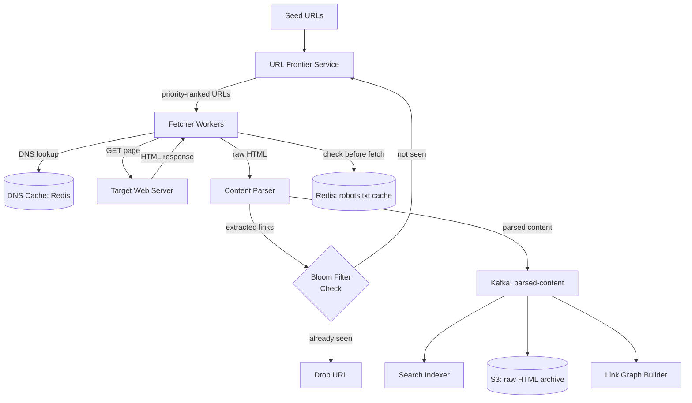

The web crawler is one of those problems where the obvious design works for a hundred URLs and fails catastrophically at a billion. A naive crawler that ignores politeness constraints will get IP-banned within minutes. One that stores every seen URL in a hash set will exhaust memory long before finishing. The two hardest operational problems are not the crawling itself: they are politeness (respecting per-domain rate limits and robots.txt) and deduplication (avoiding re-crawling pages you have already seen). Get those right and the rest is pipeline engineering.

## Series concepts

### Introduced here

- **URL frontier**: a distributed BFS queue split into two tiers. The priority queue (in-memory) holds URLs to crawl in the next few minutes, ranked by PageRank estimate, freshness, and domain importance. The bulk queue (Kafka) holds the full backlog of discovered but not-yet-crawled URLs.
- **Politeness constraints**: each domain has a crawl delay (from robots.txt or a default). Workers are partitioned by domain hash so each worker owns a disjoint set of domains and enforces their crawl delays independently. No domain sees more than N requests per second.
- **Bloom filter deduplication**: a Bloom filter for 10 billion URLs at 1% false-positive rate requires roughly 12 GB of memory, far less than storing full URLs. False positives cause ~1% of new URLs to be skipped, an acceptable tradeoff.
- **Content deduplication via SimHash**: two pages that are 90% textually identical have similar SimHash values. SimHash allows near-duplicate detection without storing full page content.
- **DNS caching**: crawlers make millions of DNS lookups. Cache each domain's resolved IP with TTL equal to the DNS TTL. Without this, the DNS resolver becomes the bottleneck.

### Carried forward from prior entries

- **Kafka as the URL queue**: same async pipeline from [URL Shortener](../url-shortener/). The frontier publishes discovered URLs; workers consume them. Kafka provides persistence, replay, and backpressure.
- **Consistent hashing for worker partitioning**: workers are assigned domain ranges by a consistent hash ring, same sharding concept from [URL Shortener](../url-shortener/) DB sharding. Adding or removing workers redistributes domain ownership gracefully.
- **Redis for URL seen-cache**: same read cache pattern from [URL Shortener](../url-shortener/), now used to check whether a URL has been seen recently. The Bloom filter is the primary dedup store; Redis handles the hot recent-URL cache.

## Clarifying questions

Ask these before drawing anything:

- **Scope**: crawl the entire web, or a specific domain set (e.g., news sites only)?
- **Refresh cycle**: how often should pages be re-crawled? Days, weeks, months?
- **Content use**: indexing for search, training data collection, link graph analysis?
- **Scale**: how many pages in the initial seed? Target corpus size?
- **Politeness requirements**: must respect robots.txt? Maximum request rate per domain?

What the answers reveal:
- Full-web crawl vs focused crawl changes the URL frontier priority model significantly
- A 2-week refresh cycle at 1B URLs sets the crawl rate target (826 URLs/sec)
- Content use determines storage format: raw HTML for training data, extracted text for search indexing
- Respecting robots.txt is non-negotiable for any production crawler; violating it leads to IP bans and legal exposure

For this walkthrough: full-web crawl, 1B URL corpus, 2-week refresh cycle, search indexing output, robots.txt compliance required.

## Estimation

```
Target crawl rate:
  1B URLs / (14 days * 86,400 sec/day) = 826 URLs/sec

Bandwidth:
  826 URLs/sec * 100 KB avg HTML = 82.6 MB/sec downloaded
  82.6 MB/sec * 86,400 = ~7 TB/day fetched

Storage for parsed content:
  1B pages * 50 KB avg extracted text = 50 TB (text index input)
  Raw HTML archive: 1B * 100 KB = 100 TB (kept for reprocessing)

Bloom filter size:
  10B URLs (10x headroom), 1% false positive rate
  Bits needed: 9.6 bits/URL = 96B bits = 12 GB
  Hash functions: 7 (optimal for 1% FPR)

DNS lookups:
  1B URLs across ~50M unique domains
  826 URLs/sec; with 10 URLs/domain avg, ~83 new domains/sec
  Cache hit rate after warmup: >99%

Worker count:
  826 URLs/sec, each fetch takes ~500ms avg (includes DNS, TCP, TLS, HTTP)
  826 * 0.5 = 413 concurrent fetches
  With headroom: 600-800 worker threads across 20-30 machines
```

**Conclusion**: bandwidth (7 TB/day) and storage (150 TB total) are the dominant costs. The Bloom filter at 12 GB is surprisingly cheap compared to the alternative (storing 10B full URLs in a hash set requires 1-10 TB depending on encoding).

## High-level design



The URL frontier is the brain. It decides what to crawl next and in what order. Everything else is pipeline.

## Deep dive: URL frontier and politeness

The frontier has two tiers to balance priority and politeness:

```python
import heapq
import time
import hashlib
from collections import defaultdict

class URLFrontier:
    def __init__(self, kafka_producer, redis_client):
        self.kafka = kafka_producer
        self.redis = redis_client
        # In-memory priority queue for next-to-crawl URLs
        # Score: lower = higher priority
        self.priority_queue = []
        # Per-domain last-crawl timestamp for politeness
        self.domain_last_crawl: dict[str, float] = defaultdict(float)
        self.domain_crawl_delay: dict[str, float] = defaultdict(lambda: 1.0)

    def add_url(self, url: str, priority: float = 0.5):
        # Publish to Kafka bulk queue for persistence
        self.kafka.send("url-frontier", {"url": url, "priority": priority})

        # Add high-priority URLs to in-memory queue for fast scheduling
        if priority > 0.7:
            heapq.heappush(self.priority_queue, (1.0 - priority, time.time(), url))

    def next_url_for_domain(self, domain: str) -> str | None:
        delay = self.domain_crawl_delay[domain]
        last = self.domain_last_crawl[domain]
        if time.time() - last < delay:
            return None  # politeness: too soon to crawl this domain again
        return self._dequeue_for_domain(domain)

    def record_crawl(self, domain: str):
        self.domain_last_crawl[domain] = time.time()
```

```typescript
import { Kafka, Producer } from 'kafkajs';
import { createClient, RedisClientType } from 'redis';

interface PriorityEntry {
  score: number;   // lower = higher priority (1.0 - priority)
  timestamp: number;
  url: string;
}

class URLFrontier {
  private kafka: Producer;
  private redis: RedisClientType;
  // In-memory priority queue for next-to-crawl URLs
  private priorityQueue: PriorityEntry[] = [];
  // Per-domain last-crawl timestamp for politeness
  private domainLastCrawl: Map<string, number> = new Map();
  private domainCrawlDelay: Map<string, number> = new Map();

  constructor(kafka: Producer, redis: RedisClientType) {
    this.kafka = kafka;
    this.redis = redis;
  }

  async addUrl(url: string, priority: number = 0.5): Promise<void> {
    // Publish to Kafka bulk queue for persistence
    await this.kafka.send({
      topic: 'url-frontier',
      messages: [{ value: JSON.stringify({ url, priority }) }],
    });

    // Add high-priority URLs to in-memory queue for fast scheduling
    if (priority > 0.7) {
      this.priorityQueue.push({ score: 1.0 - priority, timestamp: Date.now(), url });
      this.priorityQueue.sort((a, b) => a.score - b.score || a.timestamp - b.timestamp);
    }
  }

  nextUrlForDomain(domain: string): string | null {
    const delay = this.domainCrawlDelay.get(domain) ?? 1.0;
    const last = this.domainLastCrawl.get(domain) ?? 0;
    if (Date.now() / 1000 - last < delay) {
      return null; // politeness: too soon to crawl this domain again
    }
    return this.dequeueForDomain(domain);
  }

  recordCrawl(domain: string): void {
    this.domainLastCrawl.set(domain, Date.now() / 1000);
  }

  private dequeueForDomain(domain: string): string | null {
    const idx = this.priorityQueue.findIndex((e) => new URL(e.url).hostname === domain);
    if (idx === -1) return null;
    return this.priorityQueue.splice(idx, 1)[0].url;
  }
}
```

```go
package main

import (
    "context"
    "encoding/json"
    "sync"
    "time"

    "github.com/segmentio/kafka-go"
)

type URLFrontier struct {
    kafkaWriter     *kafka.Writer
    // In-memory priority queue entries (sorted by score ascending)
    priorityQueue   []PriorityEntry
    mu              sync.Mutex
    // Per-domain last-crawl timestamp for politeness
    domainLastCrawl map[string]time.Time
    domainCrawlDelay map[string]float64
}

type PriorityEntry struct {
    Score     float64
    Timestamp time.Time
    URL       string
}

func NewURLFrontier(writer *kafka.Writer) *URLFrontier {
    return &URLFrontier{
        kafkaWriter:      writer,
        domainLastCrawl:  make(map[string]time.Time),
        domainCrawlDelay: make(map[string]float64),
    }
}

func (f *URLFrontier) AddURL(ctx context.Context, url string, priority float64) error {
    // Publish to Kafka bulk queue for persistence
    payload, _ := json.Marshal(map[string]interface{}{"url": url, "priority": priority})
    if err := f.kafkaWriter.WriteMessages(ctx, kafka.Message{Value: payload}); err != nil {
        return err
    }

    // Add high-priority URLs to in-memory queue for fast scheduling
    if priority > 0.7 {
        f.mu.Lock()
        f.priorityQueue = append(f.priorityQueue, PriorityEntry{
            Score: 1.0 - priority, Timestamp: time.Now(), URL: url,
        })
        // Keep sorted: lower score first
        sortPriorityQueue(f.priorityQueue)
        f.mu.Unlock()
    }
    return nil
}

func (f *URLFrontier) NextURLForDomain(domain string) string {
    f.mu.Lock()
    defer f.mu.Unlock()
    delay := f.domainCrawlDelay[domain]
    if delay == 0 {
        delay = 1.0
    }
    last := f.domainLastCrawl[domain]
    if time.Since(last).Seconds() < delay {
        return "" // politeness: too soon to crawl this domain again
    }
    return f.dequeueForDomain(domain)
}

func (f *URLFrontier) RecordCrawl(domain string) {
    f.mu.Lock()
    f.domainLastCrawl[domain] = time.Now()
    f.mu.Unlock()
}
```

Workers are partitioned by domain hash. Worker `i` of `N` handles all domains where `hash(domain) % N == i`:

```python
def should_this_worker_handle(domain: str, worker_id: int, total_workers: int) -> bool:
    domain_hash = int(hashlib.sha256(domain.encode()).hexdigest(), 16)
    return domain_hash % total_workers == worker_id
```

```typescript
import { createHash } from 'crypto';

function shouldThisWorkerHandle(domain: string, worker_id: number, total_workers: number): boolean {
  const hash = createHash('sha256').update(domain, 'utf8').digest('hex');
  const domain_hash = BigInt(`0x${hash}`);
  return Number(domain_hash % BigInt(total_workers)) === worker_id;
}
```

```go
package main

import (
    "crypto/sha256"
    "encoding/binary"
)

func shouldThisWorkerHandle(domain string, workerID, totalWorkers int) bool {
    h := sha256.Sum256([]byte(domain))
    // Use the first 8 bytes of the hash as a uint64
    domainHash := binary.BigEndian.Uint64(h[:8])
    return int(domainHash%uint64(totalWorkers)) == workerID
}
```

This partition means each worker independently enforces its domains' crawl delays without coordinating with other workers. No distributed lock needed: domain ownership is deterministic.

## Deep dive: Bloom filter deduplication

The Bloom filter is the most space-efficient deduplication structure available. It answers "have I seen this URL before?" in O(1) time and O(1) space per query:

```python
import mmh3  # MurmurHash3, fast non-cryptographic hash
import math
from bitarray import bitarray

class BloomFilter:
    def __init__(self, capacity: int, error_rate: float = 0.01):
        # Optimal bit array size
        self.size = int(-capacity * math.log(error_rate) / (math.log(2) ** 2))
        # Optimal number of hash functions
        self.hash_count = int((self.size / capacity) * math.log(2))
        self.bits = bitarray(self.size)
        self.bits.setall(0)

    def add(self, url: str):
        for seed in range(self.hash_count):
            position = mmh3.hash(url, seed) % self.size
            self.bits[position] = 1

    def contains(self, url: str) -> bool:
        return all(
            self.bits[mmh3.hash(url, seed) % self.size]
            for seed in range(self.hash_count)
        )

# For 10B URLs at 1% FPR:
# size = 9.6 * 10B = 96B bits = 12 GB
# hash_count = 7
bloom = BloomFilter(capacity=10_000_000_000, error_rate=0.01)
```

```typescript
import { createHash } from 'crypto';

class BloomFilter {
  private size: number;
  private hashCount: number;
  private bits: Uint8Array;

  constructor(capacity: number, errorRate: number = 0.01) {
    // Optimal bit array size
    this.size = Math.ceil((-capacity * Math.log(errorRate)) / Math.log(2) ** 2);
    // Optimal number of hash functions
    this.hashCount = Math.ceil((this.size / capacity) * Math.log(2));
    this.bits = new Uint8Array(Math.ceil(this.size / 8));
  }

  private getBit(position: number): boolean {
    return (this.bits[Math.floor(position / 8)] & (1 << position % 8)) !== 0;
  }

  private setBit(position: number): void {
    this.bits[Math.floor(position / 8)] |= 1 << position % 8;
  }

  // Simulate multiple hash seeds using double-hashing (Kirsch-Mitzenmacher)
  private hashAt(url: string, seed: number): number {
    const h1 = parseInt(createHash('md5').update(`${url}:0`).digest('hex').slice(0, 8), 16);
    const h2 = parseInt(createHash('md5').update(`${url}:1`).digest('hex').slice(0, 8), 16);
    return Math.abs((h1 + seed * h2) % this.size);
  }

  add(url: string): void {
    for (let seed = 0; seed < this.hashCount; seed++) {
      this.setBit(this.hashAt(url, seed));
    }
  }

  contains(url: string): boolean {
    for (let seed = 0; seed < this.hashCount; seed++) {
      if (!this.getBit(this.hashAt(url, seed))) return false;
    }
    return true;
  }
}

// For 10B URLs at 1% FPR:
// size = 9.6 * 10B = 96B bits = 12 GB
// hashCount = 7
const bloom = new BloomFilter(10_000_000_000, 0.01);
```

```go
package main

import (
    "math"

    "github.com/bits-and-blooms/bloom/v3"
)

// BloomFilter wraps the bits-and-blooms library which handles
// optimal sizing and hashing automatically.
type BloomFilter struct {
    filter *bloom.BloomFilter
}

func NewBloomFilter(capacity uint, errorRate float64) *BloomFilter {
    // bits-and-blooms computes optimal m and k from capacity and errorRate
    return &BloomFilter{filter: bloom.NewWithEstimates(capacity, errorRate)}
}

func (b *BloomFilter) Add(url string) {
    b.filter.AddString(url)
}

func (b *BloomFilter) Contains(url string) bool {
    return b.filter.TestString(url)
}

// Manual implementation for reference (matches the Python logic):
type ManualBloom struct {
    size      int
    hashCount int
    bits      []bool
}

func NewManualBloom(capacity int, errorRate float64) *ManualBloom {
    size := int(math.Ceil(-float64(capacity) * math.Log(errorRate) / math.Pow(math.Log(2), 2)))
    hashCount := int(math.Ceil(float64(size) / float64(capacity) * math.Log(2)))
    return &ManualBloom{size: size, hashCount: hashCount, bits: make([]bool, size)}
}

// For 10B URLs at 1% FPR:
// size = 9.6 * 10B = 96B bits = 12 GB
// hashCount = 7
var globalBloom = NewBloomFilter(10_000_000_000, 0.01)
```

At 12 GB, this fits in the memory of a single large machine. In practice, partition the Bloom filter across multiple Redis instances using a consistent hash on the URL to determine which filter shard handles each lookup.

The 1% false-positive rate means roughly 1 in 100 new URLs is incorrectly classified as already-seen and skipped. This is acceptable: the crawler will encounter these URLs again in future crawl cycles and the Bloom filter's false-positive rate does not compound (it does not produce false negatives, so pages are never permanently lost).

## Deep dive: robots.txt compliance

robots.txt must be fetched once per domain per 24 hours and its rules applied before every fetch:

```python
import re
from urllib.robotparser import RobotFileParser
from urllib.parse import urlparse

class RobotsCache:
    def __init__(self, redis_client):
        self.redis = redis_client
        self.USER_AGENT = "MySearchBot/1.0"

    def can_fetch(self, url: str) -> bool:
        domain = urlparse(url).netloc
        cache_key = f"robots:{domain}"

        robots_text = self.redis.get(cache_key)
        if not robots_text:
            robots_text = self._fetch_robots(domain)
            if robots_text:
                self.redis.setex(cache_key, 86400, robots_text)  # 24h TTL
            else:
                # No robots.txt: allow everything
                return True

        parser = RobotFileParser()
        parser.parse(robots_text.decode().splitlines())

        # Update crawl delay for this domain from robots.txt
        delay = parser.crawl_delay(self.USER_AGENT)
        if delay:
            self.redis.setex(f"crawl_delay:{domain}", 86400, str(delay))

        return parser.can_fetch(self.USER_AGENT, url)

    def _fetch_robots(self, domain: str) -> bytes | None:
        try:
            import requests
            resp = requests.get(f"https://{domain}/robots.txt", timeout=5)
            return resp.content if resp.status_code == 200 else None
        except Exception:
            return None
```

```typescript
import { createClient, RedisClientType } from 'redis';

const USER_AGENT = 'MySearchBot/1.0';

interface ParsedRobots {
  disallowedPrefixes: string[];
  crawlDelay: number | null;
}

function parseRobotsTxt(text: string, userAgent: string): ParsedRobots {
  const lines = text.split('\n').map((l) => l.trim());
  const disallowed: string[] = [];
  let crawlDelay: number | null = null;
  let applicable = false;

  for (const line of lines) {
    if (line.toLowerCase().startsWith('user-agent:')) {
      const agent = line.slice('user-agent:'.length).trim();
      applicable = agent === '*' || agent.toLowerCase() === userAgent.toLowerCase().split('/')[0];
    } else if (applicable && line.toLowerCase().startsWith('disallow:')) {
      const path = line.slice('disallow:'.length).trim();
      if (path) disallowed.push(path);
    } else if (applicable && line.toLowerCase().startsWith('crawl-delay:')) {
      crawlDelay = parseFloat(line.slice('crawl-delay:'.length).trim()) || null;
    }
  }
  return { disallowedPrefixes: disallowed, crawlDelay };
}

class RobotsCache {
  private redis: RedisClientType;

  constructor(redis: RedisClientType) {
    this.redis = redis;
  }

  async canFetch(url: string): Promise<boolean> {
    const domain = new URL(url).hostname;
    const cacheKey = `robots:${domain}`;

    let robotsText = await this.redis.get(cacheKey);
    if (!robotsText) {
      robotsText = await this.fetchRobots(domain);
      if (robotsText) {
        await this.redis.setEx(cacheKey, 86400, robotsText); // 24h TTL
      } else {
        return true; // No robots.txt: allow everything
      }
    }

    const parsed = parseRobotsTxt(robotsText, USER_AGENT);

    // Update crawl delay for this domain from robots.txt
    if (parsed.crawlDelay !== null) {
      await this.redis.setEx(`crawl_delay:${domain}`, 86400, String(parsed.crawlDelay));
    }

    const path = new URL(url).pathname;
    return !parsed.disallowedPrefixes.some((prefix) => path.startsWith(prefix));
  }

  private async fetchRobots(domain: string): Promise<string | null> {
    try {
      const res = await fetch(`https://${domain}/robots.txt`, { signal: AbortSignal.timeout(5000) });
      return res.ok ? await res.text() : null;
    } catch {
      return null;
    }
  }
}
```

```go
package main

import (
    "context"
    "fmt"
    "io"
    "net/http"
    "net/url"
    "strconv"
    "strings"
    "time"

    "github.com/redis/go-redis/v9"
    "golang.org/x/net/html/robotstxt"
)

const userAgent = "MySearchBot/1.0"

type RobotsCache struct {
    rdb *redis.Client
}

func NewRobotsCache(rdb *redis.Client) *RobotsCache {
    return &RobotsCache{rdb: rdb}
}

func (rc *RobotsCache) CanFetch(ctx context.Context, rawURL string) (bool, error) {
    parsed, err := url.Parse(rawURL)
    if err != nil {
        return false, err
    }
    domain := parsed.Hostname()
    cacheKey := fmt.Sprintf("robots:%s", domain)

    robotsText, err := rc.rdb.Get(ctx, cacheKey).Result()
    if err == redis.Nil {
        robotsText, err = rc.fetchRobots(domain)
        if err != nil || robotsText == "" {
            return true, nil // No robots.txt: allow everything
        }
        rc.rdb.SetEx(ctx, cacheKey, robotsText, 24*time.Hour) // 24h TTL
    } else if err != nil {
        return false, err
    }

    data, err := robotstxt.FromString(robotsText)
    if err != nil {
        return true, nil
    }
    group := data.FindGroup(userAgent)

    // Update crawl delay for this domain from robots.txt
    if group.CrawlDelay > 0 {
        delay := strconv.FormatFloat(group.CrawlDelay.Seconds(), 'f', 2, 64)
        rc.rdb.SetEx(ctx, fmt.Sprintf("crawl_delay:%s", domain), delay, 24*time.Hour)
    }

    return group.Test(parsed.Path), nil
}

func (rc *RobotsCache) fetchRobots(domain string) (string, error) {
    client := &http.Client{Timeout: 5 * time.Second}
    resp, err := client.Get(fmt.Sprintf("https://%s/robots.txt", domain))
    if err != nil || resp.StatusCode != 200 {
        return "", err
    }
    defer resp.Body.Close()
    body, err := io.ReadAll(io.LimitReader(resp.Body, 1<<20)) // 1 MB cap
    return string(body), err
}
```

Edge cases worth mentioning in an interview: some domains serve robots.txt from a CDN and the content changes infrequently (safe to cache longer). Some domains return 200 with an empty body (allow everything). Some return 404 (allow everything). Some return 5xx (treat as temporary failure, retry in 1 hour rather than 24 hours to avoid missing a real restriction).

## Deep dive: content deduplication with SimHash

Two web pages with different URLs often have nearly identical content (mirrors, scrapers, pagination with minimal content change). Storing and indexing duplicates wastes storage and degrades search quality.

SimHash produces a 64-bit fingerprint where similar documents have fingerprints with few differing bits (low Hamming distance):

```python
import hashlib
from collections import Counter

def simhash(text: str, n_bits: int = 64) -> int:
    # Tokenize into shingles (3-word ngrams)
    words = text.lower().split()
    shingles = [' '.join(words[i:i+3]) for i in range(len(words) - 2)]

    # Weighted bit vector
    v = [0] * n_bits
    for shingle in shingles:
        h = int(hashlib.md5(shingle.encode()).hexdigest(), 16)
        for i in range(n_bits):
            if h & (1 << i):
                v[i] += 1
            else:
                v[i] -= 1

    # Produce fingerprint: bit i = 1 if v[i] > 0
    fingerprint = 0
    for i in range(n_bits):
        if v[i] > 0:
            fingerprint |= (1 << i)
    return fingerprint

def hamming_distance(h1: int, h2: int) -> int:
    xor = h1 ^ h2
    return bin(xor).count('1')

def is_near_duplicate(text1: str, text2: str, threshold: int = 3) -> bool:
    return hamming_distance(simhash(text1), simhash(text2)) <= threshold
```

```typescript
import { createHash } from 'crypto';

const N_BITS = 64;

function simhash(text: string): bigint {
  // Tokenize into shingles (3-word ngrams)
  const words = text.toLowerCase().split(/\s+/);
  const shingles: string[] = [];
  for (let i = 0; i <= words.length - 3; i++) {
    shingles.push(words.slice(i, i + 3).join(' '));
  }

  // Weighted bit vector
  const v = new Array<number>(N_BITS).fill(0);
  for (const shingle of shingles) {
    const hex = createHash('md5').update(shingle, 'utf8').digest('hex');
    const h = BigInt(`0x${hex}`);
    for (let i = 0; i < N_BITS; i++) {
      if ((h >> BigInt(i)) & 1n) {
        v[i]++;
      } else {
        v[i]--;
      }
    }
  }

  // Produce fingerprint: bit i = 1 if v[i] > 0
  let fingerprint = 0n;
  for (let i = 0; i < N_BITS; i++) {
    if (v[i] > 0) fingerprint |= 1n << BigInt(i);
  }
  return fingerprint;
}

function hammingDistance(h1: bigint, h2: bigint): number {
  let xor = h1 ^ h2;
  let count = 0;
  while (xor) {
    count += Number(xor & 1n);
    xor >>= 1n;
  }
  return count;
}

function isNearDuplicate(text1: string, text2: string, threshold: number = 3): boolean {
  return hammingDistance(simhash(text1), simhash(text2)) <= threshold;
}
```

```go
package main

import (
    "crypto/md5"
    "encoding/binary"
    "math/bits"
    "strings"
)

const nBits = 64

func simhash(text string) uint64 {
    // Tokenize into shingles (3-word ngrams)
    words := strings.Fields(strings.ToLower(text))
    var shingles []string
    for i := 0; i <= len(words)-3; i++ {
        shingles = append(shingles, strings.Join(words[i:i+3], " "))
    }

    // Weighted bit vector
    v := make([]int, nBits)
    for _, shingle := range shingles {
        h := md5.Sum([]byte(shingle))
        // Treat the 16-byte MD5 as two uint64s; use the first 8 bytes
        val := binary.LittleEndian.Uint64(h[:8])
        for i := 0; i < nBits; i++ {
            if (val>>uint(i))&1 == 1 {
                v[i]++
            } else {
                v[i]--
            }
        }
    }

    // Produce fingerprint: bit i = 1 if v[i] > 0
    var fingerprint uint64
    for i := 0; i < nBits; i++ {
        if v[i] > 0 {
            fingerprint |= 1 << uint(i)
        }
    }
    return fingerprint
}

func hammingDistance(h1, h2 uint64) int {
    return bits.OnesCount64(h1 ^ h2)
}

func isNearDuplicate(text1, text2 string, threshold int) bool {
    return hammingDistance(simhash(text1), simhash(text2)) <= threshold
}
```

SimHash fingerprints are stored in a lookup table (e.g., Cassandra or a sorted file). Before indexing a page, compute its SimHash and check if any existing fingerprint is within Hamming distance 3. If so, mark as near-duplicate and skip indexing.

## Failure modes

**Worker crashes mid-crawl**: Kafka consumer offsets are committed after successful processing, not before. A crashed worker restarts and re-processes from the last committed offset. URLs may be fetched twice; the Bloom filter and content deduplication handle the redundant output.

**Domain becomes slow or unresponsive**: per-domain timeout (5 seconds) prevents a slow domain from blocking a worker. The URL is requed to Kafka with a backoff delay. After N consecutive timeouts, the domain is added to a temporary blocklist (Redis set with 1-hour TTL).

**Bloom filter false positives accumulate over time**: the false-positive rate grows slowly as the filter fills beyond capacity. Monitor fill percentage. When it exceeds 80% of capacity, initialize a second Bloom filter and run both in parallel (add to both, check either). Retire the old one after a full crawl cycle.

**Frontier queue depth grows unbounded**: if the crawl rate falls below the discovery rate, the Kafka topic depth grows. Prioritize re-crawling known-important pages over crawling newly discovered ones. Use Kafka topic compaction to remove stale entries for already-crawled URLs.

## Key takeaways

**Politeness is an architectural constraint, not an afterthought.** Partitioning workers by domain hash is the clean solution: each worker owns a domain set and enforces that domain's crawl delay without distributed coordination. Violating politeness does not just risk IP bans; it is considered abusive behavior.

**The Bloom filter is the right dedup structure.** Storing 10B full URLs for exact dedup requires 1-10 TB. A Bloom filter does it in 12 GB with a 1% false-positive rate. The tradeoff (1% of new URLs skipped) is acceptable for a crawler that revisits pages on a 2-week cycle.

**Two-tier frontier separates priority from persistence.** The in-memory priority queue provides fast scheduling for important URLs. Kafka provides durable storage for the full backlog. Without the two tiers, either scheduling is slow (everything goes through Kafka) or nothing survives a restart (everything in memory).

**robots.txt is the contract between your crawler and the web.** Cache it per domain per 24 hours. Check it before every fetch. Honor the crawl-delay directive. This is not optional for any production system.

**SimHash enables near-duplicate detection at scale.** Exact-match dedup (via the URL Bloom filter) prevents re-crawling the same URL. SimHash prevents indexing the same content under different URLs. Both are needed for a quality search index.

## References

- [Google: The Anatomy of a Large-Scale Hypertextual Web Search Engine (Brin & Page, 1998)](https://research.google/pubs/pub334/)
- [Detecting Near-Duplicates for Web Crawling (Manku, Jain, Das Sarma)](https://research.google/pubs/pub33026/)
- [Bloom Filters by Example](https://llimllib.github.io/bloomfilter-tutorial/)
- [System Design Interview Vol 2, Alex Xu, Chapter 6](https://bytebytego.com/)

## Related topics

- [Case Study: URL Shortener](../url-shortener/), Kafka pipeline and consistent hashing patterns reused here
- [Message Queues](../../message-queues/), Kafka as the URL frontier persistent queue
- [Consistent Hashing](../../consistent-hashing/), partitioning workers by domain hash
- [Caching](../../caching/), Redis for robots.txt cache and DNS cache
- [Databases](../../databases/), storage architecture for crawled content
- [Scalability](../../scalability/), horizontal scaling of the fetcher worker fleet
