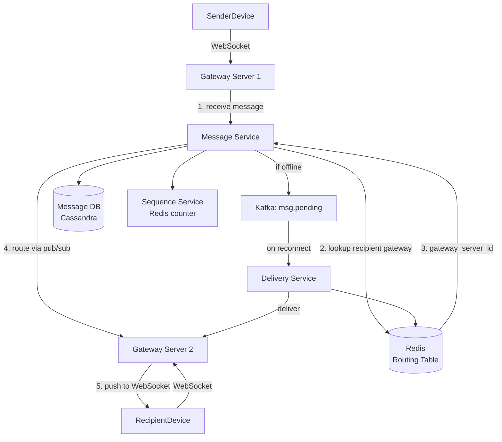

WhatsApp is a real-time delivery problem at a scale that makes the infrastructure choices non-obvious. The defining constraint is 2 billion concurrent WebSocket connections distributed across a fleet of gateway servers. Any message delivery requires knowing which gateway server the recipient is connected to at this instant: that lookup is the architectural linchpin. The key insight is that a single Redis hash table, `user_id -> gateway_server_id`, solves the routing problem for all 2 billion connections. This same pattern reappears in Uber (driver_id -> gateway_server_id for real-time location delivery to riders).

An existing [Chat System case study](./chat-system/) covers this design in full detail from first principles. This entry focuses on WhatsApp-specific features (multi-device sync, end-to-end encryption, status and stories) and on the WebSocket routing pattern that carries forward to other entries in this series.

## Series concepts

### Introduced here

- **WebSocket connection fleet with Redis routing table:** `user_id -> gateway_server_id` in Redis. On message delivery, look up the recipient's current gateway server, then route to it. 2 billion connections at 1M per server = 2,000 gateway servers.
- **Message ordering via per-conversation sequence numbers:** timestamps are unreliable across devices (clocks drift, messages arrive out of order). Each conversation has a monotonically increasing sequence number; messages are ordered by sequence, not by received timestamp.
- **Exactly-once delivery via idempotency:** the client generates a `client_msg_id` (UUID). The server deduplicates on this key before processing. Retries return the same message record without re-delivery.
- **Online presence:** `user_id -> {status, last_seen}` in Redis with TTL. Presence is eventually consistent by design: a user who loses connectivity may appear online for up to 30 seconds.

### Carried forward from prior entries

- **Kafka ([Bitly](./bitly/)):** messages that cannot be delivered immediately (recipient offline) are queued in Kafka for later delivery.
- **Redis ([Bitly](./bitly/)):** connection routing table uses the same Redis cluster pattern introduced for URL caching.
- **ID generation ([Bitly](./bitly/)):** message IDs use Snowflake-style generation; per-conversation sequence numbers use a Redis counter.

## Clarifying questions

Ask these before drawing anything:

- **Scale**: how many users? DAU? Messages per day?
- **Message types**: text only, or media (images, video, audio, documents)?
- **Group chats**: how large? What is the max group size?
- **Multi-device**: can users be logged in on multiple devices simultaneously?
- **End-to-end encryption**: is E2EE required?
- **Offline delivery**: how long should undelivered messages be retained?
- **Read receipts**: single check (delivered) vs double check (read)?

What the answers reveal:

- Media support adds a separate upload/CDN path; messages become metadata pointers to S3
- Large group chats (1,000+ members) change the fanout model (similar to celebrity problem in News Feed)
- Multi-device means delivery is to a set of connections, not a single connection
- E2EE means the server cannot read, search, or moderate message content
- Offline retention determines how long Kafka/DB must buffer undelivered messages

For this walkthrough: 2B users, 1B DAU, 40 messages/day/DAU, text + media, groups up to 1,000 members, multi-device (up to 5 devices), E2EE required, 30-day offline retention.

## Estimation

```
Message volume:
  1B DAU * 40 messages/day = 40B messages/day
  40B / 86,400 = 463,000 write QPS

WebSocket connections:
  2B users, assume 50% online at peak = 1B concurrent connections
  Each gateway server handles ~1M WebSocket connections
  1B / 1M = 1,000 gateway servers at peak
  Scale to 2,000 for headroom

Message storage:
  40B messages/day * 30-day retention
  Average message: 200 bytes (text; media is a pointer)
  40B * 30 * 200 bytes = 240 TB (30-day buffer)
  After 30 days: delivered messages can be deleted from server
  (E2EE: server stores only ciphertext; no long-term storage needed)

Media storage:
  ~20% of messages contain media
  40B * 20% = 8B media messages/day
  Average media size: 200 KB (compressed images/voice)
  8B * 200 KB = 1.6 PB/day raw
  With dedup (same media forwarded): ~30% reduction = ~1.1 PB/day

Connection routing table:
  2B users * (user_id: 8 bytes + server_id: 4 bytes) = ~24 GB Redis
  Fits comfortably in a single Redis Cluster
```

**Conclusion**: 463K write QPS for message delivery is the primary scaling constraint. The connection routing table (24 GB Redis) is small and fast. Media storage (1.1 PB/day) requires S3 and a CDN; text message retention (240 TB/30 days) is the buffer sizing concern.

## High-level design



Core endpoints / WebSocket message types:

```
WebSocket: wss://ws.whatsapp.com/

Client -> Server message types:
  { type: 'send_message', to: user_id, content: ciphertext, client_msg_id: uuid,
    conversation_id: string }
  { type: 'ack', message_id: string, status: 'delivered' | 'read' }
  { type: 'presence', status: 'online' | 'away' }

Server -> Client message types:
  { type: 'message', from: user_id, content: ciphertext, message_id: string,
    sequence_number: int }
  { type: 'ack', client_msg_id: uuid, message_id: string, status: 'sent' }
  { type: 'presence_update', user_id: string, status: string, last_seen: timestamp }
```

## Deep dive: WebSocket connection routing

When a recipient is connected to gateway server G2, and the sender's message arrives at gateway server G1, G1 must forward the message to G2. The routing table in Redis makes this a single O(1) lookup.

```python
import redis
import json

r = redis.Redis(host='redis-routing', port=6379)

# On client connection:
def register_connection(user_id: str, device_id: str, gateway_server_id: str):
    key = f"conn:{user_id}:{device_id}"
    r.setex(key, 300, gateway_server_id)  # 5-min TTL, refreshed by heartbeat
    r.sadd(f"user:devices:{user_id}", device_id)

# On client disconnect or TTL expiry:
def deregister_connection(user_id: str, device_id: str):
    r.delete(f"conn:{user_id}:{device_id}")
    r.srem(f"user:devices:{user_id}", device_id)

# On message delivery:
def deliver_message(to_user_id: str, message: dict) -> str:
    device_ids = r.smembers(f"user:devices:{to_user_id}")

    if not device_ids:
        # user is offline: queue for later delivery
        return 'queued'

    delivered_to = []
    for device_id in device_ids:
        gateway_id = r.get(f"conn:{to_user_id}:{device_id.decode()}")
        if not gateway_id:
            continue

        gateway = gateway_id.decode()
        if gateway == THIS_SERVER_ID:
            # recipient is on this server: push directly
            push_to_websocket(to_user_id, device_id, message)
        else:
            # recipient is on another server: publish via Redis pub/sub
            channel = f"gateway:{gateway}:inbox"
            r.publish(channel, json.dumps({
                'user_id': to_user_id,
                'device_id': device_id.decode(),
                'message': message,
            }))
        delivered_to.append(device_id)

    return 'delivered' if delivered_to else 'queued'
```

```typescript
import { createClient } from 'redis';

const r = createClient({ url: 'redis://redis-routing:6379' });
await r.connect();

const THIS_SERVER_ID = process.env.GATEWAY_SERVER_ID!;

// On client connection:
async function registerConnection(userId: string, deviceId: string, gatewayServerId: string): Promise<void> {
  const key = `conn:${userId}:${deviceId}`;
  await r.setEx(key, 300, gatewayServerId); // 5-min TTL, refreshed by heartbeat
  await r.sAdd(`user:devices:${userId}`, deviceId);
}

// On client disconnect or TTL expiry:
async function deregisterConnection(userId: string, deviceId: string): Promise<void> {
  await r.del(`conn:${userId}:${deviceId}`);
  await r.sRem(`user:devices:${userId}`, deviceId);
}

// On message delivery:
async function deliverMessage(toUserId: string, message: object): Promise<string> {
  const deviceIds = await r.sMembers(`user:devices:${toUserId}`);

  if (deviceIds.length === 0) {
    return 'queued';
  }

  const deliveredTo: string[] = [];
  for (const deviceId of deviceIds) {
    const gatewayId = await r.get(`conn:${toUserId}:${deviceId}`);
    if (!gatewayId) continue;

    if (gatewayId === THIS_SERVER_ID) {
      pushToWebSocket(toUserId, deviceId, message);
    } else {
      const channel = `gateway:${gatewayId}:inbox`;
      await r.publish(channel, JSON.stringify({ user_id: toUserId, device_id: deviceId, message }));
    }
    deliveredTo.push(deviceId);
  }

  return deliveredTo.length > 0 ? 'delivered' : 'queued';
}
```

```go
package main

import (
	"context"
	"encoding/json"
	"fmt"
	"os"

	"github.com/redis/go-redis/v9"
)

var rdb = redis.NewClient(&redis.Options{Addr: "redis-routing:6379"})

var thisServerID = os.Getenv("GATEWAY_SERVER_ID")

// On client connection:
func registerConnection(ctx context.Context, userID, deviceID, gatewayServerID string) error {
	key := fmt.Sprintf("conn:%s:%s", userID, deviceID)
	if err := rdb.SetEx(ctx, key, gatewayServerID, 300*1e9).Err(); err != nil {
		return err
	}
	return rdb.SAdd(ctx, fmt.Sprintf("user:devices:%s", userID), deviceID).Err()
}

// On client disconnect or TTL expiry:
func deregisterConnection(ctx context.Context, userID, deviceID string) error {
	rdb.Del(ctx, fmt.Sprintf("conn:%s:%s", userID, deviceID))
	return rdb.SRem(ctx, fmt.Sprintf("user:devices:%s", userID), deviceID).Err()
}

// On message delivery:
func deliverMessage(ctx context.Context, toUserID string, message map[string]interface{}) (string, error) {
	deviceIDs, err := rdb.SMembers(ctx, fmt.Sprintf("user:devices:%s", toUserID)).Result()
	if err != nil || len(deviceIDs) == 0 {
		return "queued", err
	}

	var deliveredTo []string
	for _, deviceID := range deviceIDs {
		gatewayID, err := rdb.Get(ctx, fmt.Sprintf("conn:%s:%s", toUserID, deviceID)).Result()
		if err != nil {
			continue
		}

		if gatewayID == thisServerID {
			pushToWebSocket(toUserID, deviceID, message)
		} else {
			channel := fmt.Sprintf("gateway:%s:inbox", gatewayID)
			payload, _ := json.Marshal(map[string]interface{}{
				"user_id":   toUserID,
				"device_id": deviceID,
				"message":   message,
			})
			rdb.Publish(ctx, channel, payload)
		}
		deliveredTo = append(deliveredTo, deviceID)
	}

	if len(deliveredTo) > 0 {
		return "delivered", nil
	}
	return "queued", nil
}
```

Each gateway server subscribes to its own inbox channel. Messages arrive as pub/sub events and are pushed to the appropriate WebSocket.

## Deep dive: message ordering with sequence numbers

Clocks across devices are not reliable. If user A sends message 1 at 12:00:00.000 and message 2 at 12:00:00.001, both may arrive at the server out of order due to network jitter. Ordering by server-received timestamp introduces similar problems. The correct primitive is a per-conversation monotonic sequence number.

```python
def assign_sequence_number(conversation_id: str) -> int:
    """
    Atomically increment and return the sequence number for this conversation.
    Redis INCR is atomic and O(1).
    """
    key = f"seq:{conversation_id}"
    return r.incr(key)

def send_message(
    sender_id: str,
    conversation_id: str,
    content: bytes,  # ciphertext
    client_msg_id: str,
) -> dict:
    # idempotency check
    existing = message_db.get_by_client_msg_id(client_msg_id, sender_id)
    if existing:
        return existing  # duplicate: return original result

    seq_num = assign_sequence_number(conversation_id)
    message_id = generate_snowflake_id()

    message = {
        'message_id': message_id,
        'conversation_id': conversation_id,
        'sender_id': sender_id,
        'content': content,  # ciphertext; server cannot read this
        'sequence_number': seq_num,
        'client_msg_id': client_msg_id,
        'created_at': now_ms(),
    }

    # persist first, then deliver
    message_db.insert(message)
    deliver_message(get_recipients(conversation_id), message)
    return message
```

```typescript
async function assignSequenceNumber(conversationId: string): Promise<number> {
  const key = `seq:${conversationId}`;
  return await r.incr(key);
}

interface Message {
  message_id: string;
  conversation_id: string;
  sender_id: string;
  content: Buffer;
  sequence_number: number;
  client_msg_id: string;
  created_at: number;
}

async function sendMessage(
  senderId: string,
  conversationId: string,
  content: Buffer,
  clientMsgId: string
): Promise<Message> {
  const existing = await messageDb.getByClientMsgId(clientMsgId, senderId);
  if (existing) {
    return existing;
  }

  const seqNum = await assignSequenceNumber(conversationId);
  const messageId = generateSnowflakeId();

  const message: Message = {
    message_id: messageId,
    conversation_id: conversationId,
    sender_id: senderId,
    content,
    sequence_number: seqNum,
    client_msg_id: clientMsgId,
    created_at: Date.now(),
  };

  await messageDb.insert(message);
  await deliverMessage(await getRecipients(conversationId), message);
  return message;
}
```

```go
func assignSequenceNumber(ctx context.Context, conversationID string) (int64, error) {
	key := fmt.Sprintf("seq:%s", conversationID)
	return rdb.Incr(ctx, key).Result()
}

type Message struct {
	MessageID      string
	ConversationID string
	SenderID       string
	Content        []byte // ciphertext; server cannot read this
	SequenceNumber int64
	ClientMsgID    string
	CreatedAt      int64
}

func sendMessage(ctx context.Context, senderID, conversationID string, content []byte, clientMsgID string) (*Message, error) {
	existing, err := messageDB.GetByClientMsgID(ctx, clientMsgID, senderID)
	if err == nil && existing != nil {
		return existing, nil
	}

	seqNum, err := assignSequenceNumber(ctx, conversationID)
	if err != nil {
		return nil, err
	}
	messageID := generateSnowflakeID()

	msg := &Message{
		MessageID:      messageID,
		ConversationID: conversationID,
		SenderID:       senderID,
		Content:        content,
		SequenceNumber: seqNum,
		ClientMsgID:    clientMsgID,
		CreatedAt:      time.Now().UnixMilli(),
	}

	if err := messageDB.Insert(ctx, msg); err != nil {
		return nil, err
	}
	recipients, _ := getRecipients(ctx, conversationID)
	deliverMessage(ctx, recipients, msg)
	return msg, nil
}
```

Clients sort displayed messages by `sequence_number`, not by `created_at`. If a message with seq 5 arrives before seq 4 (out-of-order delivery), the client buffers seq 5 and waits briefly for seq 4. After a timeout, it requests the missing message explicitly.

## Deep dive: multi-device sync

A user has a phone, a laptop, and a web browser all logged in simultaneously. Each maintains an independent WebSocket connection. Every message must be delivered to all active devices.

```python
def sync_message_to_devices(user_id: str, message: dict):
    """Deliver a message to all active devices for a user."""
    device_ids = get_active_devices(user_id)

    for device_id in device_ids:
        # each device gets the same message
        # the device tracks which messages it has displayed (by sequence_number)
        deliver_to_device(user_id, device_id, message)

def handle_read_receipt(user_id: str, device_id: str, message_id: str):
    """
    When a user reads a message on one device, mark it read on all devices.
    """
    conversation_id = get_conversation_for_message(message_id)
    seq_num = get_sequence_number(message_id)

    # update read position for this user in this conversation
    r.set(f"read_pos:{conversation_id}:{user_id}", seq_num)

    # notify all other devices belonging to this user
    other_devices = [d for d in get_active_devices(user_id) if d != device_id]
    for other_device_id in other_devices:
        deliver_to_device(user_id, other_device_id, {
            'type': 'read_sync',
            'conversation_id': conversation_id,
            'read_through_seq': seq_num,
        })
```

```typescript
async function syncMessageToDevices(userId: string, message: object): Promise<void> {
  const deviceIds = await getActiveDevices(userId);
  for (const deviceId of deviceIds) {
    await deliverToDevice(userId, deviceId, message);
  }
}

async function handleReadReceipt(userId: string, deviceId: string, messageId: string): Promise<void> {
  const conversationId = await getConversationForMessage(messageId);
  const seqNum = await getSequenceNumber(messageId);

  await r.set(`read_pos:${conversationId}:${userId}`, seqNum);

  const allDevices = await getActiveDevices(userId);
  const otherDevices = allDevices.filter(d => d !== deviceId);
  for (const otherDeviceId of otherDevices) {
    await deliverToDevice(userId, otherDeviceId, {
      type: 'read_sync',
      conversation_id: conversationId,
      read_through_seq: seqNum,
    });
  }
}
```

```go
func syncMessageToDevices(ctx context.Context, userID string, message map[string]interface{}) {
	deviceIDs, _ := getActiveDevices(ctx, userID)
	for _, deviceID := range deviceIDs {
		deliverToDevice(ctx, userID, deviceID, message)
	}
}

func handleReadReceipt(ctx context.Context, userID, deviceID, messageID string) error {
	conversationID, err := getConversationForMessage(ctx, messageID)
	if err != nil {
		return err
	}
	seqNum, err := getSequenceNumber(ctx, messageID)
	if err != nil {
		return err
	}

	readPosKey := fmt.Sprintf("read_pos:%s:%s", conversationID, userID)
	if err := rdb.Set(ctx, readPosKey, seqNum, 0).Err(); err != nil {
		return err
	}

	allDevices, _ := getActiveDevices(ctx, userID)
	for _, otherDeviceID := range allDevices {
		if otherDeviceID == deviceID {
			continue
		}
		deliverToDevice(ctx, userID, otherDeviceID, map[string]interface{}{
			"type":              "read_sync",
			"conversation_id":   conversationID,
			"read_through_seq":  seqNum,
		})
	}
	return nil
}
```

The read position (`read_pos:{conversation_id}:{user_id}`) is a single integer in Redis: the highest sequence number the user has read. Any device can compute "unread count" as `max_seq - read_pos`. When the user reads on one device, the sync event propagates to all others within milliseconds.

## Deep dive: end-to-end encryption implications

WhatsApp uses the Signal Protocol. The server stores only ciphertext. Keys are managed entirely on client devices.

```python
# What the server stores (ciphertext blob, opaque to server):
CREATE TABLE messages (
    message_id     BIGINT PRIMARY KEY,
    conversation_id UUID NOT NULL,
    sender_id       BIGINT NOT NULL,
    ciphertext      BYTEA NOT NULL,    -- server cannot decrypt this
    sequence_number BIGINT NOT NULL,
    client_msg_id   UUID UNIQUE NOT NULL,
    created_at      TIMESTAMPTZ NOT NULL
);

-- No content column. No plaintext. No search index.
-- The server is a routing and storage intermediary, nothing more.
```

```typescript
// What the server stores (ciphertext blob, opaque to server):
// CREATE TABLE messages (
//   message_id      BIGINT PRIMARY KEY,
//   conversation_id UUID NOT NULL,
//   sender_id       BIGINT NOT NULL,
//   ciphertext      BYTEA NOT NULL,    -- server cannot decrypt this
//   sequence_number BIGINT NOT NULL,
//   client_msg_id   UUID UNIQUE NOT NULL,
//   created_at      TIMESTAMPTZ NOT NULL
// );
//
// No content column. No plaintext. No search index.
// The server is a routing and storage intermediary, nothing more.

interface StoredMessage {
  message_id: bigint;
  conversation_id: string;
  sender_id: bigint;
  ciphertext: Buffer;    // server cannot decrypt this
  sequence_number: bigint;
  client_msg_id: string;
  created_at: Date;
}
```

```go
// What the server stores (ciphertext blob, opaque to server):
// CREATE TABLE messages (
//   message_id      BIGINT PRIMARY KEY,
//   conversation_id UUID NOT NULL,
//   sender_id       BIGINT NOT NULL,
//   ciphertext      BYTEA NOT NULL,
//   sequence_number BIGINT NOT NULL,
//   client_msg_id   UUID UNIQUE NOT NULL,
//   created_at      TIMESTAMPTZ NOT NULL
// );
//
// No content column. No plaintext. No search index.
// The server is a routing and storage intermediary, nothing more.

type StoredMessage struct {
	MessageID      int64
	ConversationID string
	SenderID       int64
	Ciphertext     []byte // server cannot decrypt this
	SequenceNumber int64
	ClientMsgID    string
	CreatedAt      time.Time
}
```

Operational implications the interview should address:

```python
# 1. Server cannot search message content
#    Full-text search is impossible server-side.
#    WhatsApp's "Search messages" feature runs entirely on the device,
#    searching the local decrypted message store.

# 2. Server cannot filter spam or CSAM by content
#    Content moderation must be done differently:
#    - hash-based matching on media (perceptual hashes sent alongside ciphertext)
#    - metadata analysis (send frequency, group membership patterns)
#    - user reports (sender identity, not content)

# 3. Key loss = message loss
#    If a user loses their device and did not back up their keys,
#    all past messages are irrecoverable. WhatsApp offers optional
#    encrypted backups to Google Drive / iCloud, but this is opt-in.

# 4. Group key distribution
#    For a group of N members, the sender encrypts the message N times
#    (once per member's public key) or uses a group session key
#    (Signal's Sender Keys protocol). Sender Keys: one encryption,
#    each member can decrypt with their copy of the group session key.

def encrypt_for_group(plaintext: bytes, group_session_key: bytes) -> bytes:
    """
    With Sender Keys: encrypt once with the group session key.
    Each member has a copy of this key (distributed out-of-band).
    Server receives one ciphertext; each member decrypts independently.
    """
    return aes_gcm_encrypt(plaintext, group_session_key)
```

```typescript
// 1. Server cannot search message content
//    Full-text search is impossible server-side.
//    WhatsApp's "Search messages" feature runs entirely on the device,
//    searching the local decrypted message store.

// 2. Server cannot filter spam or CSAM by content
//    Content moderation must be done differently:
//    - hash-based matching on media (perceptual hashes sent alongside ciphertext)
//    - metadata analysis (send frequency, group membership patterns)
//    - user reports (sender identity, not content)

// 3. Key loss = message loss
//    If a user loses their device and did not back up their keys,
//    all past messages are irrecoverable. WhatsApp offers optional
//    encrypted backups to Google Drive / iCloud, but this is opt-in.

// 4. Group key distribution
//    For a group of N members, the sender encrypts the message N times
//    (once per member's public key) or uses a group session key
//    (Signal's Sender Keys protocol). Sender Keys: one encryption,
//    each member can decrypt with their copy of the group session key.

function encryptForGroup(plaintext: Buffer, groupSessionKey: Buffer): Buffer {
  // With Sender Keys: encrypt once with the group session key.
  // Each member has a copy of this key (distributed out-of-band).
  // Server receives one ciphertext; each member decrypts independently.
  return aesGcmEncrypt(plaintext, groupSessionKey);
}
```

```go
// 1. Server cannot search message content
//    Full-text search is impossible server-side.
//    WhatsApp's "Search messages" feature runs entirely on the device,
//    searching the local decrypted message store.

// 2. Server cannot filter spam or CSAM by content
//    Content moderation must be done differently:
//    - hash-based matching on media (perceptual hashes sent alongside ciphertext)
//    - metadata analysis (send frequency, group membership patterns)
//    - user reports (sender identity, not content)

// 3. Key loss = message loss
//    If a user loses their device and did not back up their keys,
//    all past messages are irrecoverable. WhatsApp offers optional
//    encrypted backups to Google Drive / iCloud, but this is opt-in.

// 4. Group key distribution
//    For a group of N members, the sender encrypts the message N times
//    (once per member's public key) or uses a group session key
//    (Signal's Sender Keys protocol). Sender Keys: one encryption,
//    each member can decrypt with their copy of the group session key.

func encryptForGroup(plaintext []byte, groupSessionKey []byte) ([]byte, error) {
	// With Sender Keys: encrypt once with the group session key.
	// Each member has a copy of this key (distributed out-of-band).
	// Server receives one ciphertext; each member decrypts independently.
	return aesGCMEncrypt(plaintext, groupSessionKey)
}
```

## Failure modes

**Gateway server crash**: all connections on that server disconnect. Clients detect the TCP close and reconnect to a different gateway (with exponential backoff + jitter). The routing table entries expire after 5 minutes (TTL), or are explicitly cleaned up by the crashed server's health-checker. Messages delivered during the reconnect window are queued in Kafka and delivered on reconnect.

**Redis routing table failure**: delivery is impossible for online users (cannot look up their gateway). Fail open to the offline queue (Kafka); deliver when Redis recovers. This is safer than guessing gateways randomly.

**Kafka consumer lag**: if the delivery service falls behind, offline users see delayed messages on reconnect. Add consumer instances; Kafka partitioning by conversation_id ensures ordering within a conversation even with multiple consumers.

**Sequence number counter gap**: if the Redis counter for a conversation is lost (Redis failure without persistence), sequence numbers restart from 0. Clients detect the discontinuity and request a full re-sync from the message database. Mitigation: persist the sequence counter with Redis AOF.

**Group message fanout storm**: a message in a 1,000-member group requires 1,000 delivery operations. At 463K messages/sec globally, if 1% are group messages, that is 4.63M fanout deliveries/sec. Keep group fanout on a separate worker pool from direct messages; bound group size to 1,000 to limit fanout fan-out.

## Key takeaways

**The connection routing table is the architectural linchpin.** Every real-time delivery problem (WhatsApp, Uber, multiplayer games) reduces to the same lookup: who is this user connected to right now? A Redis hash keyed by user_id answers this in O(1) for any scale.

**Use sequence numbers, not timestamps, for message ordering.** Clocks drift. Networks reorder packets. A monotonically increasing sequence number per conversation is the only reliable ordering primitive. Clients that receive out-of-order messages buffer and wait, then request gaps explicitly.

**E2EE is an architectural constraint, not a feature toggle.** Once you commit to server-side ciphertext only, you lose content search, content moderation, and spam filtering by content. These must be solved through metadata analysis and client-side mechanisms. Design the entire system around this constraint from the start.

**Multi-device sync is a read-position synchronization problem.** Every device needs to know the user's read position in every conversation. Storing `read_pos:{conversation_id}:{user_id}` as a single Redis key makes this O(1) to update and propagate.

**Offline delivery via Kafka decouples availability from real-time routing.** If the recipient is offline, the message is not lost: it lives in Kafka until delivery is possible. The routing layer (Redis) and the persistence layer (Kafka/Cassandra) serve different failure modes and can recover independently.

## References

- [WhatsApp engineering blog: 1 million connections per server](https://blog.whatsapp.com/1-million-is-so-2011)
- [Signal Protocol documentation](https://signal.org/docs/)
- [System Design Interview Vol 1, Alex Xu, Chapter 12](https://bytebytego.com/)
- [Erlang/Elixir for WebSocket connection servers](https://www.erlang.org/doc/efficiency_guide/processes.html)

## Related topics

- [Chat System case study](./chat-system/), foundational walkthrough of the same design
- [Facebook News Feed case study](./facebook-news-feed/), carries forward Redis and Kafka fanout
- [Bitly case study](./bitly/), introduces Redis and Kafka patterns used here
- [Caching](../caching/), Redis connection routing table design
- [Message Queues](../message-queues/), Kafka offline message queuing
- [Databases](../databases/), Cassandra for high-throughput message storage
- [Scalability](../scalability/), handling 463K write QPS at 2B user scale
